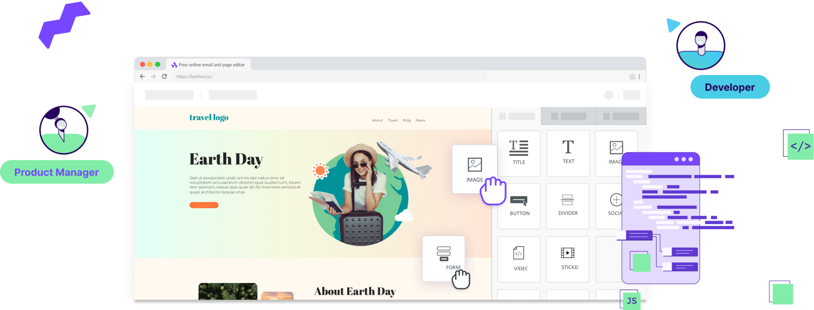

# Introduction to Beefree SDK

<figure><figcaption></figcaption></figure>

## What is Beefree SDK?

Beefree SDK is an embeddable no-code builder that gives your end users the freedom to design stunning emails, landing pages, and popups—without writing a single line of code. It’s easy to configure, intuitive to personalize, and built to scale with your needs—whether you're a startup or an enterprise. Built with both developers and end users in mind, it’s designed to integrate easily into your application, scale as your product grows, and provide a flexible, white-label design experience.&#x20;

**For developers**, Beefree SDK is easy to work with. You can personalize the design experience by adding simple configuration parameters. Want to enable or disable a feature? Just check a box in the Developer Console, hit save, and the changes are immediately reflected on the frontend. No complicated setup required.&#x20;

**For your end users,** Beefree SDK is an intuitive drag-and-drop editor with everything end users need to bring their creative ideas to life—whether they’re creating an email campaign, a landing page, or an attention-grabbing popup. Content blocks like titles, images, lists, tables, buttons, and more are all available right out of the box.

Beefree SDK includes the following features and more:

* **Email builder:** A [no-code email](visual-builders/email-builder.md) creation environment that helps end users quickly create beautiful emails. This environment supports your end users in following email creation best practices recommended by industry experts.
* **Page builder:** A [no-code landing page](visual-builders/page-builder/) creation environment that empowers end users to build visually stunning landing pages. They can use a landing page as a link for a call-to-action (CTA) inside emails, to embed forms and capture information, or to create standalone pages.
* **Popup builder:** The [popup builder is a no-code environment](visual-builders/popup-builder/) that provides end users with the tools they need to build compelling popups that capture attention.
* **AI-generated templates:** With both[ Simple Schema](data-structures/simple-schema/) and the [Convert endpoints](apis/content-services-api/convert.md#simple-to-full-json), you can build a custom AI-generated content creation experience (for assets such as emails, landing pages, or popups) for your end users.
* **AI Writing Assistant:** A helpful AI assistant to help end users write their design content.
* **File manager:** A tool to [manage media assets](broken-reference) (images, PDFs, and so on).
* **Template catalog:** A design template catalog that integrates industry best practices to support end users in quickly getting across the finish line with their creations and achieving quick design wins.
* **API offering:** Extend the functionality of any of the builders with our comprehensive [suite of APIs](broken-reference).

This site discusses the technical capabilities of Beefree SDK, and how to embed it into your web application. To learn more about the end user experience, and how your end users will interact with Beefree SDK on the frontend of your application, reference the [White Label End User Guide](https://docs.beefree.io/end-user-guide). Markdown files for this guide are available in this [GitHub repository](https://github.com/mailupinc/beefreeSDKwhiteLabelDocs), which you can clone and use as a starting point for building a knowledge base for your end users.&#x20;

## Quick Start 

Take the following steps to get started with Beefree SDK in a few minutes:

1. Create an account to access the [Developer Console](https://developers.beefree.io/accounts/login/?from=website_menu) and obtain your credentials.
2. [Create a new subscription](https://docs.beefree.io/beefree-sdk/getting-started/readme/create-an-application#sign-up-for-account-in-the-developer-console) to get started. Beefree SDK offers a generous Free plan that includes each builder type mentioned in the previous section.
3. Create an application and [obtain your Client ID and Client Secret](https://docs.beefree.io/beefree-sdk/getting-started/readme/create-an-application#obtain-your-client-id-and-client-secret).
4. Clone the [beefree-sdk-sample-client repository](https://github.com/BeefreeSDK/beefree-sdk-sample-client), which includes the code for email and popup builder implementations.
5. Add your credentials, the Client ID and Client Secret from step three, inside the placeholders in the code.
6. Once the email builder, or popup builder, depending on which environment you chose, opens, you can start experimenting with the SDK's configuration by customizing the [configuration parameters](https://docs.beefree.io/beefree-sdk/getting-started/readme/installation/configuration-parameters) in the `beeConfig` section of the code.
7. You can also customize the SDK's configuration inside the [Developer Console](https://developers.beefree.io/accounts/login/?from=website_menu) under the [Application configuration section](https://docs.beefree.io/beefree-sdk/server-side-configurations/server-side-options) of the application you created.

**Note:** Visit the [Beefree SDK pricing page](https://developers.beefree.io/pricing-plans) for a comprehensive list of features and the plan type they correspond to.

## Quick Start Guides 

Reference Quick Start Guides specific to your tech stack:

* [React No-code Email Builder](quickstart-guides/react-no-code-email-builder.md)
* [Vue.js No-code Email Builder](quickstart-guides/vue.js-no-code-email-builder.md)

## Beefree SDK's Embeddable Builders 

Learn more about our three embeddable builders.

<table data-view="cards"><thead><tr><th data-card-target data-type="content-ref"></th></tr></thead><tbody><tr><td><a href="visual-builders/email-builder.md">email-builder.md</a></td></tr><tr><td><a href="visual-builders/page-builder/">page-builder</a></td></tr><tr><td><a href="visual-builders/popup-builder/">popup-builder</a></td></tr></tbody></table>

## File Manager

In addition to our drag-and-drop editors, we also offer a standalone [File Manager](file-manager/file-manager-application-overview/) application, which can be used alongside any of the builders. The File Manager is designed to simplify the organization and management of digital assets. It is an image and document management user interface that can be launched as a standalone application. This allows your customers to quickly upload or manage assets, without having to load one of the builders.

Learn more about our [File Manager](file-manager/file-manager-application-overview/) and [File Storage Options](server-side-configurations/server-side-options/storage-options/).

## Developer Essentials 

Create a free account and obtain your Client ID and Client Secret in the [Developer Console](https://developers.beefree.io/accounts/login/?from=website_menu) to get started. Set up a local environment to experiment with customizing a configuration. Watch the configuration changes and customizations come to life on the frontend.

* [Create and Application](getting-started/readme/create-an-application.md)
* [React No-code Email Builder](quickstart-guides/react-no-code-email-builder.md)
* [Vue.js No-code Email Builder](quickstart-guides/vue.js-no-code-email-builder.md)
* [GitHub Resources](https://github.com/BeefreeSDK)

### Sample Code

Learn more about Beefree SDK through available sample code and example projects in [GitHub](https://github.com/BeefreeSDK).

* [Sample templates](https://github.com/BeefreeSDK/beefree-sdk-assets-templates)
* [Sample forms](https://github.com/BeefreeSDK/beefree-sdk-sample-forms)
* [NPM official package](https://github.com/BeefreeSDK/beefree-sdk-npm-official)
* [Simple Schema and AI-generated templates](https://github.com/BeefreeSDK/beefree-sdk-simple-schema)
* [Sample project with Next.js](https://github.com/BeefreeSDK/beefree-sdk-sample-nextjs)

### Videos 

Learn more about Beefree SDK through [videos](resources/videos/). Explore [Tutorials](resources/videos/#tutorials), [Spotlight Sessions](resources/videos/#spotlight-sessions), and [Case Studies](resources/videos/#case-studies).&#x20;
