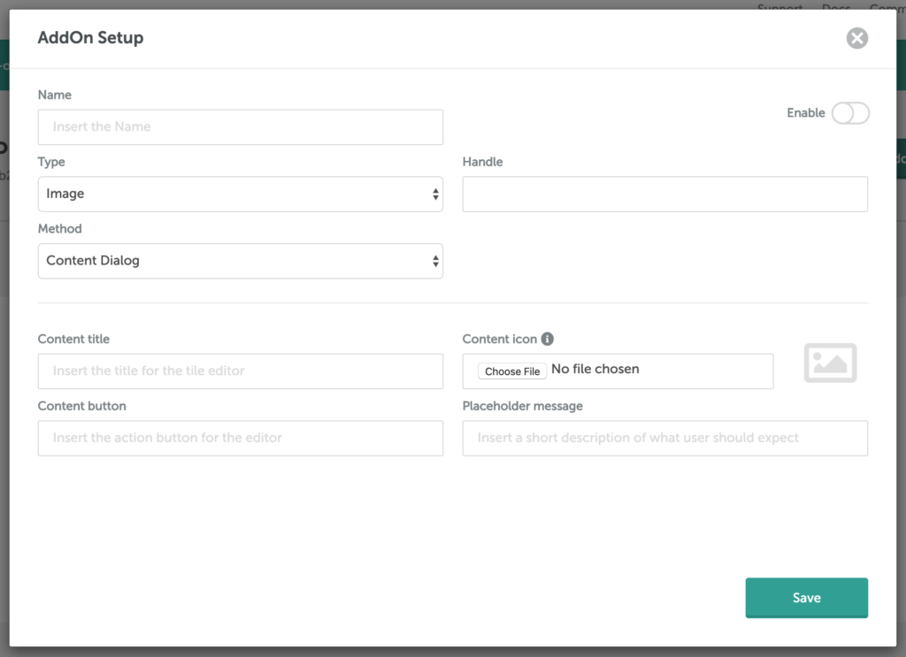
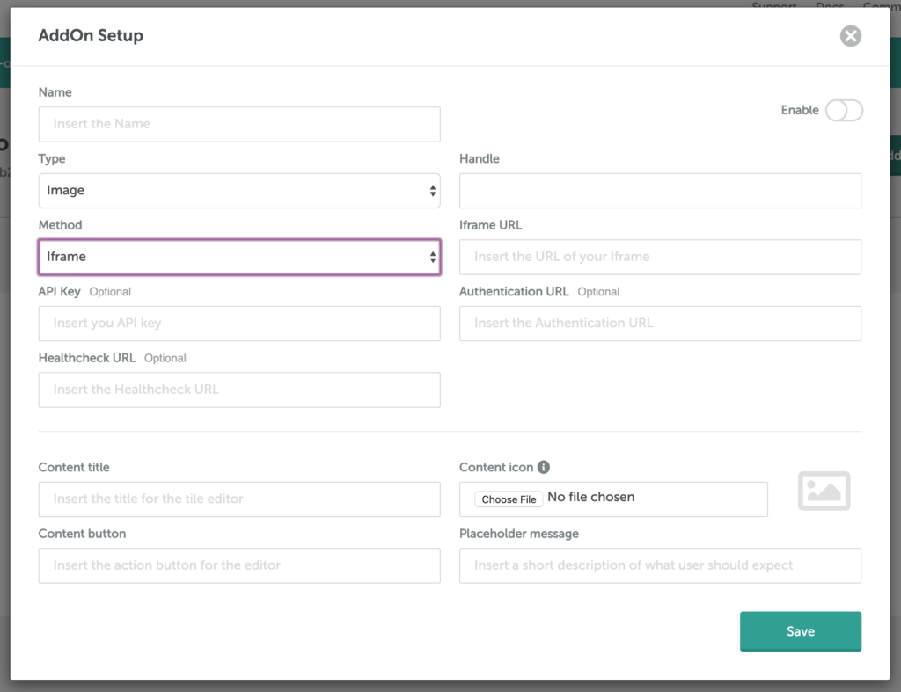
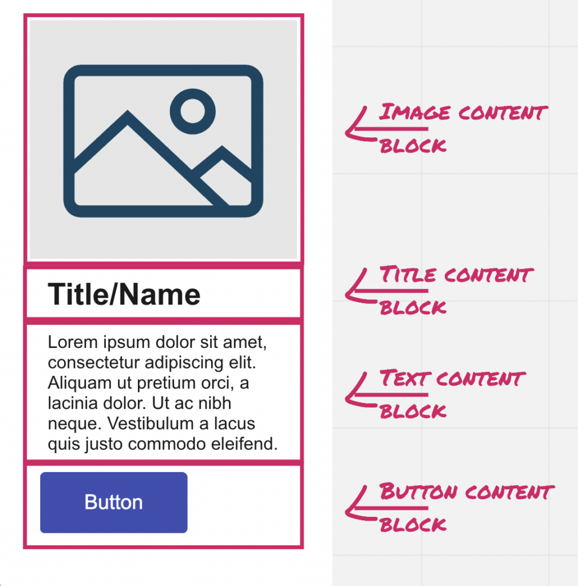

# AddOn Development

## Introduction <a href="#introduction" id="introduction"></a>

Welcome to the Beefree SDK AddOn development documentation!

This document is for anyone that wants to start creating AddOns for Beefree SDK users.

Before you get started, you may want to review these [frequently asked questions](../addon-faqs.md).

Happy coding!

## Creating a development app <a href="#creating-a-development-app" id="creating-a-development-app"></a>

First, [create a development application](../../readme/development-applications.md) so that you are not testing your new AddOn with a production application.

Development applications inherit the plan of the production application to which they are connected. You can only build AddOns when you are on the [Superpowers plan or above](https://developers.beefree.io/pricing-plans). If you are **not** on one of those plans:

* Create a development application
* Request an upgrade

Once you have a development application on the Superpowers plan or above, proceed to the next step.

## Getting started <a href="#getting-started" id="getting-started"></a>

The process all starts in the [Beefree SDK Console](https://dam.beefree.io/devmain):

1. Log into the Console at [developers.beefree.io](http://developers.beefree.io/)
2. If you have not done so yet, create a development app as indicated above
3. Click the _Details_ link next to any application on the Superpowers plan or above
4. Click the _AddOns_ link, under _Application configuration_
5. Click the _Create a custom AddOn_ button

When you create a new Custom AddOn, you will be prompted to enter some information through the AddOn setup form. Depending on the _method_ that you choose, the number of fields in the form will change.

<figure><figcaption></figcaption></figure>

* **Name**:\
  The name of the AddOn is saved in the dashboard. This is not the name used for the _tile_ in the Beefree editor’s _Content_ tab but rather the internal name visible to other developers. In other words, it will not be shown to end-users of the editor.
* **Enable toggle**:\
  A toggle element to enable and disable the AddOn. When toggled _OFF,_ the AddOn is not visible to end-users of the editor in your application (the _host application_).
* **Type**:\
  The type of content that the AddOn will create. Currently, the following content types are available:
  * _Image_
  * _HTML_
  * _Mixed_
  * _Row_
  * _Paragraph_
  * _Button_
  * _Title_
  * _List_
  * _Menu_
  * _Icon_
* **Handle**:\
  A unique identifier for this AddOn. This value will be the future reference between the AddOn and its content dialog. Additionally, it will be used to override settings per user or build a content dialog for the AddOn.
* **Method**:\
  This is an important selection and is covered in detail in the section below.
  * External iframe: Choose this option if the AddOn is hosted outside the host application. If this is an AddOn that will be made available to other Beefree SDK applications via the Partner AddOn directory, then it is by definition hosted outside of the host application, and therefore you must select this method.
  * Content Dialog: Choose this option for AddOn that lives inside the host application (e.g., internal AddOn). You **cannot** choose this _method_ if you plan to make your AddOn available to others by listing it in the Partner AddOn directory.
* **Icon**:\
  Upload an image from your local computer that will become the icon associated with the _tile_ shown in the editor’s _Content_ tab. We recommend a 64 x 64 pixel SVG file.
* **Labels**:
  * Content Title: This is the name that will be used for the _tile_ in the BEE editor’s _Content_ tab (e.g., “Countdown timer,” “Product Recommendation,” etc.).
  * Content button: The label for the call-to-action button (e.g., “Select a Countdown Timer”), which opens the content dialog or iframe.
  * Placeholder message: This is the message shown in the editor’s stage when the tile is first dropped.

If you are using the **iFrame method**, some **additional fields** are shown on the form.

<figure><figcaption></figcaption></figure>

* **Iframe URL** – Required\
  The URL that will be loaded inside the Iframe.
* **API Key** – Optional\
  The API Key optionally authorizes the application to load the URL provided above. If authorization is not needed, this field can be left empty.
* **Authentication URL** – Optional\
  The endpoint that handles the optional authorization request. If authorization is not needed, this field can be left empty.
* **Healthcheck URL** – Optional, but required for [Partner AddOns](../partner-addons/)\
  This URL will be contacted when the editor is started to verify the status of the AddOn. In the case of AddOn downtime, the editor hides it in the UI. Please note: if you are building a [Partner AddOn](../partner-addons/), this is a required field as it will allow applications that have installed your AddOn to protect the quality of their end-users experience if your service is unavailable.

Once you have entered all the details, click _Save_, and you should immediately find your AddOn visible within the Beefree SDK platform. However, your AddOn is not completed until the configuration steps described below are done.

## Concepts <a href="#concepts" id="concepts"></a>

### Content dialog vs. iframe methods

One of the important choices you will make is in regard to how your content creation AddOn loads.

The general rule of thumb is that if your AddOn lives within the host application, you can use a **content dialog**.

If your AddOn lives on another website outside of the host application or will be listed in the Partner AddOn directory, then you must select the **external iframe** method.

## **Overview of iframe method**

The AddOn can be built using any technology stack. There are no specific rules about how your AddOn functions internally.

However, you will need to implement the following:

* **JavaScript API**
  * Protocol to communicate between iframe and the Beefree application.
* **Server API**
  * Conditional health check endpoint
  * Optional authentication endpoint

Don’t worry about the fine details just yet! We’ll revisit each of these methods in more detail in the following sections.

### **Overview of content dialog method**

Superpowers and Enterprise applications have the option to create their own, custom AddOn with content dialogs.

This option is convenient when the AddOn and host applications are hosted under the same domain.

You don’t need to implement a **JavaScript API** or **Server API** when using the content dialog.

### Content types

An AddOn can only return one type of content. The type you choose will determine which sidebar properties are shown when your AddOn is selected.

Currently, you may choose between the following content types:

* **Image**:\
  Will insert an image module on the stage, and show the properties of an image content block in the sidebar. Adjusting the properties allows for customization of the content type.
* **HTML**:\
  Will insert an HTML module on the stage, and show the properties of a custom HTML content block in the sidebar, except the HTML text input will be hidden. That’s because the HTML cannot be edited outside of the content dialog or iframe made available by your AddOn.
* **Mixed**:\
  Will insert a module on the stage that allows for loading of different content blocks with a single action.
* **Row**:\
  Will insert a row module on the stage, and show the row properties in the sidebar. The row is pre-built with a specific use case in mind. For example, a row that serves of the purpose of allowing end users to add products to their builders.
* **Paragraph**:\
  Will insert a paragraph module on the stage, and show the properties of a paragraph content block in the sidebar.
* **Button**:\
  Will insert a button module on the stage, and show the properties of a button content block in the sidebar. This simplifies offering pre-built buttons to your end users.
* **Title**:\
  Will insert a title module on the stage, and show the properties of a title content block in the sidebar.
* **List**:\
  Will insert a list module on the stage, and show the properties of a list content block in the sidebar.
* **Menu**:\
  Will insert a menu module on the stage, and show the properties of a menu content block in the sidebar. This simplifies offering pre-built menus to your end users.
* **Icon**:\
  Will insert an icon module on the stage, and show the properties of an icon content block in the sidebar.

## Mixed Content AddOns <a href="#mixed-content-addons" id="mixed-content-addons"></a>

Mixed Content AddOns are a new type of content tile that allows the host application to load multiple content modules at once. This grants you greater flexibility with how you want your custom AddOn to interact with your customers and data; for example, you could create a mixed content AddOn to drop a product image in your template, along with a title, description, and more.

<figure><figcaption></figcaption></figure>

To utilize this feature:

* Create a new custom AddOn of type “Mixed Content” from [developers.beefree.io](https://developers.beefree.io/), as described in the “Getting started” section of this article;
* Add the [integration code required by custom AddOns](./) (for example, if the user chose the “Content Dialog” method, it might look something like this):

```javascript

var beeConfig = { ... contentDialog: { addOn: { label: 'Custom AddOn Label', handler: (resolve, reject, args) => { ... } } } }

```

* The host application should return a valid response as the parameter of the “resolve” callback.

## Response Content

A valid response that the hosting application should send to the Beefree app when the contents of a Mixed Content AddOn are selected must have the following structure:

```json

{
  "type": "mixed",
  "value": [
    ... here the list of modules
  ]
}

```

### For example:

```json

{
  "type": "mixed",
  "value": [
    {
      "type": "title",
      "value": {
        "text": "Enjoy $50 off!",
        "title": "h1"
      }
    }, {
      "type": "title",
      "value": {
        "text": "ENTER CODE: 2 YEARS",
        "title": "h2"
      }
    }, {
      "type": "image",
      "value": {
        "alt": "My custom image",
        "href": "http://www.google.com/",
        "src": "http://my-image-url",
      }
    }, {
      "type": "button",
      "value": {
        "label": "SHOP NOW >",
      }
    }
  ]
}

```

If the response is not valid, an error is raised, and `onError` is called.

## Modules definition

For each module type, here is the list of allowed properties.

Unless otherwise specified, the properties are optional.

### **Title**

The following code calls a function named resolve with an object argument. This object defines a heading element with characteristics such as type, text content, alignment, font size, boldness, text color, and link color. The resolve function handles or returns the constructed heading element.

```javascript

resolve({
  type: 'heading',
  value: {
    title: 'h3',
    text: 'Title',
    align: 'right',
    size: '48',
    bold: true,
    color: 'pink',
    linkColor: 'green',
  }
})

```

The following table displays a list of properties in the resolve function, and each of its respective value types and whether or not they are mandatory.

| Property  | Value   | Mandatory |
| --------- | ------- | --------- |
| title     | String  | No        |
| text      | String  | Yes       |
| align     | String  | No        |
| size      | String  | No        |
| bold      | Boolean | No        |
| color     | String  | No        |
| linkColor | String  | No        |

### **Image**

The following sample code defines an image element with various attributes.

```javascript

resolve({
  type: 'image',
  value: {
    alt: 'Alternative desc',
    href: 'http://www.example.com/',
    src: 'https://url.to.myimage.com,
    dynamicSrc: '{{any-merge-tag}}',
    target: '_self',
  }
})

```

The following table displays a list of properties in the resolve function, and each of its respective value types and whether or not they are mandatory.

| Property   | Value        | Mandatory |
| ---------- | ------------ | --------- |
| alt        | String       | Yes       |
| href       | String (URL) | Yes       |
| src        | String (URL) | Yes       |
| dynamicSrc | String (URL) | No        |
| target     | String       | No        |

### **Button**

The following sample code defines a button element with various attributes.

```javascript

resolve({
  type: 'button',
  value: {
    label: 'Button',
    href: 'https://beefree.io',
    target: '_self',
    color: 'pink',
    'background-color': 'yellow',
  },
  mergeTags: [...],
})

```

The following table displays a list of properties in the resolve function, and each of its respective value types and whether or not they are mandatory.

| Property         | Value        | Mandatory |
| ---------------- | ------------ | --------- |
| label            | String       | Yes       |
| href             | String (URL) | No        |
| target           | String       | No        |
| color            | String       | No        |
| background-color | String       | No        |

### **Paragraph**

The following sample code defines a paragraph element with various attributes. The mergeTags property contains a list of merge tags, which can be used for dynamic content insertion.

```javascript

resolve({
  type: 'paragraph',
  value: {
    html: 'My text',
    underline: true,
    italic: true,
    align: 'right',
    size: '48',
    bold: true,
    color: 'pink',
    linkColor: 'green',
  },
  mergeTags: [...],
})

```

The following table displays a list of properties in the resolve function, and each of its respective value types and whether or not they are mandatory.

| Property  | Value                 | Mandatory |
| --------- | --------------------- | --------- |
| html      | String (HTML content) | Yes       |
| underline | Boolean               | No        |
| italic    | Boolean               | No        |
| align     | String                | No        |
| size      | Number                | No        |
| bold      | Boolean               | No        |
| color     | String                | No        |
| linkColor | String                | No        |

### **HTML**

The following sample code defines an HTML element with various attributes.

```javascript
resolve({
    type: 'html',
    value: {
        html: `<div><h4>Html Block</h4>
    </div>`,
    })
```

The following table displays a list of properties in the resolve function, and each of its respective value types and whether or not they are mandatory.

| Property | Value                 | Mandatory |
| -------- | --------------------- | --------- |
| html     | String (HTML content) | Yes       |

### **Menu**

The code defines a menu structure with a list of items. Each item has text content (e.g., “Menu item”) and a link associated with it. The link includes a title, URL (href), and a target attribute, demonstrating that it generates a menu with clickable items that open the specified links in the same browser window or tab when clicked.

```javascript

resolve({
  type: 'menu',
  value: {
    items: [
      {
        text: 'Menu item',
        link: {
          title: 'Link',
          href: 'https://beefree.io',
          target: '_self'
        }
      },
      ...
    ],
  }
})

```

The following table displays a list of properties in the resolve function, and each of its respective value types and whether or not they are mandatory.

| Property | Value            | Mandatory |
| -------- | ---------------- | --------- |
| items    | Array of objects | Yes       |
| text     | String           | No        |
| link     | Object           | No        |
| title    | String           | No        |
| href     | String (URL)     | No        |
| target   | String           | No        |

## Custom AddOn - Row <a href="#custom-addon-row" id="custom-addon-row"></a>

This feature expands the capabilities of Custom AddOns by including:

* additional integrations (e.g. a _Product Block_ integrated with client’s e-commerce)
* domain-specific contents (e.g _Event Block_ for an application that offers event engagement)
* .. and much more

<figure><figcaption></figcaption></figure>

To take advantage of this new feature, you have to:

* Create a new custom AddOn of type “Row” from [developers.beefree.io](http://developers.beefree.io/), as described in the “Getting started” section of this article;
* Add the [integration code required by custom AddOns](./) (for example, if the user chose the “Content Dialog” method, it might look something like this):

```


var beeConfig = { contentDialog: { addOn: { label: 'Custom AddOn Label',  handler: (resolve, reject, args) => { ... }  }  } }


```

* The host application should return a valid response as the parameter of the “resolve” callback.

### Response Content

A valid response that the hosting application should send to the Beefree app when the contents of a Row AddOn are selected must have the following structure:

```json

{
  "type": "rowAddon", 
  "value": {
    ... here all the props accepted by the simplified JSON schema 
        (the one used for "custom-rows")
    ... like name, columns etc...
  }
}

```

#### For example:

```json

{
    "type": "rowAddon",
    "value": {
        "name": "First item", // Identifies the row
        "columns": [{ // The columns inside the row
            "weight": 12, // This weight identifies a single column row
            "modules": [{ // This describes the content modules inside the column
                    "type": "title", // Every module is identified by a type parameter
                    "text": "How am I supposed to fight?"
                },
                {
                    "type": "paragraph",
                    "text": "Look, I can take you as far as Anchorhead. You can get a transport there to Mos Eisley or wherever you're going."
                },
                {
                    // List module, with common additional text parameters 

                    "type": "list",
                    "tag": "ol",
                    "text": "<ol><li>First List item</li><li>Second List item</li></ol>",
                    "align": "right",
                    "size": 50,
                    "bold": true,
                    "color": "green",
                    "linkColor": "yellow",
                    "italic": true,
                    "underline": true
                },
                // Icons module
                {
                    "type": "icons",
                    "icons": [{
                        "image": "http://cdn.onlinewebfonts.com/svg/img_456510.png",
                        "textPosition": "right",
                        "text": "Custom addon icon text",
                        "alt": "Custom addon icon alt",
                        "title": "Custom addon icon title",
                        "href": "https://www.google.com",
                        "target": "_blank",
                        "width": "100px",
                        "height": "100px"
                    }]
                }

            ]
        }]
    "metadata": {
        "myMeta": "myMetaValue"
    }, // an object of custom metadata that will be passed back to the Application when the content selection is triggered again
    }
}

```

The content dialog configuration, required for this custom AddOn is the same configuration used by the other AddOns. Please see the [Content Dialog method](../../advanced-options/content-dialog.md) paragraph.

## The Content dialog method <a href="#the-content-dialog-method" id="the-content-dialog-method"></a>

The purpose of the contentDialog object in the code snippet is to handle different types of content that can be added to a dialog. It has a handler function that resolves with an image or HTML content based on the provided contentDialogId.

To set up the content dialogs you will need to add the _contentDialog_ object to _beeConfig._ For more details about the content dialog, please review [Content Dialog: How it works](../../advanced-options/content-dialog.md).

### Configure content dialog in beeConfig

```javascript

contentDialog: {
    addOn: {
        handler: (resolve, reject, args) => {
            if (args.contentDialogId == { addOnID }) {
                resolve(
                    {
                        "type": "image",
                        "value": {
                            "alt": "Alternative desc",
                            "href": "http://www.example.com/",
                            "src": "https://d1oco4z2z1fhwp.cloudfront.net/templates/default/731/HNY2020.gif",
                            "dynamicSrc": "{{any-merge-tag}}"
                        }
                    }
                )
            } else if (args.contentDialogId == { addOnID }) {
                resolve(
                    {
                        "type": "html",
                        "value": {
                            "html": "<div>example</div>",
                        }
                    }
                )
            }
        }, // close handler
    }, // close addOn
}, // close contentDialog

```

### **Image**

```json

{
  "type": "image",
  "value": {
    "alt": "Alternative desc",
    "href": "http://www.example.com/",
    "src": "https://d1oco4z2z1fhwp.cloudfront.net/templates/default/731/HNY2020.gif"
    "dynamicSrc": "{{any-merge-tag}}"
  }
}

```

### **HTML**

```json

{
  "type": "html",
  "value": {
    "html": "<div>example</div>",
  }
}

```

### **Custom Fields**

This is optional. Should you feel the need to add custom fields when resolving, we created a “customFields” key allowing to you place any additional custom fields inside of that object.

```json

resolve (
    {
        "type": "html",
        "value": {
            "html": "<div>example</div>",
            "customFields": {
                "customField_example_one": {
                    "example_key": "...",
                    "...": "..."
                },
                "customField_example_two": [
                    "example_index"
                ]
            },
        }
    }
)

```

## The Iframe method <a href="#the-iframe-method" id="the-iframe-method"></a>

#### JavaScript API

### **General**

The JavaScript API allows an application inside of an external iframe to communicate with the host application that’s embedded a Beefree app. If you use the content dialog option, there is no need to implement the JavaScript API.

This section describes the communication protocol between a Beefree app and an external AddOn (i.e. an AddOn that is loaded into an iframe inside a Beefree app).

The communication takes place using _postMessage,_ which is a standard way of communicating between _Window_ objects.

The data object sent in the messages exchanged between the Beefree app and the AddOn has a standardized form:

```

{
  action: string,  
  data: any
}

```

### **Actions**

The application inside the iframe may trigger the following actions:

* `onCancel`
* `onSave`

### **Events**

The application inside of the iframe may listen for the following events:

* loaded
* init
* load

### **Protocol**

The Beefree app creates an iframe for the AddOn and then expects it to start the conversation by sending the _loaded_ action:

```

{ action: 'loaded' }

```

The AddOn may also pass optional arguments to define the shape and style of the modal dialog that will contain the AddOn. If no arguments are provided the modal will fill the screen with no border.

The following parameters are available for the loaded method:

* **isRounded**:  Boolean true or false value.  If true, the modal will have rounded corners.
* **hasTitleBar**:  Boolean true or false value. If true, the modal will display a title bar.
* **showTitle**: Boolean true or false value. If true, the name of the AddOn will display in the title bar.
* **width**:  The width of the modal in pixels. If not provided, the modal will be 100% width.
* **height**:  The height of the modal in pixels. If not provided, the modal will be 100% height.

The following is a full example of a fixed-size modal with rounded corners, no title, and no close button.  In this case, a custom close button is provided by the AddOn using the _onCancel_ method.

```javascript

  window.parent.postMessage(
    {
      action: 'loaded',
      data: {
        isRounded: true,
        hasTitleBar: false,
        showTitle: false,
        width: '820px',
        height: '640px'
      },
    },
    '*'
  )

```

The Beefree app then responds with an _init_ message that contains the current locale of the editor and any pass-through data defined by the host application:

```javascript

{
  action: 'init',
  data: {
    locale: 'current plugin locale',
    data: { ... sent by host app }
  }
}

```

This message may be followed by an optional _load_ message from the Beefree app in case the user has already defined the content of this AddOn in a previous session:

```

{ 
  action: 'load', 
  data:  
}

```

Any further action is then on the AddOn. In case the user cancels the edit, it is expected to send an _onCancel_ message:

```

{ action: 'onCancel' }

```

And if the user finishes editing and clicks on the save (or OK) button, the AddOn is expected to send an _onSave_ message:

```

{
  action: 'onSave',
  data: {
    type: 'html | image',
    value: 
  }
}

```

## Server API

The Server API is only for use with external iframe applications. The application inside of the iframe must implement at least one API endpoint for a health check, but may also implement an optional endpoint for authentication. If you use the content dialog option, there is no need to implement the Server API.

## **Healthcheck**

The health check endpoint is mandatory for apps that will be posted to the partner directory but otherwise optional. If your AddOn is for internal use (i.e. a custom AddOn), then you can perform your own health checks inside of the host application.  If the application is offline, then you can use the configuration settings to disable it.  If you choose to implement the health endpoint, simply ensure it returns a 200 for all GET requests.

## **Authentication**

An application is not required to use any authentication. For example, the Giphy AddOn by Beefree is FREE for all users and therefore has no need for authentication.

However, authentication can be enabled for applications of any kind, if you want to identify or authorize the user to access your resources.

To enable authentication, simply add the optional parameters to your AddOn in the Beefree SDK Console:

* **API Key:**\
  This is any globally unique identifier that can be used to identify the customers, but usually, this would be a bearer token or JWT.
* **Authentication URL:**\
  This is the URL of your authentication endpoint. More on this below.

## **Protocol**

With authentication enabled, a specific protocol follows:

1. Before the Beefree app creates an iframe for the AddOn, it performs a proxied GET request to the authentication URL.
2. The following HTTP Headers are passed to the AddOn’s endpoint.
   1. **x-real-ip**:\
      The IP Address of the host application
   2. **authorization**:\
      It contains the API Key (e.g. bearer token), which you provided to the host application.
   3. **x-bee-clientid**:\
      It contains the client id of the host application.
   4. **x-bee-uid**:\
      It contains the uid defined in the BEE configuration.
3. The iframe application uses the Authorization Header to validate the user permissions.
   1. In the event of success, the application returns a URL to load within the iframe. The URL is provided as plain text with a 200 status code, no JSON formatting is needed.
   2. In the event of unauthorized, the application returns a 403 status code.
4. The Beefree app creates an iframe for the AddOn using the URL returned from the authorization endpoint.
5. The AddOn application loads the application or performs additional authentication.

## Configuration parameters <a href="#configuration-parameters" id="configuration-parameters"></a>

Once you have initialized the Beefree app, you can pass a series of [configuration parameters](addon-development.md#configuration-parameters) to it.

The **AddOn section** of the configuration allows you to override the parameters you configured at the application level, on a per-user basis.

See: [Adding client-side configuration parameters for AddOns](../partner-addons/installing-partner-addons.md).
