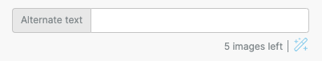
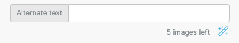

# Alternate Text Generation with AI

## Overview <a href="#overview" id="overview"></a>

The Alternate Text Generation with AI AddOn enables host application end users to instantly generate alternate text for images using AI. This feature is only available for images.

Visit the Alternate Text Generation with AI Knowledge Base article to learn more about the key benefits and use cases of this feature. Continue in this article to learn more about how to implement the Alternate Text Generation with AI AddOn in your host application.

## Prerequisites <a href="#prerequisites" id="prerequisites"></a>

Prior to getting started with the configuration, ensure you have the following:

* A working subscription with Azure
* Superpower or Enterprise plan

## Configuration Steps <a href="#configuration-steps" id="configuration-steps"></a>

This section discusses the steps you need to take to configure alternate text generation in your host application.

### Developer Console <a href="#developer-console" id="developer-console"></a>

To active alternate text generation with AI in your Beefree SDK Developer Console, take the following steps:

1. Go to the [Beefree SDK Developer Console](https://developers.beefree.io/accounts/login/)
2. Enter your application
3. Click on “AddOns”
4. Select the “Azure AI Vision – Image Analysis” AddOn
5.  Click “Install”

    Once you click “Install”, the “Set Up Content” pop up will appear to configure the AddOn
6. Toggle “Enable” to on
7. Insert your Azure API Key and Endpoint

**Note:** If you do not yet have an Azure API Key and Endpoint, navigate to the [Microsoft Azure Configuration Steps](https://docs.google.com/document/d/1\_bToJB4U06SvsxphJHKUKsssz7hzoAE4Gbqfa76Mjbo/edit#heading=h.8k1sgzr7vogd) of this guide.

<figure><figcaption></figcaption></figure>

### Microsoft Azure Configuration Steps <a href="#microsoft-azure-configuration-steps" id="microsoft-azure-configuration-steps"></a>

Azure Computer Vision is a key component of the Alternate Text Generation with AI AddOn. The steps highlighted in this section will guide you through how to obtain your Computer Vision or Cognitive Services API Key and Endpoint. If you have already obtained both, you can skip this section and navigate to the [Limit the Usage section](alternate-text-generation-with-ai.md#limit-the-usage) of this guide to learn more about customizing the AddOn for your end users.

Take the following steps to configure Azure Computer Vision and successfully integrate the AddOn into your host application:

1.  Login to the [Microsoft Azure Portal](https://login.microsoftonline.com/)

    1. Go to “Azure services”
    2. Click “Create a resource”
    3. Search “Cognitive Services”
    4. Select “Cognitive Services” or “Computer Vision”

    **Note:** Cognitive Services allows you to use other functions of Azure AI, but either “Cognitive Services” or “Computer Vision” will work for configuring the alternate text generation. Ensure you select the feature that is best for your use case.
2.  Click “Create”

    It will ask you for “Project Details”
3. Complete the following information to satisfy the “Project Details” requirement:

* Subscription
* Resource group
* Instance Details
* Region
* Name
* Pricing tier

**Note:** Version 4.0 is not yet available in all regions, but it is required for this feature to work. If you only have access to the 3.2 version, this feature will not work. Ensure that you have access to the correct version.

4. Click “Review + create” to create the resource
5. Azure will create your resource with an endpoint and API key &#x20;
6. Input in the endpoint in the provider url field within in the Beefree Developer Console
7. Input in the API key within the API key field within in the Beefree Developer Console

**Note:** Once you complete these steps, wait at least 15 minutes for the resources to become available. After 15 minutes, you will be able to move forward with using your API Key and Endpoint with the feature.&#x20;

For more information, visit the [Microsoft Azure Computer Vision documentation](https://learn.microsoft.com/en-us/azure/ai-services/computer-vision/quickstarts-sdk/image-analysis-client-library-40?tabs=visual-studio%2Clinux\&pivots=programming-language-rest-api).

## Limit the Usage <a href="#limit-the-usage" id="limit-the-usage"></a>

After you complete the configuration, the Alternate Text Generation with AI tool will be available to your end users. At this point in the process, the tool is offered for free to your end users. If you’d like to limit the usage of the Alternate Text Generation with AI tool, follow these additional steps to configure usage limitations.

1. Implement the onInfo call

Sample code onInfo call:

```javascript

const beeConfig = {
    uid: 'string',
    ... 
    onInfo: function (data) {

        // Check information is addon
       if (data.code === 1000) {

        // Check which addon
        const handle = data.detail.handle
        if (handle === 'ai-alt-text') {
          imagesCounter++
          const refreshedUsageSettings = {
            addOns: [
              {
                id: "ai-alt-text",
                settings: {
                  imagesAvailable: imagesAvailable,
                  imagesUsed: imagesCounter,
                }
              },
            ],
          }
          // Reload Config
          bee.loadConfig(refreshedUsageSettings)
        }
      }
    },
    ...
}

```

2. Confirm the AddOn handle is “ai-alt-text”


**IMPORTANT:** You consume one image for each request.


The following sample code shows imagesCounter and imagesAvailable, which determine how many images you have used, and the image limit the host application setup for users, respectively.

```javascript

let imagesCounter = 0
let imagesAvailable = 5

```

**Note:** In this example, the end user can only make five requests in total, after the fifth request, the end user will no longer be able to generate alternate text. The number five is defined in the configuration and can be customized. For example, if imagesAvailable is set ten, the end user will be able to perform ten requests.

3. In the AddOn settings, `isIconDisabled` is configured to automatically disable the Alternate Text Generation with AI feature when the counter reaches zero.&#x20;

```javascript

  // Check which addon
        const handle = data.detail.handle
        if (handle === 'ai-alt-text') {
          imagesCounter++
          const refreshedUsageSettings = {
            addOns: [
              {
                id: "ai-alt-text",
                settings: {
                  imagesAvailable: imagesAvailable,
                  imagesUsed: imagesCounter,
                }
              },
            ],
          }

```

## Display the Usage Widget <a href="#display-the-usage-widget" id="display-the-usage-widget"></a>

To display the widget usage, take the following steps:&#x20;

1. The call looks for imagesAvailable value and ImagesUsed value
2. To activate the display usage widget, provide the usage data via the addon settings.  Since the editor doesn’t track usage, you’ll need to refresh the values via the bee.loadConfig method to keep the display widget data current

```javascript

let imagesCounter = 0
let imagesAvailable = 1000

const beeConfig = {
    uid: 'string',
    ...
    // Initial AddOn configuration
    addOns: [
      {
        id: "ai-alt-text",
        settings: {
          imagesAvailable: imagesAvailable,
          imagesUsed: imagesCounter
        }
      },
    ],
    ...
    // Monitor for information
    onInfo: function (data) {

      // Check information is addon
      if (data.code === 1000) {

        // Check which addon
        const handle = data.detail.handle
        if (handle === 'ai-alt-text') {
          imagesCounter++
          const refreshedUsageSettings = {
            addOns: [
              {
                id: "ai-alt-text",
                settings: {
                  imagesAvailable: imagesAvailable,
                  imagesUsed: imagesCounter,
                }
              },
            ],
          }
          // Reload Config
          bee.loadConfig(refreshedUsageSettings)
        }
      }
    },
}


```

**Note:** If either of the settings imagesAvailable or imagesUsed are not sent, the application will not show the consumption.

## Advanced Permissions <a href="#advanced-permissions" id="advanced-permissions"></a>

This section discusses advanced permissions for your application users. You can use the two settings `IsIconDisabled` and enabled to configure permissions for your end users. To configure both booleans, take the steps outlined in the subsequent sections.

#### Disable Prompts Per User <a href="#disable-prompts-per-user" id="disable-prompts-per-user"></a>

To disable prompts per user, perform the following:

1. Set `isIconDisabled` to true

```javascript

{
                id: "ai-alt-text",
                settings: {
                  isIconDisabled: true
                }

```

**Note:** The end user will be able to see the button, but will not be able to use the button through setting the `isIconDisabled` setting to true&#x20;

You can reference the difference in appearance in the following images.

Image 1.0 displays an example of the wand when the feature is not active.&#x20;

<figure><figcaption></figcaption></figure>

Image 2.0 displays an example of the AI wand icon when the feature is active.

<figure><figcaption></figcaption></figure>

## Disable AddOn Per User <a href="#disable-addon-per-user" id="disable-addon-per-user"></a>

To disable the AddOn completely for an end user, perform the following:

1. Set the `enabled` field to false

```javascript

const beeConfig = {
    uid: 'inactive-user',
    ... 
    addOns: [
      {
        id: "ai-alt-text",
        enabled: false
      },
    ],
    ...
}

```

## Feature Limitations <a href="#feature-limitations" id="feature-limitations"></a>

Ensure you familiarize yourself with the following feature limitations to ensure this AddOn is suitable for your application’s needs:

* You can generate the caption for an image multiple times, but you’ll always get the same result for the alternate text
* The AI model does not work well with PNG or SVG images with transparent backgrounds, especially when the outline is black
* Only available in English
* Not available for Multi-language templates
* Images must have URLs and be publicly accessible
* Only available for static images, not available for dynamic images
* Not available for custom AddOn of image type

## Billing <a href="#billing" id="billing"></a>

Unlike the OpenAI AddOn, the Alternate Text Generation AddOn does not charge by tokens. Rather, the AddOn charges for each image caption you generate. Reference the [Microsoft Azure Pricing page](https://azure.microsoft.com/en-us/pricing/) for additional information.

If you want to know if you are being charged, and you have the usage widget enabled, you will only be charged if the counter goes down.

**Note:** If an error occurs after the icon for the Alternate Text Generation AddOn is clicked by an end user, and text is not generated, you will not be charged. You will only be charged for instances when a caption is successfully generated.

## Error Handling <a href="#error-handling" id="error-handling"></a>

In the event an error occurs, the end user will see an alert and you will receive a message from the Azure API with additional details regarding the error.

For more information on potential errors and error codes, reference the [Azure Cognitive Services REST API reference](https://learn.microsoft.com/en-us/rest/api/cognitiveservices/) or the [Computer Vision REST API reference – Azure Cognitive Services](https://learn.microsoft.com/en-us/rest/api/computer-vision/) depending on which service you opted in for to configure this feature.

## FAQs <a href="#faqs" id="faqs"></a>

**Q: Will Azure keep the photos used with this feature?**&#x20;

A: The following answer is directly from the [Azure Data and privacy for Image Analysis website](https://learn.microsoft.com/en-us/legal/cognitive-services/computer-vision/imageanalysis-data-privacy-security):

_The images you submit to Image Analysis service are processed in real time, and the input images and results are not retained or stored in the service after processing._

For more information on image processing and data security, refer to the [Azure AI services security documentation](https://learn.microsoft.com/en-us/azure/ai-services/security-features).
