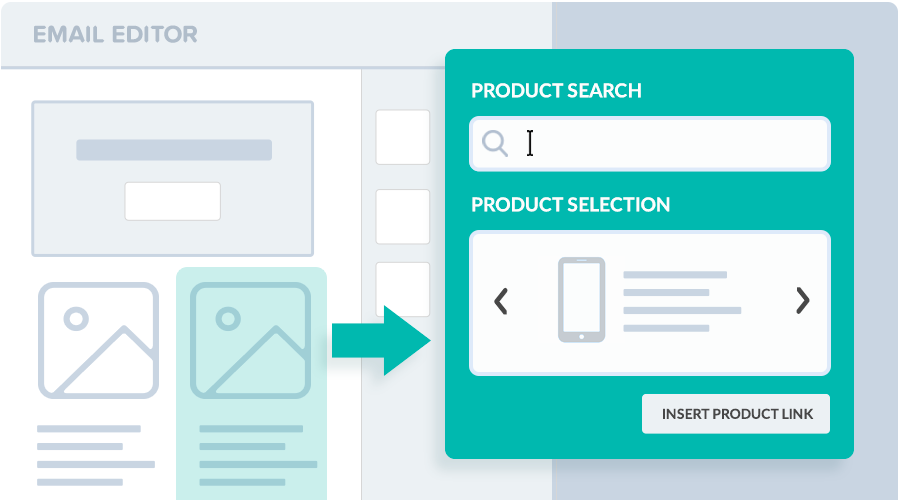
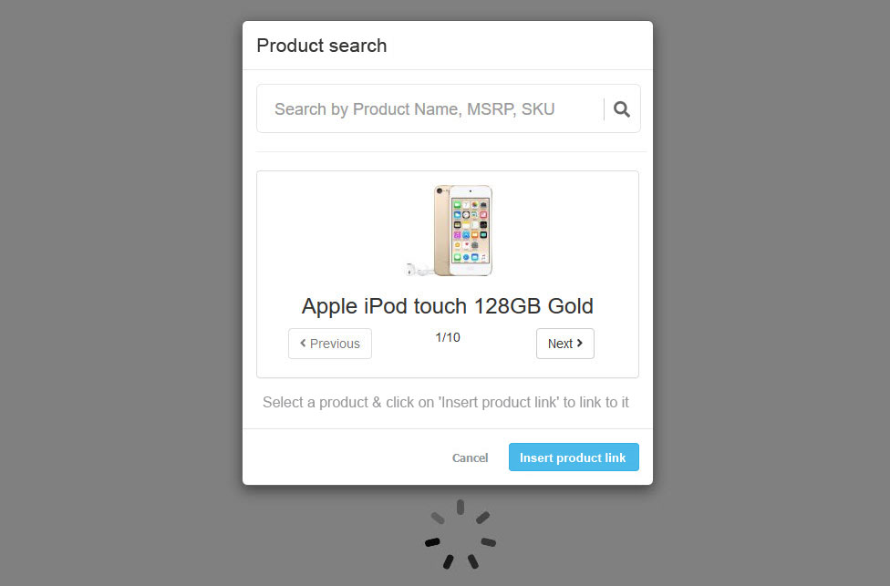
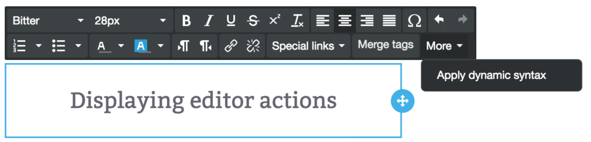
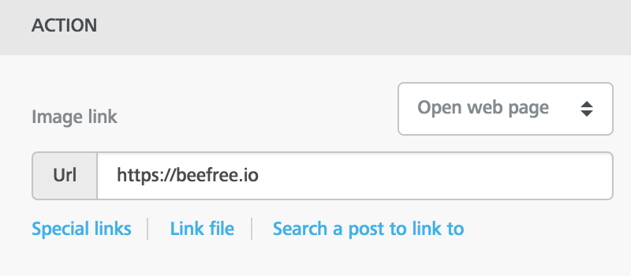
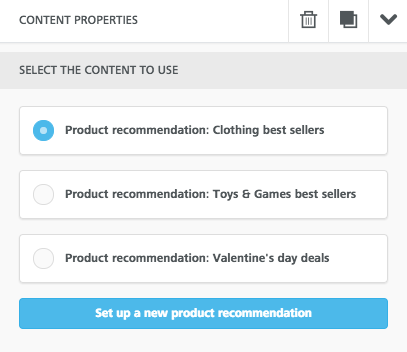
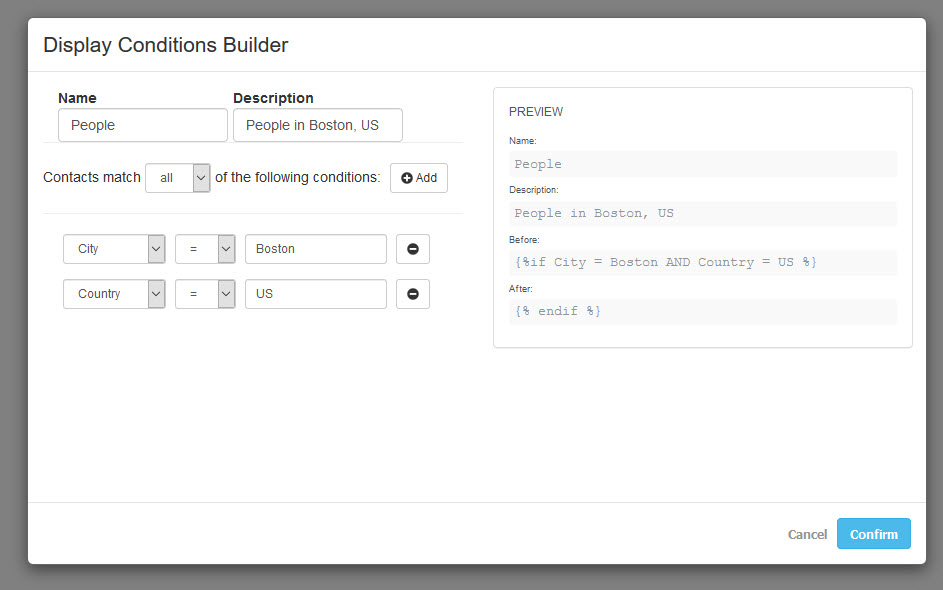
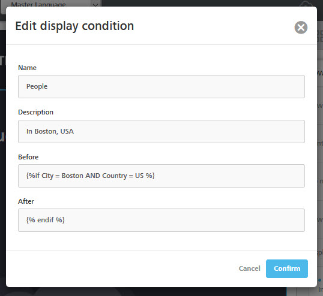
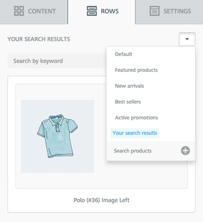
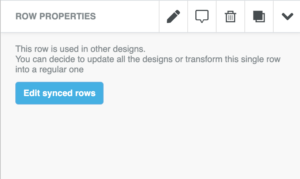

# Content Dialog


This feature is available on Beefree SDK [paid plans](https://dam.beefree.io/pluginpricing) only.


## The problem <a href="#the-problem" id="the-problem"></a>

When designing a message or a landing page with Beefree’s editors, there might be cases in which users of your application insert a [merge tag](smart-merge-tags.md), add a link to an image, or apply a [conditional statement](content-dialog.md#display-conditions).

It’s all good until things scale up. For example…

* What if you have 400 merge tags? You can [feed an array of merge tags](smart-merge-tags.md) to the editor, but that’s not going to cut it.
* What if it’s a 6,000 product database? How will they locate the right one? [Special Links](special-links-and-merge-tags.md) is not the right fit.
* And what if a [display condition](content-dialog.md#display-conditions) needs to be built on-the-fly?

## A flexible solution <a href="#a-flexible-solution" id="a-flexible-solution"></a>

Since the Beefree builders are used in hundreds of applications, and since each of them is facing different user experience challenges like the examples mentioned above, we decided that this was really a case where _one size does **not** fit all_.

So we engineered a solution that puts you in **control** and provides a large amount of **flexibility**.

If your users want to insert a merge tag or a display condition, you control how that will happen. You can overlay a window on top of the editor, for example, and display a simple search box, a list of categories to browse, or a complex configurator to build an advanced conditional statement.

We call this feature _Content Dialog_.

<figure><figcaption></figcaption></figure>

## An interactive UI layer <a href="#an-interactive-ui-layer" id="an-interactive-ui-layer"></a>

_Content Dialog_ allows you to build user interfaces for your users to locate & insert merge tags, links, conditional statements, and more. It lets you establish an interaction layer between the editor and your application (e.g. you show a pop-up window) that allows your users to locate/build/insert specific content (merge tags, links, conditional statements, etc.). And you’re in full control of the UI.

For example, imagine you want your customers to be able to quickly locate a link to a product page and assign that link to a button, image, or text. _Content Dialog_ will let you build the right user experience.

Here is a visual example of what you could accomplish in that _find a product link_ scenario.

<figure><figcaption></figcaption></figure>

The user experience in this interaction layer is entirely up to you. In the example above, the user clicked on “Find a product” (or alike) in the editor, and a modal window was shown, with a search box in it. Since you decide what the user experience will be like, you are fully in control of how users will select and insert:

* a text placeholder ([merge tag](smart-merge-tags.md))
* a dynamic link or a link to specific content ([special link](smart-merge-tags.md))
* a markup placeholder ([merge content](smart-merge-tags.md))
* a conditional statement ([display conditions](display-conditions.md)).

For each type of content, you can define the action that will be triggered in your application (e.g. display a modal window), and the text that will be displayed in the Beefree SDK editor’s UI to trigger that action (e.g. “Locate a merge tag”), keeping a consistent UX with other areas of your application.

## What it does <a href="#what-it-does" id="what-it-does"></a>

_Content Dialog_ introduces new call-to-actions in the editor UI.

Depending on the type of content, the call-to-action will be rendered as a button, a link, or a drop-down choice (see below a detailed list of UI changes).

The text for the action is defined by the host application, so you can use your own wording to provide a better experience.

**An example of a possible workflow when the user clicks on a content dialog action:**

1. The editor will start _waiting mode_ (same as when the _save_ action is triggered)
   * This mode prevents users from further editing and keeps the focus on the user selection
   * The waiting mode is interrupted if the host application cancels the action
2. The host application will display to the user a UI element to select or define a content item
3. When the selection is done, the host application closes the UI and passes it to the editor
4. The editor receives from the host application the selected content and exits _waiting mode_
5. The content is applied to the selected item

**The same example applied to special links (link to a product) in a text selection:**

1. The editor starts _waiting mode_
2. The host application displays an overlay that hides the editor and lists the categories of products to link. The user browses them to find the desired product and selects it.
3. The editor receives the link and exits _waiting mode_
4. The link is applied to the selected text

## How it works <a href="#how-it-works" id="how-it-works"></a>

To set up content dialogs you will need to add the `contentDialog` object to `beeConfig`:

```javascript


contentDialog: {
	specialLinks: {
		label: 'Custom text for links',
		handler: function(resolve, reject) {
			// Your function
		}
	},
	mergeTags: {
		label: 'Custom text for merge tags',
		handler: function(resolve, reject) {
			// Your function
		}
	},
	mergeContents: {
		label: 'Custom text for merge contents',
		handler: function(resolve, reject) {
			// Your function
		}
	},
	rowDisplayConditions: {
		label: 'Custom text for display conditions',
		handler: function(resolve, reject) {
			// Your function
		}
	},
	externalContentURLs: {
            label: 'Custom text for custom rows',
            handler: function(resolve, reject) {
                // Your function
        }
    },
	saveRow: {
    	handler: function (resolve, reject, args) {
        	// Your function
    	}
	},
    editSyncedRow: {
	    label: 'Custom text for synced rows',
        description: 'Custom description for synced rows',
	    notPermittedDescription: 'Custom description for synced rows when not permitted',
        handler: function (resolve, reject, args) => {
        	// Your function
    	}
    }

}


```

You can add all the dialogs, some of them or only one. Is up to your application to create them for all the users or a segment, as there are no related server-side settings, you can customize them for each editor start.

All the dialogs use the same pattern, but the returned object must match the element pattern (described in the following section).

### **label**

Defines the text displayed in the editor UI.

### **handler**

Is a function with a [Promise](https://dam.beefree.io/mozillapromise)-like signature.\
This function lets you use your own logic to retrieve the desired value.\
Once the value is available, you must call the `resolve(value)` function to pass it to the editor.\
In case you want to cancel the operation, call the `reject()` function.

A resolve or reject call is mandatory. If you miss this step, the editor will remain in waiting mode.\
Error management on the host application must call the reject function to unblock the editor.

### **Examples**

#### **Simple application of a link action**

```javascript


contentDialog: {
  specialLinks: {
    label: 'Add an Example Link',
    handler: function(resolve, reject) {
      resolve({
        type: 'custom',
        label: 'external special link',
        link: 'http://www.example.com'
      })
    }
  },
}


```

A very simple example of how to apply a Special link.

When the user clicks on Add an Example Link, the URL http://www.example.com is applied to the selection (a button, an image or a text).

The waiting mode will not be perceived, and there is no cancel action.

### **Apply a link with a delay**

```javascript


contentDialog: {
  specialLinks: {
    label: 'Add an Example Link after 2 seconds',
    handler: function(resolve, reject) {
      setTimeout(function() {
        resolve({
          type: 'custom',
          label: 'external special link',
          link: 'http://www.example.com'
        })
      }, 2000)
    }
  },
}


```

Same as the previous example, but the waiting mode will display for two seconds before applying the URL.

### **Opening a dialog UI element**

```javascript


contentDialog: {
  specialLinks: {
    label: 'Custom text for links',
    handler: function(resolve, reject) {
      openMySpecialLinkDialog() // Replace this with your application function
        .then(specialLink => resolve(specialLink))
        .catch(() => reject())
    }
  },
},


```

In this example the `openMySpecialLinkDialog()` should be replaced with a function that opens a modal window (or other element) of the host application, where the user can select or build a link.

The selection is then returned as the value of `specialLink` to the `resolve()` function.

A cancel action will trigger the `reject()` function instead.

## Returned value syntax

Values must use the same pattern used in the `beeConfig` object.

The returned object is validated against the expected format.

If the validation fails, an error will be returned in the browser console:

E.g., `Error getting content rowDisplayConditions, the item is malformed.`

These errors will not trigger any visible notification in the UI.

## **Configuration**

```javascript


contentDialog: {
	mergeTags: {
		label: 'Apply dynamic syntax',
		handler: function(resolve, reject) {
			//your function goes here
		}
	},
},

```

You can add a new action, available in the text toolbar, and associated with the merge tag element:

<figure><figcaption></figcaption></figure>

### **Most common use cases:**

* Your application has a high number of placeholders and needs to provide a categorization or search form
* Placeholder availability depends on options that the user can select while building the message
* You want to display the same UI your users already know and use in your application
* You need to separate merge tags from other text placeholders

### **Value**

```javascript
{
	name: 'Placeholder name', // Will not be shown
	value: '{{ syntax }}' // Text string that will be added
}
```

_The name parameter may be later displayed if the user selection is saved and loaded in beeConfig on subsequent requests._

## Special links <a href="#special-links" id="special-links"></a>

### **Configuration**

```javascript

contentDialog: {
	specialLinks: {
		label: 'Search a post link',
		handler: function(resolve, reject) {
			//your function goes here
		}
	},
},
```

Links are applied to different contents, so, when you define a link dialog action, it will be displayed in:

The text-toolbar, as happens with merge tags

<figure><figcaption></figcaption></figure>

An image or button action

<figure><figcaption></figcaption></figure>

### **Most common use cases:**

* Apply links to products or news using a categories pattern, a search form, or a visual browser
* Apply special parameters or configuration to certain links with a wizard or form
* You want to display the same UI your users already know and use in your application

### **Value**

```javascript
{
    type: 'A link type', // will not be shown
    label: 'Text', // Will be used as default text when text is not selected
	link: 'http://...' // The URL that will be applied. Placeholders can be used
}
```

_The type parameter may be lately displayed if the user selection is saved and loaded in `beeConfig` on later requests._

## Merge contents <a href="#merge-contents" id="merge-contents"></a>

### **Configuration**

<pre class="language-javascript"><code class="lang-javascript"><strong>contentDialog: {
</strong>	mergeContents: {
		label: 'Set up a new product recommendation',
		handler: function(resolve, reject) {
			//your function goes here
		}
	},
},
</code></pre>

The content dialog adds a button to the merge content list:

<figure><figcaption></figcaption></figure>

### **Most common use cases:**

* Set up the content and/or layout for a product recommendation
* Set up the content and/or layout for a dynamic advertising
* Set up the content and/or layout for another type of targeted content

Notice that, to display the Dynamic content tile in the contents panel, you must configure [mergeContents](smart-merge-tags.md) in [beeConfig](../getting-started/installation/configuration-parameters/) with at least one predefined item.

### **Value**

```javascript

{
	name: 'Content name', // Will be displayed in the editor UI and in the message
	value: '{{ syntax }}' // Text string that will be added to the HTML output (will be show in the preview)
}

```

## Display conditions <a href="#display-conditions" id="display-conditions"></a>

### **Configuration**

```javascript
contentDialog: {
	rowDisplayConditions: {
		label: 'Open builder',
        handler: function(resolve, reject) {
			//your function goes here
        }
    },
},
```

A new button will be available in the display condition widget. In this example, the button says “Open builder”, which is the `label` shown in the JSON configuration file shown above.

<figure><figcaption></figcaption></figure>

### **Most common use cases:**

* Display a condition builder or form to target a segment of recipients
* Display a form to create a loop with the row dynamic contents, as product recommendations

### **Value**

```javascript
{
	type: 'A category for this condition', // Will not be shown
	label: 'Condition', // Will be displayed as the condition name
	description: 'Small text describing what the condition does', // Will be displayed in the editor UI to identify the condition action
	before: '
', // Will be added before the selected row
	after: '
', // Will be added after the selected row
}
```

_The type parameter may be later displayed if the user selection is saved and loaded in `beeConfig` on subsequent requests._

### **An example**

In this example, a window is shown to users when they click on the button to open the builder.

<figure><figcaption></figcaption></figure>

The UI is entirely up to the hosting application. Here, the developer decided to offer some fields at the top where the _Display Condition_ can be named and described, an area below it where parameters, values, and operators can be selected, and a preview on the right.

When users click on “Confirm”, the information is passed back to the editor and shown in the properties panel.

<figure><figcaption></figcaption></figure>

Of course, it can be edited in the editor like any other _Display condition_, if the user has the [rights to do so](roles-and-permissions.md).

<figure><figcaption></figcaption></figure>

## Custom rows <a href="#custom-rows" id="custom-rows"></a>

### **Configuration**

```javascript
contentDialog: {
    externalContentURLs: {
            label: 'Search products',
            handler: function(resolve, reject) {
                // Your function
        }
    }
}
```

The content dialog adds a new item, using your text label, in the Rows drop-down:

<figure><figcaption></figcaption></figure>

### **Most common use cases:**

* Import a set of products or news, as custom rows, using a categories pattern, a search form, or a visual browser
* Set up the row layout for a set of predefined contents
* Set up rows with dynamic content to build dynamic sections that provide product recommendations, QR or bar codes, advertising content, etc.

### **Value**

```javascript
{
    "name":"Results name", // Will be added as a new choice in the rows drop-down
    "value":"https://..." // Will be used to get the list of rows
}
```

This response will:

1. Create a new drop-down choice with the provided name
2. Display the rows provided by the URL in the rows panel

<figure><figcaption></figcaption></figure>

Notice that in the rows list, names returned by the content dialog display as highlighted elements to give them further visibility over starting choices.

The content dialog can be used as many times as the user needs and, depending on the response, the behavior may change:

#### **1. Returning the same name**

This overwrites the existing results, keeping the same name in the drop-down.\
This behavior perfectly matches our example above, where the host application returns “Your search results” every time the content dialog is resolved.

#### **2. Returning a new name**

This creates a new drop-down choice, keeping the previous results as selectable elements. Previous results are available directly in the drop-down.\
Usage example:

<figure><figcaption></figcaption></figure>

## Synced Rows

### **Configuration**

```javascript
contentDialog: {
    editSyncedRow: {
		label: 'Edit synced rows',
		description: `This row is used in other designs.
					  You can decide to update all the designs or transform this single row into a regular one`,
		notPermittedDescription: `This row is used in other designs.
                                  Your plan does not permit you to edit it. Please contact your account administrator`,
        handler: function (resolve, reject, args) => {
        	resolve(false) // the boolean will be the value of  'Label of the sidebar button that triggers the contentDialog'`synced`
                           // if false the row will be un-synced, if true nothing will happen.
    	}
    }
}
```

The `label`, `description` and `notPermittedDescription` fields handle the wording related to the “Edit synced row” call-to-action/button. Here’s how and where they are used:

* `label`: Label related to the sidebar button that triggers the content dialog
* `description`: Description of the action on top of the button
* `notPermittedDescription`: Description of the action when the button is hidden from the dedicated [advanced permission](advanced-permissions.md)&#x20;

Here’s an example of what `label` and `description` would look like:

<figure><figcaption></figcaption></figure>

And here’s an example of what `notPermittedDescription` would look like:

<figure><figcaption></figcaption></figure>

## Save rows <a href="#save-rows" id="save-rows"></a>

### **Configuration**

```javascript
contentDialog: {
    saveRow: {
        handler: function (resolve, reject, args) {
            // Your function
        }
    }
}
```

Unlike the rest of content dialog configurations, _Save rows_ doesn’t use the `label` parameter as the UI element is a save icon displayed on the selected row (and in the row’s properties panel):

<figure><figcaption></figcaption></figure>

The _Save rows_ content dialog is a mandatory step in the [Save rows](../saved-rows/) workflow.

The `resolve` function must return metadata for the selected row. The [_metadata_](../saved-rows/) section of the rows schema allows you to keep track of row-specific information.

The `args` object in the handler function returns to the host application metadata already applied to the selected row.

### **Value**

```


{
    "name":"Row name", // Mandatory metadata
    "Category":"A row category" // If you provide category management for saved rows
    "...":"..." // You can add as metadata as your application needs
}


```

This response will provide metadata that is added to the row in the asset (email, page, popup) before it’s provided through the [Save Rows callback](../saved-rows/).

The row name is the only required metadata and it’s displayed as the row title in the _Rows_ panel:

* A string of plain text that identifies the row.
* Displayed in the row card when the row is shown in the _Rows_ panel.
* Used for text searches within the _Rows_ panel

&#x20;Check the [Saved rows metadata section](../saved-rows/save-rows-overview.md) for further details on recommended metadata.

## Forms <a href="#forms" id="forms"></a>

### **Configuration**

```javascript
manageForm: {
	label: 'Edit form',
	handler: async (resolve, reject, args) => { 
		// Your function
	} 
},
```

If you want to have total control on the forms that a Beefree application displays and renders, you can use this _forms_ Content Dialog rather than passing a single form to the Beefree application.

The **forms** Content Dialog works the same way as the previous Content Dialog for the **saved rows –** but in this case, the `resolve` function should return the structure for the desired form.

The `args` object in the handler function returns to the host application the form object already applied. With this information, the application can decide what to display to the user (e.g., edit the current form, suggest a similar form, etc.).

To understand how this data is structured, refer to the [form structure page](../form-block/integrating-and-using-the-form-block/form-structure-and-parameters.md) on this website.

## Custom attributes <a href="#custom-attributes" id="custom-attributes"></a>

### **Configuration**

```javascript
        customAttribute: {
          label: 'Search Attributes',
          handler: (resolve, reject) => {
            resolve({
              key: '2783f0ea-f6af-44f3-856e-d7a01cd87714',
              name: '100% Custom',
              value: 'My custom value',
              target: 'link',
            })
          }
        },
```

If your end users need to apply custom attributes to the links and images in their content, you can completely customize the user experience and workflow for adding those attributes with a Content Dialog that will take over the editor’s UI. The dialog will need to return the attribute to apply.

## Custom video <a href="#custom-video" id="custom-video"></a>

### **Configuration**

```javascript
addVideo: {
  label: 'Choose a video',
  handler: async (resolve, reject) => {
    resolve({
      videoSrc: 'https://link.to.your.custom.video', // mandatory
      thumbSrc: 'https://my.beautifulimages.com/thebest.jpg', // mandatory
      thumbAlt: 'The title of my custom video!', // optional
    })
  }
}
```

It is possible to leverage the Content Dialog method to add videos from custom sources – other than YouTube and Vimeo.

You can use the `addVideo` Content Dialog modal, which will take over the builder’s UI. The video will be added as a thumbnail in the content area.

The user must fill out the video URL from a custom source, the image used as a thumbnail, and an alt text/title by implementing a custom modal window (optional). When the user clicks on the video thumbnail, it will open `videoSrc` in a new tab/window.
