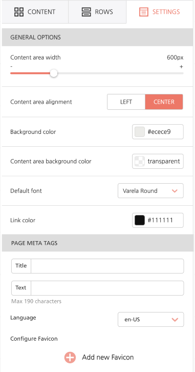

# Meta Tags


Meta Tags are available for [Email Builder](../email-builder.md) and [Page Builder](../page-builder/).


## Overview <a href="#overview" id="overview"></a>

With **Meta Tags**, you can now apply various tags to your HTML that can greatly benefit your SEO and accessibility needs. These include **Title Tags, Meta Description Tags,** and **Language attributes**. For the Email Builder, this means improved deliverability performance, and for the Page Builder, this means greater customization and improved search engine results.

<figure><figcaption></figcaption></figure>

A page title, also known as a **Title tag**, is a short description of a webpage that appears at the top of a browser window and in SERPs (Search engine results page). This is an important element of an optimized SEO page, as it affects the page ranking in search engines. The title tag will be located within the \<title> element of a page’s HTML output, and its value will be saved inside the JSON template.

Here is an example of what a Title Tag inside Beefree SDK’s HTML output might look like:

```javascript

<title>Done with love using BeefreeSDK</title>

```

The **description tag** is located within the \<meta> tag element of a page’s HTML, and it has a limit of 190 characters. The tag will be located within the \<meta> element of the page’s HTML output, and its value will be saved inside the JSON template.&#x20;

Here is an example of what a description tag inside Beefree SDK’s HTML output might look like:

```javascript

<meta name="description" 
content="This is an example of a meta description. 
This will often show up in search results.">

```

## Language Attribute <a href="#language-attribute" id="language-attribute"></a>

The **HTML lang attribute** is used to identify the language of text content on the web. This information helps search engines return language-specific results, and it is also used by screen readers that switch language profiles to provide the correct accent and pronunciation for accessibility purposes.

When loading the builder, the host application can specify in the configuration a list of languages for their users to choose from (e.g. en-US), see the example below where the only option “Italian, it-IT” is provided. If there are no values provided via configuration file, a standard list of common languages will be provided.

```javascript

beeConfig: {
   ...
   metadata: {
      languages: [
         { value: 'it-IT', label: 'Italian' },
         ...
      ]
    }
}

```

Here is an example of what a language attribute inside Beefree SDK’s HTML output might look like:

```javascript

<html lang="en">

```
