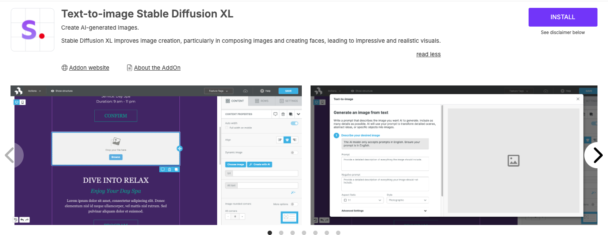
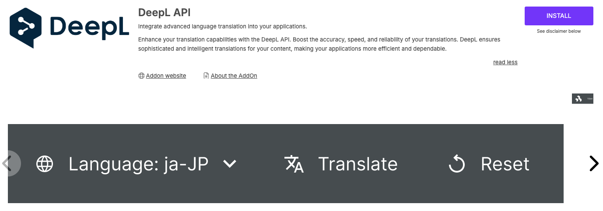

# AI AddOns


You can install the Beefree AI AddOns from your Beefree SDK [Developer Console](../../builder-addons/partner-addons/installing-partner-addons.md).&#x20;


### AI Writing Assistant

Empower users to generate text quickly with AI. With this AddOn, your end users will see a new “Write with AI” button for Title, Paragraph, List, and Button content blocks. Beefree SDK processes your end users' prompts, sends them to your AI provider, and returns the response to the end user. They can then decide to apply or regenerate the response. By integrating the AI Writing Assistant, you provide your end users with a powerful tool to complete their designs quickly, which helps them maintain a competitive edge. Choose between [Azure OpenAI](https://azure.microsoft.com/en-us/products/ai-services/openai-service/?ef_id=_k_Cj0KCQjwwae1BhC_ARIsAK4JfrxKm9iAYpFxdsG338x_u9X0GZpyFYL2a4lsLLy4Kib2MTsseC7Qpz0aAoPKEALw_wcB_k_\&OCID=AIDcmm5edswduu_SEM__k_Cj0KCQjwwae1BhC_ARIsAK4JfrxKm9iAYpFxdsG338x_u9X0GZpyFYL2a4lsLLy4Kib2MTsseC7Qpz0aAoPKEALw_wcB_k_\&gad_source=1\&gclid=Cj0KCQjwwae1BhC_ARIsAK4JfrxKm9iAYpFxdsG338x_u9X0GZpyFYL2a4lsLLy4Kib2MTsseC7Qpz0aAoPKEALw_wcB), [OpenAI](https://openai.com/) or [Anthropic](https://www.anthropic.com/) as providers for this feature, our AddOn is quick and simple to integrate.

 

[How do I enable the AI Writing Assistant AddOn?](https://devportal.beefree.io/hc/en-us/articles/10838757053330-How-do-I-enable-the-OpenAI-AddOn-) | [Developer’s FAQ for OpenAI](https://devportal.beefree.io/hc/en-us/articles/10839177777810-Developer-s-FAQ-for-OpenAI) | [Webinar](https://app.livestorm.co/beefreeio/introducing-bee-plugin-openai-add-on-live-demo-and-q-and-a/live?s=7cef0fc7-d888-4627-a5c6-a3c4ed1c396d)

### Custom AI Writing Assistant 

The Custom AI Writing Assistant AddOn enables host applications to integrate their own LLM models with Beefree SDK. This allows host applications to provide their end users with advanced AI writing capabilities that are specific to their domains. Using the [Content Dialog](https://docs.beefree.io/beefree-sdk/other-customizations/advanced-options/content-dialog), this AddOn employs the same entry points as the [AI writing assistant](https://docs.beefree.io/beefree-sdk/ai-and-mcp/ai-writing-assistant), allowing full control over the AI experience within your application. Once your Custom AI Writing Assistant AddOn is fully configured, the [Content Dialog](https://docs.beefree.io/beefree-sdk/other-customizations/advanced-options/content-dialog) displays the modal you created within the user interface when end users click the **Write with AI** button in the sidebar. 

<figure><figcaption></figcaption></figure>

[How do I enable the Custom AI Writing Assistant AddOn?](https://docs.beefree.io/beefree-sdk/ai-and-mcp/ai-writing-assistant/custom-ai-writing-assistant) | [Terms of Services](https://developers.beefree.io/terms-of-service)

### Stability AI (Text-to-image)

The Stability AI AddOn converts text to images. This feature allows your end users to submit descriptions of what they would like to see in their AI-generated images, and to also submit negative prompts of what they do not want to see in their image. Once they submit the prompt and negative prompt, they'll receive an AI-generated image that they can use directly within their designs. 

<figure><figcaption></figcaption></figure>

[How do I enable the Stability AI AddOn?](https://docs.beefree.io/beefree-sdk/builder-addons/partner-addons/partner-addons-directory#openai) | [AI Providers and Data Security](https://docs.beefree.io/beefree-sdk/ai-and-mcp/ai-writing-assistant/data-security) | [Terms of Services](https://developers.beefree.io/terms-of-service)

### Generate Alt Text with AI

Generate alt-text descriptions with the power of Computer Vision. Azure AI Vision is a unified service that offers innovative computer vision capabilities. Image analysis pulls from more than 10,000 concepts and objects to detect, and caption images.

<figure><figcaption></figcaption></figure>

[How do I enable the Azure AI Vision - Image Analysis AddOn?](https://app.gitbook.com/s/8c7XIQHfAtM23Dp3ozIC/ai-and-mcp) | [Azure Ai Vision FAQs](https://docs.beefree.io/beefree-sdk/addons/partner-addons/alternate-text-generation-with-ai#faqs) | [Data and Privacy](https://learn.microsoft.com/en-us/legal/cognitive-services/computer-vision/imageanalysis-data-privacy-security)

### DeepL (AI-powered translation)

Through this AddOn and [Multi-language templates](https://docs.beefree.io/beefree-sdk/other-customizations/multi-language-templates), you can empower your end users to create up to six different language versions of a single design. Once your end users create their new language versions, they can click the **Translate** button to automatically translate all the translatable content within their designs.

<figure><figcaption></figcaption></figure>

[How do I enable the DeepL AddOn?](https://docs.beefree.io/beefree-sdk/ai-and-mcp/deepl) | [AI Providers and Data Security](https://docs.beefree.io/beefree-sdk/ai-and-mcp/ai-writing-assistant/data-security) | [Terms of Services](https://developers.beefree.io/terms-of-service)

