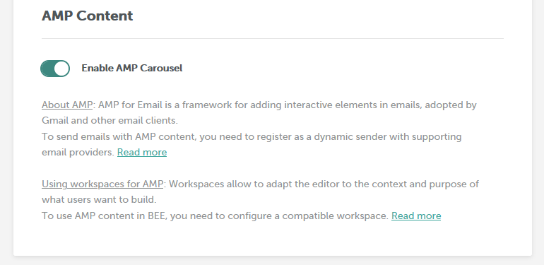
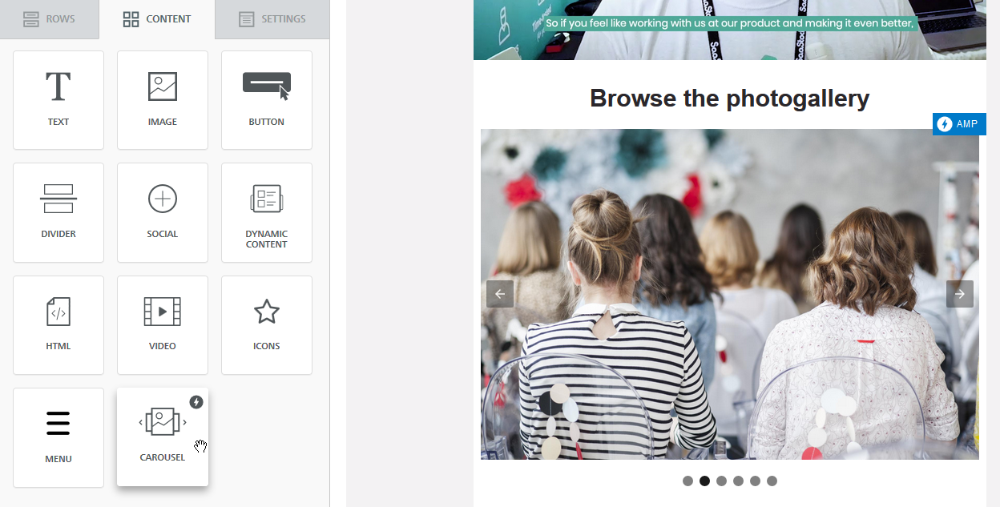
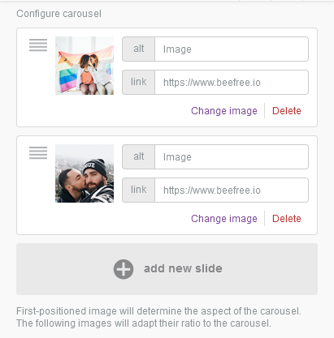
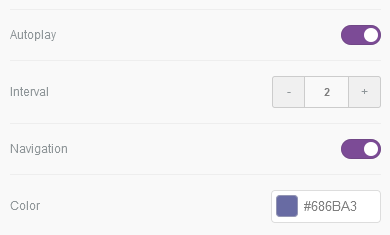
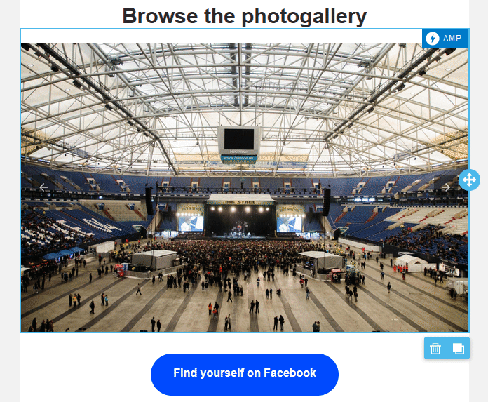
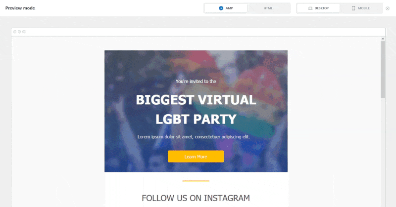
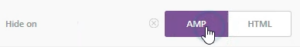
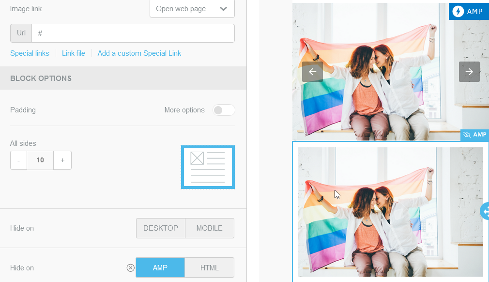

# AMP for Email

## What is AMP for Email? <a href="#what-is-amp-for-email" id="what-is-amp-for-email"></a>

[AMP](https://amp.dev/) is an open-source, web component framework, maintained by the OpenJS Foundation with significant support from Google. Its goal is to create great experiences across the web, focusing on interactivity and speed.

<figure><figcaption></figcaption></figure>

AMP for Email features interactive elements that email readers can use to take action directly in the inbox. It can also be used to fetch up-to-date information and present it each time an email is opened.

## How AMP for email works <a href="#how-amp-for-email-works" id="how-amp-for-email-works"></a>

Traditionally, a marketing or a transactional email is a multipart message, with two different parts delivered as different MIME types.

* HTML: this is what the vast majority of email clients support. It is also the usual output of our email builder.
* Text: Originally, this was the only way to send emails. When the HTML MIME type was rolled out, not all email clients supported HTML, or readers could set their client to stick to the Text version. The text part still acts as a fallback for the HTML part. Beefree builders do not produce this MIME type.

[AMP for Email](https://amp.dev/about/email) works by creating AMP markup that looks like HTML but is a new specification. That code is written in a separate email file, delivered using a third, additional MIME type (on top of existing HTML and text types). We’ll provide an additional AMPHTML document when there’s AMP content in the email saved by Beefree’s email builder.

The AMPHTML version will be delivered only to the inboxes of **service providers that support AMP –** currently **Gmail, Yahoo Mail** (webmail only), and **mail.ru**. All other clients will **fall back to the HTML** version.

Please note that adding AMP content in Beefree’s email builder is only possible through our **AMP-powered widgets**. We currently do not support adding AMPHTML markup directly into the message. Our first AMP content block is the **AMP Carousel**.

## Activating the AMP Carousel <a href="#activating-the-amp-carousel" id="activating-the-amp-carousel"></a>

The AMP Carousel is OFF by default and you must first activate it in the Beefree SDK Console.

To do so:

* [Login into the Beefree SDK Console](https://dam.beefree.io/devmain)
* Click **Details** next to the application you want to configure
  * We recommend you first try the AMP carousel under a DEV or QA application
* Click view more under **Application configuration**.
* In the AMP Content section, toggle **Enable AMP Carousel** ON and click the **Save** button to activate Commenting for the application.

<figure><figcaption></figcaption></figure>

Next, to activate the AMP Carousel when launching the builder, you will need to initialize your Beefree application with an AMP-compatible workspace.

## Using workspaces for AMP <a href="#using-workspaces-for-amp" id="using-workspaces-for-amp"></a>

We recommend starting by initializing a Beefree application with a “mixed” workspace, which is the most straightforward way of testing out the AMP Carousel. This parameter will:

* activate the AMP Carousel block in the **Content** tab;
* add a **Hide on AMP/HTML** property in the “block options” section of content blocks. This property will be essential when creating AMP emails to manage content visibility and fallbacks.

Also, when the message contains AMP content, you will:

* see a switch between the HTML and the AMP version in the message **preview**;
* receive an **additional AMPHTML** document when the `OnSave` method is fired.

Here is how to load a Beefree application with a “mixed” workspace:

```javascript

type ClientConfig = {
  workspace?: {
    type:'default'|'mixed'|'amp_only'|'html_only'
  }
  // ....
}

const beeConfig: ClientConfig = {
  workspace:{
    type:'mixed'
  }
  // ....
}


//Create the instance 
function BeePlugin.create(token, beeConfig, (beePluginInstance) => { 
  //.... 
}

```

If the workspace is loaded successfully, a `onLoadWorkspace(workspace)` callback is triggered.

```javascript

//SUCCESS 
onLoadWorkspace: function (workspace) {
  console.log(`workspace: ${workspace} has been loaded`);
},

```

Visit [Workspaces](readme/installation/configuration-parameters/workspaces.md) to learn more about what workspaces are and the additional workspaces you can use for AMP content.

## Loading a template with AMP content

If you don’t set a workspace when loading the builder, AMP widgets are not visible in the Content tab. However, if a message or template containing AMP is loaded, the builder will send an [`onWarning`](https://about/error-management/#warning-codes) [callback](error-management/onwarning.md) to your application. At that point, you may decide to switch to an AMP-compatible workspace, using the [`loadWorkspace`](https://about/workspaces/#switching-workspaces) [method](readme/installation/configuration-parameters/workspaces.md).

## How to use the AMP carousel <a href="#how-to-use-the-amp-carousel" id="how-to-use-the-amp-carousel"></a>

The Carousel content tile will appear in the Content tab after enabling it in the Beefree SDK Console and loading the editor with an AMP-compatible workspace, as described above.

<figure><figcaption></figcaption></figure>

To start creating a carousel, users need to drag and drop the carousel block to the stage. By clicking on “browse” or dropping an image file in the block, they can start adding images, or as we call them in this context, “slides”.

The carousel looks best using images of the same size. However, it is possible to mix sizes in the slides: in that case, the logic that drives how the carousel is rendered is that the first slide will determine the carousel ratio. The slides that follow will be adapted to that ratio.

<figure><figcaption></figcaption></figure>

Beyond this, remember that images will be adapted to fill the carousel width, so if users choose an image less wide than the carousel, it will be stretched to fill it.

For each slide, users can:

* set an **alternate text** in case the slide doesn’t load, the email client blocks images or the email is opened with a screen reader;
* set a **link** so that clicking or tapping on the slide takes recipients to a specific destination;
* **rearrange the slides** in the carousel by dragging the slide card inside the content properties panel;
* **Change image** or **delete** the slide by using the controls in the slide card.

There are two additional properties for a carousel:

<figure><figcaption></figcaption></figure>

* Autoplay, to enable automatic scrolling between slides, setting the interval in seconds between each slide (the autoplay stops if the recipient interacts with the carousel).
* Dot navigation, to add a dot for each slide, so that the reader can jump to different images without scrolling with the arrows. The user can define the color of the dots.

The carousel can be previewed right inside the editing stage, using the left and right arrows in the AMP carousel block:

<figure><figcaption></figcaption></figure>

For a full preview, using real AMPHTML, users need to hit Preview, and they can switch between the AMP and the HTML version, both on mobile and desktop.

<figure><figcaption></figcaption></figure>

## Creating the HTML fallback <a href="#creating-the-html-fallback" id="creating-the-html-fallback"></a>

When using AMP content, it’s essential to **create fallback** for email clients that **don’t support AMP**. The fallback can be easily obtained with the “Hide on AMP/HTML” widget, available on all blocks as a content property.

<figure><figcaption></figcaption></figure>

It is very similar to the “Hide on Desktop/Mobile” control. Users can add the content for the HTML fallback and mark it as “Hide on AMP”. Inside the stage, a visual cue in the block’s outline will identify the block as hidden on AMP.

<figure><figcaption></figcaption></figure>

Besides the carousel, users can mark any part of the email as AMP-only by applying the “Hide on HTML” property.

## FAQs on the AMP Carousel <a href="#faqs-on-the-amp-carousel" id="faqs-on-the-amp-carousel"></a>

### **What image formats are supported?**

There are no particular limitations. You can use any image type that already works with the standard Image block (GIFs included). Please note that if you have a custom [file system provider](server-side-options/storage-options/connect-your-file-storage-system.md) that limits the image types that can be loaded in the builder, it will reflect also on the AMP carousel.

### **Can I edit an image used as a carousel slide?**

No, it’s not possible to use the image editor. You might work around this limitation by editing the image in a standard Image block and then adding it to the carousel.

### **Are there any suggestions for image sizes?**

The best way to build a carousel is to use images with the same size, or that respect the same image ratio. Plus, the first slide should be wide at least as the carousel block, to avoid image stretching.

### **Why am I getting an INVALID\_AMP email in the inbox when I send a test email with AMP content?**

AMP is a versatile but pretty strict framework, and it will not render messages that don’t respect its validation protocol. The most common validation error is related to **invalid HREF value** in links (e.g., no URL, invalid or missing protocol, or incorrect URL composition).

To validate an AMP message before sending it out, all post-processing steps must beperformed (e.g., substitution of text variables that may impact link validation). Since Beefree builders use a replacement syntax and do not handle substitutions, we can’t currently provide a built-in validation without triggering false positives. However, nothing prevents you from adding a validation service in your application before sending out AMP emails.

### **Is there a weight limit for the AMP part of an email?**

The limit for the AMP version of an email, before being trimmed by Gmail clients, is 200Kb, up from 100Kb for HTML emails.

## Disable the AMP Carousel for specific customers <a href="#disable-the-amp-carousel-for-specific-customers" id="disable-the-amp-carousel-for-specific-customers"></a>

Once you turn on the feature in the Beefree SDK Console, you may want to **disable AMP Carousel for some customers**. You can do so via the client-side configuration document that you feed to your Beefree application when initializing the editor.

Why? Because you may decide to make the feature available to your customers:

* **depending on the subscription plan** that they are on (i.e. you could push users to a higher plan based on the ability to use AMP);
* **depending on the purchase** of an optional feature (same);
* only if they are **“beta” customers**, so they see it while keeping it hidden from the rest of your users.

Here’s how to do so:

* Enable AMP Carousel in the Beefree SDK Console, as mentioned above.
* Configure the ‘default’ workspace in the beeConfig document, so that AMP cannot be used ([more details here](readme/installation/configuration-parameters/workspaces.md)). As an alternative, if you don’t configure a workspace, the Beefree application will be loaded with the default workspace.

## What you need to do to send AMP emails <a href="#what-you-need-to-do-to-send-amp-emails" id="what-you-need-to-do-to-send-amp-emails"></a>

* Your app must save the additional AMPHTML version of the email, when returned by the Beefree system, the same way it already saves the HTML version.
* Your sending infrastructure must handle delivering an additional MIME type for AMP – this typically involves becoming an [authorized sender](https://developers.google.com/gmail/ampemail/register) for dynamic emails.
  * In alternative, you can leverage one of the existing ESPs that already support sending AMP emails via SMTP or API, such as Amazon SES, Mailgun, and Sparkpost. See the full list list [here](https://amp.dev/support/faq/email-support).
* You should advise end-users on creating fallback for AMP content due to limited client support for AMP – _optional, but highly recommended_.
  * For example, if they create an image carousel with AMP, they should also add some images for the HTML version. They can hide content for the AMP version with the “Hide on AMP” content property.

## What your end users need to do to send AMP emails <a href="#what-your-end-users-need-to-do-to-send-amp-emails" id="what-your-end-users-need-to-do-to-send-amp-emails"></a>

The email senders – i.e., the end-users of your application – need to:

* Have domain authentication in place (SPF, DKIM, DMARC) for the domain they use to send emails with your app.
* Register with [Google](https://dam.beefree.io/ampregister), [Verizon Media](https://dam.beefree.io/ampyahoo) (Yahoo) and [mail.ru](https://dam.beefree.io/mailruamp) as an authorized sender for dynamic emails, so that AMP emails will be rendered in the inbox of recipients who use these clients.
  * Each email client has a separate registration process.
  * Each email address that will be used to send AMP emails address needs to be authorized individually.
  * These registration processes usually involve
    * Meeting the client’s bulk sender guidelines.
    * Sending a real, production-quality AMP email, from their production servers to a registration address.
* As a final step, fill out the [AMP for Email: Sender Registration form](https://dam.beefree.io/ampsenderreg). This is the only form they need to fill out to be allowlisted to send AMP emails for all supporting email clients.
