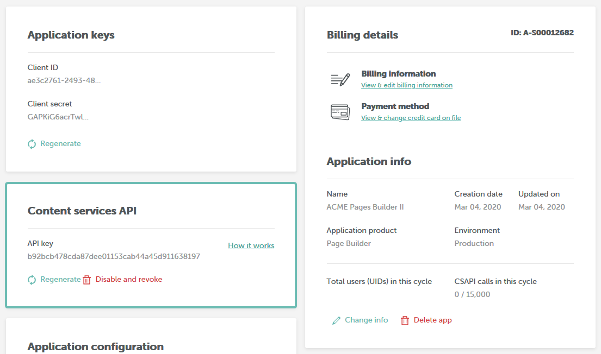

# Content Services API Reference

The Content Services API Reference provides a comprehensive guide to utilizing the Content Services API, which leverages the REST architecture and HTTP protocol for making API calls. This reference document outlines the available collections, including `/message`, `/page`, `/popup`, `/amp`, `/template`, and `/ai`, detailing the resources for each collection. For every resource, this document includes its description, parameters, and example responses and requests.

## API Key

To use the Content Services API you will first need to obtain a your API Key from the Beefree SDK Console.&#x20;

To obtain an API Key, take the following steps:

1. Log into the [Beefree SDK Console](https://dam.beefree.io/devmain)
2. Locate the application that you wish to work with, and click on **Details**
3. Locate the Content Services API section and click **Create New API Key**
4. Acknowledge the message that reminds you that if you exceed the [number of API calls included in your plan](https://dam.beefree.io/devmain), you may be charged for overages and click **Create Key**

Your API key will appear under the **Content services API** section of your application details.

<figure><figcaption></figcaption></figure>

The Content Services API uses API Keys to authenticate requests for resources.  You can manage your API Keys within the Beefree SDK Console.  All requests must be made over HTTPS and contain the following HTTP Header:

**`Authorization:`**` ``Bearer {token}`

## Rate Limits

API requests rate limits exist independently of API key’s monthly usage allowance.

By default, the API has the following rate limits:

* **Per minute:** 500 requests
* **Per second:**  100 requests
* **X-Rate-Limit:** An integer representing the total number of requests available per cycle. Exceeding the limit per cycle results in a 429 error.  (e.g. 500)
* **X-Rate-Limit-Remaining:** An integer representing the number of remaining requests before the next cycle begins, and the count resets. (e.g. 100)
* **X-Rate-Limit-Reset:** A Unix timestamp representing the time the next cycle will begin, and the count will reset.
* **Retry-After:** A Unix timestamp representing the time the application may resume submitting requests.

## API Root

All API access is over HTTPS, and accessed from the following URL:

`https://api.getbee.io/v1/{collection}/{resource}`

## Collections

The following table lists the available collection option and corresponding resources for each collection.

| Collection  | Available Resources                                   |
| ----------- | ----------------------------------------------------- |
| `/message`  | `html`, `pdf`, `images`, `merge`, `index, plain-text` |
| `/page`     | `html`, `pdf`, `images`, `merge`, `index`             |
| `/popup`    | `html`                                                |
| `/amp`      | `html`                                                |
| `/template` | `brand`                                               |
| `/ai`       | `metadata`, `sms`, `summary`                          |

### Example URLs

The following table provides a few examples of URLs you can use to make specific types of requests.

<table><thead><tr><th width="160">Type</th><th>Action</th><th>Example URL</th></tr></thead><tbody><tr><td>Email</td><td>Request HTML for email</td><td><code>https://api.getbee.io/v1/message/html</code></td></tr><tr><td>Landing Page</td><td>Request HTML for a landing page</td><td><code>https://api.getbee.io/v1/page/html</code></td></tr><tr><td>Popup</td><td>Request HTML for a popup</td><td><code>https://api.getbee.io/v1/popup/html</code></td></tr><tr><td>AMP</td><td>Request HTML for AMP</td><td><code>https://api.getbee.io/v1/amp/html</code></td></tr></tbody></table>

## Resources

The following section provides detailed information for each of the resources associated with each collection mentioned in the previous section.

### HTML <a href="#html" id="html"></a>

**URL:** `https://api.getbee.io/v1/{collection}/html`

**HTTP Method:** `POST`

**Description:** Transform JSON template to HTML.

#### Request Parameters <a href="#request-parameters" id="request-parameters"></a>

The following table lists the parameters applicable for this request.

| Name                   | Type    | Description                                                                                                                               |
| ---------------------- | ------- | ----------------------------------------------------------------------------------------------------------------------------------------- |
| `page`                 | object  | A Beefree template in JSON format                                                                                                         |
| `beautifulHtmlEnabled` | boolean | This flag will force the API to return uncompressed HTML                                                                                  |
| `language`             | JSON    | For [multi-language](../../other-customizations/multi-language-templates.md) templates, any valid language code sets the output language. |

**Content-Type:** application/json

#### **Example** <a href="#example" id="example"></a>

The following JSON displays an example request.

```json

{
  beautifyHtmlEnabled: false,
  page: {
     body: { ... },
     template: { ... },
     rows: { ... },
     title: '',
     description: ''
 }
}
```

#### **Response** <a href="#response" id="response"></a>

The following HTML displays an example response.

```html
<!DOCTYPE html>
<html xmlns:v="urn:schemas-microsoft-com:vml" xmlns:o="urn:schemas-microsoft-com:office:office" lang="en">

<head>
    <title></title>
    <meta http-equiv="Content-Type" content="text/html; charset=utf-8">
    <meta name="viewport" content="width=device-width, initial-scale=1.0">
    <!--[if mso]><xml><o:OfficeDocumentSettings><o:PixelsPerInch>96</o:PixelsPerInch><o:AllowPNG/></o:OfficeDocumentSettings></xml><![endif]-->
    <!--[if !mso]><!-->
    <link href="https://fonts.googleapis.com/css2?family=Montserrat:wght@400;700&amp;display=swap" rel="stylesheet"
        type="text/css">
    <!--<![endif]-->
    <style>
        * {
            box-sizing: border-box;
        }

        body {
            margin: 0;
            padding: 0;
        }
```

### Plain Text

**Endpoint:** `/message/plain-text`

**HTTP Method:** `POST`

**Description:** The endpoint accepts a JSON template and returns a plain text document.

#### Request Parameters <a href="#request-parameters" id="request-parameters"></a>

`page` (JSON): The email JSON template to create the plain text for.

#### Request Parameters <a href="#request-parameters" id="request-parameters"></a>

The following table lists the parameters for this endpoint.

| Name       | Type | Required | Description                                                                                                                               |
| ---------- | ---- | -------- | ----------------------------------------------------------------------------------------------------------------------------------------- |
| `page`     | JSON | Yes      | The template's JSON. This is the template used to create the plain text document.                                                         |
| `language` | JSON | Optional | For [multi-language templates](../../other-customizations/multi-language-templates.md), any valid language code sets the output language. |

#### Example Request <a href="#example-request" id="example-request"></a>

The following section shows an example request:

```json
{
    "page": {
        "body": {
            "container": {
                "style": {
                    "background-color": "#fff",
                    "background-image": "none",
                    "background-position": "top left",
                    "background-repeat": "no-repeat",
                    "background-size": "auto"
                }
            },
            "content": {
                "style": {
                    "color": "#000000",
                    "font-family": "Lato, Tahoma, Verdana, Segoe, sans-serif"
                }
            },
            "type": "mailup-bee-page-properties",
            "webFonts": [
                {
                    "fontFamily": "'Lato', Tahoma, Verdana, Segoe, sans-serif",
                    "name": "Lato",
                    "url": "https://fonts.googleapis.com/css?family=Lato"
                }
            ]
        },
        "description": ""
    "language": "en-US"
    }
}
```

#### Example Response <a href="#example-response" id="example-response"></a>

The following section shows an example response:

```
[BeeFree Logo](https://beefree.io/)
*****************************
Hello there!
**Would you be interested in participating in a user research project with us?**
The research will consist of a video call. It usually takes 30 to 45 minutes maximum... more plain text.
```

### PDF <a href="#pdf" id="pdf"></a>

**URL:** `https://api.getbee.io/v1/{collection}/pdf`

**Method:** `POST`

**Description:** Transform HTML and PDF settings to a JSON object with a PDF url.

#### Request Parameters <a href="#request-parameters" id="request-parameters"></a>

The following table lists the parameters applicable for this request.

| Name               | Data Type | Description                                                                                                                                                                                     |
| ------------------ | --------- | ----------------------------------------------------------------------------------------------------------------------------------------------------------------------------------------------- |
| `html`\*           | String    | A full HTML document                                                                                                                                                                            |
| `page_size`        | String    | <p>Accepted values: letter (default), A4, A3, full</p><p><strong>Full:</strong> a single page using 900px as page width. The page_orientation is always portrait when using this page size.</p> |
| `page_orientation` | String    | Accepted values: landscape (default), portrait                                                                                                                                                  |
| `file_type`        | String    | Accepted values: PDF                                                                                                                                                                            |

**Content-Type:** application/json

#### **Request** <a href="#request" id="request"></a>

The following code sample shows an examples request with HTML and PDF settings.

```json
{"html":"a","file_type":"pdf","page_size":"full","page_orientation":"portrait"}
```

#### **Response** <a href="#response" id="response"></a>

The following code sample shows an examples response.

```json
{"statusCode":200,"body":{"url":"https:\/\/pro-bee-beepro-pdf.s3.amazonaws.com\/public\/pdf\/87ElCDpHHk.pdf","filename":"87ElCDpHHk.pdf","page_size":"full","page_orientation":"portrait","content_type":"application\/pdf"}}
```


**Note:** The response is a JSON string that will contain the URL of the temporary location of the PDF document. The file is available for 24 hours.


### Image <a href="#image" id="image"></a>

**URL:** `https://api.getbee.io/v1/{collection}/image`

**HTTP Method:** `POST`

**Description:** Transform HTML and image settings into an image.

#### Request Parameters <a href="#request-parameters" id="request-parameters"></a>

The following table lists the headers applicable for this request.

| Name          | Type    | Description                                                                                                                                                                                                                                                                                                                       |
| ------------- | ------- | --------------------------------------------------------------------------------------------------------------------------------------------------------------------------------------------------------------------------------------------------------------------------------------------------------------------------------- |
| `html`\*      | String  | A Beefree HTML message.                                                                                                                                                                                                                                                                                                           |
| `size`        | String  | Use “size” instead of “width” and “height” when you only know the width and want the height automatically calculated. **Required** if width and height are not defined.                                                                                                                                                           |
| `width`       | Integer | The image width in pixels. **Required** if size is not defined.                                                                                                                                                                                                                                                                   |
| `height`      | Integer | The image height in pixels. Default applies a proportional value based on the given width, keeping the image aspect ratio. When the value is not proportional to the given width either will occur: If it’s higher, the proportional value applies, or, if it’s lower, the image is cropped. **Required** if size is not defined. |
| `file_type`\* | String  | Accepts jpg or png.                                                                                                                                                                                                                                                                                                               |

**Content-Type:** application/json

#### **Example Request** <a href="#example-request" id="example-request"></a>

The following code sample shows an example response.

```json

{
    "html": "<!DOCTYPE html><html><head><meta charset=\"UTF-8\" /></head><body><div style='width:900px; margin: 30px;'>Hello World!</div></body></html>",
    "width": 215,
    "height": 125,
    "file_type": "jpg"
}
```

#### **Example Response** <a href="#example-response" id="example-response"></a>

The following image is an example response.

<figure><figcaption></figcaption></figure>

application/jpg

The response includes the raw image data.

### Merge <a href="#merge" id="merge"></a>

**URL:** `https://api.getbee.io/v1/{collection}/merge`

**HTTP Method:** `POST`

**Description:** Replace a Beefree template in JSON format.

#### Request Parameters <a href="#request-parameters" id="request-parameters"></a>

The following table lists the request parameters.

| Name      | Type             | Description                                                                                                                                                                                |
| --------- | ---------------- | ------------------------------------------------------------------------------------------------------------------------------------------------------------------------------------------ |
| source\*  | Object           | A Beefree template in JSON format.                                                                                                                                                         |
| replace\* | Array            | An array of objects that contain a JSON path and value to replace.                                                                                                                         |
| value\*   | String \| Object | The value can be an object, such as a saved row. Or, it can be a string, such a hex color code. The value should be the same type as the value you want to match in your match expression. |
| path\*    | String           | A JSON Path to the matching nodes in the source JSON.                                                                                                                                      |

**Content-Type:** application/json

#### Replace Array <a href="#replace-array" id="replace-array"></a>

The following table lists the request parameters for the replace array and whether or not they are optional.

| Parameters | Type             | Required or Optional | Description                                                                                                                                                                                |
| ---------- | ---------------- | -------------------- | ------------------------------------------------------------------------------------------------------------------------------------------------------------------------------------------ |
| Value      | String \| Object | Required             | The value can be an object, such as a saved row. Or, it can be a string, such a hex color code. The value should be the same type as the value you want to match in your match expression. |
| Path       | String           | Required             | A JSON Path to the matching nodes in the source JSON.                                                                                                                                      |

#### **Example Request** <a href="#example-request" id="example-request"></a>

The following code displays an example request of the "replace" array.

```json

{
  "replace": [
    {
      "path": "$..style[?(@ == '#FFFFFF')]",
      "value": "#89cff0"
    },
    {
      "path": "$..rows[?(@.metadata.id=='')]",
      "value": { ... row json }
    }
  ],
  "source": { "page": { ... }  }
}
```

#### **Response** <a href="#response" id="response"></a>

application/json

The JSON object containing the following parameters:

| Parameter    | Type   | Required or Optional | Description                                                                                                                                             |
| ------------ | ------ | -------------------- | ------------------------------------------------------------------------------------------------------------------------------------------------------- |
| **json**     | object | required             | The updated Beefree template in JSON format. In the event of an error, the original source is returned.                                                 |
| **html**     | string | required             | The HTML message.                                                                                                                                       |
| **warnings** | array  | optional             | An array of objects containing information about issues that occurred during the merge. If no warnings exist, then it is safe to save the updated JSON. |

#### **Example Response** <a href="#example-response" id="example-response"></a>

The following code displays an example response.

```json

{
    "html": "...",
    "json": {
        "page": { ...// BEE Template }
    },
    "warnings": [
        {
            "msg": "Your path $..style[?(@ == '#FFFFFF')] did not return any matching nodes",
            "param": "path",
            "location": "replace"
        },
        {
            "msg": "Your path $..style[?(@ == '#89cff0')] did not return any matching nodes",
            "param": "path",
            "location": "replace"
        }
    ]
}
```

### Merge Rows <a href="#merge" id="merge"></a>

**URL:** `https://api.getbee.io/v1/{collection}/merge-rows`

**HTTP Method:** `POST`

**Description:** The Merge Rows endpoint enables you to integrate custom fonts and resized images into your designs. It saves custom fonts within the template's JSON, ensuring the the correct font is displayed. It also handles image resizing, particularly when the image's initial template width is narrower than the saved row's destination template. To use this endpoint, send your template and rows in JSON format. You will receive a response with an updated template. The rows requiring an update are identified by their `rowIdentifier` values.

#### Request Parameters <a href="#request-parameters" id="request-parameters"></a>

The following table lists the request parameters.

| Name                 | Type   | Description                                                                                                                                                                                                                                                                                                                                                                      |
| -------------------- | ------ | -------------------------------------------------------------------------------------------------------------------------------------------------------------------------------------------------------------------------------------------------------------------------------------------------------------------------------------------------------------------------------- |
| `rows`               | Array  | An array of Beefree rows in JSON format. The array accepts the following format: `rows: [{row1json}, {row2json}]`                                                                                                                                                                                                                                                                |
| `template`           | JSON   | A Beefree template in JSON format.                                                                                                                                                                                                                                                                                                                                               |
| `webFonts`           |        | This facilitates the addition of missing webfonts for messages associated with synced or saved rows. It allows you to provide a list of webfonts available in your host application to the editor. This information enables the editor to rectify missing webfonts during the merge process, ensuring consistent and accurate rendering of messages across synced or saved rows. |
| `rowIdentifierLabel` | String | The label used for identifying the rows added to the metadata key usually is guid.                                                                                                                                                                                                                                                                                               |

**Content-Type:** application/json

#### **Example Request** <a href="#example-request" id="example-request"></a>

The following code displays an example request.

```json
{
  "rows": [
    {
      "columns": [
        {
          "grid-columns": 12,
          "modules": []
        }
      ]
    }
  ],
  "template": {
    "page": {
      "body": {
        "container": {}
      },
      "content": {}
    }
  },
  "webFonts": [
    {
      "fontFamily": "'Arvo', 'Courier New', Courier, monospace",
      "name": "Arvo",
      "url": "https://fonts.googleapis.com/css2?family=Arvo:wght@100;200;300;400;500;600;700;800;900"
    }
  ],
  "rowIdentifierLabel": "guid"
}
```

#### **Example Response** <a href="#example-response" id="example-response"></a>

The following code displays an example response.

```json
{
  "template": {
    "page": {
      "body": {
        "container": {
          "style": {
            "background-color": "#ffffff"
          }
        },
        "content": {
          "description": "",
          "rows": [
            {
              "columns": [
                {
                  "grid-columns": 12,
                  "modules": [
                    {
                      "descriptor": {}
                    }
                  ]
                }
              ]
            }
          ]
        }
      }
    },
    "title": ""
  }
}

```


When utilizing this feature, it's important to consider adding a handle to the metadata. This handle serves a crucial role in functions such as `onDeleteRow` and `onEditRow`. In our provided example, we use a handle named `guid`. However, users have the flexibility to choose their own handle name according to their preferences and requirements. When selecting a handle name, we recommend you choose something descriptive and meaningful for ease of identification and management within your workflow.


### Synced Rows <a href="#merge" id="merge"></a>

**URL:** `https://api.getbee.io/v1/{collection}/synced-rows`

**HTTP Method:** `POST`

**Description:** Get a list of all the synced rows inside a template with their corresponding `rowIdentifier` values.

#### Request Parameters <a href="#request-parameters" id="request-parameters"></a>

The following table lists the request parameters.

| Name                 | Type   | Description                                                                        |
| -------------------- | ------ | ---------------------------------------------------------------------------------- |
| `rowIdentifierLabel` | String | The label used for identifying the rows added to the metadata key usually is guid. |
| `template`           | Array  | The JSON of a template.                                                            |

**Content-Type:** application/json

#### **Example Request** <a href="#example-request" id="example-request"></a>

The following code displays an example request.

```json
{
  "rowIdentifierLabel": "guid",
  "template": {**The JSON of the Template**}
}
```

#### **Example Response** <a href="#example-response" id="example-response"></a>

The following code displays an example response.

```json
{
	"syncedRows": [
		{
			"rowIndex": 0,
			"rowIdentifier": "96b19ad9-268c-43a0-a4fb-a2b02635e9e6"
		},
		{
			"rowIndex": 2,
			"rowIdentifier": "96b19ad9-268c-43a0-a4fb-a2b02635e9e6"
		}
	]
}
```

#### Response Elements <a href="#index" id="index"></a>

The following table provides the name, type, and description for the response elements within the returned `syncedRows` array.

| Name            | Type   | Description                                                                  |
| --------------- | ------ | ---------------------------------------------------------------------------- |
| `rowIndex`      | Number | The index of the row in the array of rows inside the Template.               |
| `rowIdentifier` | String | The value of the `rowIdentifier` (guid in most cases) for that specific row. |

### Index <a href="#index" id="index"></a>

**URL:** `https://api.getbee.io/v1/{collection}/merge/index`

**HTTP Method:** `POST`

**Description:** Reference an array of metadata objects from a Beefree template in JSON format.

#### Request Parameters <a href="#request-parameters" id="request-parameters"></a>

The following table lists the request parameters.

| Name     | Type   | Description                        |
| -------- | ------ | ---------------------------------- |
| source\* | object | A Beefree template in JSON format. |

**Content-Type:** application/json

#### **Example** <a href="#example" id="example"></a>

The following JSON shows an example request.

```json

{
    "source": { "page": { ... }  }
}
```

#### **Response** <a href="#response" id="response"></a>

application/json

The JSON object containing the following parameters:

| Parameter | Type  | Required or Optional | Description                                                                                                                                                                  |
| --------- | ----- | -------------------- | ---------------------------------------------------------------------------------------------------------------------------------------------------------------------------- |
| **rows**  | array | required             | An array of metadata objects containing row details, which can be saved in a database to create a reference (or relational table) to the rows associated with your template. |

#### **Example** <a href="#example-1" id="example-1"></a>

The following JSON shows an example response.

```json

[
  {
    "name": "my saved row A"
    "guid": "some unique value"
  },
  {
    "name": "my saved row B"
    "guid": "some unique value"
  }
]
```

### AI Collection

The resources in the AI collection accept your template JSON and use generative AI to return text within a JSON object to you.

### Prerequisites <a href="#prerequisites" id="prerequisites"></a>

Prior to getting started with the resources in this collection, ensure you have the following:

* **Superpowers** subscription or higher
* **OpenAI AddOn** installed and configured in your Beefree Developer Console
* Content Services **API key**


**Note:** OpenAI billing costs apply in addition to the Content Services API billing.


### Metadata (Preheader and Subject) <a href="#metadata" id="metadata"></a>

`v1/ai/metadata`

**HTTP Method:** `POST`

**Description:** The endpoint accepts a JSON template and returns a JSON object with metadata (preheader and subject).

#### Request Parameters <a href="#request-parameters" id="request-parameters"></a>

The following table lists the parameters for this endpoint.

| Name       | Type | Required | Description                                                                          |
| ---------- | ---- | -------- | ------------------------------------------------------------------------------------ |
| `template` | JSON | Yes      | The template's JSON. This is the template used to create the AI-generated metadata.  |
| `options`  | JSON | No       | Optional settings that instruct the output.**\***                                    |


**\*Note:** Reference the optional parameters for the `options` JSON in the following section.


#### Optional parameters <a href="#optional-parameters" id="optional-parameters"></a>

The following table lists the optional parameters for making this request.

| Name           | Type    | Description                                                                                                                                                                       |
| -------------- | ------- | --------------------------------------------------------------------------------------------------------------------------------------------------------------------------------- |
| `toneOfVoice`  | string  | Use this parameter to define a tone of voice for the response output. For example, you can include words such "Formal", "Humorous", or "Business" to instruct the AI's response.  |
| `instructions` | string  | Use this parameter to include extra instructions and fine tune the AI's response.                                                                                                 |
| `reportUsage`  | boolean | Use this parameter to return the usage data from OpenAI. Set this boolean to true or false.                                                                                       |
| `language`     | string  | Use this parameter to specify the output language for the response.                                                                                                               |

#### Example Request <a href="#example-request" id="example-request"></a>

The following section shows an example request:

```json
{
    "options": {
        "toneOfVoice": "",
        "instructions": "Try to use a pun.",
        "reportUsage": true,
        "language": "en-US"
    },
    "template": {
        "page": {}
    }
}
```

#### Example Response <a href="#example-response" id="example-response"></a>

The following section shows an example response with the preheader and subject metadata in the JSON object:

```json
{
    "preheader": "Ready to Beefree a part of our user research project? Schedule your video call now!",
    "subject": "Beefree SDK: Let's Pollinate Ideas Together! 🐝🌼",
    "usage": {
        "prompt_tokens": 417,
        "completion_tokens": 48,
        "total_tokens": 465
    }
}
```

### SMS <a href="#sms" id="sms"></a>

`v1/ai/sms`

**HTTP Method:** `POST`

**Description:** The endpoint accepts a JSON template and returns a JSON object with the SMS text. Use this endpoint for summaries geared toward SMS.

#### Request Parameters <a href="#request-parameters" id="request-parameters"></a>

The following table lists the parameters for this endpoint.

| Name       | Type | Required | Description                                                                          |
| ---------- | ---- | -------- | ------------------------------------------------------------------------------------ |
| `template` | JSON | Yes      | The template's JSON. This is the template used to create the AI-generated SMS text.  |
| `options`  | JSON | No       | Optional settings that instruct the output.**\***                                    |


**\*Note:** Reference the optional parameters for the `options` JSON in the following section.


#### Options parameters <a href="#options-parameters" id="options-parameters"></a>

The following table lists the optional parameters for making this request.

| Name           | Type    | Description                                                                                                                                                                       |
| -------------- | ------- | --------------------------------------------------------------------------------------------------------------------------------------------------------------------------------- |
| `toneOfVoice`  | string  | Use this parameter to define a tone of voice for the response output. For example, you can include words such "Formal", "Humorous", or "Business" to instruct the AI's response.  |
| `length`       | string  | Must be one of the following options: "Concise", "Standard", or "Detailed".                                                                                                       |
| `instructions` | string  | Use this parameter to include extra instructions and fine tune the AI's response.                                                                                                 |
| `reportUsage`  | boolean | Use this parameter to return the usage data from OpenAI. Set this boolean to true or false.                                                                                       |
| `language`     | string  | Use this parameter to specify the output language for the response.                                                                                                               |

#### Example Request <a href="#example-request" id="example-request"></a>

The following code sample shows an example request.

```json
{
    "options": {
        "toneOfVoice": "",
        "length": "detailed",
        "instructions": "Use hello instead of hi",
        "reportUsage": true,
        "language": "en-US"
    },
    "template": {
        "page": {}
    }
}
```

#### Example Response <a href="#example-response" id="example-response"></a>

The following code sample shows an example response.

```json
{
    "sms": "Hello 🙂 Would you be interested in participating in a user research project with us? The survey will be conducted via video call, lasting a maximum of 30-45 minutes. Book an appointment here: calendly.com/beepro-product-team/beepro-interview?month=2022-06. We look forward to your response. Best regards, Dalila from the Product Team 💜",
    "usage": {
        "prompt_tokens": 484,
        "completion_tokens": 102,
        "total_tokens": 586
    }
}
```

### Summary

`v1/ai/summary`

**HTTP Method:** `POST`

**Description:** The text endpoint accepts a JSON template and returns a JSON object with the summary text. This endpoint is for generating general summaries that can have multi-purpose use.

#### Request Parameters <a href="#request-parameters" id="request-parameters"></a>

The following table lists the parameters for this endpoint.

| Name       | Type | Required | Description                                                                              |
| ---------- | ---- | -------- | ---------------------------------------------------------------------------------------- |
| `template` | JSON | Yes      | The template's JSON. This is the template used to create the AI-generated summary text.  |
| `options`  | JSON | No       | Optional settings that instruct the output.**\***                                        |


**\*Note:** Reference the optional parameters for the `options` JSON in the following section.


#### Options parameters <a href="#options-parameters" id="options-parameters"></a>

The following table lists the optional parameters for making this request.

| Name           | Type    | Description                                                                                                                                                                       |
| -------------- | ------- | --------------------------------------------------------------------------------------------------------------------------------------------------------------------------------- |
| `toneOfVoice`  | string  | Use this parameter to define a tone of voice for the response output. For example, you can include words such "Formal", "Humorous", or "Business" to instruct the AI's response.  |
| `length`       | string  | Must be one of the following options: "Concise", "Standard", or "Detailed".                                                                                                       |
| `instructions` | string  | Use this parameter to return the usage data from OpenAI. Set this boolean to true or false.                                                                                       |
| `reportUsage`  | boolean | Use this parameter to return the usage data from OpenAI. Set this boolean to true or false.                                                                                       |
| `language`     | string  | Use this parameter to specify the output language for the response.                                                                                                               |

#### Example Request <a href="#example-request" id="example-request"></a>

The following section shows an example request:

```json
{
    "options": {
        "toneOfVoice": "Formal",
        "length": "concise",
        "instructions": "include a call to action",
        "reportUsage": true,
        "language": "en-US"
    },
    "template": {
        "page": {}
    }
}
```

#### Example Response <a href="#example-response" id="example-response"></a>

The following section shows an example response:

```json
{
    "summary": "Join us in a user research project to share your experience with BEE Pro. Schedule a 30-45 min video call to help us understand how BEE Pro fits into your workflow.",
    "usage": {
        "prompt_tokens": 431,
        "completion_tokens": 42,
        "total_tokens": 473
    }
}
```
