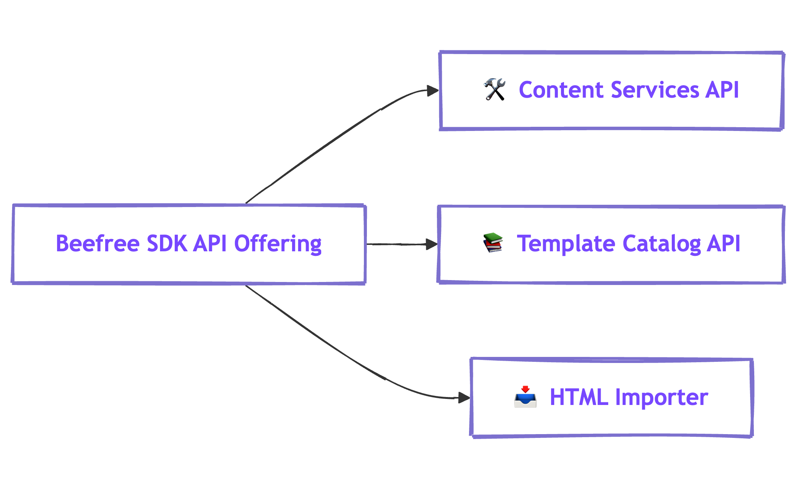
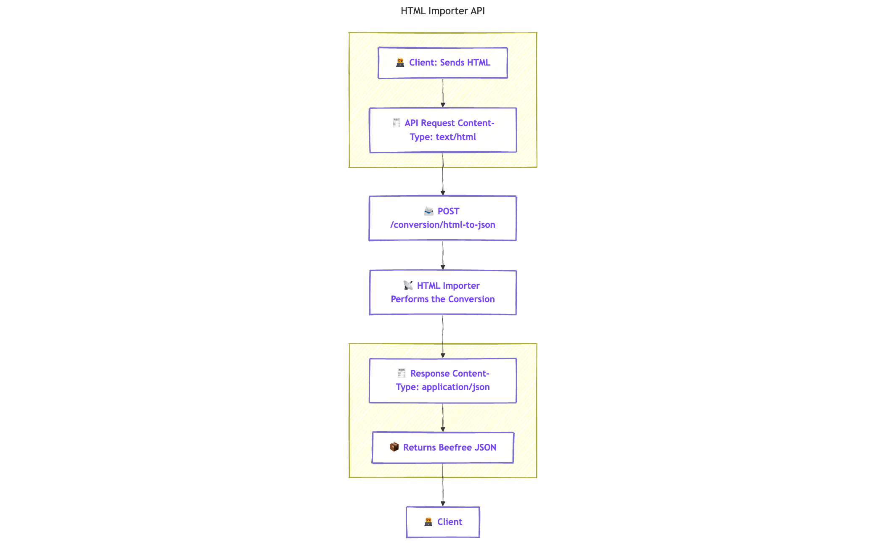

# HTML Importer API


Available on all [Beefree SDK plan types](https://developers.beefree.io/pricing-plans). Learn more about Usage-based fees for the [HTML Importer API](https://devportal.beefree.io/hc/en-us/articles/4403095825042-Usage-based-fees).&#x20;


## Beefree SDK API Offering 

Beefree SDK includes a comprehensive API offering designed to expand upon the builder's capabilities. By leveraging Beefree SDK's APIs, you can extend the builder's functionality into other aspects of your application.

Beefree SDK's API offering includes three APIs. They are the following:&#x20;

* [Content Services API](../content-services-api/)
* [Template Catalog API](../template-catalog-api/)
* [HTML Importer API](./)

This section of the documentation discusses the [HTML Importer API](./#overview-of-html-importer-api), which includes resources for programmatically importing pre-existing HTML templates into Beefree SDK's builder.

<table><thead><tr><th>API</th><th>Purpose</th><th width="208.046875">Requires Separate API Key?</th></tr></thead><tbody><tr><td><a href="./">HTML Importer</a></td><td>Import custom HTML into Beefree SDK</td><td>✅ Yes, <a href="authentication.md">see authentication instructions</a>.</td></tr><tr><td><a href="../content-services-api/">CSAPI</a></td><td>Export, convert, and style templates and rows. Use AI to generate metadata, SMS, and summaries.</td><td>✅ Yes,<a href="../content-services-api/authentication.md"> see authentication instructions</a>.</td></tr><tr><td><a href="../template-catalog-api/">Template Catalog</a></td><td>Access Beefree's catalog of templates</td><td>✅ Yes, <a href="../template-catalog-api/authentication.md">see authentication instructions</a>.</td></tr></tbody></table>

<figure><figcaption>
Diagram Displaying Beefree SDK's API Offering
</figcaption></figure>

## Overview of HTML Importer API

The HTML Importer API allows you to import your own HTML files into Beefree SDK. To use the HTML Importer API, you'll need to [create an API key](authentication.md) for the HTML Importer in the [Beefree SDK Developer Console](https://developers.beefree.io/accounts/login/?from=website_menu). Visit the [Import HTML page](import-html.md) to learn how to make API calls with the HTML Importer API.&#x20;

Manually migrating your existing templates can be time-consuming, but with the HTML Importer API you can:

* **Make existing HTML editable in the Beefree SDK:** Empower your end-users to edit their current HTML email templates using the intuitive drag-and-drop interface — without having to manually recreate them
* **Save time and resources**: Manually recreating email templates from scratch can take _hours_. With the new Importer API, you can make existing email templates editable in Beefree in seconds.
* **Significantly reduce migration friction for faster client onboarding:** Overcome the challenge of template migration, a common pain point when bringing on new clients. The HTML Importer API streamlines this process, allowing for quicker onboarding.    &#x20;

The HTML Importer API is a [REST](https://restfulapi.net/)-based API that enables Beefree SDK integrators to programmatically convert email HTML into Beefree JSON. It is built to follow predictable resource url patterns, and to utilize standard HTTP response codes and methods. This service is particularly helpful if you (or your end users) have pre-existing HTML templates you'd like to load within the no-code Beefree SDK builder and edit in the drag-and-drop editor.

Beefree SDK requires that you [authenticate](authentication.md) prior to accessing the HTML Importer API's resources and obtain an API key for your production application.&#x20;

The resource in HTML Importer API is a synchronous endpoint that accepts the email HTML as the body of a `POST` request and returns the Beefree JSON in the response.&#x20;

## Webinar

The following webinar utilizes the demo code in the [html-importer-spotlight repository](https://github.com/BeefreeSDK/html-importer-spotlight) to demonstrate an example of how to use the HTML Importer API along with the [Brand Style endpoint](../content-services-api/brand-style-management.md) to create a compelling import and brand styling experience for your application's end users.



### How the HTML Importer API works

This section provides a high-level overview of the concepts related to the HTML Importer API. For detailed information on how to activate, use, and implement the endpoint, [visit the Import HTML page](import-html.md), which includes comprehensive implementation steps and considerations. The HTML Importer leverages a series of algorithms to map and classify all the content elements available in the email, label them, and then translate them into Beefree's JSON format.

Using a simple API, you can pass us the email you'd like us to convert, and the API will return Beefree JSON in response:&#x20;

<figure><figcaption></figcaption></figure>

### FAQs

Explore answers to the most frequently asked questions.

#### Can I convert any HTML template? Are there any limitations? 

There are a few things you should be aware of to ensure a great import experience:

* **The conversion engine is designed to convert email HTML.** It's not optimized for converting landing pages or other HTMLs.&#x20;
* **Ensure your email HTML is valid**. We can't import HTML files that miss `DOCTYPE` declaration, don't include valid `html` and `body` elements, or don't include the `<meta charset="UTF-8">` tag in the `head` section of your HTML.
* **Our** **API doesn't convert dynamically created HTML documents** that leverage JavaScript to render content. We currently support static HTML and CSS content only.
* **Ensure that all images and resources included in your HTML are publicly available on the internet.** We can't convert emails with images and resources that are only available on private networks.&#x20;
* Please be aware that **some HTML elements are not fully supported** by the importer at this time, including background images, dividers, and menus.&#x20;

If you follow the best practices above, the HTML Importer will migrate the structure and content of your HTML into Beefree's JSON format, significantly reducing the time it takes to recreate templates from scratch manually. Some design adjustments may still be necessary to match the original design.

#### **What happens with unsupported HTML tags?**

Unsupported HTML tags do not break the endpoint as long as the overall HTML structure is valid. However, they may behave unpredictably and result in suboptimal imports. Implement validation and sanitization workflows for unsupported HTML tags to ensure proper handling.

#### Will I get different results if I upload the same HTML template to the API several times?

No, with the HTML importer API, the result will stay consistent each time you call the API.&#x20;

#### What's the applicable use policy? 

You can use this tool in accordance with [Beefree's Terms of Service](https://developers.beefree.io/terms-of-service). In particular, you should use the tool in a way that ensures you will not violate the rights of third parties.

#### **Can I limit the number of imports per user?**

Yes, the HTML Importer API can be integrated with usage-based logic. For instance, you can track API calls by user ID and enforce usage limits based on predefined credit tiers. This logic should be implemented within your backend—for example, by maintaining a counter that increments with each API call to monitor and restrict access accordingly.

#### Which plan has access to the API, and what's the pricing? 

The HTML Importer API is available for all Beefree SDK plan types, including the free plan. We charge $2 per template import.&#x20;

* Every time you call our HTML Importer API and receive a JSON in response, that’s counted as an import for billing purposes.&#x20;
* If an API call fails for any reason (and we respond with an error rather than a JSON file), you won’t be charged.

For more information on usage and pricing, visit the [Usage-based fees article](https://devportal.beefree.io/hc/en-us/articles/4403095825042-Usage-based-fees).

#### **Do you store any of the templates I upload to the HTML Importer?**

No, we do not store any of your templates.

#### **When importing images, where are they hosted?**

Images are not uploaded to Beefree SDK's file manager. They are referenced from the original source and must be publicly accessible on the internet to display correctly in the builder.

#### **Does the HTML Importer API use AI, and are you using my templates for training?**

No, the HTML importer API does not use AI to recreate content into our native JSON format. Your templates will not be stored or used for training or data analysis purposes.

#### **Does the importer support external CSS or merge tags?**

External CSS may only work if it is publicly hosted online, but its behavior is not guaranteed as it has not been thoroughly tested. It is best to inline CSS for reliable results. Merge tags are not supported during import but can be added afterward in the builder.

#### **What happens with dynamic content in imported templates?**

Dynamic content must be configured after import. The importer does not interpret or map dynamic content placeholders. You can apply dynamic content once the HTML is converted and editable in the Beefree SDK.

#### **What about importing .eml or other email formats?**

The HTML Importer API only supports plain HTML. If clients provide .eml or other formats, you’ll need to convert them to static HTML before importing. Consider developing preprocessing tools for recurring client onboarding.
