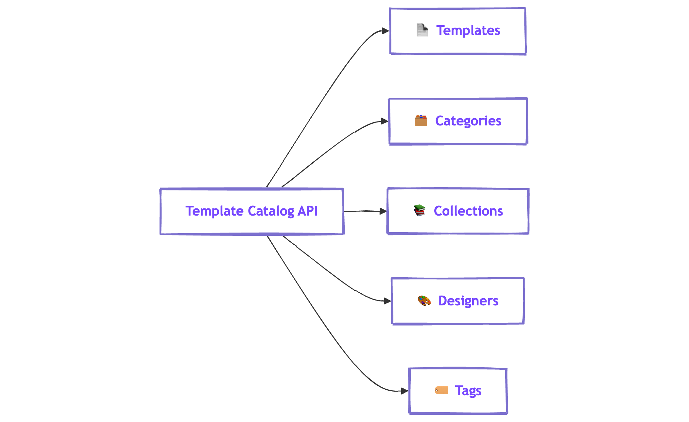

# Template Catalog API


The Template Catalog API is available for Core, Superpowers, and Enterprise plans. Activating the Template Catalog API varies by plan type.

* **Enterprise:** Self-service activation through the Beefree SDK Developer Console.
* **Superpower:** Self-service activation through the Beefree SDK Developer Console.
* **Core:** Contact your Customer Success Manager (CSM) to activate this API.


## Beefree SDK API Offering 

Beefree SDK includes a comprehensive API offering designed to expand upon the builder's capabilities. By leveraging Beefree SDK's APIs, you can extend the builder's functionality into other aspects of your application.

Beefree SDK's API offering includes three APIs. They are the following:&#x20;

* [Content Services API](../content-services-api/)
* [Template Catalog API](./)
* [HTML Importer API](../html-importer-api/)

This section of the documentation discusses the [Template Catalog API](./#overview-of-template-catalog-api), which includes resources for programmatically adding a catalog of pre-existing email, page, and popup templates to your application. These pre-existing templates were carefully constructed by professional designers with the goal of inspiring your end users' creativity. &#x20;

<figure><figcaption>
Diagram Displaying Beefree SDK's API Offering
</figcaption></figure>

## Overview of Template Catalog API

The Template Catalog API is a [REST](https://restfulapi.net/)-based API that enables Beefree SDK integrators to programmatically access a catalog of pre-made templates for emails and pages. This catalog is a useful resource for integrators looking to provide their end users with pre-made templates created by professional designers. These templates serve as a starting point for the design and creation workflow, and offer end users with visual inspiration for their campaigns. The Template Catalog API is built to follow predictable resource url patterns, and to utilize standard HTTP response codes and methods.    &#x20;

Beefree SDK requires that you [authenticate](authentication.md) prior to accessing the Template Catalog API's resources. You can generate API keys for both production and [development applications](../../getting-started/readme/development-applications.md). API keys associated with development applications are intended for pre-production environments and endpoint testing. They should not be used in production environments.     &#x20;

There are five categories of resources within the Template Catalog API. Each of these categories includes a group of endpoints with resources to support various workflows.&#x20;

### Which Templates will I have access to?

To get an idea of the template catalog offering, you can reference the [Beefree Templates page](https://beefree.io/templates). This page includes a few examples of email and page templates included in the Template Catalog API.

### API Features and Functionality

The Template Catalog API provides the following features:&#x20;

* Fetch templates from the Template Catalog API by applying filters such as "category", "industry", and so on.&#x20;
* Sort and customize templates to match your application’s requirements and end user preferences.

The Template Catalog API offers the following resources:

* **Templates**: Individual email templates that users can browse, select, and use. Each template contains metadata such as title, description, thumbnail image, and design structure.
* **Categories**: Groupings of templates based on their use case or theme (e.g., Newsletters, Promotions, Events), helping users quickly find relevant templates.
* **Collections**: Curated sets of templates bundled together around a specific topic, brand, or style, providing thematic consistency across multiple communications.
* **Designers**: Information about the creators of templates, including designer profiles and links to the templates they have authored.
* **Tags**: Keywords associated with templates, making it easier to filter and search based on specific styles, industries, or content types (e.g., Minimal, E-commerce, Holiday).

<figure><figcaption></figcaption></figure>

In this Template Catalog Reference, you will learn more about a personalized template catalog for your SaaS applications. Through this API, you can integrate a diverse range of email and page templates, promoting enhanced user engagement while optimizing the design process within your platform.

<figure><figcaption></figcaption></figure>

### Access and Subscription

The Template Catalog API is available for Core, Superpowers, and Enterprise plans. Activating the Template Catalog API varies by plan type.

* **Enterprise:** Self-service activation through the Beefree SDK Developer Console.
* **Superpower:** Self-service activation through the Beefree SDK Developer Console.
* **Core:** Contact your Customer Success Manager (CSM) to activate this API.

| Beefree Plan | Availability           |
| ------------ | ---------------------- |
| Enterprise   | Included               |
| Superpowers  | Included               |
| Core         |  $167/mth or $2,000/yr |
| Essentials   | Not available          |
| Free         | Not available          |

## Best Practices

To enhance the performance and user experience of your template catalog, we recommend following these best practices.

### Optimize API Usage

Implement caching mechanisms to reduce API calls and minimize user loading times. Template data do not change often, so you can use a cache TTL of some minutes (10 for example, but even more) without issues.

### Rate Limits

Handle errors gracefully and provide clear error messages to assist in resolving any issues.\
These endpoints have the following rate limits:

* Per minute: 500 requests;
* Per second:  100 requests.

Therefore, we recommend not enforcing excessive automatic tries when you get an error message, otherwise, you may exceed the limit and won’t be able to proceed with more requests.

The API is a read-only API. The only method is `GET`.

Find answers to common queries related to the Template Catalog API, its features, and integration.

## FAQs

Reference answers to the most frequently asked questions in this section.

#### Do I need to pay extra for new templates?

No, they are included in your subscription. The catalog will be updated with the latest trends at no extra charge.

#### How frequently are new templates available?

We are committed to making fresh new templates available every quarter.

#### Where are the image and media assets stored?

Storing the JSON Template source file is totally in your control. The media assets referenced inside the template are kept in the Beefree SDK S3 Bucket and provisioned using the CDN.

#### Am I being charged per API call when using the Template Catalog API?

No. There are no additional fees or usage-based limits when using the Template Catalog API.
