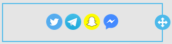

# Content Defaults


This feature is available on Beefree SDK [paid plans](https://dam.beefree.io/pluginpricing) only.


## Overview <a href="#overview" id="overview"></a>

With Content Defaults, you can define how content looks when dragged into an email or page.

When adding new content elements through the Content tab, you may want a default style that matches one of these options:

* your application’s color scheme;
* your user’s branding guidelines;
* the look & feel of the template used to create the message or page.

For example, here is how a button dragged into the stage looks by default:

<figure><figcaption></figcaption></figure>

* The background color is always light blue (HEX code #3AAEE0).
* The font size is always 16px.
* The font is Arial, unless a different Default font was set for the template loaded in the editor.
* The border radius is set at 4.
* The CTA is a formally correct, but laconic “Button”.

Instead, when applying Content defaults, the button dragged by your users could look out of the box like this:

<figure><figcaption></figcaption></figure>

We’ve used a dark grey color (HEX code #555555), an Ubuntu font at 22px in Bold, with a border radius of 10 and a nice “READ MORE” call-to-action.

Content Defaults are part of the Configuration parameters passed to your Beefree application during startup, so you can have different sets of them for different users.

## Use cases <a href="#use-cases" id="use-cases"></a>

By setting up your Content defaults, you’ll be able to address styling and branding needs for you and your customers.

### **Create a more consistent UX between your application and the editor**

If your application uses dark grey for the primary CTA, then you probably would want a default button in the Beefree builders to follow that style.

### **Match your customers’ branding**

If your application has brand settings that are used for your app’s UI or for assets managed in your application, you may want those to apply also to default content in the Beefree editors.

### **Create a more consistent experience within the editor**

If you’ve customized how the editor looks like, either through [Themes](themes.md) or [Custom CSS](custom-css.md), you may want default content to adhere to the same style.

### **Define custom social blocks**

Since the Social block is one of the available Content defaults, you can define what social platforms – either present in the Beefree editors or added by you – are included when a social block is added to a message or page. For example, you can have a default social block with three platforms defined in the Beefree system and a fourth, custom one (Messenger):

<figure><figcaption></figcaption></figure>

## How it works <a href="#how-it-works" id="how-it-works"></a>

To set up the content styles you will need to add the `contentDefaults` object to `beeConfig`:

```javascript

beeConfig: {
  uid: 'CmsUserName', // [mandatory]
  container: 'bee-plugin-container', // [mandatory]
  ...
  contentDefaults: {
    title: { ... },
    text: { ... },
    image: { ... },
    button: { ... },
    divider: { ... },
    social: { ... },
    dynamic: { ... },
    video: { ... },
    form: { ... },
    icons: { ... },
    menu: { ... },
    spacer: { ... },
    paragraph: { ... },
    list: { ... },
    carousel: { ... },
    table: { ... },
    general: { ... },
  }
}
```

## Available content settings <a href="#available-content-settings" id="available-content-settings"></a>

You can add all the content styles, some of them or just one. It is up to your application to create them for all the users or for a segment, as there are no related server-side settings; basically you can customize them each time the editor starts.

All the contents use the same pattern, but the object must match the content schema for the type of content (described in the following section).

### **title**

```javascript

titleDefaultConfig: {
  bold: true
},
titleDefaultStyles: {
  h1: {
    color: 'red',
    'font-size': '34px',
    'font-family': 'Arial, sans-serif',
    'font-weight': '700',
    'link-color': 'blue',
    'line-height': '120%',
    'text-align': 'center',
    'direction': 'ltr',
    'letter-spacing': 0,
  },
  h2: {
    color: 'red',
    'font-size': '24px',
    'font-family': 'Arial, sans-serif',
    'font-weight': '700',
    'link-color': 'blue',
    'line-height': '120%',
    'text-align': 'center',
    'direction': 'ltr',
    'letter-spacing': 0,
  },
  h3: {
    color: 'black',
    'font-size': '14px',
    'font-family': 'Arial, sans-serif',
    'font-weight': '700',
    'link-color': 'blue',
    'line-height': '120%',
    'text-align': 'center',
    'direction': 'ltr',
    'letter-spacing': 0,
  },
},
contentDefaults: {
  title: {
    hideContentOnMobile: true,
    defaultHeadingLevel: 'h3',
    blockOptions: {
      align: 'center',
      paddingTop: '5px',
      paddingRight: '5px',
      paddingBottom: '5px',
      paddingLeft: '5px',
    },
    mobileStyles: {
      textAlign: "center",
      fontSize: "30px",
      paddingTop: "20px",
      paddingRight: "20px",
      paddingBottom: "20px",
      paddingLeft: "20px",
    },
  }
}

```

### **text**


Please note that the default text inside `html` is required.


```javascript

text: {
  html: 'This is default text for block...',
  styles: {
    color: "#e63c60",
    linkColor: "#e63c60",
    fontSize: '22px',
    lineHeight: "200%",
    fontFamily: "'Comic Sans MS', cursive, sans-serif",
  },
  blockOptions: {
    paddingBottom: "20px",
    paddingLeft: "20px",
    paddingRight: "20px",
    paddingTop: "20px",
    hideContentOnMobile: true
  },
  mobileStyles: {
    paddingTop: "30px",
    paddingRight: "30px",
    paddingBottom: "30px",
    paddingLeft: "30px",
  },
}

```

### **image**

```javascript

image: {
  alt: "My Alt Label",
  href: "http://www.google.com",
  src: "https://react.semantic-ui.com/images/wireframe/white-image.png",
  width: "250px" // optional - 100% default
  blockOptions: {
    paddingBottom: "0px",
    paddingLeft: "0px",
    paddingRight: "0px",
    paddingTop: "0px",
    align: "center",     
    hideContentOnMobile: true
  },
  mobileStyles: {
    textAlign: "right",
    paddingTop: "10px",
    paddingRight: "10px",
    paddingBottom: "10px",
    paddingLeft: "10px",
  },
}

```

### **button**

```javascript

button: {
  label: "My New Label",
  href: "http://www.google.com",
  width: "35%",
  styles: {
    color: "#ffffff",
    fontSize: '22px',
    fontFamily: "'Comic Sans MS', cursive, sans-serif",
    backgroundColor: "#FF819C",
    borderBottom: "0px solid transparent",
    borderLeft: "0px solid transparent",
    borderRadius: "25px",
    borderRight: "0px solid transparent",
    borderTop: "0px solid transparent",
    lineHeight: "200%",
    maxWidth: "100%",
    paddingBottom: "5px",
    paddingLeft: "20px",
    paddingRight: "20px",
    paddingTop: "5px"
  },
  blockOptions: {
    paddingBottom: "20px",
    paddingLeft: "20px",
    paddingRight: "20px",
    paddingTop: "20px",
    align: "center",
    hideContentOnMobile: true
  },
  mobileStyles: {
    paddingBottom: "10px",
    paddingLeft: "10px",
    paddingRight: "10px",
    paddingTop: "10px",
    textAlign: "center",
    fontSize: "40px",
  },
}

```

### **divider**

```javascript

divider: {
  width: '50%',
  line: "10px solid #BBBBBB",
  align: "right",
  blockOptions: {
    paddingBottom: "20px",
    paddingLeft: "20px",
    paddingRight: "20px",
    paddingTop: "20px",
    hideContentOnMobile: true
  },
  mobileStyles: {
    align: 'left',
    paddingLeft: "10px",
    paddingRight: "10px",
  },
}

```

### **social**

```javascript

social: {
  icons: [
    {
      type: 'custom',
      name: 'Facebook',
      image: {
        prefix: 'https://www.facebook.com/',
        alt: 'Facebook',
        src: `https://img.icons8.com/dusk/64/000000/facebook-new--v2.png`,
        title: 'Facebook',
        href: 'https://www.facebook.com/'
      },
      text: ''
    }
  ],
  blockOptions: {
    align: "center",
    hideContentOnMobile: true,
    paddingBottom: "10px",
    paddingLeft: "10px",
    paddingRight: "10px",
    paddingTop: "10px",
  },
  mobileStyles: {
    paddingTop: "10px",
    paddingRight: "10px",
    paddingBottom: "10px",
    paddingLeft: "10px",
    textAlign: "right",
  },
}

```

### **dynamic**

```javascript

dynamic: {
    blockOptions: {
      paddingBottom: "20px",
      paddingLeft: "20px",
      paddingRight: "20px",
      paddingTop: "20px",
      hideContentOnMobile: true,
    }
  }

```

### **video**

```javascript

video: {
  blockOptions: {
    paddingBottom: "20px",
    paddingLeft: "20px",
    paddingRight: "20px",
    paddingTop: "20px",
    hideContentOnMobile: true,
  },
  mobileStyles: {
    paddingTop: "40px",
    paddingRight: "40px",
    paddingBottom: "40px",
    paddingLeft: "40px",
  },
}

```

### **form**

```javascript

form: {
  structure: {...}, // see form docs
  styles: {
    width: "100px"
    fontSize: "14px",
    fontFamily: "'Comic Sans MS', cursive, sans-serif",
    fontWeight: '700',
  },
  labelsOptions: {
    color: "#000000",
    lineHeight: "200%",
    fontWeight: "",
    fontStyle: "",
    align: "left",
    position: "top"
    letterSpacing: 1,
    minWidth: 30,
  },
  fieldsOptions: {
    color: "#000000",
    backgroundColor: "#ffffff",
    outlineColor: "#3AAEE0",
    borderRadius: "4px",
    borderTop: "1px solid transparent",
    borderRight: "1px solid transparent",
    borderBottom: "1px solid transparent",
    borderLeft: "1px solid transparent",
    paddingBottom: "5px",
    paddingLeft: "5px",
    paddingRight: "5px",
    paddingTop: "5px",
  },
  buttonsOptions: {
    color: "#ffffff",
    backgroundColor: "#3AAEE0",
    borderRadius: "4px",
    borderTop: "0px solid transparent",
    borderRight: "0px solid transparent",
    borderBottom: "0px solid transparent",
    borderLeft: "0px solid transparent",
    lineHeight: "200%",
    align: "center",
    width: "100%",
    maxWidth: "100%",
    paddingBottom: "5px",
    paddingLeft: "20px",
    paddingRight: "20px",
    paddingTop: "5px",
    marginBottom: "0px",
    margingLeft: "0px",
    marginRight: "0px",
    marginTop: "0px",
  },
  blockOptions: {
    align: "center",
    paddingBottom: "10px",
    paddingLeft: "10px",
    paddingRight: "10px",
    paddingTop: "10px",
    hideContentOnMobile: true,
    hideContentOnDesktop: false,
    backgroundColor: "#FF819C",
  },
  mobileStyles: {
    textAlign: "right",
    fontSize: "25px",
    paddingTop: "20px",
    paddingRight: "20px",
    paddingBottom: "20px",
    paddingLeft: "20px",
  },
}

```

### **icons**

```javascript

icons: {
  items: [
    {
      image: "https://react.semantic-ui.com/images/wireframe/white-image.png",
      textPosition: "right",
      text: "Company name",
      alt: "Company name",
      title: "Company name",
      href: "https://www.acme.com",
      target: "_blank",
      width: "128px",
      height: "48px",
    }
  ],
  styles: {
    color: "#000000",
    fontSize: "14px",
    fontFamily: "'Comic Sans MS', cursive, sans-serif",
    fontWeight: '700',
  },
  blockOptions: {
    align: "center",
    paddingBottom: "0px",
    paddingLeft: "0px",
    paddingRight: "0px",
    paddingTop: "0px",
    hideContentOnMobile: true,
    hideContentOnDesktop: false,
    itemSpacing: "10px",
    iconHeight: "50px",
  },
  iconSpacing: {
    paddingBottom: "5px",
    paddingLeft: "5px",
    paddingRight: "5px",
    paddingTop: "5px",
  },
  mobileStyles: {
    textAlign: "right",
    fontSize: "50px",
    paddingTop: "20px",
    paddingRight: "20px",
    paddingBottom: "20px",
    paddingLeft: "20px",
  },
}

```

### **menu**

```javascript

menu: {
  items: [
    {
      text: "Contact us"
      link: {
        href: "https://www.acme.com/contact-us",
        title: "Contact us",
        target: "_blank"
      }
    }
  ],
  styles: {
    color: "#000000",
    linkColor: "#0068A5",
    fontSize: "14px",
    fontFamily: "'Comic Sans MS', cursive, sans-serif",
    fontWeight: '700',
  },
  hamburger: {
    mobile: false,
    foregroundColor: "#ffffff",
    backgroundColor: "#000000",
    iconSize: "36px",
    iconType: "normal" // or "rounded"
  },
  blockOptions: {
    align: "center",
    paddingBottom: "0px",
    paddingLeft: "0px",
    paddingRight: "0px",
    paddingTop: "0px",
    hideContentOnMobile: true,
    hideContentOnDesktop: false,
  },
  itemsSpacing: {
    paddingBottom: "5px",
    paddingLeft: "5px",
    paddingRight: "5px",
    paddingTop: "5px",
  },
  mobileStyles: {
    textAlign: "right",
    fontSize: "50px",
    paddingTop: "10px",
    paddingRight: "10px",
    paddingBottom: "10px",
    paddingLeft: "10px",
  },
}

```

### **spacer**

```javascript

spacer: {
  height: "60px",
  blockOptions: {
    hideContentOnMobile: true    
  }
}

```

### **paragraph**

```javascript

paragraph: {
  styles: {
    color: '#000000',
    fontSize: '14px',
    fontFamily: 'inherit',
    fontWeight: '400',
    lineHeight: '120%',
    textAlign: 'left',
    direction: 'ltr',
    letterSpacing: '0px',
    linkColor: '#0068a5',
    paragraphSpacing: '16px',
  },
  blockOptions: {
    paddingTop: '10px',
    paddingRight: '10px',
    paddingBottom: '10px',
    paddingLeft: '10px',
  },
  mobileStyles: {
    textAlign: "right",
    fontSize: "50px",
    paddingTop: "60px",
    paddingRight: "60px",
    paddingBottom: "60px",
    paddingLeft: "60px",
  },
}

```

### **list**

```javascript

list: {
  styles: {
    color: '#000000',
    fontSize: '14px',
    fontFamily: 'inherit',
    fontWeight: '400',
    lineHeight: '120%',
    textAlign: 'left',
    direction: 'ltr',
    letterSpacing: '0px',
    linkColor: '#0068a5',
    liSpacing: '0px',
    liIndent: '40px',
    listType: 'ul', // or 'ol'
    listStyleType: 'revert',
    startList: '1',
  },
  blockOptions: {
    paddingTop: '10px',
    paddingRight: '10px',
    paddingBottom: '10px',
    paddingLeft: '10px',
  },
  mobileStyles: {
    textAlign: "center",
    fontSize: "24px",
    paddingTop: "20px",
    paddingRight: "20px",
    paddingBottom: "20px",
    paddingLeft: "20px",
  },
}

```

Additionally, `listStyleType` supports the following: revert, auto, disc, circle, square, decimal, lower-alpha, upper-alpha, lower-roman, upper-roman.

### **carousel**

```javascript

carousel: {
  blockOptions: {
    paddingBottom: "10px",
    paddingLeft: "10px",
    paddingRight: "10px",
    paddingTop: "10px",
    hideContentOnMobile: true,
  },
  mobileStyles: {
    paddingTop: "20px",
    paddingRight: "20px",
    paddingBottom: "20px",
    paddingLeft: "20px",
  },
}

```

### **table**

```javascript
{
   ...
   table: {
      rows: [{
        cells: [
          {html: "new-default-text"},{html: "second text"}
        ]
      }, {
        cells: [
          {html: "third"}, {html: "last text"}
        ]
      }],
      headers: [{
        cells: [{html: "header 1"},{html: "header 2"}]
      }],
      styles: {
        color: "red",
        fontFamily: "'Merriweather', serif",
        fontWeight: "700",
        fontSize: "17px",
        textAlign: "right",
        lineHeight: "200%",
        letterSpacing: "8px",
        direction: "rtl",
        linkColor: "yellow",
        backgroundColor: "blue",
        border: "11px solid green",
        alternateRowBackgroundColor: "yellow",
        headersFontSize: "30px",
        headersFontWeight: "400",
        headersTextAlign: "center",
        headersBackgroundColor: "red",
        headersColor: "green",
      },
      blockOptions: {
        paddingBottom: "17px",
        paddingLeft: "15px",
        paddingRight: "14px",
        paddingTop: "13px",
      }
    },
}
```

**Note:** If  **content defaults** are incorrectly formatted, the following **onWarning** will be triggered and the default table will be used instead:

```javascript
{code: 1730, message: 'Content defaults for [Table] module is not valid'}
```

If the user tries to load a template that contains a malformed Table (for example if a row in it does not contain all its cells), the template is _not_ loaded, and the **onError** is triggered.&#x20;

The following code displays an example error for this scenario.

```javascript
{ 
   code: 2250,
   message: 'Bump template validation error',
   detail: 'page/rows/0/columns/0/modules/0/descriptor/table/rows: malformed field (each row must contain the same number of cells)',   
}
```

### **general**

```javascript

general: {
  backgroundColor: "#efefef",
  contentAreaBackgroundColor: "#efefef",
  contentAreaWidth: "600px",
  defaultFont: "'Comic Sans MS', cursive, sans-serif",
  linkColor: "#efefef"
}

```
