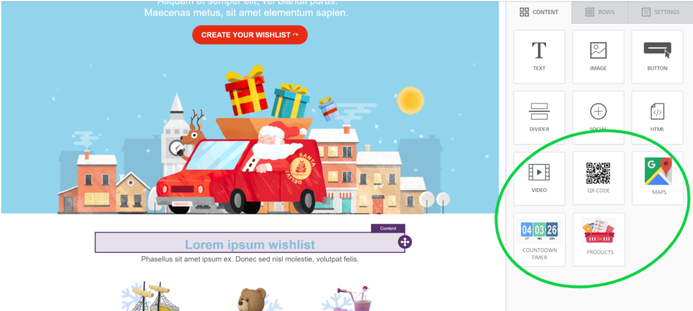
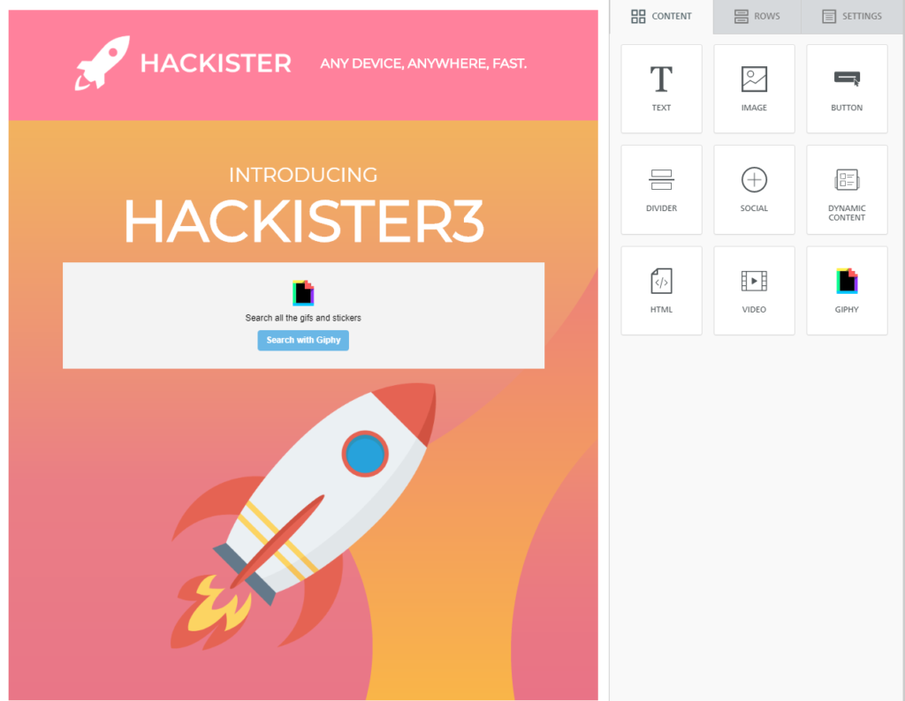

# AddOn FAQs

## What is an AddOn?

An addon is an application that extends the functionality of the Beefree SDK editor.

Software companies can both **use** addons and **build** addons.

You **use** an addon when you need a new feature for Beefree SDK (e.g. you want your end-users to be able to insert a _countdown timer_ in an email) and find an addon that meets your needs. You will search, find, and install addons in the [Beefree SDK Console](https://dam.beefree.io/devmain), in the application configuration area. The [end-user experience](https://docs.beefree.io/addon-end-user-experience/) will vary depending on the addon.

In some case you might decide to build addons for Beefree SDK. In that case:

* When you create an addon for yourself, it’s called a [Custom AddOn](custom-addons/).
* If you build an addon for any application that uses Beefree, then it’s a [Partner AddOn](partner-addons/).

## How to Use (Not Build) an AddOn?

That’s precisely why we’re excited about addons: companies like yours can easily turn on all kinds of additional features (i.e. addons), with minimal effort. You will find, select, and install the addons that meet your needs directly from within the [Beefree SDK Console](https://dam.beefree.io/devmain).

More specifically:

* The Partner AddOn Directory will go live by mid-March, 2020. [Sign up to receive updates](https://docs.beefree.io/updates/) from us on this.
* You will access the directory from within the [Beefree SDK Console](https://dam.beefree.io/devmain), from the _Details_ page of any application that you have created.
* There will be several addons listed that will help your end-users with things like countdown timers, dynamic maps, personalized cards, etc. ([here is an example](https://docs.beefree.io/addon-end-user-experience/))
* You will be able to install many addons with just a few clicks (but some addons will require that you become a customer of the addon provider and obtain an API key).
* You will be able to customize things like the name of the feature shown to your end-users in the _Content_ tab of the editor, the icon used, etc.

## What is a Custom AddOn?

A [Custom AddOn](custom-addons/) is an addon that you developed for your own use. You developed it to provide your own end-users with new features by extending the Beefree SDK editor, and those features may not  make sense for any other application.

You will be able to install your custom addons on your own Beefree SDK host applications. No other Beefree SDK customer (i.e. no other software application that has embedded a Beefree content builder) will see it.

These addons are not listed in the Partner AddOn Directory, unlike [Partner AddOns](partner-addons/).

## What is a Partner AddOn?

A [Partner AddOn](partner-addons/) is an addon that you developed for any Beefree SDK customer that wishes to take advantage of it.

You created it to provide end-users of any application that has embedded a Beefree SDK content builder with new features that extend the builder.

Any Beefree SDK customer will see it and will be able to install it, as Partner AddOns are listed in the Partner AddOn Directory.

## Who Can Build and AddOn?

To build an addon, you need an eligible Beefree SDK subscription plan, including any one of the following:

1. [Superpowers plan](https://dam.beefree.io/pluginpricing)
2. [Enterprise plan](https://dam.beefree.io/pluginpricing)

If you are on a lower-level plan and wish to test building an addon, you can simply [upgrade a development application](../../getting-started/readme/development-applications.md) for free.

## Can a Custom AddOn Become a Partner AddOn?

Yes, that’s exactly the process of developing an addon that is available to the entire community of applications that have embedded the Beefree SDK editor.

* First you develop a [Custom AddOn](custom-addons/)
* Then you submit it for listing in the [Partner AddOn](partner-addons/) Directory

Just remember that – technically speaking – you can only use the [iFrame Method](custom-addons/addon-development.md) when developing a Partner AddOn. So, a Custom AddOn that you want to later list in the Partner AddOn Directory, must be developed that way.

## Where are AddOns in the Beefree SDK UI?

As of January 2020, addons become visible as new _tiles_ in the _Content_ tab.

<figure><figcaption></figcaption></figure>

An example would be a [Giphy](https://giphy.com/) tile (you can see it in the _Content_ tab in the screenshot below) that can be dragged to the editing stage to allow a Beefree SDK user to search, find and insert a GIF animation into the message or page they are designing.

<figure><figcaption></figcaption></figure>

In the future, we may develop new types of addons that may impact other areas of the editor. If you have specific ideas or requests, certainly let us know.

## What Kind of Content Block Can an AddOn Generate?

As of October, 2022, you can generate two kinds of content with an addon:

* An image content block
* A custom HTML content block
* A mixed Content content block
* A custom row content block

A countdown timer or a live map, for example, they will mostly likely be _image content blocks_ in Beefree SDK.

For details, see: [AddOn Development](custom-addons/addon-development.md)

#### How do I know when new addons become available? 

## How Will I Know When New AddOns Become Available?

[Sign up to receive updates](https://docs.beefree.io/updates/) from us. We email rather infrequently, and it’s typically about things that are important to Beefree SDK customers.
