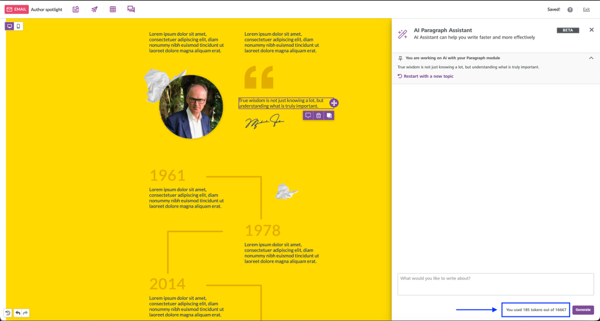

# AI Writing Assistant


The AI Writing Assistant AddOn is only available for [Superpowers](https://developers.beefree.io/pricing-plans) and [Enterprise](https://developers.beefree.io/pricing-plans) plans.


## AI Writing Assistant Overview <a href="#overview" id="overview"></a>

Use this AddOn to enable the AI Writing Assistant for your end users. This AddOn allows users to generate text within their designs using AI, helping them complete their designs faster and more efficiently. This AddOn integrates with OpenAI or Azure OpenAI as the providers for this feature.

With this feature, your end users will see a “Write with AI” button for Title, Paragraph, List, and Button content blocks. Beefree SDK processes your end users' prompts, sends them to your AI provider, and returns the response to the end user. They can then decide to apply or regenerate the response.

By integrating the AI Writing Assistant, you provide your end users with a powerful tool to complete their designs quickly, which helps them maintain a competitive edge. This AddOn is quick and simple to integrate.

The following image provides an example of how the AI Writing Assistant looks to your end user:

<figure><figcaption><p>Write with AI button within the builder</p></figcaption></figure>

Visit our [Integrated AI Assistant White label end user guide](https://docs.beefree.io/end-user-guide/integrated-ai-assistant) to learn more about how this feature works on the frontend for your application's end users.


**Important:** The OpenAI AddOn is now the AI Writing Assistant AddOn with the addition of a new provider: Azure OpenAI. You can use either [OpenAI](https://openai.com/) or [Azure OpenAI](https://azure.microsoft.com/en-us/products/ai-services/openai-service) to activate the AI Writing Assistant.


## What is Azure OpenAI?

[Azure OpenAI](https://azure.microsoft.com/en-us/products/ai-services/openai-service) is a service offered by Microsoft Azure that provides access to OpenAI's language models, such as GPT-4, integrated within the Azure ecosystem. This integration allows users to leverage the robust cloud infrastructure, security, compliance, and scalability features of Azure, making it an attractive choice for enterprises seeking a seamless and secure AI solution.&#x20;

### How is it different from OpenAI?

[OpenAI](https://openai.com/) directly offers its models through its own API, which may be more straightforward for developers and small businesses looking for a quick, standalone implementation. The primary difference between the two lies in the integration and additional features provided by Azure, such as enhanced data privacy and the ability to easily combine with other Azure services. However, Azure OpenAI may require more familiarity with the [Azure platform](https://learn.microsoft.com/en-us/azure/?product=popular).

### How to activate the AI Writing Assistant

This section discusses the prerequisites and steps you need to take to get started with this feature. You can watch the following [How to change your AI provider | Beefree SDK video](https://www.youtube.com/watch?v=\_FybVH28DR4) for visual steps on how to activate the AddOn and add or change providers. Or, you can continue reading the documentation in this section for a step-by-step breakdown of how to activate the AddOn and add or change providers. &#x20;



#### Prerequisites

* Azure OpenAI or OpenAI account and credentials
* AI Writing Assistant AddOn enabled in the developer console

#### Switch Providers

Take the following steps to switch providers:

1. Log in to the Beefree SDK Developer Console.
   1. Navigate to the application you'd like to use.
   2. Navigate to the application's AddOns section.
2. Click on the **Edit** button for the **AI Writing Assistant** AddOn .
   1. Click **Manage providers.**
   2. Click **Add provider**.
      1. Complete the required information\*.
3. Click **Save**.

\*The following information is required for each provider.

| OpenAI                                 | Azure OpenAI                                                                      |
| -------------------------------------- | --------------------------------------------------------------------------------- |
| <ul><li>Name</li><li>API Key</li></ul> | <ul><li>Name</li><li>API Key</li><li>URL Provider</li><li>Deployment ID</li></ul> |

#### Manage Providers

You can also manage your existing providers within the Developer Console. By taking the same steps mentioned in the [Switch Providers section](./#switch-providers) and navigating to your application's AddOns, you can manage your configured providers.

When managing your providers, you will have the following options:

* Edit
* Deactivate
* Delete  &#x20;

#### Additional considerations

* Azure OpenAI and OpenAI are the only provider options for the AI Writing Assistant.
* Cognitive Vision is the provider for the Alt text generation with AI feature.

## Customize the AddOn's Configuration

In certain scenarios, you may find the need to personalize both the user interface (UI) and the operational features of the AI Writing Assistant AddOn. This is particularly applicable when you want to achieve objectives such as:

1. **Monitoring Token Usage for Cost Management:** By tracking the number of tokens being used, you can effectively manage and regulate your expenses related to using the AI Writing Assistant AddOn. This becomes important when your usage is high, and you must keep a budget check. [Learn more about tokens.](https://help.openai.com/en/articles/4936856-what-are-tokens-and-how-to-count-them)
2. **Controlling Access to the Prompt:** You might want to limit who can access and manipulate the prompt. In a shared environment, for instance, you may want to restrict certain users from altering the prompt, which is crucial for maintaining consistency and avoiding unwanted changes.
3. **Enabling Per User or Per Content Type:** You might want to limit who can access the AI so you can up-sell the feature to end-users. Or, you may only want to enable the AI capability for specific content types, such as paragraphs vs. buttons.
4. **Disabling Automatic Suggestions:** The AI Writing Assistant AddOn can generate automatic suggestions at the prompt, which may not always be desirable. In such cases, you might want to disable this feature to have more control over the input and output at the prompt.
5. **Token Upselling:** The AI Writing Assistant AddOn can be configured to guide your end users to purchase additional tokens when they run out of available tokens. This feature is called [Token Upselling](token-upselling.md).

We’ll cover all of these scenarios in the following sections as we discuss the settings and configuration options available for developers.

## General Settings <a href="#general-settings" id="general-settings"></a>

**Note:** All settings are _optional_ and may be refreshed, in real-time, via the [configuration reload](../../../../getting-started/readme/installation/configuration-parameters/configuration-reload.md) instance method (e.g. `bee.loadConfig(settings)`) during the active session.

Currently, the following settings are supported:

<table><thead><tr><th>Setting</th><th width="249.33333333333331">Type</th><th>Description</th></tr></thead><tbody><tr><td><code>tokensAvailable</code></td><td>number</td><td>Display only value for the optional <a href="./">Display Usage Widget</a>: The total tokens available for the user to consume during the session. If provided, <code>tokensUsed</code> and <code>tokenLabel</code> are required.</td></tr><tr><td><code>tokensUsed</code></td><td>number</td><td>Display only value for the optional <a href="./">Display Usage Widget</a>: The number of tokens that the addon user has consumed during the current session. If provided, <code>tokensAvailable</code> and <code>tokenLabel</code> are required.</td></tr><tr><td><code>tokenLabel</code></td><td>string</td><td>Display only value for the optional <a href="./">Display Usage Widget</a>: The API reports token usage, but the host app may refer to tokens as words or any other nomenclature that makes sense to its users. Required when providing usage limits via <code>tokensAvailable</code> and <code>tokensUsed</code> parameters.</td></tr><tr><td><code>isPromptDisabled</code></td><td>boolean</td><td>Set to true to lock the prompt. The chat interface will be disabled but allow previous answers to be applied.</td></tr><tr><td><code>isSuggestionsDisabled</code>  </td><td>boolean</td><td>Set to true to hide the suggestions popup. Set this to <code>false</code> to disable the prompt presets. </td></tr><tr><td><code>isUpsellEnabled</code>  </td><td>boolean</td><td>A boolean that confirms whether or not the <a href="token-upselling.md">Token Upsell</a> feature is enabled.</td></tr><tr><td><code>metadataGeneration</code></td><td>boolean</td><td>A boolean that confirms whether or not the <a href="ai-generated-meta-tag-fields.md">AI-Generated Meta Tag fields feature</a> is enabled</td></tr></tbody></table>

### AI Writing Assistant Configuration Example

<details>

<summary>AI Writing Assistant Configuration Example</summary>

The following code snippet displays an example of the AI Writing Assistant with the ai-integration id and available configuration settings.

```javascript
const beeConfig = {
    uid: 'string',  // Unique identifier for the user
    ... 
    addOns: [
      {
        id: "ai-integration",  // Identifier for the AI integration add-on
        settings: {
          tokensAvailable: tokensAvailable,  // Total tokens available for user consumption during the session
          tokensUsed: tokenCounter,  // Number of tokens consumed by the user during the current session
          tokenLabel: 'tokens',  // Label for the token usage, customizable by the host app
          isPromptDisabled: false,  // Whether to lock the prompt interface
          isSuggestionsDisabled: false,  // Use to remove prompt presets, decide whether to hide the suggestions popup 
          isUpsellEnabled: true,  // Whether Token Upsell feature is enabled
          metadataGeneration: true  // Whether AI-Generated Meta Tag fields feature is enabled (enabled by default)
        }
      },
    ],
    ...
}
```

</details>

## Monitor Usage <a href="#monitor-usage" id="monitor-usage"></a>

With each prompt response, the addon will report the usage data provided by Azure OpenAI or OpenAI API via the editor’s `onInfo` callback without storing or tracking the data.

<details>

<summary>Monitor Usage Example</summary>

The following code snippet shows an example of how to monitor usage for this addOn.

```javascript

const beeConfig = {
    uid: 'string',
    ... 
    onInfo: function (data) {

        // Check information is addon
        if (data.code === 1000) {

            // Check which addon
            const handle = data.detail.handle
            if (handle === 'ai-integration') {
                // Get the total tokens
                const totalTokens = data.detail.usage.total_tokens
                // Update running total in database
                // --> host app code goes here
            }
        }
    },
    ...
}
     
```

</details>

## Display Usage Widget

You may choose to track the end-user’s total usage through the aforementioned `onInfo` callback if desired. Additionally, you may choose to show the usage data to the user via the built-in display widget. To activate the display usage widget, provide the usage data via the addon settings.  Since the editor doesn’t track usage, you’ll need to refresh the values via the `bee.loadConfig` method to keep the display widget data current.

<details>

<summary>Display Usage Widget Example</summary>

The following code snippet displays an example of displaying the usage widget.

```javascript

let tokenCounter = 0
let tokensAvailable = 2000

const beeConfig = {
    uid: 'string',
    ...
    // Initial AddOn configuration
    addOns: [
      {
        id: "ai-integration",
        settings: {
          tokensAvailable: tokensAvailable,
          tokensUsed: tokenCounter,
          tokenLabel: 'words',
          isPromptDisabled: false,
        }
      },
    ],
    ...
    // Monitor for information
    onInfo: function (data) {

        // Check information code is 1000 for addon reporting
        if (data.code === 1000) {

            // Check which addon
            const handle = data.detail.handle
            if (handle === 'ai-integration') {
                const totalTokens = data.detail.usage.total_tokens
                tokenCounter = tokenCounter + totalTokens

                // Refresh Usage AddOn Settings
                const refreshedUsageSettings = {
                    addOns: [
                        {
                            id: "ai-integration",
                            settings: {
                                tokensAvailable: tokensAvailable,
                                tokensUsed: tokenCounter,
                                tokenLabel: 'tokens',
                                isPromptDisabled: (tokenCounter >= tokensAvailable) ? true : false,
                            }
                        },
                    ],
                }

                // Reload Config
                bee.loadConfig(refreshedUsageSettings)
            }
        }
    },
}

```

</details>

See below for an example of how the UI will render when provided with the optional display usage widget.

<figure><figcaption></figcaption></figure>

## Disable Prompts Per User <a href="#disable-prompts-per-user" id="disable-prompts-per-user"></a>

To enable the AI Writing Assistant AddOn, but disable the prompt per user, pass the `isPromptDisabled` boolean parameter as `true`.

The following example will **disable** the prompts for the user with an `uid` of `inactive-user`.

<details>

<summary>Disable Prompts Per User Example</summary>

The following code snippet providesan example of how to disable prompts per user.

```javascript

const beeConfig = {
    uid: 'inactive-user',
    ... 
    addOns: [
      {
        id: "ai-integration",
        settings: {
          isPromptDisabled: true,
        }
      },
    ],
    ...
}
     
```

</details>

## Disable AddOn Per User <a href="#disable-addon-per-user" id="disable-addon-per-user"></a>

To disable the AI Writing Assistant AddOn for a particular user, use the following configuration. Ensure the `enabled` parameter is set to `false`. To turn the AddOn back on for a user, edit the parameter to `true`.

<details>

<summary>Disable AddOn Per User Example</summary>

```javascript

const beeConfig = {
    uid: 'inactive-user',
    ... 
    addOns: [
      {
        id: "ai-integration",
        enabled: false
      },
    ],
    ...
}
     
```

</details>

## Disable AddOn Per Content Block Type <a href="#disable-addon-per-content-block-type" id="disable-addon-per-content-block-type"></a>

The AI Writing Assistant AddOn is available for the following content blocks:

* Title
* Paragraph
* List
* Button

You may utilize the Advanced Permissions configuration to disable AI Writing Assistant AddOn per content type.

The following example will disable the addon for the paragraph block:

<details>

<summary>Disable AddOn Per Content Block Type</summary>

The following code snippet displays an example of disabling the addOn per Content Block type.

```javascript

const beeConfig = {
    uid: 'string',
    ... 
    advancedPermissions: {
      content: {
        paragraph: {
          behaviors: {
            canViewSidebar: true,
          },
          properties: {
            aiIntegration: {
              show: false,
              locked: true
            },
          },
        },
      },
    }
    ...
}
     
```

</details>

## Prompt Suggestions <a href="#prompt-suggestions" id="prompt-suggestions"></a>

The AI Writing Assistant AddOn includes preset prompt suggestions to facilitate the content creation process. These appear after the initial draft of your text has been formulated and whenever further refinement is needed. **Please note** that this function applies only when editing existing text through the AI prompt. The suggestions will not appear for placeholder text.

Here’s a simplified step-by-step guide on how to use suggestions, as shown below:

1. Start with your draft text added to the design area.
2. If you desire to adjust the tone to be more formal, for example, click on the paragraph, list, title, or button you want to modify.
3. Navigate to the ‘Write with AI’ option.
4. Click on the area designated for adding prompts.
5. You’ll notice the prompt suggestions popup.
6. Select the ‘Make it \[desired tone]’ option, making sure to replace \[desired tone] with a value (e.g., funny)
7. Click ‘Generate’.

The AI will then generate a revised version of your content, matching the tone you entered.

## Customize Prompt Suggestions <a href="#customize-prompt-suggestions" id="customize-prompt-suggestions"></a>

Below are the preset prompt suggestions we have identified for the different content tiles, along with their corresponding translation key, in case you’d like to revise the prompt through our custom languages feature.

### Paragraph

| Label                                                               | Key                                                   |
| ------------------------------------------------------------------- | ----------------------------------------------------- |
| Spell-check the content                                             | mailup-bee-common-component-ai.suggest-check-spelling |
| Correct grammar mistakes in the content                             | mailup-bee-common-component-ai.correct-grammar        |
| Translate content to \[language]                                    | mailup-bee-common-component-ai.translate              |
| Make it \[tone] without changing the format                         | mailup-bee-common-component-ai.adjust-tone            |
| Use Active Voice                                                    | mailup-bee-common-component-ai.use-active-voice       |
| Summarize the content                                               | mailup-bee-common-component-ai.summarize-text         |
| Convert the content to the third person without changing the format | mailup-bee-common-component-ai.convert-third-person   |

### Button

| Label                            | Key                                             |
| -------------------------------- | ----------------------------------------------- |
| Translate content to \[language] | mailup-bee-common-component-ai.translate        |
| Make it \[tone]                  | mailup-bee-common-component-ai.make-it-tone     |
| Use Active Voice                 | mailup-bee-common-component-ai.use-active-voice |

### List

| Label                                           | Key                                                   |
| ----------------------------------------------- | ----------------------------------------------------- |
| Spell-check the content                         | mailup-bee-common-component-ai.suggest-check-spelling |
| Correct grammar mistakes and return the content | mailup-bee-common-component-ai.correct-grammar-list   |
| Translate content to \[language]                | mailup-bee-common-component-ai.translate              |
| Make it \[tone] without changing the format     | mailup-bee-common-component-ai.adjust-tone            |
| Use Active Voice                                | mailup-bee-common-component-ai.use-active-voice       |

### Title

| Label                                       | Key                                                 |
| ------------------------------------------- | --------------------------------------------------- |
| Capitalize all letters                      | mailup-bee-common-component-ai.capitalize-text      |
| Capitalize the first letter of each word    | mailup-bee-common-component-ai.capitalize-all-words |
| Make it \[number] words long                | mailup-bee-common-component-ai.characters-length    |
| Make it \[tone] without changing the format | mailup-bee-common-component-ai.adjust-tone          |
| Translate it to \[language]                 | mailup-bee-common-component-ai.translate-heading    |

## Additional considerations

Prior to configuring the AI Writing Assistant AddOn, consider the following:

* Scrolling behavior
* [AI Providers and Data Security](open-ai-and-data-security.md)

### Scrolling Behavior

This section will discuss how to manage an odd scrolling behavior related to the AI Writing Assistant AddOn. At times, the AI Writing Assistant side panel opens and requires the end user to scroll down to reach the prompting area.

The following image shows an example of this behavior:

<figure><figcaption></figcaption></figure>

If you encounter this behavior, take the following steps to avoid the need for scrolling to access the prompting area:

1. Navigate to your CSS code.
2. Change the height of your container using the `calc()` function as shown in the following examples:

```css
Example A:
height: calc(100% - 100px); // offset for 100px footer
```

This sets the height of the element to be the full height of its parent (`100%`) minus `100px`, which accounts for an offset such as a footer.

```css
Example B:
height: calc(100%);  // no offset needed
```

This sets the height of the element to be exactly `100%` of its parent's height with no offset.

The `calc()` function allows for mathematical expressions in CSS values, making it versatile for dynamic layouts.

3. Save your updated CSS.

You can now access the prompting section of the AI Writing Assistant on the front end without scrolling down the side panel.

The following image shows an example of this result:&#x20;

<figure><figcaption></figcaption></figure>

### AI Providers and Data Security

Visit our [AI Providers and Data Security page](open-ai-and-data-security.md) to learn more about the flow of your end user's information from prompt creation to generated response.
