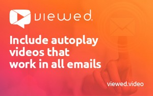

# Partner AddOns directory


These AddOns need to be [installed from your Beefree SDK Console](installing-partner-addons.md). Some of them are offered by third-party providers, and they might require an active subscription with those providers in order to be used.


## Custom AI Writing Assistant 

The Custom AI Writing Assistant AddOn enables host applications to integrate their own LLM models with Beefree SDK. This allows host applications to provide their end users with advanced AI writing capabilities that are specific to their domains. Using the [Content Dialog](../../../other-customizations/advanced-options/content-dialog.md), this AddOn employs the same entry points as the [AI writing assistant](ai-writing-assistant/), allowing full control over the AI experience within your application. Once your Custom AI Writing Assistant AddOn is fully configured, the [Content Dialog](../../../other-customizations/advanced-options/content-dialog.md) displays the modal you created within the user interface when end users click the **Write with AI** button in the sidebar.&#x20;

<figure><figcaption></figcaption></figure>

[How do I enable the Custom AI Writing Assistant AddOn?](custom-ai-writing-assistant.md) | [Terms of Services](https://developers.beefree.io/terms-of-service)&#x20;

## Stability AI 

The Stability AI AddOn converts text to images. This feature allows your end users to submit descriptions of what they would like to see in their AI-generated images, and to also submit negative prompts of what they do not want to see in their image. Once they submit the prompt and negative prompt, they'll receive an AI-generated image that they can use directly within their designs.

<figure><figcaption></figcaption></figure>

[How do I enable the Stability AI AddOn?](partner-addons-directory.md#openai) | [AI Providers and Data Security](ai-writing-assistant/data-security.md) | [Terms of Services](https://developers.beefree.io/terms-of-service)&#x20;

## DeepL  

Through this AddOn and [Multi-language templates](../../../other-customizations/multi-language-templates.md), you can empower your end users to create up to six different language versions of a single design. Once your end users create their new language versions, they can click the **Translate** button to automatically translate all the translatable content within their designs.

<figure><figcaption></figcaption></figure>

[How do I enable the DeepL AddOn?](deepl.md) | [AI Providers and Data Security](ai-writing-assistant/data-security.md) | [Terms of Services](https://developers.beefree.io/terms-of-service)&#x20;

## AI Writing Assistant 

Empower users to generate text quickly with AI. With this AddOn, your end users will see a new “Write with AI” button for Title, Paragraph, List, and Button content blocks. Beefree SDK processes your end users' prompts, sends them to your AI provider, and returns the response to the end user. They can then decide to apply or regenerate the response. By integrating the AI Writing Assistant, you provide your end users with a powerful tool to complete their designs quickly, which helps them maintain a competitive edge. Choose between [Azure OpenAI](https://azure.microsoft.com/en-us/products/ai-services/openai-service/?ef_id=_k_Cj0KCQjwwae1BhC_ARIsAK4JfrxKm9iAYpFxdsG338x_u9X0GZpyFYL2a4lsLLy4Kib2MTsseC7Qpz0aAoPKEALw_wcB_k_\&OCID=AIDcmm5edswduu_SEM__k_Cj0KCQjwwae1BhC_ARIsAK4JfrxKm9iAYpFxdsG338x_u9X0GZpyFYL2a4lsLLy4Kib2MTsseC7Qpz0aAoPKEALw_wcB_k_\&gad_source=1\&gclid=Cj0KCQjwwae1BhC_ARIsAK4JfrxKm9iAYpFxdsG338x_u9X0GZpyFYL2a4lsLLy4Kib2MTsseC7Qpz0aAoPKEALw_wcB) or [OpenAI](https://openai.com/) as providers for this feature, our AddOn is quick and simple to integrate.

<figure><figcaption></figcaption></figure>

[How do I enable the AI Writing Assistant AddOn?](https://devportal.beefree.io/hc/en-us/articles/10838757053330-How-do-I-enable-the-OpenAI-AddOn-) | [Developer’s FAQ for OpenAI](https://devportal.beefree.io/hc/en-us/articles/10839177777810-Developer-s-FAQ-for-OpenAI) | [Webinar](https://app.livestorm.co/beefreeio/introducing-bee-plugin-openai-add-on-live-demo-and-q-and-a/live?s=7cef0fc7-d888-4627-a5c6-a3c4ed1c396d)

## Azure AI Vision - Image Analysis 

Generate alt-text descriptions with the power of Computer Vision. Azure AI Vision is a unified service that offers innovative computer vision capabilities. Image analysis pulls from more than 10,000 concepts and objects to detect, and caption images.

<figure><figcaption></figcaption></figure>

[How do I enable the Azure AI Vision - Image Analysis AddOn?](https://app.gitbook.com/s/xZgBDrdhQLtWmkGqVR59/) | [Azure Ai Vision FAQs](https://docs.beefree.io/beefree-sdk/addons/partner-addons/alternate-text-generation-with-ai#faqs) | [Data and Privacy](https://learn.microsoft.com/en-us/legal/cognitive-services/computer-vision/imageanalysis-data-privacy-security)

## IO Monetizer 

For setup, please reach out to support@interactiveoffers.com, and we will provide you with an API key that identifies your application on our network.

Over 600 digital publishers use Interactive Offers to help captivate new audiences and discover new monetization solutions. These programmatic email ad solutions provide a non-intrusive way to engage users with your content while earning revenue from every email you send.

<figure><figcaption></figcaption></figure>

[AddOn website](https://www.interactiveoffers.com/) | [About Ads By Interactive Offers](https://www.interactiveoffers.com/publishers) | [Privacy Policy](https://app.gitbook.com/s/xZgBDrdhQLtWmkGqVR59/) | [Support](https://www.interactiveoffers.com/knowledgeBase)

## Countdown Timers by NiftyImages 

<figure><figcaption></figcaption></figure>

Create urgency with custom-designed countdown timers.

Give your users the ability to design fully customized countdown timers without ever leaving the editor. Create urgency for sales, events, holidays, webinars, and more, with this powerful yet easy-to-use AddOn.

[Addon website](https://dam.beefree.io/beenifty) | [About the AddOn](https://dam.beefree.io/niftycontact) | [Setup instructions](https://dam.beefree.io/niftycontact) | [Privacy Policy](https://dam.beefree.io/niftytos) | [Support](mailto:support@niftyimages.com)

<figure><figcaption></figcaption></figure>

Engage and inform with dynamic content, timers, and millions of visuals.

Email from your platform will come alive with this powerful set of dynamic-content tools and a massive collection of ready-to-use visuals. On-open content transforms the email experience into a live marketing channel, backed by millions of royalty-free visuals to grab inbox attention with eye-catching emails.

[Addon website](https://dam.beefree.io/visboxmain) | [Privacy Policy](https://dam.beefree.io/visboxtos) | [Support](https://dam.beefree.io/visboxsupport)

## Countdown Timers by Sendtric 

<figure><figcaption></figcaption></figure>

Boost clickthrough rates with dynamic countdown timers.

Sendtric countdown timers are perfect for your customers to create urgency in their campaigns. With our robust architecture and limitless customization options, our timers can be used for a variety of use cases such as sales, events, deadlines, new account sign-ups, abandoned cart reminders, and much more.

[Addon website](https://dam.beefree.io/sendtricmain) | [About the AddOn](https://dam.beefree.io/sendtricabout) | [Privacy Policy](https://www.sendtric.com/terms-of-service/) | [Support](mailto:support@sendtric.com)

## Viewed 

<figure><figcaption></figcaption></figure>

Capture your customer’s attention and stand out from the competition with the use of autoplay video in email.

It works with all email clients and devices. Get up to 90% of views on your opened emails, against only 16% that can be achieved including a static picture linked to YouTube. Autoplay video in email is the best solution to quickly spread your message and get millions of video views.

[Addon website](https://dam.beefree.io/viewedmain) | [About the AddOn](https://dam.beefree.io/viewedabout) | [Privacy Policy](https://www.viewed.video/privacy-policy/) | [Support](mailto:support@viewed.video)

## Gifs 

<figure><figcaption></figcaption></figure>

The GIFs by GIPHY AddOn gives your customers the best source for GIFs, ready to use in their emails and pages, without leaving the application. This AddOn is developed by Beefree SDK and powered by GIPHY.

Once installed and configured, they will see a new content tile in the builder. Once dragged into the email or page, a click on a button in the stage area will launch a GIPHY search dialog. Clicking on a GIF will import it instantly into the email or page.

[Addon website](./) | [About the AddOn](./) | [Privacy Policy](https://beefree.io/privacy-policy/) | [Support](https://dam.beefree.io/devportal)

## Stickers 

<figure><figcaption></figcaption></figure>

The Stickers by GIPHY AddOn gives your customers the best source for stickers, ready to use in their emails and pages, without leaving the application. This AddOn is developed by Beefree SDK and powered by GIPHY.

Once installed and configured, they will see a new content tile in the builder. Once dragged into the email or page, a click on a button in the stage area will launch a GIPHY search dialog. Clicking on a sticker will import it instantly into the email or page.

[Addon website](./) | [About the AddOn](./) | [Privacy Policy](https://beefree.io/privacy-policy/) | [Support](https://dam.beefree.io/devportal)
