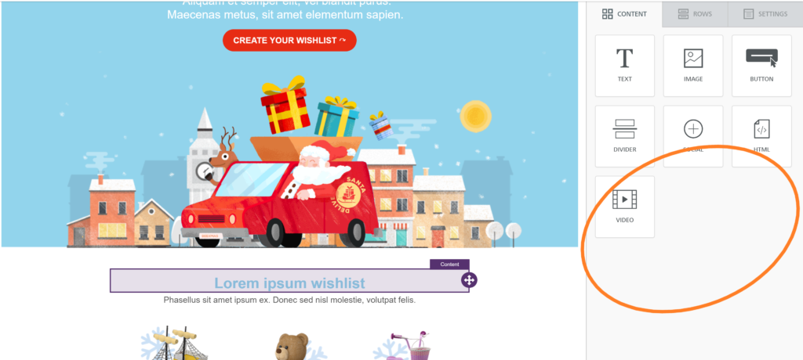
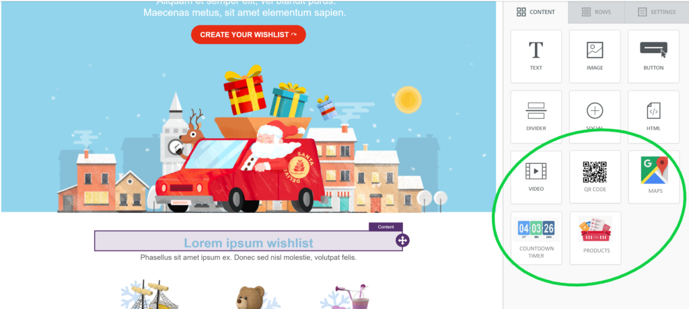
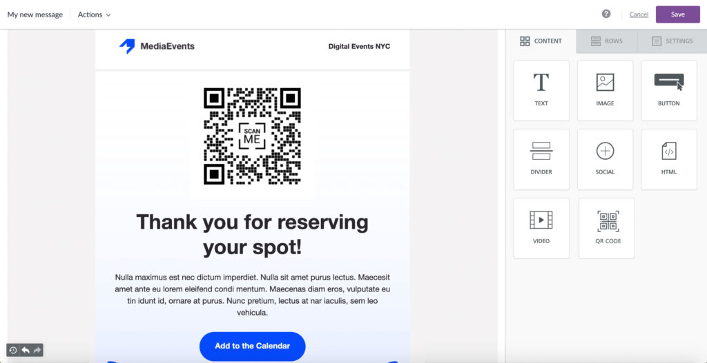

# Getting Started

## What are AddOns? 

AddOns are additional [Content Tiles](../other-customizations/appearance/content-tile-sorting.md#full-list-of-content-tiles) that you can add to the **Content** tab within the builder's sidebar. These optional AddOns are particularly useful in situations where your end users request a type of content that isn't available within the sidebar by default. There are two types of AddOns available within Beefree SDK, Partner and Custom AddOns. This page provides an overview of AddOns, lists the difference between [Partner](getting-started.md#partner-addons) and [Custom](getting-started.md#custom-addons) AddOns, and explains how you can get started with AddOns within Beefree SDK.     &#x20;

## Overview 

From the moment Beefree’s first email builder was released, people started asking for additional [Content Tile options](../other-customizations/appearance/content-tile-sorting.md#full-list-of-content-tiles) to be available in the **Content** tab of the sidebar, so that they would be able to do more with the Beefree SDK drag-and-drop editor.

A few examples of ways that people wanted to extend the content options within the sidebar included:

* Inserting a **countdown timer** in a promotional email
* Adding a **QR code** in an event ticket reminder&#x20;
* Displaying **live weather** on a landing page

The following image shows the Beefree SDK builder with only default [Content Tiles](../other-customizations/appearance/content-tile-sorting.md#full-list-of-content-tiles) available.

<figure><figcaption></figcaption></figure>

The following image shows the Beefree SDK builder with available AddOns in addition to the default [Content Tiles](../other-customizations/appearance/content-tile-sorting.md#full-list-of-content-tiles).

<figure><figcaption></figcaption></figure>

Both Partner and Custom AddOns provide options to extend the default offering of the Beefree SDK builder, and to customize the experience for your end users and their unique content creation needs.

## Everybody wins 

Beefree SDK is used by over 600 software companies in all kinds of industries. Through their applications, hundreds of thousands of marketers create countless emails and landing pages, which reach millions of people.

With AddOns, richer emails and landing pages can be created, and everybody wins:

* The people that receive those emails or view those pages, have a better experience.
* The marketers that create them, have more ways to engage their audience.
* The applications that embed Beefree’s builders can give those marketers better tools.
* The AddOn providers reach more marketers through those apps.
* And all of the above creates an overall more successful community around Beefree.

## Types of AddOns 

You can either use AddOns that are available in the [AddOn Marketplace](partner-addons/partner-addons-directory.md) or [build new ones.](custom-addons/) [Partner AddOns](getting-started.md#partner-addons) that are available within the AddOn Marketplace within the Beefree SDK Developer Console take less than five minutes to configure and install. [Custom AddOns](getting-started.md#custom-addons) require development time to build and integrate within your instance of Beefree SDK.

### Custom AddOns


This feature is available on Beefree SDK's [Superpowers plan](https://developers.beefree.io/pricing/) and above. Upgrade a [development application](../getting-started/readme/development-applications.md) at no extra charge to explore features from higher plan tiers. **Note:** Usage on a development application still counts toward [usage-based fees](https://devportal.beefree.io/hc/en-us/articles/4403095825042-Usage-based-fees) and limits.


Custom AddOns are useful when there is a feature you'd like to offer within your application that is not available in our AddOn Marketplace within the Developer Console. In these instances, you can develop your own Custom AddOns for your application's end users. They are available for the following [Beefree SDK plan types](https://developers.beefree.io/pricing-plans):

* Superpowers
* Enterprise

To add your own content tiles to the Content tab in a Beefree editor, you will need to develop a [Custom AddOn](custom-addons/).

For example, say your application is an event marketing system and you want your users to be able to drag-n-drop a QR code into an email. The QR code is generated by your event marketing system when the email is sent. The feature only works for your application. That’s a [Custom AddOn](getting-started.md#custom-addons).

<figure><figcaption></figcaption></figure>

Reference the [Custom AddOn documentation](custom-addons/) to learn more about building Custom AddOns.

### Partner AddOns


This feature is available on Beefree SDK's [paid plans](https://developers.beefree.io/pricing-plans) only.


Here is how you can locate and [install ready-to-go AddOns](partner-addons/installing-partner-addons.md):

* Access the directory from within the [Beefree SDK Console](https://developers.beefree.io/login), from the _Details_ page of any application that you have created.
* Browse the list. These AddOns can help your end-users with things like countdown timers, dynamic maps, personalized cards, etc.
* Install any AddOn with just a few clicks. Please note that some AddOns will require that you become a customer of the AddOn provider and obtain an API key.

For more, see [Using AddOns](partner-addons/installing-partner-addons.md).

There are two types of AddOns: [Partner AddOns](partner-addons/) and [Custom AddOns](custom-addons/). Partner AddOns can easily be integrated with your application in a matter of minutes by installing them inside of the [Developer Console](https://developers.beefree.io/login?from=website_menu). They are available for the following [Beefree SDK plan types](https://developers.beefree.io/pricing-plans):

* Essentials
* Core
* Superpowers
* Enterprise


**Note:** There is a growing [library of Partner AddOns](partner-addons/partner-addons-directory.md) for Beefree SDK customers. All these AddOns are available in a public directory inside the Beefree SDK Console. Application developers that have embedded a Beefree builder are able to quickly [select and install any of those AddOns](partner-addons/partner-addons-directory.md).


Additional Resources

* Learn more about [Partner AddOns](partner-addons/)
* Learn more about [Custom AddOns](custom-addons/)
* [AddOn FAQs](addon-faqs.md)
