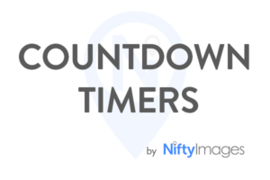
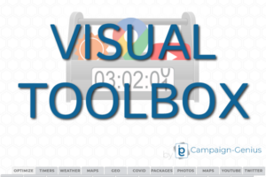
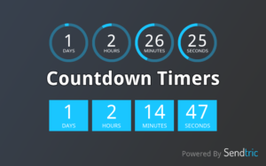
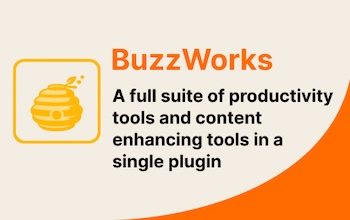

# Partner AddOns directory


For Beefree AI and the other AI AddOns please visit our [dedicated section](../../ai-and-mcp/getting-started-with-ai-in-beefree-sdk.md).


These AddOns need to be [installed from your Beefree SDK Console](installing-partner-addons.md). Some of them might require an active subscription with third-party providers in order to be used.

## IO Monetizer 

For setup, please reach out to support@interactiveoffers.com, and we will provide you with an API key that identifies your application on our network.

Over 600 digital publishers use Interactive Offers to help captivate new audiences and discover new monetization solutions. These programmatic email ad solutions provide a non-intrusive way to engage users with your content while earning revenue from every email you send.

<figure><figcaption></figcaption></figure>

[AddOn website](https://www.interactiveoffers.com/) | [About Ads By Interactive Offers](https://www.interactiveoffers.com/publishers) | [Privacy Policy](https://app.gitbook.com/o/hABGoPMOKISmuDmz4fbV/s/xZgBDrdhQLtWmkGqVR59/) | [Support](https://www.interactiveoffers.com/knowledgeBase)

## Countdown Timers by NiftyImages 

<figure><figcaption></figcaption></figure>

Create urgency with custom-designed countdown timers.

Give your users the ability to design fully customized countdown timers without ever leaving the editor. Create urgency for sales, events, holidays, webinars, and more, with this powerful yet easy-to-use AddOn.

[Addon website](https://dam.beefree.io/beenifty) | [About the AddOn](https://dam.beefree.io/niftycontact) | [Setup instructions](https://dam.beefree.io/niftycontact) | [Privacy Policy](https://dam.beefree.io/niftytos) | [Support](mailto:support@niftyimages.com)

<figure><figcaption></figcaption></figure>

Engage and inform with dynamic content, timers, and millions of visuals.

Email from your platform will come alive with this powerful set of dynamic-content tools and a massive collection of ready-to-use visuals. On-open content transforms the email experience into a live marketing channel, backed by millions of royalty-free visuals to grab inbox attention with eye-catching emails.

[Addon website](https://dam.beefree.io/visboxmain) | [Privacy Policy](https://dam.beefree.io/visboxtos) | [Support](https://dam.beefree.io/visboxsupport)

## Countdown Timers by Sendtric 

<figure><figcaption></figcaption></figure>

Boost clickthrough rates with dynamic countdown timers.

Sendtric countdown timers are perfect for your customers to create urgency in their campaigns. With our robust architecture and limitless customization options, our timers can be used for a variety of use cases such as sales, events, deadlines, new account sign-ups, abandoned cart reminders, and much more.

[Addon website](https://dam.beefree.io/sendtricmain) | [About the AddOn](https://dam.beefree.io/sendtricabout) | [Privacy Policy](https://www.sendtric.com/terms-of-service/) | [Support](mailto:support@sendtric.com)

## Viewed 

<figure><figcaption></figcaption></figure>

Capture your customer’s attention and stand out from the competition with the use of autoplay video in email.

It works with all email clients and devices. Get up to 90% of views on your opened emails, against only 16% that can be achieved including a static picture linked to YouTube. Autoplay video in email is the best solution to quickly spread your message and get millions of video views.

[Addon website](https://dam.beefree.io/viewedmain) | [About the AddOn](https://dam.beefree.io/viewedabout) | [Privacy Policy](https://www.viewed.video/privacy-policy/) | [Support](mailto:support@viewed.video)

## Gifs 

<figure><figcaption></figcaption></figure>

The GIFs by GIPHY AddOn gives your customers the best source for GIFs, ready to use in their emails and pages, without leaving the application. This AddOn is developed by Beefree SDK and powered by GIPHY.

Once installed and configured, they will see a new content tile in the builder. Once dragged into the email or page, a click on a button in the stage area will launch a GIPHY search dialog. Clicking on a GIF will import it instantly into the email or page.

[Addon website](./) | [About the AddOn](./) | [Privacy Policy](https://beefree.io/privacy-policy/) | [Support](https://devportal.beefree.io/hc/en-us)

## Stickers 

<figure><figcaption></figcaption></figure>

The Stickers by GIPHY AddOn gives your customers the best source for stickers, ready to use in their emails and pages, without leaving the application. This AddOn is developed by Beefree SDK and powered by GIPHY.

Once installed and configured, they will see a new content tile in the builder. Once dragged into the email or page, a click on a button in the stage area will launch a GIPHY search dialog. Clicking on a sticker will import it instantly into the email or page.

[Addon website](./) | [About the AddOn](./) | [Privacy Policy](https://beefree.io/privacy-policy/) | [Support](https://devportal.beefree.io/hc/en-us)

## Buzzworks

<figure><figcaption></figcaption></figure>

The BuzzWorks add-on gives you instant access to the full suite of BuzzWorks plugins from a single, unified interface inside your Beefree SDK editor.&#x20;

Easily insert QR codes, maps, calendar events, content feeds, and all other tools Buzzworks has to offer from a single AddOn.&#x20;

[Addon website](https://buzzworks.studio/) | [Privacy Policy](https://beefree.io/privacy-policy/) | [Support](https://devportal.beefree.io/hc/en-us)

## Mailix

<figure><figcaption></figcaption></figure>

Mailix allows you to build interactive email widgets without coding right in the Beefree editor.\
Mailix offers these features out of the box:

* Video in email
* Countdown timer that shows the right time even on Apple MPP devices
* Text over image
* 5-Star Rating
* NPS Score
* Survey
* Form
* Quiz
* One-click email rating&#x20;

And many more on demand like product carousels and panels with navigation/filter, decision trees / multi step selections, wheel of fortune, flip card, scratch off — and even games like mine sweeper or memory.

[Addon website](https://mailix.com/) | [Privacy Policy](https://mailix.com/terms-and-conditions/) | [Support](https://mailix.com/contact-us)
