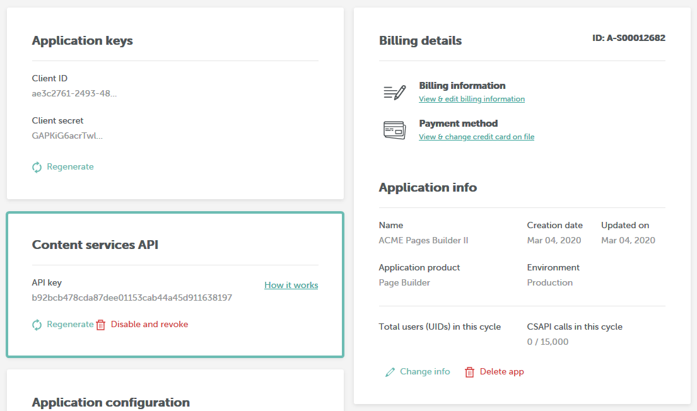

# Content Services API Reference

## API Key

To use the Content Services API you will need to obtain an API key.&#x20;

To obtain an API Key, take the following steps:

1. Log into the [Beefree SDK Console](https://dam.beefree.io/devmain)
2. Locate the application that you wish to work with, and click on _Details_
3. Locate the Content Services API section and click on _Create New API Key_
4. Acknowledge the message that reminds you that if you exceed the [number of API calls included in your plan](https://dam.beefree.io/devmain), you may be charged for overages and click on _Create Key_
5. You’re done!

<figure><figcaption></figcaption></figure>

The Content Services API uses API Keys to authenticate requests for resources.  You can manage your API Keys within the Beefree SDK Console.  All requests must be made over HTTPS and contain the following HTTP Header:

| **`Authorization:`**` ``Bearer {token}` |
| --------------------------------------- |

## Rate Limits

API requests rate limits exist independently of API key’s monthly usage allowance.

By default, the API has the following rate limits:

* **Per minute:** 500 requests
* **Per second:**  100 requests
* **X-Rate-Limit:** An integer representing the total number of requests available per cycle. Exceeding the limit per cycle results in a 429 error.  (e.g. 500)
* **X-Rate-Limit-Remaining:** An integer representing the number of remaining requests before the next cycle begins, and the count resets. (e.g. 100)
* **X-Rate-Limit-Reset:** A Unix timestamp representing the time the next cycle will begin, and the count will reset.
* **Retry-After:** A Unix timestamp representing the time the application may resume submitting requests.

## API Root

All API access is over HTTPS, and accessed from the following URL:

| API Root                                                  |
| --------------------------------------------------------- |
| `https://api.getbee.io/{version}/{collection}/{resource}` |

### Versions

| Version | Released on |
| ------- | ----------- |
| V1      | 4/25/2019   |
| Beta    | 4/06/2019   |

### Collections

| Collection | Available Resources            |
| ---------- | ------------------------------ |
| /message   | html, pdf, images, merge,index |
| /page      | html, pdf, images, merge,index |
| /popup     | html                           |
| /amp       | html                           |

## Example URLs

| Request HTML for email                  |
| --------------------------------------- |
| `https://api.getbee.io/v1/message/html` |

## Example URLs

### Email

| Request HTML for email                  |
| --------------------------------------- |
| `https://api.getbee.io/v1/message/html` |

### Landing Page

| Request HTML for a landing page      |
| ------------------------------------ |
| `https://api.getbee.io/v1/page/html` |

### Popup

| Request HTML for a popup              |
| ------------------------------------- |
| `https://api.getbee.io/v1/popup/html` |

### AMP

| Request HTML for AMP                |
| ----------------------------------- |
| `https://api.getbee.io/v1/amp/html` |

## Resources

### HTML







A Beefree template in JSON format



This flag will force the API to return uncompressed HTML























**Content-Type:** application/json

**Example**

```json

{
  beautifyHtmlEnabled: false,
  page: {
     body: { ... },
     template: { ... },
     rows: { ... },
     title: '',
     description: ''
 }
}

```

**Response**

application/html

The HTML message

### PDF







A full HTML document



Accepted values: letter (default), A4, A3, full

**Full:** a single page using 900px as page width. The page\_orientation is always portrait when using this page size.



Accepted values: landscape (default), portrait



Accepted values: PDF



This flag will force the API to return uncompressed HTML. Both page and popup endpoints do not compress HTML so will ignore this flag.























**Content-Type:** application/json

**Request**

```json

{"html":"a","file_type":"pdf","page_size":"full","page_orientation":"portrait"}

```

**Response**

application/json

A JSON string that will contain the URL of the temporary location of the PDF document.

The file is available for 24 hours.

```json


{"statusCode":200,"body":{"url":"https:\/\/pro-bee-beepro-pdf.s3.amazonaws.com\/public\/pdf\/87ElCDpHHk.pdf","filename":"87ElCDpHHk.pdf","page_size":"full","page_orientation":"portrait","content_type":"application\/pdf"}}


```

### Image







A Beefree HTML messag



Use “size” instead of “width” and “height” when you only know the width and want the height automatically calculated. **Required** if width and height are not defined.



The image width in pixels. **Required** if size is not defined.



The image height in pixels.\
D**efault** applies a proportional value based on the given width, keeping the image aspect ratio.\
When the value is not proportional to the given width either will occur: If it’s higher, the proportional value applies, or, if it’s lower, the image is cropped. **Required** if size is not defined.



Accepts jpg or png.























**Content-Type:** application/json

**Example**

```json

{
    "html": "<!DOCTYPE html><html><head><meta charset=\"UTF-8\" /></head><body><div style='width:900px; margin: 30px;'>Hello World!</div></body></html>",
    "width": 215,
    "height": 125,
    "file_type": "jpg"
}

```

**Response**

application/jpg

The raw image data

Check out our [sample code for a JavaScript method to convert an image to data URI here](https://gist.github.com/BEE-Plugin/5913ffa1a649b923962d53946e552194).

### Merge







A Beefree template in JSON format.



An array of objects that contain a JSON path and value to replace.



The value can be an object, such as a saved row. Or, it can be a string, such a hex color code. The value should be the same type as the value you want to match in your match expression.



A JSON Path to the matching nodes in the source JSON.























**Content-Type:** application/json

#### Replace Array

| Parameters | Type             | Required or Optional | Description                                                                                                                                                                                |
| ---------- | ---------------- | -------------------- | ------------------------------------------------------------------------------------------------------------------------------------------------------------------------------------------ |
| Value      | String \| Object | Required             | The value can be an object, such as a saved row. Or, it can be a string, such a hex color code. The value should be the same type as the value you want to match in your match expression. |
| Path       | String           | Required             | A JSON Path to the matching nodes in the source JSON.                                                                                                                                      |

**Example**

```json

{
  "replace": [
    {
      "path": "$..style[?(@ == '#FFFFFF')]",
      "value": "#89cff0"
    },
    {
      "path": "$..rows[?(@.metadata.id=='')]",
      "value": { ... row json }
    }
  ],
  "source": { "page": { ... }  }
}

```

**Response**

application/json

The JSON object containing the following parameters:

<table><thead><tr><th width="126">Parameter</th><th width="85">Type</th><th>Required or Optional</th><th>Description</th></tr></thead><tbody><tr><td><strong>json</strong></td><td>object</td><td>required</td><td>The updated Beefree template in JSON format. In the event of an error, the original source is returned.</td></tr><tr><td><strong>html</strong></td><td>string</td><td>required</td><td>The HTML message.</td></tr><tr><td><strong>warnings</strong></td><td>array</td><td>optional</td><td>An array of objects containing information about issues that occurred during the merge. If no warnings exist, then it is safe to save the updated JSON.</td></tr></tbody></table>

**Example**

```json

{
    "html": "...",
    "json": {
        "page": { ...// BEE Template }
    },
    "warnings": [
        {
            "msg": "Your path $..style[?(@ == '#FFFFFF')] did not return any matching nodes",
            "param": "path",
            "location": "replace"
        },
        {
            "msg": "Your path $..style[?(@ == '#89cff0')] did not return any matching nodes",
            "param": "path",
            "location": "replace"
        }
    ]
}

```

### Index







A Beefree template in JSON format.



























**Content-Type:** application/json

**Example**

```json

{
    "source": { "page": { ... }  }
}

```

**Response**

application/json

The JSON object containing the following parameters:

<table><thead><tr><th width="123">Parameter</th><th width="80">Type</th><th width="184">Required or Optional</th><th>Description</th></tr></thead><tbody><tr><td><strong>rows</strong></td><td>array</td><td>required</td><td>An array of metadata objects containing row details, which can be saved in a database to create a reference (or relational table) to the rows associated with your template.</td></tr></tbody></table>

**Example**

```json

[
  {
    "name": "my saved row A"
    "guid": "some unique value"
  },
  {
    "name": "my saved row B"
    "guid": "some unique value"
  }
]

```
