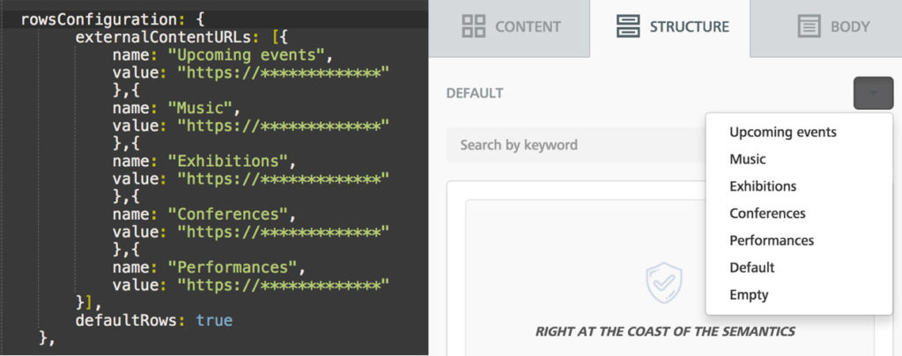
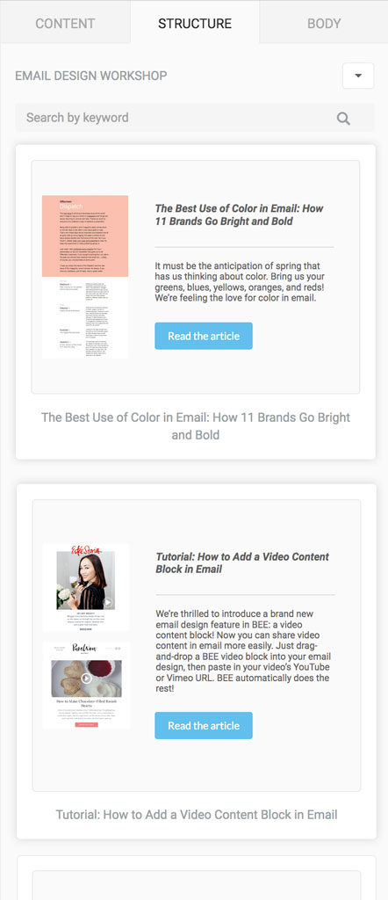
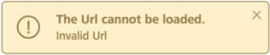
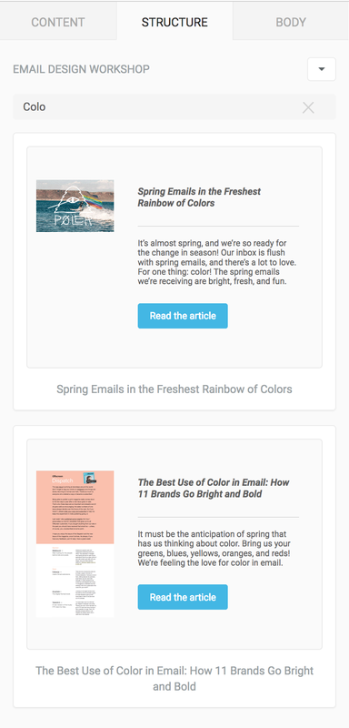
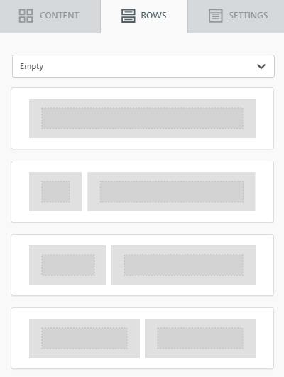
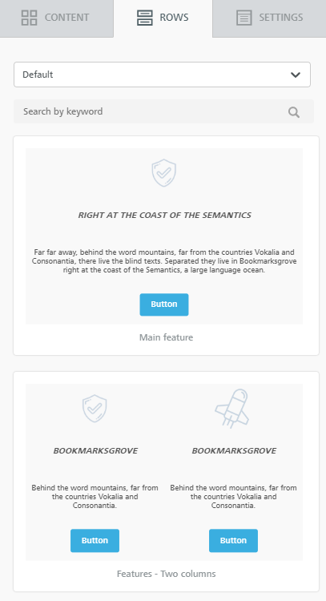
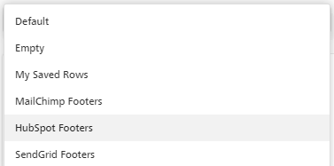

# How it works

## Overview <a href="#overview" id="overview"></a>

When the builder starts, you can feed to it multiple lists of _custom rows_, which will display in the rows selector:

<figure><figcaption></figcaption></figure>

Each list is an array of objects (JSON) describing the rows and must be returned by a URL that the builder will call when the user selects its name.\
These objects may be [Saved Rows](../saved-rows/) or [Simplified Rows](generating-custom-rows-from-existing-content.md) (a JSON schema that allows you to generate rows from existing contents through an API).

When the user selects the list name, the builder will call the given URL to retrieve the rows and display them:

<figure><figcaption></figcaption></figure>

If the URL is not available, a warning message will be displayed in the bottom right, and the builder will display the next set of rows or fallback to _empty rows_ or _default rows_(depending on your configuration):

<figure><figcaption></figcaption></figure>

## **List limits**

There is no limit to the number of rows passed to the builder in each array of _custom rows_.

However, the builder UI will only display the first **30 items** (i.e., the first 30 rows in the array).

The rest of them will not show until the user performs a search that matches them. If the search matches over 30 items, the first 30 are displayed.

This filtering is applied to prevent performance degradation in the browser.

## **Search**

The search field allows users to narrow down the content shown after they select a list of _custom rows_.

The search is performed against all elements of the array (i.e., both visible and hidden), and the first 30 items (i.e., the first 30 rows in the array that match the search criteria) are shown.

All textual content included in the selected array – including image file names – is used to find a match.

<figure><figcaption></figcaption></figure>

## Rows configuration <a href="#rows-configuration" id="rows-configuration"></a>

Defines the usage of _custom rows_ in the _beeConfig_ object when you start the builder:

```javascript

rowsConfiguration: {
            emptyRows: true,
            defaultRows: true,         
            externalContentURLs: [{
                name: "Rows list 01",
                value: "https://URL-01"
                },{
                name: "Rows list 02",
                value: "https://URL-02"
            }]         
        },

```

## **Parameters**

### **emptyRows**

Set of empty rows. The same rows available when no _rowsConfiguration_ is included.

**Allowed values:** true / false

**Default value:** true

Will always be included as the last element if omitted in the configuration.

They are presented as follows in the builder’s default theme (the screenshot shows the first 4 empty rows):

<figure><figcaption></figcaption></figure>

## **defaultRows**

A set of rows that contain sample contents. That’s why we also call them _sample rows_. They may be used as a supporting feature for starting templates or to speed up the process of building a message from scratch.

**Allowed values:** true / false

**Default value:** false

They are presented as follows in the builder’s default theme (the screenshot shows the first 2 default rows):

<figure><figcaption></figcaption></figure>

## **externalContentURLs**

Each item in this list defines an option available in the _Rows_ drop-down.

**name:** the text displayed in the _Rows_ drop-down

**value:** URL that will be called by the builder when the user selects the corresponding _name_ in the drop-down. The URL must return a set of rows as a JSON object.

Here is an example of how the _Rows_ drop-down looks when the application configuration includes:

* **Empty** rows (see above)
* **Default** rows (see above)
* **Saved** rows (l[earn about displaying Saved rows](displaying-saved-rows.md))
* 3 additional arrays for **Custom** rows

<figure><figcaption></figcaption></figure>

## **Display order**

The order of the JSON nodes in _rowsConfiguration_ defines the order in which the lists of _custom rows_ will display in the drop-down. It also determines which list of rows will be used as default (selected) when the user clicks on the _Rows_ tab for the first time during the session.

## **Row type order**

The first ordering factor refers to the **type of row** (empty, default, custom). That’s defined by how the following parameters are listed in _rowsConfiguration_:

* _emptyRows_
* _defaultRows_
* _externalContentURLs_

So obtain the order shown in this screenshot…

<figure><figcaption></figcaption></figure>

… you would list _defaultRows_ before _emptyRows_:

* _defaultRows_
* _emptyRows_
* _externalContentURLs_

## **External content order**

The order inside the _externalContentURLs_ node defines the order of the _Custom rows_.

In the above example configuration:

1. _emptyRows_ will be the first item in the drop-down and the default selection when clicking on the _Rows_ tab
2. _defaultRows_ will be the second item in the drop-down
3. The lists of rows defined in _externalContentURLs_ will follow their ordering in the drop-down

It’s up to you – the host application – to decide what’s available and in which order.

## **Row type requirements**

* _emptyRows_ and _defaultRows_ are **not** required
* this allows you to load just _Custom rows_, if needed, controlling which content users can drag and drop into the builder
