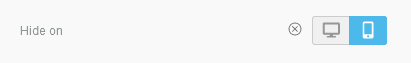
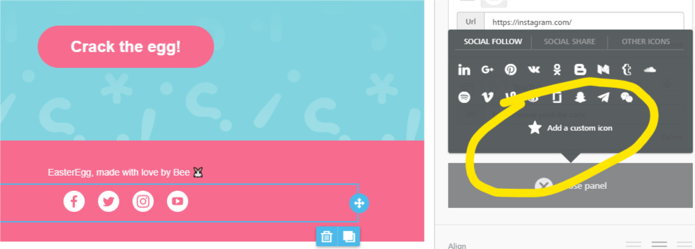
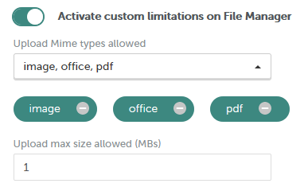

# Services options


Please note that server-side configurations are only available on [paid plans](https://dam.beefree.io/pluginpricing).


## Free stock image gallery <a href="#free-stock-image-gallery" id="free-stock-image-gallery"></a>

A new feature becomes available in the File Manager when this is active.

It leverages an integration with popular stock photo services to offer users of the builder the ability to search through a large repository of high-quality images.

The images are free to use under the **Creative Commons Zero (CC0)** license.

## Dark Mode Preview <a href="#dark-mode-preview" id="dark-mode-preview"></a>

When this is active, adds a toggle to the toolbar that allows a user to simulate the current design in dark mode.

## Row background image <a href="#row-background-image" id="row-background-image"></a>

When this is active, advanced users of the builder can set an image as background when editing a row.

## Background image (entire document) <a href="#background-image-entire-document" id="background-image-entire-document"></a>

When toggled on, this option scales the background image to fit the background dimensions of the entire document. This feature is best used with high-resolution images. More information [here](https://devportal.beefree.io/hc/en-us/articles/4791598301458).

## Row background video <a href="#row-background-video" id="row-background-video"></a>

For [Page](../../visual-builders/page-builder/) and [PopUp Builder](../../visual-builders/popup-builder/).

When this is active, advanced users of the builder can set a video as the background when editing a row.

## Video picker <a href="#video-picker" id="video-picker"></a>

Requires “Row background video” to be enabled.

Enables the possibility for users to upload videos.

## Free stock videos gallery <a href="#free-stock-videos-gallery" id="free-stock-videos-gallery"></a>

Requires “Row background video” to be enabled.

Enables a user to search for free stock videos to use in the File Manager.

## Dynamic images <a href="#dynamic-images" id="dynamic-images"></a>

When this setting is enabled, users of the builder can specify both a static placeholder image and a dynamic image URL when adding an image content block. This allows for scenarios such as personalized birthday cards, countdown timers, dynamic ads, and many other user cases in which an image is built dynamically at the time it is served. [More about using dynamic images](https://dam.beefree.io/dynamicimagescontent).

## Do not stack on mobile <a href="#do-not-stack-on-mobile" id="do-not-stack-on-mobile"></a>

When enabled, adds a new row option to keep the horizontal layout on mobile devices. Useful when working with nav bars, icons, and other horizontal design elements.

## Display conditions <a href="#display-conditions" id="display-conditions"></a>

When enabled, the display conditions widget will show as a row option. The widget can be used to apply the conditions created by the host applications or to add new syntax manually. [More about display conditions](services-options.md#display-conditions).

## Hide content on mobile or desktop <a href="#hide-content-on-mobile-or-desktop" id="hide-content-on-mobile-or-desktop"></a>

When enabled, it adds a new property in the “Content properties” section of any content block that supports it. This widget allows users to hide a content block either on mobile or on desktop devices.

<figure><figcaption></figcaption></figure>

More on [hiding content on mobile or desktop devices.](https://dam.beefree.io/hideonmobile)

## Custom Social Icons

When you enable Custom Social Icons in the Social module, users will be able to upload their own social media icons as a new “Add a custom icon” feature will now be available in the Social content block’s property panel.

<figure><figcaption></figcaption></figure>

## Undo and changes history <a href="#undo-and-changes-history" id="undo-and-changes-history"></a>

When enabled, it will give users the ability to _Undo_ or _Redo_ any changes that have been made to the email, including the ability to rewind and fast-forward to any point in their recent edit history.

## Save rows feature <a href="#save-rows-feature" id="save-rows-feature"></a>

This will allow users to select a row in the current message and save it for later use. More [about Saved Rows](../../rows/saved-rows/).

## Import from external source in file manager <a href="#import-from-external-source-in-file-manager" id="import-from-external-source-in-file-manager"></a>

When enabled, adds an option in the file manager to import images from different social networks and storage services. We use [Filestack](https://www.filestack.com/) for this feature. Filestack may log the user’s IP address. If this is in conflict with your privacy policy, turn the feature off.

## Enable image editor ('Apply effects & more') in image module <a href="#enable-image-editor-apply-effects-more-in-image-module" id="enable-image-editor-apply-effects-more-in-image-module"></a>

When enabled, an editor to apply image effects and transformations is available in the image module and row background images.

This feature allows users to leave comments and start discussion threads inside an email or page, to collaborate asynchronously. [More on Commenting](https://docs.beefree.io/commenting/).

## Reverse stacking on mobile <a href="#reverse-stacking-on-mobile" id="reverse-stacking-on-mobile"></a>

When enabled, adds a new row option to revert the stacking order of columns on mobile. Useful for layouts with alternating visual & text: applying it will ensure that, on mobile, images are consistently on top of their accompanying copy.

## Disable anonymous usage tracking <a href="#disable-anonymous-usage-tracking" id="disable-anonymous-usage-tracking"></a>

We use third-party tools to aggregate anonymous usage data. It helps us develop a better product by assessing locations, devices, browsers, etc.

This can be turned off if necessary.

## Disable the HTML sanitize service in the HTML content block <a href="#disable-the-html-sanitize-service-in-the-html-content-block" id="disable-the-html-sanitize-service-in-the-html-content-block"></a>

When you disable the HTML sanitization service, you’re removing all restrictions on what users of the builder can add inside the Custom HTML content block.

The sanitize service checks and ‘cleans up’ custom HTML, which can be an important measure to prevent the inadvertent introduction of unsafe content or the usage of HTML tags that may impact the message delivery rate. However, it can also have an undesired side effect when the host application needs custom HTML tags or attributes to manage specific scenarios.

Please use caution when disabling this service.

Specifically, when HTML sanitization is disabled, **we strongly recommend** that you add an **alternative code review** process. To that extent, the _onChange_ event can help the host application intercept the content as soon as it is inserted, and perform a check on it before the user exits the builder. Alternatively, you can use the _onSave_ event to trigger an HTML review on your end at the time the HTML is saved in your system.

The client-side configuration exposes a parameter to override the global setting in the control panel. You cannot disable the HTML sanitization service in the client-side configuration, due to security reasons, but you can enable it per user via the _forceSanitizeHTML_ parameter.

```

forceSanitizeHTML: true

```

## **Which tags are allowed by the sanitize service?**

The sanitization service allows the following tags and attributes:

## **Allowed tags list:**

a, abbr, acronym, address, b, bdo, big, blockquote, button, caption, center, cite, code, colgroup, dd, del, dfn, dir, div, dl, dt, em, fieldset, font, form, h1, h2, h3, h4, h5, h6, i, ins, kbd, label, legend, li, map, menu, ol, optgroup, option, p, pre, q, s, samp, select, small, span, strike, strong, sub, sup, table, tbody, td, textarea, tfoot, th, thead, u, tr, tt, u, ul, var, video, source, style, img, br, hr, area, base, basefont, input, link, meta, col, iframe

## **Allowed attributes list:**

| Element            | Attributes                                                           |
| ------------------ | -------------------------------------------------------------------- |
| general attributes | style, id, class, data-\*, title                                     |
| a                  | href, name, target                                                   |
| img                | align, alt, border height, hspace, src, vspace, width, usemap        |
| table              | align, bgcolor, border, cellpadding, cellspacing, width              |
| tbody              | align, valign                                                        |
| td                 | align, bgcolor, colspan, height, rowspan, valign, width              |
| tr                 | align, bgcolor, valign                                               |
| tfoot              | align, valign                                                        |
| th                 | align, bicolor, colspan, height, rowspan, valign, width              |
| thead              | align, valign                                                        |
| li                 | type                                                                 |
| map                | name                                                                 |
| area               | alt, coords, href, shape, target                                     |
| div                | itemscope, itemtype                                                  |
| meta               | itemprop, content                                                    |
| video              | autoplay, controls, height, loop, muted, poster, preload, src, width |
| source             | media, src, type                                                     |

## Activate custom limitations on File Manager <a href="#activate-custom-limitations-on-file-manager" id="activate-custom-limitations-on-file-manager"></a>

In this section, you can activate **restrictions for the file manager**:

* Specify which **file formats** your users can upload in File Manager.
* Set a **maximum allowed size**, different from the default of **20MB**.

<figure><figcaption></figcaption></figure>

Please note that the first option will not ask for file extensions, but will instead present file categories such as **image**, **video**, **text**, etc. We have mapped these categories to the most used MIME types that can be referenced in HTML documents.

Learn more about [Mime Types and Groups](../../file-manager/file-manager-application-overview/file-extensions-and-groups.md) for custom limitations on File manager.
