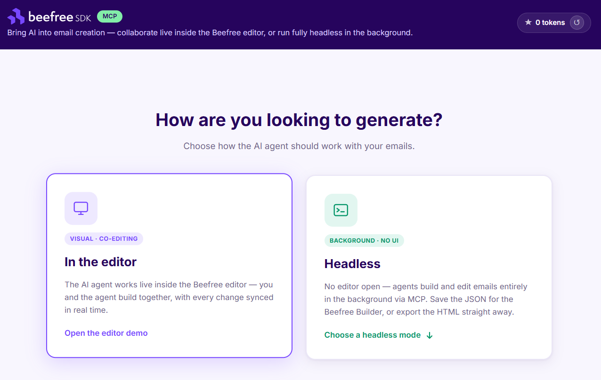

# Getting started with the MCP Server


**Open Beta rollout plan**

Beefree SDK's MCP Server is rolling out to all customers with Essentials, Core, Superpowers and Enterprise plans, with neither waitlist nor approval needed. Follow the [Installation & Setup](../mcp-server/mcp-server-installation-and-setup.md) guide to get started.



**Beefree SDK's MCP Server is entering General Availability on September 1, 2026**

To make sure your integration stays up and running after the MCP Server graduates from Open Beta on Sept 1 2026, please:

* Ensure you’re using the **latest version of our MCP Server**. If you still use the legacy version, identifiable by the v1 endpoint, please follow the [migration guide](https://docs.beefree.io/beefree-sdk/mcp-server/mcp-server-installation-and-setup#migrating-from-v1). The legacy version will be deprecated on September 1, 2026.
* Switch to **CSAPI keys** before September 1. The custom beta API keys which you obtained from the Beefree team will be retired on September 1.

Starting September 1, MCP Server calls will count toward your plan's CSAPI totals. There won’t be any additional access costs for using the MCP Server – just standard CSAPI usage amounts in your plan.


### Introduction

The Beefree SDK MCP Server allows you to connect your AI agents to the Beefree SDK. It makes key functionality of the Beefree SDK — the [Editor](https://app.gitbook.com/s/8c7XIQHfAtM23Dp3ozIC/visual-builders) and the [Check API](../apis/content-services-api/check.md) — accessible to AI agents, opening new ways to bring agentic design directly into your application.&#x20;

**Please remember that**:&#x20;

* The MCP Server requires either a live and correctly configured editor session or a server-side session created via the Headless API. See [Installation & Setup](../mcp-server/mcp-server-installation-and-setup.md) to choose the right path for your setup.
* Providing the agent is the responsibility of the host application. If you don't have your own agent yet, see the [sample projects](beefree-sdk-mcp-server-beta.md#sample-projects) below.


Looking for a way to reduce token consumption for your AI agent connected via Beefree SDK's MCP Server? Check out [Code Mode](../mcp-server/mcp-server-installation-and-setup.md#code-mode-research-preview)!


### What can you do with the Beefree SDK's MCP Server?

The Beefree SDK's MCP Server empowers your product team to seamlessly integrate AI-driven design into your Beefree SDK-powered application — letting your end users leverage AI to create, edit, and optimize email designs with less friction between idea and execution.

By replacing custom integrations with a universal standard, the Beefree MCP Server delivers:

1. **Drastic reduction in time-to-market:** deploy AI-powered features in hours instead of weeks.
2. **A Future-proof** **AI strategy**: MCP decouples your application from any specific AI model, so you can swap providers without rebuilding infrastructure.
3. **A seamless end-user experience**: deep integration lets users achieve professional results in seconds with no learning curve.

### Use cases

#### Interactive design in the editor

These use cases involve an AI agent editing a template while the user is working in the editor — changes appear in real time.

**Prompt to design**

Create complete, high-quality email designs from scratch with a single prompt.



**Instant rebranding**

Editing existing email designs by applying a different brand identity or color palette via AI.



**Content iteration**

Generate content variations while maintaining your core brand elements.



#### Automated & headless workflows

These use cases run entirely server-side — no editor session required. The agent operates on templates through the Headless API, making them suitable for large-scale automation and backend pipeline integration.

**Bulk generation**

Programmatically generate large volumes of unique email variants without manual intervention. Ideal for large-scale campaigns where each variant requires tailored content or layout.

**Iterative variation**

Automatically produce a series of design or layout variations from a single template. Useful for rapid A/B testing or content experimentation driven entirely by backend scripts or AI agents.

**External workflow integration**

Trigger template modifications directly from third-party automation platforms such as n8n, Zapier, Make, Retool, or Tines. Because there is no frontend dependency, Beefree SDK actions slot into any workflow that can make an HTTP request.

…and many more! Feel free to reach out to our team [talk about your use case](mailto:beta-feedback@beefree.io)!

### Sample project

A sample implementation using a [PydanticAI](https://ai.pydantic.dev/) agent connected to the Beefree SDK's MCP Server. Supports Gemini, OpenAI, and Anthropic as LLM providers.

Clone and run from the [Beefree SDK MCP demo repository](https://github.com/BeefreeSDK/beefree-sdk-mcp-v2-example-demo). The project supports Gemini, OpenAI, and Anthropic as LLM providers.

The sample project allows testing both **in-editor** and **headless use cases**. You can choose the mode of use in the opening screen.&#x20;


Using an email building agent generates LLM API costs. The sample project includes a token counter to help you track usage.


<figure><figcaption></figcaption></figure>

#### In the editor

This mode allows you to test a in-editor use case with a sample content-building agent connected to the Beefree SDK MCP Server. Once you create the session, you can use the **chat panel** to interact with the agent and experiment with prompt-to-design generations.&#x20;

<figure><figcaption></figcaption></figure>


The "in the editor" mode requires you to insert a Beefree SDK application's `bee_client_id` and `bee_client_secret` in the configuration file.&#x20;


You can also pick between "Editor-managed" and "API-Managed + Coediting" approach to test both integration modes, as explained in the sample project `/integration` page. Learn more about the [editor-managed](https://docs.beefree.io/beefree-sdk/mcp-server/mcp-server-installation-and-setup#editor-managed-session) and [API-managed](https://docs.beefree.io/beefree-sdk/mcp-server/mcp-server-installation-and-setup#api-managed-session) session approaches.&#x20;

#### Headless

This mode features a **headless MCP Server demo** with five readymade automation use cases. Plus, you can also test **Code Mode** (currently available in open beta), an alternative way of connecting the MCP Server to your AI Agent that allows token saving up to 96%. [Discover Code Mode](https://docs.beefree.io/beefree-sdk/mcp-server/mcp-server-installation-and-setup#code-mode-research-preview).

<figure><figcaption></figcaption></figure>

Ready to launch the sample application? Clone and run it from the [Beefree SDK MCP demo repository](https://github.com/BeefreeSDK/beefree-sdk-mcp-v2-example-demo).

### Beefree SDK's MCP Server & AI agent responsibilities

In the MCP architecture, responsibilities are split so that AI models can access data and tools without custom code for every integration.

The **Beefree SDK's MCP Server** acts as the "Hands" and "Manual": it exposes tools that allow creating and editing emails in the Beefree SDK. The AI Agent acts as the "Brain": it knows what the user wants and which tools to call to achieve that goal.

|                 | MCP Server                                                                          | AI Agent                                                                                      |
| --------------- | ----------------------------------------------------------------------------------- | --------------------------------------------------------------------------------------------- |
| Primary Role    | The connector that exposes tools and prompts                                        | The host application that manages the user session and the LLM                                |
| Initiation      | Waits for requests. Responds with a list of available tools, resources, and prompts | Starts the connection. Discovers capabilities via a handshake                                 |
| Logic Execution | Executes the work. Performs the actual API call, database query, or file read/write | Orchestrates the workflow. Decides when to call a tool based on the model's intent            |
| Capabilities    | Provides Tools (actions) and Resources (data)                                       | Provides Sampling (allows server to use the host's LLM) and Roots (defines folder boundaries) |
| Security        | Defines scope. Implements the actual access logic and data filtering                | Enforces permissions. Asks the user for consent before a tool runs or a file is accessed      |
| Model Awareness | Model-agnostic. Doesn't care which LLM is calling it; just follows the protocol     | Knows which LLM is being used and formats data for its context window                         |
