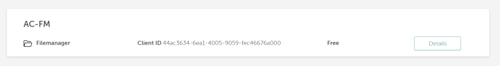
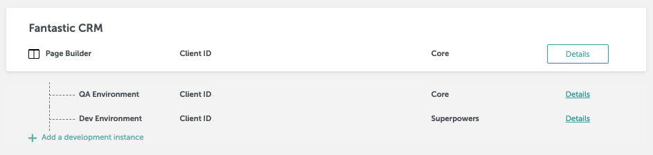

# File manager application overview

## Managing assets with File Manager <a href="#managing-assets-with-file-manager" id="managing-assets-with-file-manager"></a>

The File Manager can be launched as a standalone application. This means that users can access the File Manager directly, without having to first launch the builder application. This is useful for situations where a user needs to quickly upload or manage assets, but doesn’t need to create a full email, landing page, or popup.

<figure><figcaption></figcaption></figure>

Instead of having to switch between different applications or tools, they can access everything they need from one centralized location. This can make the asset management process more streamlined and efficient, which can ultimately help users be more productive.

## Testing and integrating the File Manager <a href="#testing-and-integrating-the-file-manager" id="testing-and-integrating-the-file-manager"></a>

When you create an application in the [Beefree SDK Console](https://dam.beefree.io/devmain), you’ll have the option to create a File Manager application.

<figure><figcaption></figcaption></figure>

Paid applications also include the option to create child development applications. These child applications can be used for new feature testing, development, and maintenance. By creating a child application, developers can easily test and iterate on new features without affecting the main application. This can help to minimize downtime and reduce the risk of introducing bugs or errors into the production environment.

<figure><figcaption></figcaption></figure>

The child applications can also be used for ongoing maintenance and updates. Instead of making changes directly to the production environment, developers can make updates and improvements in the child application, test them thoroughly, and then deploy the changes to the main application once they have been fully vetted. This can help to ensure that the main application remains stable and functional, even as new features and updates are introduced.

File manager applications share the same core functionalities as all other builders. These functionalities include authentication and configuration, which are necessary for the development process. If you have already integrated another builder into your workflow, you can easily re-use most of your work by using the same configuration for the file manager application.

For those who are new to our platform, our documentation includes a comprehensive [Getting Started](../../getting-started/readme/installation/) section that provides detailed instructions on how to set up and use our builders. This section is applicable to all products.

File Manager and all builders are available to  customers under the same [all-in-one pricing.](https://dam.beefree.io/pluginpricing) Please contact your Customer Success Manager for more details.

## Configure "Insert" and "X" Buttons

This section outlines steps to add the “Insert” and “X” buttons to your application’s user interface. These steps are specifically for the file manager.

Take the following steps to define the \`onFilePickerInsert\` and \`onFilePickerCancel\` properties to enable an “Insert” button and “X” button in the file manager user interface:

1. Ensure that you have initialized the Beefree SDK and have a reference to the SDK instance (\`bee\`).
2. Define the `` `onFilePickerInsert` `` property with a callback function that will be invoked when the user wants to insert a file. This function will receive the selected file data as the only parameter. You can use this data to perform any necessary actions, such as inserting the file into the editor or displaying a preview.&#x20;

Here is an example of how the callback function can be defined:

```javascript

onFilePickerInsert: function (data) {
  // Handle the selected file data
  console.log("File Inserted:", data);
  // Perform any necessary actions with the file data
},

```


**IMPORTANT:** This callback provides the host application with the file’s metadata and URL. If this callback is not implemented, the “Insert” button will not be displayed.


3. Define the \``` onFilePickerCancel` `` property with a callback function that will be invoked when the user wants to cancel the file picker. This function does not receive any parameters. You can use this callback to perform any cleanup actions or provide feedback to the user.&#x20;

Here’s an example of how the callback function can be defined:

```javascript
 JAVASCRIPTCopy
onFilePickerCancel: function () {
  // Handle file picker cancellation
  console.log("File Picker Canceled");
  // Perform any necessary actions when the file picker is canceled
},

```


IMPORTANT: This callback provides the host application with the control to close the workflow. If the callback is not implemented, the “X” button will not be displayed.


4. Assign the defined `` `onFilePickerInsert` `` and `` `onFilePickerCancel` `` callbacks to the corresponding properties in the Beefree SDK configuration. Make sure to include these properties when initializing the Beefree SDK.&#x20;

Here is an example:

```javascript

var beeConfig = {
  // Other configuration options...
  onFilePickerInsert: function (data) {
    // Handle the selected file data
  },
  onFilePickerCancel: function () {
    // Handle file picker cancellation
  },
};

// Initialize the Beefree SDK with the configuration
bee.start(beeConfig);

```

By following these steps, you will be able to define the `` `onFilePickerInsert` `` and `` `onFilePickerCancel` `` properties in the Beefree SDK configuration and enable the “Insert” and “X” buttons in the file manager user interface. You can customize the callback functions to suit your specific needs and perform any desired actions with the selected file data or when the file picker is canceled.

## Storage Options

When configuring a builder application with Beefree SDK, you have four image and file storage options:

1. **Beefree SDK Storage:** Default option. Images are hosted in Beefree SDK’s AWS S3 bucket. Potential fees apply for usage beyond the included limits.
2. **Existing Storage Application:** Connect your builder to an existing storage application to share storage resources.
3. **Own AWS S3 Bucket:** Use your own AWS S3 bucket instead of Beefree SDK’s. Follow the documentation to configure this option.
4. **Own File System:** Integrate your application’s existing file system for storage. This option is available on Beefree SDK paid plans.

Reference the [Storage Options documentation](../../dev-console-settings/server-side-options/storage-options/) to learn more about how to configure storage for your File manager application.
