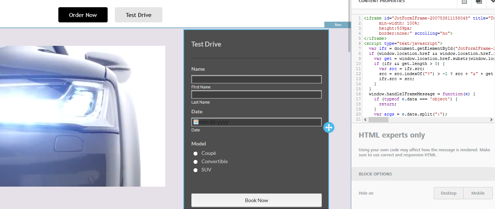
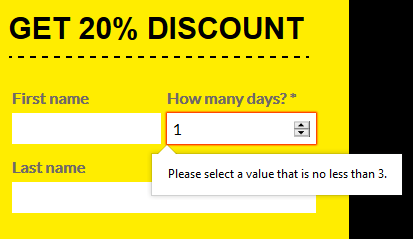

# Integrating and using the Form block


The Form block is available for the [Page Builder](../../visual-builders/page-builder/) and the [Popup Builder](../../visual-builders/popup-builder/)


## How it Works

You can enable your users to add forms in Beefree SDK with two methods:

* by passing in the [configuration parameters](../../getting-started/readme/installation/configuration-parameters/) a single, **default JSON form**, potentially including all the fields your application supports, and then have **customers build and style forms** with our **form content block**.
* by implementing a [content dialog](../../other-customizations/advanced-options/content-dialog.md) on top of the form content block and building a user interface on top of the builder, so that your users can either **browse and select pre-built forms** or **build a new form.**


**Note:** For the "Form" tile to appear in the "Content" of the builder, you must successfully implement one of the two methods mentioned above.


## Pass a Single Form

Your application passes a single JSON form, potentially including all the fields that may be required in a form. You are in control of which fields are visibile when the form is dragged. From there, users have a vast control on how to customize the form, by:

* adding or removing fields
* rearranging their order
* renaming their labels
* editing their type

<figure><figcaption></figcaption></figure>

This is the **quickest way** to get started using forms. You may also decide to include such forms inside templates provided by your application.

[Learn more about this method](passing-forms-to-the-builder.md)

## Pass Multiple Forms


The Content Dialog feature is available on Beefree SDK [paid plans](https://dam.beefree.io/pluginpricing) only.


If you want to pass more than one form to the builder, you can do so by implementing a [Content dialog](../../other-customizations/advanced-options/content-dialog.md) on top of the form content block.

With a content dialog, you have full control over the experience of adding a form. A few examples:

* users can select a form from a predefined list
* users can browse a list of forms and pick one
* users can pick a form and have configuration options (e.g. define a layout) before adding it

Here is an example of form selection built with a Content Dialog.

<figure><figcaption></figcaption></figure>

Once the content dialog returns a form to the application, users can then change the form content properties in the builder, by adding and removing fields, rearranging their order. and customizing their labels and style

[Learn more about this method](passing-forms-to-the-builder.md)

## Load Your Form Builder

You may even want to go a step further and use the Content dialog to load your UI for form creation, on top of the builder; your users will be able to create a new form and add it to the web content they’re building, without interrupting their workflow.

<figure><figcaption></figcaption></figure>

## Embed a Third-Party Form


The HTML Block is available on Beefree SDK [paid plans](https://dam.beefree.io/pluginpricing) only.


As an alternative to the above-mentioned methods, your users can add an **HTML block** and easily **embed forms** created with [any form builder](https://www.g2.com/categories/online-form-builder) available on the market (e.g. Typeform, JotForm, etc.).

<figure><figcaption></figcaption></figure>

Form builders typically offer different options to get an embed code:

* if the embed code is a script, it will not appear in the stage when building the web content. Due to security reasons, we need to remove such scripts during edit mode. The form will appear regularly both in the preview and in the final HTML output. An example of this behavior is the embed code produced by Typeform;
* If the embed code lives in an iframe, it will be visible during editing as well. For example, Jotform and Google Forms offer this kind of embedding option.

### Customizing forms 

Once a form is added to the web content, the user has these options to manage fields:

* Add and remove fields (unless they are marked as required)
* Rearrange their order
* Rename their labels

Besides, end users can [edit fields](form-structure-and-parameters.md), when the “edit” action is available.

<figure><figcaption></figcaption></figure>

Finally, users can apply various styling options to the form:

* change font type, size, and style;
* change colors for text and input backgrounds
* change size for field inputs
* define borders and paddings
* position field labels on the top or on the side of the input fields
* style buttons
* and more . . .

## Editing Form Fields

When managing fields in a form block, users can click on the “Edit” action to change field types and properties. To facilitate the user, the icon next to the label highlights the current field type.

<figure><figcaption></figcaption></figure>

A modal window will pop up:

<figure><figcaption></figcaption></figure>

From this modal, users can:

* change field type
* change general field properties
  * label (_available also in the sidebar)_
  * placeholder (_not available for date, multiple/single choice, dropdown_)
  * required field
  * read-only field

Clicking on “Type” will open a dropdown with all the available field types:

<figure><figcaption></figcaption></figure>

All fields can be edited, unless:

* you defined the field in the JSON form as not editable, using the `canBeModified` attribute
* the field type is
  * Submit
  * Hidden
  * File upload
  * Label (_a special field type with plain text_)

Now, let’s have a closer look at the field types that can be configured with the “Edit field” modal.

**Email / Phone / Text / Url**

These are the easiest field types to configure, as they only have the optional Placeholder property.

The email and URL types will check at form submission, through HTML5 validation, that the value entered is a formally correct email/web address.

**Single choice / Multiple choice / Dropdown**

Users need to enter the values that will be displayed to visitors. To do this, they will add those values under **Options**:

<figure><figcaption></figcaption></figure>

They can either:

* Enter a single value, which will be both the label and the value passed to the host app in the form.
* Enter couplets such as label | value to differentiate the label shown to visitors from the value passed to your app after form submission. In the example above, users will select Milan from the dropdown at the city they want to visit, but your app will receive “A” as the response for that field.

The Multiple choice type can also be used to create checkboxes, e.g. privacy policy acceptance. In this case, no value should be specified, and any external URL should be added in the field label, like in this example:

<figure><figcaption></figcaption></figure>

**Date**

This type has no additional properties. The date format of the value returned to the host app will be coherent with browser locale information.

<figure><figcaption></figcaption></figure>

Visitors will enter the date using the browser’s date picker. Otherwise, they can input the date directly, following the automatically generated placeholder for the expected date format.

**Number**

This type has the option to enter a minimum and/or a maximum allowed value. If not entered, the field will accept any number.

Number fields have a “spinner” input that visitors can use to cycle through allowed values. Visitors can also input a number directly, but the HTML 5 validation will verify if the submitted number falls into the permitted interval.

<figure><figcaption></figcaption></figure>

**Long text**

This type is just like a text field, but it’s meant for longer inputs. It has an additional “row height” property to define the default height for the text area – which can be adjusted by the visitor by dragging the bottom right corner. Here is how a long text field looks like in a form:

<figure><figcaption></figcaption></figure>

### What happens after a form is submitted? 

Beefree SDK just passes the data back to the host application. It doesn’t save anything or touch any of the data.

You can implement client-side validation in your JSON forms using the built-in [HTML5 form validation](https://developer.mozilla.org/en-US/docs/Learn/Forms/Form_validation#using_built-in_form_validation), to validate things like:

* required field;
* response length, for strings (“must be less than” or “must be higher than” n characters);
* response value for numbers (minimum or maximum value allowed);
* correct type (i.e. the field must contain a number, email address, or some other specific preset type);
* check against a regular expression that defines a pattern the entered data needs to follow.

Any other post-submission validation and action must be defined and performed by your application, for instance:

* validating whether the data is acceptable, i.e. email already registered;
* saving it into a database;
* passing it to a 3rd application;
* performing other actions (e.g. sending an email notification).

### Developer resources 

[**Passing forms to the Builder**](passing-forms-to-the-builder.md)

Learn how to implement the different methods to pass forms to the Builder

[**Form structure and parameters**](form-structure-and-parameters.md)

A closer look at how to structure a JSON form

[**Sample forms and templates**](https://dam.beefree.io/githubbeeforms)

Visit our [GitHub account](https://dam.beefree.io/githubbeeforms) to:

* dive into some sample forms and quick start your integration;
* download templates that include those forms;
* get a validation JSON schema to test your forms with.
