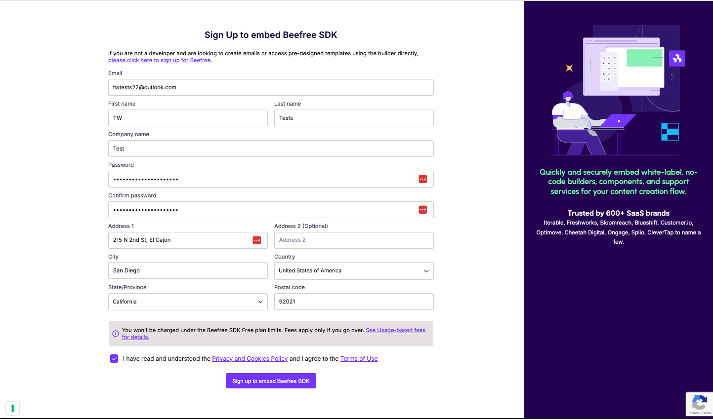
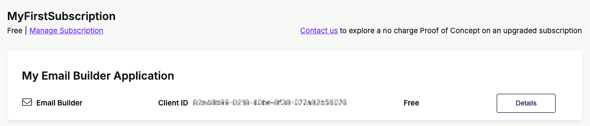
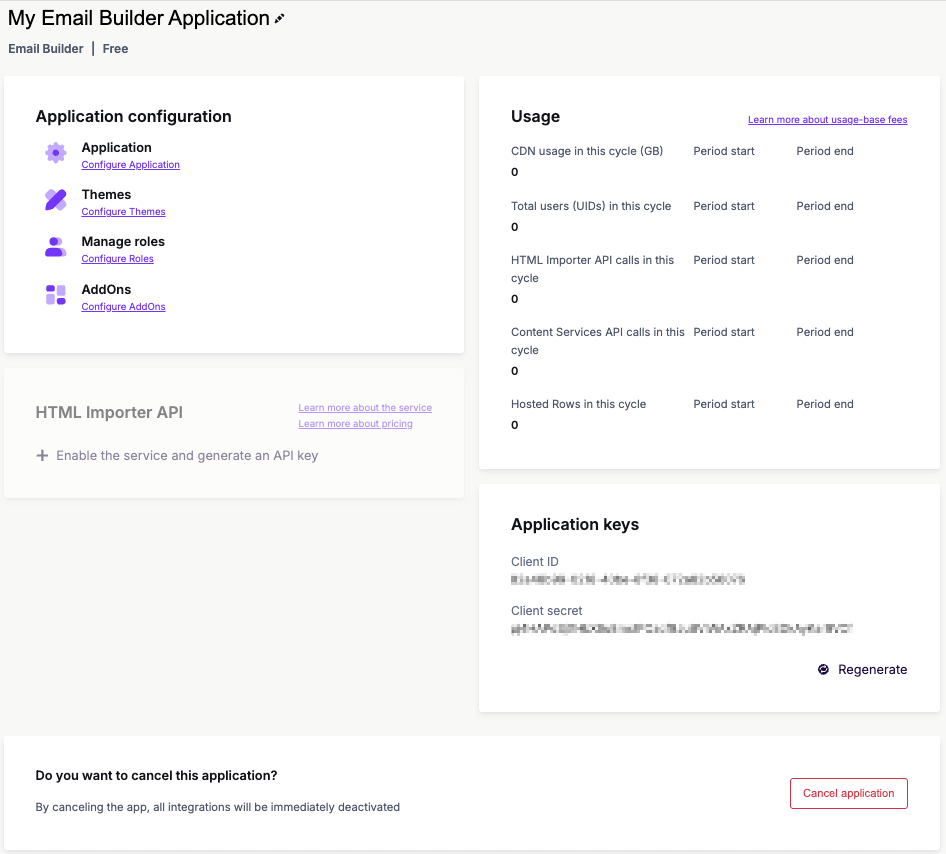

# Create an Application

## Overview

In this article, we will discuss how to sign up for an account in the [Beefree SDK Developer Console](https://developers.beefree.io/accounts/login/?from=website_menu), create an application, and obtain your Client ID and Client Secret.&#x20;

This article will cover steps for the following processes:

* [Sign up for an account in the Developer Console](create-an-application.md#sign-up-for-account-in-the-developer-console)
* [How to create an application](create-an-application.md#how-to-create-an-application)
* [Obtain your client secret and client id](create-an-application.md#obtain-your-client-id-and-client-secret)

## Sign up for a Developer Console account

The first step to experimenting with and embedding Beefree SDK's visual builders is to[ sign up for a Beefree SDK account](https://developers.beefree.io/accounts/signup/).&#x20;

Take the following steps to sign up for a Beefree SDK account:

1. Navigate to the [Beefree SDK sign up page](https://developers.beefree.io/accounts/signup/).
   1. Complete the required fields to create an account.&#x20;
   2. Once the form is complete, click **Sign up to embed Beefree SDK**.&#x20;

<figure><figcaption></figcaption></figure>

2. Check your inbox and verify your email address.
   1. Once it is successfully verified, you'll be redirected to the [Log in page](https://developers.beefree.io/accounts/login/). Enter your email and password to login.
3. You'll be redirected to a page with an active free subscription called **MyFirstSubscription**. Under this subscription, there are four applications you can activate: Email Builder, Page Builder, Popup Builder, and File manager. You can activate one or all of them if you'd like.
   1.  Click the **Activate** button corresponding to the application type you'd like to start experimenting with. Once it is activated, you'll notice Client ID appears.  &#x20;

       <figure><figcaption></figcaption></figure>
4. Click **Details** to obtain your Client Secret and add any **Application configurations** you'd like to start exploring.

<figure><figcaption></figcaption></figure>


**Important:** Keep in mind that Beefree SDK will not charge you for using the Free plan. However, there are charges related to UIDs, CDN overages, and using the [HTML Importer API](../../apis/html-importer-api/). Ensure you add a credit card on file if you plan on using the [HTML Importer API](../../apis/html-importer-api/import-html.md), or exceeding the thresholds for UIDs and CDN usage. Reference the [Usage-based fees article](https://devportal.beefree.io/hc/en-us/articles/4403095825042-Usage-based-fees) for more information on thresholds.


## How to create an application

Once that’s done, you will be able to [log into the Beefree SDK Console](https://developers.beefree.io/accounts/login/).  Your dashboard will look like the following image.

<figure><figcaption></figcaption></figure>

You will have the option to activate any or all of the following applications:

* [Email Builder Application](../../visual-builders/email-builder.md)
* [Page Builder Application](../../visual-builders/page-builder/)
* [Popup Builder Application](../../visual-builders/popup-builder/)
* [File manager Application](../../file-manager/file-manager-application-overview/)

Take the following steps to create an application:

1. Click the **Activate** button that corresponds with the application you'd like to create.
2. Type in a name for your new application.
3. Click **Create**.

Your application will look like the following in the dashboard once it is activated:

<figure><figcaption></figcaption></figure>

You have successfully created an application. Now, you can enter the application **Details** and obtain your Client ID and Client Secret.&#x20;

## Obtain your Client ID and Client Secret

Click on your application's **Details** button to view your **Client ID** and **Client Secret**. Use these to authenticate when you initialize it.

<figure><figcaption></figcaption></figure>

With your Client ID and Client Secret, you can use our [Sample Code](../sample-code.md) to experiment with a simple integration of Beefree SDK. You can also get started with [your own implementation of Beefree SDK](installation/). &#x20;

Reference the following related topics to learn more about customizing your applications, creating development instances, and referencing sample code.

### Regenerate Client Secrets


This feature applies to paid plan types.


Inside the Beefree Developer Console, you have the option to **regenerate** the Client Secret for your application. To regenerate your application's Client Secret, take the following steps:

1. Log in to the [Beefree SDK Console](https://developers.beefree.io/accounts/login/?next=/subscriptions/).
2. Navigate to the application you'd like to update the Client Secret for.
3. Click on the application's **Details** button.

<figure><figcaption></figcaption></figure>

4. Navigate to **Application keys** within the application's details.
5. Click **Regenerate** to generate a new Client Secret.

<figure><figcaption></figcaption></figure>

6. You will be prompted to a modal and asked to confirm your application's name.
7. Complete the **App Name** field and click **Regenerate** to complete the action.

Your new Client Secret is now available and ready to use. Your old Client Secret will expire 24 hours after creating the new one. Ensure you replace it in all the necessary environments prior to its expiration.

<figure><figcaption></figcaption></figure>


For 24 hours after regenerating a new Client Secret, you will temporarily have access to two Client Secrets—your old one and your new one. After 24 hours, you will only have access to the new Client Secret for your application.


* Create [development applications](development-applications.md)
* [Configuration parameters](installation/configuration-parameters/)
* [Server-side options](../../server-side-configurations/server-side-options/)
* [Sample code](../sample-code.md)
