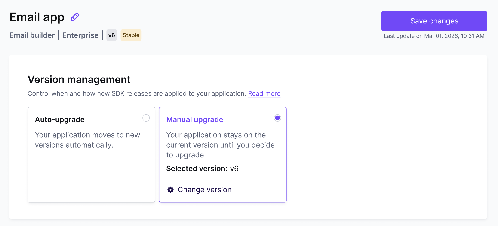
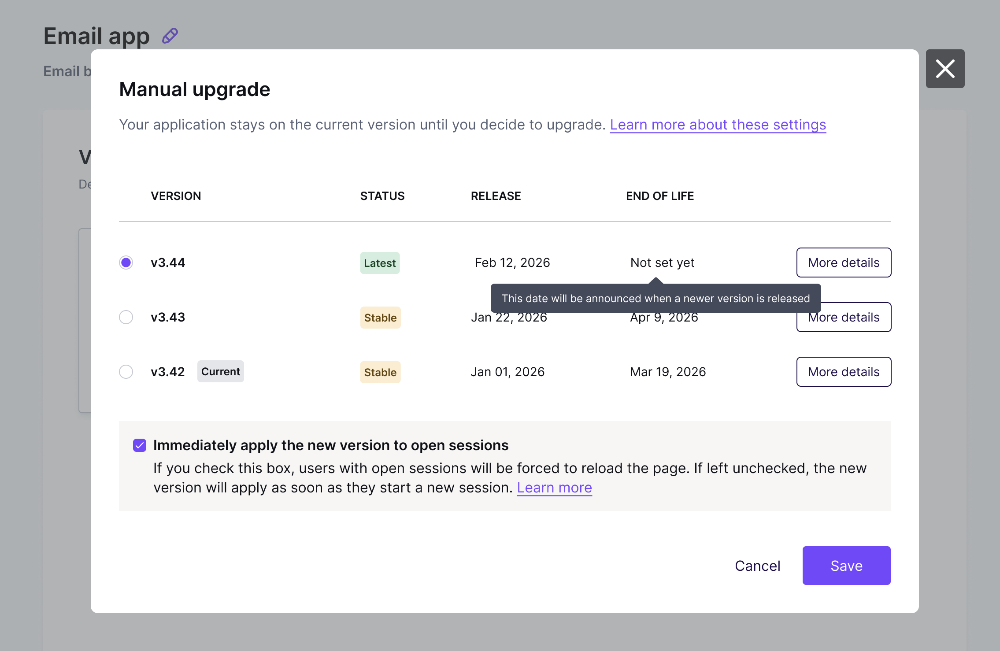
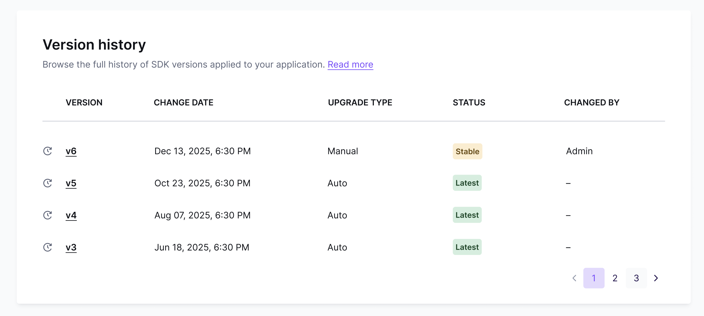

# Version Control


Version Control will be available for customers [Enterprise plans](https://developers.beefree.io/pricing-plans) starting June, 2026.&#x20;

If you’re on another plan type, the latest version of the Beefree SDK will automatically apply to your application(s) as soon as it becomes available.


### Overview

Enterprise Version Control gives you control over when Beefree SDK updates are applied to your applications. Rather than receiving releases automatically on Beefree's timeline, you can decide when each new SDK version takes effect — per application, on your own schedule. This includes both Development and Production applications.

Because you have control over the SDK release timing, you can, for example:&#x20;

* Decide if you’d like to take advantage of new SDK features as soon as possible — or if you prefer fewer releases
* Give your team more time for QA (and only upgrade your production application once QA in your development application is completed)
* Align SDK releases with your internal release calendar&#x20;
* Prevent SDK releases from reaching your production applications during high-traffic periods (e.g. during the holiday season)

### How version control works

#### The version lifecycle

Beefree releases new SDK versions approximately every three weeks. Each SDK version moves through distinct phases:

* **Latest** — When a new version is released, it is marked as the Latest release. It is the most current SDK version available.
* **Stable** — When the next new version is released, the previous version moves into Stable mode. A Stable version is supported for 8 weeks from that point, meaning every version remains available for a minimum of 11 weeks total.
* **End of Life** — After 8 weeks in Stable, a version reaches End of Life and is no longer available. If your application is still on a version that reaches End of Life, Beefree will automatically upgrade it to the newest Stable version. You will never be left on an unsupported version.

#### Choosing your update strategy

Each application is versioned independently. If you have multiple applications, you can point each one to a different version.&#x20;

You manage version settings for your application(s) via the SDK Developer Console. Visit your application’s details, then select “Version” to enter version management settings.&#x20;

From here, you can choose between two approaches for version management: Manual upgrade or Auto-upgrade:

<figure><figcaption></figcaption></figure>

#### Manual upgrade

When you select manual mode, we won’t automatically upgrade your applications. Instead, you will have to select which version you’d like to apply to your application:&#x20;

<figure><figcaption></figcaption></figure>

Here, you can see all available versions with their status (Latest or Stable), the date it was released, and when we expect it to reach End of Life. Click “More Details” if you’d like to see a detailed breakdown of what new features, improvements, and fixes are included in each version.&#x20;

Once you select a version, you can decide how you’d like to handle open user sessions as you upgrade:&#x20;

* **Apply immediately:** Your users with open sessions will be prompted to reload the page. The new version takes effect right away.
* **On next session:** The new version applies the next time a user starts a new session (or within \~12 hours of a session start, based on session expiry).&#x20;

For most cases, "on next session" is the lower-friction choice. Use "apply immediately" when a version change needs to take effect without delay.


**What happens when a version reaches End of Life?**\
If you’ve selected Manual Mode and your application is on a version that reaches End of Life, we will automatically upgrade your application to the newest Stable version. You will never be left on an unsupported version.


#### Auto-upgrade

Automatic-upgrade mode keeps your applications updated without manual intervention. You choose the update rule that best fits your preference:

<figure><figcaption>
Auto-upgrade in the Version Control settings of the Beefree SDK Console
</figcaption></figure>

<table data-header-hidden><thead><tr><th width="352">Option</th><th>Behavior</th></tr></thead><tbody><tr><td><strong>Option</strong></td><td><strong>Behavior</strong></td></tr><tr><td>Always up-to-date</td><td>Your application updates to the newest SDK version as soon as it is released. Choose this if you’d like to take advantage of new SDK features and updates without delay. </td></tr><tr><td>Stable releases only</td><td>Your application updates as soon as a new version moves into Stable mode. </td></tr><tr><td>Longest stability</td><td>Your application remains on the current version until it reaches End of Life, at which point it upgrades automatically to the newest Stable version. Choose this option if you prefer stability with fewer releases (and if you’re okay with skipping versions along the way) </td></tr></tbody></table>

#### Default behavior

By default, your applications are set to upgrade in Automatic Mode, and the following rules apply:&#x20;

| **Application type**                        | **Default upgrade mode**                                                                                   |
| ------------------------------------------- | ---------------------------------------------------------------------------------------------------------- |
| Enterprise Development / Child apps         | As soon as possible: Development applications update to a new version as soon as it is released.           |
| Enterprise Production / Parent applications | As soon as it's Stable: Production apps update as soon as a new version enters Stable mode.                |
| Non-Enterprise applications                 | Latest (always). Non Enterprise customers don’t have the option to adjust the version or release schedule. |

### Version history

In the version management settings, you can also check an application’s version history. This overview shows you: 

* When a version was applied to your app
* What status was the version in when it was applied to your application
* The upgrade type. This shows if the upgrade happened automatically, or through manual mode. If it was a manual update, you’ll also see which user made the change.&#x20;

<figure><figcaption></figcaption></figure>

### What's covered by versioning

Enterprise Version Control covers the Beefree services that receive the most frequent updates:

| Service                             | Description                                                                                                                       |
| ----------------------------------- | --------------------------------------------------------------------------------------------------------------------------------- |
| Beefree SDK frontend                | The user-facing drag-and-drop Builder and File Manager interface. It’s the part of the Beefree SDK that is loaded in the browser. |
| HTML generation service             | The microservice responsible for turning users' designs into reliable and performing HTML.                                        |
| Authentication and token validation | Manages SDK configurations via /authinfo URL and handles the refresh and validation of tokens.                                    |

We may expand the list of covered services in future releases.

***

## Migration from the legacy Release Candidate model

Previously, Beefree SDK Enterprise Customers received access to a Release Candidate (RC) environment two weeks before a new version went live in Enterprise production environments. While this provided a preview window to test out the latest Beefree SDK version, it didn't give you real control: updates still happened on Beefree's schedule, and we heard from some of you that two weeks wasn't always enough for thorough QA or release coordination.

When we start rolling out Enterprise Version Control, it will replace this old model entirely. The RC environment will be fully retired in H2 2026. In its place, you get a versioned SDK with a [defined lifecycle](version-control.md#the-version-lifecycle) — and the flexibility to choose exactly when each version is applied to each of your applications.

#### When does this change happen, and what do I need to know?

We will begin migrating Enterprise customers to the new Enterprise Version Control infrastructure on June 3, 2026.

On this date, the [default settings for Automatic Mode](version-control.md#default-behavior) will apply to your applications. Let’s recap what that means:&#x20;

* **Development applications:** Your development applications will update to the newest SDK version (“Latest”) as soon as it is released. That means you always have the latest version of the SDK available for testing in your development apps.&#x20;
* **Production applications:** Production apps update as soon as a new version enters Stable mode—that’s typically three weeks after the version was first released.&#x20;


These default settings largely replicate what you’ve experienced with our legacy Release Candidate (RC) approach: You get to test out the newest release in your development application before it gets pushed to your production application with a delay.&#x20;

Please note: In our legacy release flow, there was typically a 2-week window between RC release and the delayed Enterprise production release. The new default settings under Enterprise Version control expand that period to three weeks.&#x20;


If you’re happy with these default settings, there’s nothing for you to do.&#x20;

If you prefer a different behavior for automatic upgrades, or if you’d like to handle any version changes manually, visit the Version Control section in your applications’ settings to adjust the upgrade behavior to your preference.&#x20;

#### Questions? We’re here to help.&#x20;

If you have any questions about Enterprise Version Control or the migration process from our legacy Release Candidate approach, please reach out to your CSM or email us at [sdksupport@beefree.io](mailto:sdksupport@beefree.io). 
