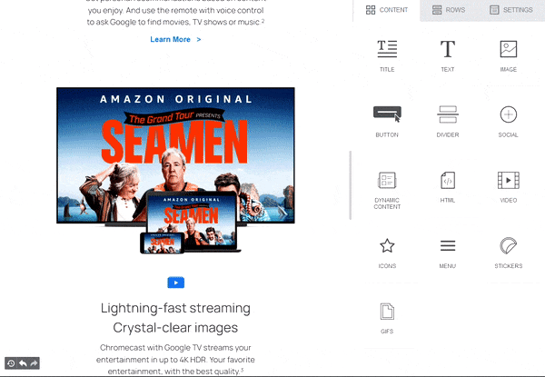
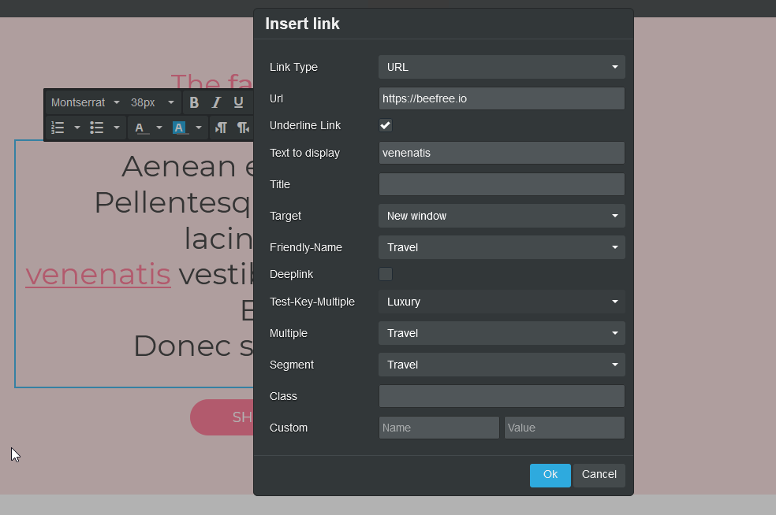
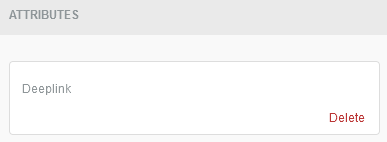
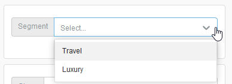
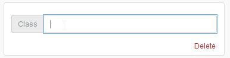

# Custom Attributes


This feature is available on Beefree SDK [Core plan](https://dam.beefree.io/pluginpricing) and above. Upgrade a [development application](../../getting-started/readme/development-applications.md) at no extra charge to explore features from higher plan tiers. **Note:** Usage on a development application still counts toward [usage-based fees](https://devportal.beefree.io/hc/en-us/articles/4403095825042-Usage-based-fees) and limits.


## Overview <a href="#overview" id="overview"></a>

With **Custom Attributes**, your end users can easily append **additional information to HTML tags** in emails and web pages, at the same moment they are creating their content in Beefree SDK. These attributes can be **applied to links**, both in text blocks and buttons, **and images**, and they serve a variety of scenarios: personalization, segmentation, styling, accessibility, etc.

## Use cases <a href="#use-cases" id="use-cases"></a>

Custom attributes enable a wide array of use cases, depending on your application’s capabilities and your users’ needs. Here are a few examples:

* flagging specific links so that user activity for those won’t be tracked (e.g. `clicktracking="off”` in SendGrid);
* handling internal statistical segmentation or reporting (e.g. `data-reportingname="October_promo" data-reportingtags="promo,iphone"`);
* adding conditions to a single content element (using an attribute such as `condition="customer_exists"`);
* embedding a single image by adding an attribute like `embedded="true"`, processed when the message is sent;
* adding custom CSS classes for custom CSS;
* adding WAI-ARIA attributes for accessibility requirements.

## How it works <a href="#how-it-works" id="how-it-works"></a>

The host application can provide the editor with a list of attributes that will be available to the user through the UI. How the attribute value is formatted impacts how the builder UI displays it and how the user interacts with it.

Custom attributes can be applied to:

* Links in text blocks
* Links in buttons
* Images (including thumbnails generated by the Video block)

For images and buttons, these attributes will be visible in the **editor sidebar**, under the new “ATTRIBUTES” section.

\
For links in text blocks, they will be part of the dialog window for creating a link.

<figure><figcaption></figcaption></figure>

\
You can provide the editor with a list of attributes that will be available to the user through the UI. How the attribute value is formatted impacts how the builder UI displays it and how the user interacts with it.

<figure><figcaption></figcaption></figure>

Depending on how custom attributes are implemented, users may:

* add a custom attribute from a list of attributes already defined, and specify the value of the attribute, if appliable:
  * from a predefined list
  * in a text input
  * defining a boolean property (yes/no, true/false, etc.)
* add a “custom” custom attribute by manually specifying both name and value
* open an additional interface, through a content dialog, where users have complete freedom on how to build custom attributes.

Regardless of how a custom attribute is added, it will be included in the `a` or `img` tag when HTML is generated for an email/page, like the segment attribute in this hyperlink:

```javascript

<a href=”https://beefree.io/” segment=”emaildesign”>Visit BEE!</a>

```

## How to activate it <a href="#how-to-activate-it" id="how-to-activate-it"></a>

Custom attributes are a client-side configuration that needs to be passed when initializing the editor. There are different shades of implementation complexity, based on the outcome you want to obtain. These approaches can be combined as preferred.

### Basic

The easiest implementation is to just pass a simple configuration at startup:

```javascript

customAttributes: {
  enableOpenFields: true
}

```

With this setup, users can indicate a “Custom” custom attribute by manually specifying Name and Value. Please note that users must know exactly what they are doing, as there will be no guidance in the editor.

### Standard

You can pass the necessary custom attributes in the initial configuration. Those attributes will be available in the interface, and the user will be able to specify the value for these attributes, if possible.

```javascript

customAttributes:{
  attributes: [
    { 
      key: "Deeplink",
      value: true,
      target: "link"
    },
    { 
      key: "data-segment",
      value: ['travel', 'luxury'],
      target: "link"
    },
    { 
      key: "class",
      target: "tag"
    }
  ]
}

```

Let’s look through the attributes defined in the example above, and how they will look like in the builder.

The `Deeplink` attribute has a single, predefined value, so when added in the builder it will look like this:

<figure><figcaption></figcaption></figure>

The `Segment` attribute has two possible values, which can be selected by the user:

<figure><figcaption></figcaption></figure>

The `Class` attribute has no defined value, so the user can enter anything in a text input:

<figure><figcaption></figcaption></figure>

### Advanced

You can totally customize the UX of adding attributes by invoking a [Content Dialog](content-dialog.md) that will take over the editor’s UI. The dialog will need to return the attribute that needs to be applied.
