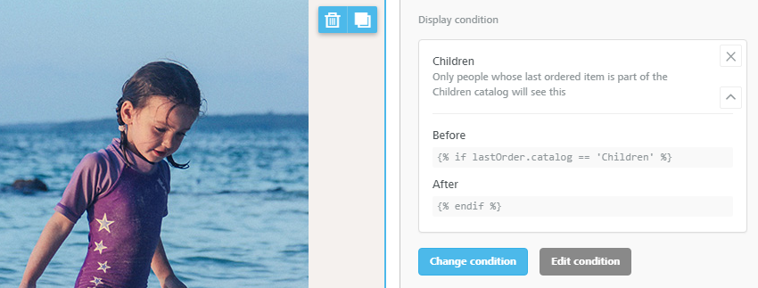
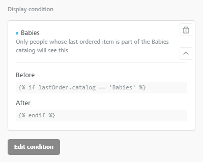
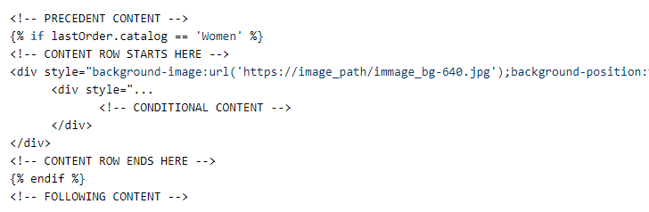
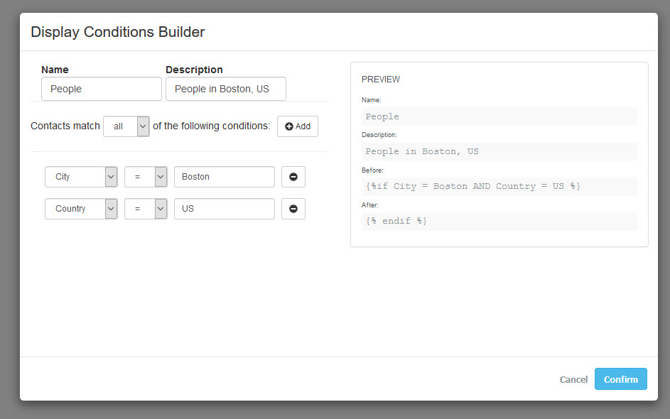

# Display Conditions


Display Conditions are available on Beefree SDK [Core plan](https://developers.beefree.io/pricing-plans) and above. Upgrade a [development application](../../getting-started/readme/development-applications.md) at no extra charge to explore features from higher plan tiers. **Note:** Usage on a development application still counts toward [usage-based fees](https://devportal.beefree.io/hc/en-us/articles/4403095825042-Usage-based-fees) and limits.


## How they work <a href="#how-they-work" id="how-they-work"></a>

Display Conditions allow you to change the content that is shown to a recipient of an email depending on who the recipient is.

<figure><figcaption></figcaption></figure>

Your users will have the ability to pick a condition (or write one from scratch if they are technically savvy), apply it to a row, and thus show different content based on who the recipient (or viewer) is.

The feature provides a number of benefits, including:

### **Ease of use for email designers**

Display Conditions allow anyone that is using the builder to easily create personalized messages without writing a line of code.

### **Any syntax for the conditional statements**

Use whatever syntax your application understands. The feature is language agnostic: it can be used with whatever syntax matches your tech stack. Does your sending engine understand the Liquid markup? Then you can use Liquid. Does it use a proprietary templating language? No problem.

### **User permissions**

Restrict access to some of the functionality based on user roles. For example, some users may be able to edit the syntax of the conditional statements, while others may not. Use this flexibility to simplify the UI or promote upselling.

## Activating and using the feature <a href="#activating-and-using-the-feature" id="activating-and-using-the-feature"></a>


You must be on a paid plan (Core subscription and above) to enable display conditions.


You can activate the Display Condition feature by enabling the flag in the SDK console.

You'll also find a sub-flag called **"Highlight rows with Display Conditions"**. This options modifies the UI by providing more visibility to the rows that have Display Conditions and a toggle to hide them, as [described in detail below](https://docs.beefree.io/beefree-sdk/~/changes/559/other-customizations/advanced-options/display-conditions#if-highlight-rows-with-display-conditions-is-enabled).

<figure><figcaption></figcaption></figure>

Please note that you'll find "Display Conditions"  and "Highlight rows with Display Conditions" **disabled by default** in new applications. When you toggle Display Conditions on in an application, the Highlight rows with Display Conditions sub-flag will also be enabled.


The "Highlight rows with Display Conditions" sub-flag was introduced in April 2026 with the 3.50.0 release of the Beefree SDK. If you had any applications with Display Conditions enabled at that time, the sub flag was not automatically enabled.


As the application hosting the builder, you can now pass an array of conditions.

```javascript

var rowDisplayConditions = [{
  type: 'Last ordered catalog',
  label: 'New Customer',
  description: 'Only new clients will see this',
  before: '',
  after: '',
}, {
  type: 'Purchase Frequency',
  label: 'Recurring Buyer',
  description: 'Show to users who have placed more than 3 orders',
  before: '',
  after: '',
}, {
  type: 'Loyalty Status',
  label: 'VIP Members',
  description: 'Show only to users with more than 500 points',
  before: '{',
  after: '',
}, { ... }]

```

Those conditions become available for users of the editor to select, assuming the feature is turned **on** and the user has permissions to apply a condition to a row.

They will do so by browsing through categories or searching by keyword. For example,

<figure><figcaption></figcaption></figure>

The condition that they pick is applied to the row and displayed when the row is selected.

<figure><figcaption></figcaption></figure>

It can be changed (i.e. the user decides to apply another condition) or edited (if the user has the technical skills to do so, and its user role has been granted those permissions).

<figure><figcaption></figcaption></figure>

### Before & after: conditional logic

Display Conditions require either a `before` or `after` setting. You may use both, but at least one of the two is required. This enables multi-row conditional logic (e.g. IF–ELSEIF–ELSE structures across separate rows).

The three valid combinations are:

* `before` only
* `after` only
* `before` + `after`


The Beefree SDK does not inject automatic END statements. It is the user's responsibility to ensure conditions are correctly closed.


Multi-row conditional logic example:

| Row   | Condition                                                          |
| ----- | ------------------------------------------------------------------ |
| Row 1 | `` (before only)                        |
| Row 2 | ` ... ` (before + after) |
| Row 3 | `` (after only)                                         |

### See Display conditions in the stage

The way in which your users will see Display Conditions when working in the builder depends on whether the **Highlight rows with Display Conditions** sub-flag is enabled.

#### If "Highlight rows with Display Conditions" is enabled

When a row has a Display Condition applied, it shows a dashed border and a label directly in the editor stage. The label displays the condition name (if present). Labels are hidden when the row or a module inside the row is selected.&#x20;

<figure><figcaption></figcaption></figure>

A tooltip appears only when the label text goes into ellipsis. On mobile, label names are hidden and only the icon is shown (with a tooltip on hover).

With the "Highlight rows with Display Conditions" flag enabled, the **Eye icon** in the stage toolbar lets you toggle the visibility of condition labels and dashed borders.

* **Default (eye on):** labels and dashed borders are visible on rows with Display Conditions.
* **Toggled off:** labels and borders are hidden; rows appear clean in the stage. Hidden rows are also hidden when the eye is toggled off.

#### If "Highlight rows with Display Conditions" is disabled

With this setup, a bifurcation icon is added to the row’s “Structure” tag, which is shown as you mouse over the row. Here’s an example:

<figure><figcaption></figcaption></figure>

If the "Highlight rows with Display Conditions" flag is disabled in the SDK Console, the Eye icon controls only hidden rows, and no dashed borders or condition labels appear.

### Display Conditions preview

When the _Preview_ feature is accessed, users can now simulate what recipients in a certain segment will see by toggling _Display Conditions_ on and off.

<figure><figcaption></figcaption></figure>


## Display Conditions and user roles & permissions <a href="#display-conditions-and-user-roles-permissions" id="display-conditions-and-user-roles-permissions"></a>

When active, the feature is available to all users by default. You can manage who can see and/or do what by leveraging user roles and permissions.

When the feature is ON, new permissions are available for you to configure when you create or edit a Role.

<figure><figcaption></figcaption></figure>

A basic set up allows you to have 3 user levels:

1. **Can only view & preview**
   * None of the above options are selected
   * No widget will be shown unless the loaded message has display conditions assigned to one or more rows
   * If conditions are applied:
     * They are shown as ready-only
     * They can be applied in the Preview
2. **Can only select**
   * Only Can select conditions option is selected in the role settings (remove will be automatically selected too)
   * The widget shows and the user can select and apply any of the conditions specified in the editor configuration
   * The user cannot add a new condition
   * The user cannot edit a selected condition
3. **Full control**
   * All permissions are selected
   * The user can select and edit conditions (if provided) or add a new condition

**Note:** if there are no Display Conditions passed in the configuration, and the user has the rights to access the feature, the editor will only show the Add condition action, which allows users to apply a new condition to a row by manually adding the condition’s syntax.

### Custom conditions

When a default Display Condition is edited – by a user that has permissions to do so – it becomes a custom condition. Custom conditions are easy to recognize because:

* A blue dot is added next to the condition’s name
* The “Change condition” button is no longer available: a custom condition can only be removed
* The cancel icon is replaced by a trash button because an edited condition, once remove, is lost: it cannot be re-added.

<figure><figcaption></figcaption></figure>

Why these different behaviors for custom conditions? Because Beefree SDK does not save them to the configuration (you passed that configuration to the application: we don’t have access to the repository where you save that information). So, custom conditions do not exist in the array of conditions that the user can search and/or browse.

Reference our [Advanced Permissions documentation](advanced-permissions.md#add-condition-and-edit-condition-buttons) to learn more about managing the visibility of the Add Condition and Edit Condition buttons.

## HTML output

Conditional syntax and row content are isolated from each other in the HTML generated by Beefree SDK, so your system can delete, repeat or change elements inside the row without impacting other parts of the message. For example, the HTML of a row might look like this:

<figure><figcaption></figcaption></figure>

## Extending Display Conditions <a href="#extending-display-conditions" id="extending-display-conditions"></a>

You can extend this feature and allow users of the editor to build their own _Display Conditions_, on the fly, using a UI that you control. It’s part of the [Content Dialog](content-dialog.md) functionality. This is an advanced feature that requires some development on the side of the hosting application, but that provides fantastic flexibility. [Check it out!](content-dialog.md)

Here is an example of a custom builder of _Display Conditions_.

<figure><figcaption></figcaption></figure>

## Sample Code: Display Conditions

Here is a ready-to-run example demonstrating how to integrate the Beefree SDK Display Conditions feature into your application to enable personalized email content that adapts based on recipient attributes.


