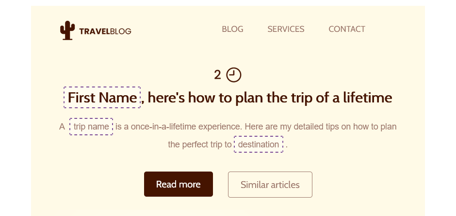
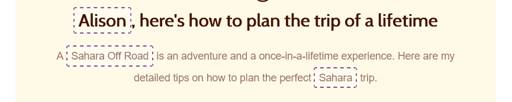

# Smart Merge Tags


This feature is available on Beefree SDK [**Core plan**](https://dam.beefree.io/pluginpricing) and above. Upgrade a [development application](../../getting-started/readme/development-applications.md) at no extra charge to explore features from higher plan tiers. **Note:** Usage on a development application still counts toward [usage-based fees](https://devportal.beefree.io/hc/en-us/articles/4403095825042-Usage-based-fees) and limits.


## Overview <a href="#overview" id="overview"></a>

**Smart merge tags** provide a better way for your customers to leverage personalization when creating content with Beefree SDK.

With Smart merge tags, users can:

* **quickly identify merge tags** through a specific highlighting
* see **human-friendly names** instead of the raw syntax – e.g., _Customer Name_ instead of _\{%customer.name%\}_.
* **select**, **replace**, and **style** merge tags with just one click
* get **sample content** for each merge tag, both during **editing** and **preview**.

## How it works <a href="#how-it-works" id="how-it-works"></a>

After enabling Smart merge tags, the builder will:

* **highlight** merge tags with a dotted border
* display the **tag name** you passed instead of the raw syntax

<figure><figcaption></figcaption></figure>

When users click on a tag, its border will become solid to signify that it has been selected. After selection, users can **style, replace, or delete** the merge tag with just one click.

<figure><figcaption></figcaption></figure>

Smart merge tags are easier to identify inside the content you’ve created and will save users tons of time. Furthermore, hiding the syntax will make it impossible for a user to break it while interacting with the overall text element.

On top of this, you can pass sample content for each merge tag, so that users can see an example of the data that will take the place of the merge tags when the web content is rendered:

<figure><figcaption></figcaption></figure>

## How to enable it <a href="#how-to-enable-it" id="how-to-enable-it"></a>

Smart merge tags are **disabled by default**. If your application doesn’t have Smart merge tags, you need to activate it. It takes just a few clicks:

* [Login into the Beefree SDK Console](https://dam.beefree.io/devmain)
* Click **Details** next to the application you want to configure
  * We recommend you first familiarize yourself with this feature under a DEV or QA application
* Click view more under **Application configuration**.
* Under the Services section, toggle **Enable Smart merge tags** ON and click the **Save** button.

Notice that, at this point, you will be prompted to enable the merge tag preview in the toolbar. You can skip this option when your integration is not using the [standard toolbar](../../server-side-configurations/server-side-options/toolbar-options.md) or you’re not passing sample content for your [merge tags](smart-merge-tags.md).

## Configuring sample content <a href="#configuring-sample-content" id="configuring-sample-content"></a>

After enabling Smart merge tags from your developer account, you need to apply a minor change to the merge tags’ [initial configuration](../../getting-started/readme/installation/configuration-parameters/).

```javascript

{
  name: 'first name',
  value: '[first-name]',
  previewValue: 'John',
}

```

The optional `previewValue` parameter is used to pass to the editor a sample content (text string) for every merge tag.

The value of this new parameter **will replace the merge tag in the editor preview**, meaning that there’s no need to build a custom preview to display the final result of an email or landing page with rich personalization strings.

## Displaying sample content during editing <a href="#displaying-sample-content-during-editing" id="displaying-sample-content-during-editing"></a>

Sample content strings are not limited to the preview, but can be displayed in the editor’s stage as mentioned above.

The way to do this depends on how your integration manages the [toolbar options](../../server-side-configurations/server-side-options/toolbar-options.md).

## **Toolbar enabled**

In this case, you can simply enable the option “Show ‘Merge tag preview’ in toolbar” mentioned above.

When this option is active, the toolbar displays a new action to the user:

<figure><figcaption></figcaption></figure>

The option works as a toggle that alternates between displaying the `previewValue` and the name parameter inside the merge tag UI.

## **Toolbar disabled**

As with all the actions available in the toolbar, [we provide methods](../../getting-started/readme/installation/methods-and-events.md) to control this option from your own UI:

```javascript
beePluginInstance.toggleMergeTagsPreview()
```

Use this method to replicate the behavior described for the standard toolbar.
