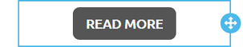

# Content Defaults


This feature is available on Beefree SDK [paid plans](https://dam.beefree.io/pluginpricing) only.


## Overview <a href="#overview" id="overview"></a>

With Content Defaults, you can define how content looks when dragged into an email or page.

When adding new content elements through the Content tab, you may want a default style that matches one of these options:

* your application’s color scheme;
* your user’s branding guidelines;
* the look & feel of the template used to create the message or page.

For example, here is how a button dragged into the stage looks by default:

<figure><figcaption></figcaption></figure>

* The background color is always light blue (HEX code #3AAEE0).
* The font size is always 16px.
* The font is Arial, unless a different Default font was set for the template loaded in the editor.
* The border radius is set at 4.
* The CTA is a formally correct, but laconic “Button”.

Instead, when applying Content defaults, the button dragged by your users could look out of the box like this:

<figure><figcaption></figcaption></figure>

We’ve used a dark grey color (HEX code #555555), an Ubuntu font at 22px in Bold, with a border radius of 10 and a nice “READ MORE” call-to-action.

Content Defaults are part of the Configuration parameters passed to your Beefree application during startup, so you can have different sets of them for different users.

## Use cases <a href="#use-cases" id="use-cases"></a>

By setting up your Content defaults, you’ll be able to address styling and branding needs for you and your customers.

### **Create a more consistent UX between your application and the editor**

If your application uses dark grey for the primary CTA, then you probably would want a default button in the Beefree builders to follow that style.

### **Match your customers’ branding**

If your application has brand settings that are used for your app’s UI or for assets managed in your application, you may want those to apply also to default content in the Beefree editors.

### **Create a more consistent experience within the editor**

If you’ve customized how the editor looks like, either through [Themes](themes.md) or [Custom CSS](custom-css/), you may want default content to adhere to the same style.

### **Define custom social blocks**

Since the Social block is one of the available Content defaults, you can define what social platforms – either present in the Beefree editors or added by you – are included when a social block is added to a message or page. For example, you can have a default social block with three platforms defined in the Beefree system and a fourth, custom one (Messenger):

<figure><figcaption></figcaption></figure>

## How it works <a href="#how-it-works" id="how-it-works"></a>

To set up the content styles you will need to add the `contentDefaults` object to `beeConfig`:

```javascript

beeConfig: {
  container: 'beefree-sdk-container', // [mandatory]
  ...
  titleDefaultConfig: {
    bold: true
  },
  titleDefaultStyles: { ... },
  titleMaxLevel: 'h6', // 'h3' default (min 'h1', max 'h6')
  contentDefaults: {
    text: { ... },
    image: { ... },
    row: { ... },
    button: { ... },
    divider: { ... },
    social: { ... },
    dynamic: { ... },
    video: { ... },
    form: { ... },
    icons: { ... },
    menu: { ... },
    spacer: { ... },
    paragraph: { ... },
    list: { ... },
    carousel: { ... },
    table: { ... },
    general: { ... },
  }
}
```


**Note:** The **Title block** is the only block that is configured on the root level of the `beeConfig` object. Ensure it is on the correct level prior to configuring.&#x20;


## Available content settings <a href="#available-content-settings" id="available-content-settings"></a>

You can add all the content styles, some of them or just one. It is up to your application to create them for all the users or for a segment, as there are no related server-side settings; basically you can customize them each time the editor starts.

All the contents use the same pattern, but the object must match the content schema for the type of content (described in the following section).

### **Title**

The `title` content default inside the `beeConfig` sets default properties and styling for title elements in the editor. It includes heading levels, alignment, padding, and mobile-specific styles to ensure consistency and responsiveness across different devices.

You can use the `titleMaxLevel` parameter to extend the available header options within the builder. The default value includes H1, H2, and H3 options. You can configure `titleMaxLevel` to go up to H6. If you configure additional header options, you can use Content Defaults to set default styling for the additional headers. The [Content Defaults for Additional Title Levels](content-defaults.md#content-defaults-for-additional-title-levels) provides more details on how to achieve this.   &#x20;

```javascript
titleDefaultConfig: {
  bold: true
},
titleDefaultStyles: {
  h1: {
    color: 'red',
    'font-size': '34px',
    'font-family': 'Arial, sans-serif',
    'font-weight': '700',
    'link-color': 'blue',
    'line-height': '120%',
    'text-align': 'center',
    'direction': 'ltr',
    'letter-spacing': 0,
  },
  h2: {
    color: 'red',
    'font-size': '24px',
    'font-family': 'Arial, sans-serif',
    'font-weight': '700',
    'link-color': 'blue',
    'line-height': '120%',
    'text-align': 'center',
    'direction': 'ltr',
    'letter-spacing': 0,
  },
  h3: {
    color: 'black',
    'font-size': '14px',
    'font-family': 'Arial, sans-serif',
    'font-weight': '700',
    'link-color': 'blue',
    'line-height': '120%',
    'text-align': 'center',
    'direction': 'ltr',
    'letter-spacing': 0,
  },
},
titleMaxLevel: 'h6', // 'h3' default (min 'h1', max 'h6')
contentDefaults: {
  title: {
    hideContentOnMobile: true,
    defaultHeadingLevel: 'h3',
    blockOptions: {
      align: 'center',
      paddingTop: '5px',
      paddingRight: '5px',
      paddingBottom: '5px',
      paddingLeft: '5px',
    },
    mobileStyles: {
      textAlign: "center",
      fontSize: "30px",
      paddingTop: "20px",
      paddingRight: "20px",
      paddingBottom: "20px",
      paddingLeft: "20px",
    },
  }
}

```

#### Content Defaults for Additional Title Levels

The following code snippet shows how you can set default styles for the H4, h5, and h6 heading levels can be added in the same way as the existing levels:

```json
beeConfig: {
    titleDefaultStyles: {
    h1: {...},
    h2: {...},
    h3: {...},
    h4: {
      color: 'red',
      'font-size': '13px',
      'font-family': 'Arial, sans-serif',
      'font-weight': '700',
      'link-color': 'blue',
      'line-height': '120%',
      'text-align': 'center',
      'direction': 'ltr',
      'letter-spacing': 0,
    },
    h5: {
      color: 'black',
      'font-size': '12px',
      'font-family': 'Arial, sans-serif',
      'font-weight': '700',
      'link-color': 'blue',
      'line-height': '120%',
      'text-align': 'center',
      'direction': 'ltr',
      'letter-spacing': 0,
    },
    h6: {...}
  },
}
```

### **Text**

The `text` content default within the `beeConfig` provides a default HTML string and sets the styles for text blocks, including color, font, and line height. It also includes options for padding and visibility on mobile devices to ensure a consistent appearance across different screen sizes.


Please note that the default text inside `html` is required.


```javascript

text: {
  html: 'This is default text for block...',
  styles: {
    color: "#e63c60",
    linkColor: "#e63c60",
    fontSize: '22px',
    lineHeight: "200%",
    fontFamily: "'Comic Sans MS', cursive, sans-serif",
  },
  blockOptions: {
    paddingBottom: "20px",
    paddingLeft: "20px",
    paddingRight: "20px",
    paddingTop: "20px",
    hideContentOnMobile: true
  },
  mobileStyles: {
    paddingTop: "30px",
    paddingRight: "30px",
    paddingBottom: "30px",
    paddingLeft: "30px",
  },
}

```

### **Image**

The image content defaults in the BeeConfig define the properties for images, including attributes like `alt`, `src`, and `href`, as well as styling details such as dimensions, border radius, and padding. It also specifies mobile-specific styles to ensure proper alignment and spacing on different devices.

```javascript

image: {
  alt: "My Alt Label",
  href: "http://www.google.com",
  src: "https://react.semantic-ui.com/images/wireframe/white-image.png",
  width: "250px" // optional - 100% default
  borderRadius: "30px",
  blockOptions: {
    paddingBottom: "0px",
    paddingLeft: "0px",
    paddingRight: "0px",
    paddingTop: "0px",
    align: "center",     
    hideContentOnMobile: true
  },
  mobileStyles: {
    textAlign: "right",
    paddingTop: "10px",
    paddingRight: "10px",
    paddingBottom: "10px",
    paddingLeft: "10px",
  },
}

```

**Image Parameters**

| Parameter      | Data Type | Example | Description                                 |
| -------------- | --------- | ------- | ------------------------------------------- |
| `borderRadius` | String    | 30px    | Defines the roundness of the image corners. |

### **Row**

The `row` content default in the BeeConfig specifies various styling properties for rows, including background colors, vertical alignment, border radius, and spacing. It also includes options for mobile-specific styles, such as stacking and padding configurations.

```json
row: {
  styles: {
    backgroundColor: "red",
    contentAreaBackgroundColor: "green",
    verticalAlign: "bottom",
    columnsBorderRadius: "10px",
    columnsSpacing: "20px",
    columnsStackOnMobile: false,
    columnsReverseStackOnMobile: true,
    columnsPadding: "42px",
    columnsPaddingLeft: "25px",
    columnsPaddingRight: "20px",
    columnsPaddingTop: "15px",
    columnsPaddingBottom: "10px",
    columnsBackgroundColor: "yellow",
    padding: "20px",
    paddingLeft: "25px",
    paddingRight: "20px",
    paddingTop: "15px",
    paddingBottom: "10px",
  }
}
```

**Row Parameters**

The following table lists the row content default parameters and their corresponding descriptions and data types.

<table><thead><tr><th width="218">Parameter</th><th>Data Type</th><th>Example</th><th>Description</th></tr></thead><tbody><tr><td><code>backgroundColor</code></td><td>String</td><td>Red</td><td>Sets the background color of the row.</td></tr><tr><td><code>contentAreaBackgroundColor</code></td><td>String</td><td>Green</td><td>Sets the background color of the content area within the row.</td></tr><tr><td><code>verticalAlign</code></td><td>String</td><td>bottom</td><td>Specifies the vertical alignment of the row content.</td></tr><tr><td><code>columnsBorderRadius</code></td><td>String</td><td>10px</td><td>Defines the roundness of the column corners.</td></tr><tr><td><code>columnsSpacing</code></td><td>String</td><td>20px</td><td>Sets the spacing between columns.</td></tr><tr><td><p></p><p><code>columnsStackOnMobile</code></p><p></p></td><td>Boolean</td><td>false</td><td>Determines if columns should stack on mobile devices.</td></tr><tr><td><code>columnsReverseStackOnMobile</code></td><td>Boolean</td><td>true</td><td>Specifies if the order of stacked columns should be reversed on mobile devices.</td></tr><tr><td><code>columnsPadding</code></td><td>String</td><td>42px</td><td>Defines the padding inside each column (the value applies to all padding sides).</td></tr><tr><td><code>columnsBackgroundColor</code></td><td>String</td><td>Yellow</td><td>Sets the background color for each column.</td></tr><tr><td><code>columnsPaddingLeft</code></td><td>String</td><td>25px</td><td>Defines the left padding for each column.</td></tr><tr><td><code>columnsPaddingRight</code></td><td>String</td><td>20px</td><td>Defines the right padding for each column.</td></tr><tr><td><code>columnsPaddingTop</code></td><td>String</td><td>15px</td><td>Defines the top padding for each column.</td></tr><tr><td><code>columnsPaddingBottom</code></td><td>String</td><td>10px</td><td>Defines the bottom padding for each column.</td></tr><tr><td><code>padding</code></td><td>String</td><td>20px</td><td>Defines the padding for the entire row (the value applies to all padding sides).</td></tr><tr><td><code>paddingLeft</code></td><td>String</td><td>25px</td><td>Defines the left padding for the entire row.</td></tr><tr><td><code>paddingRight</code></td><td>String</td><td>20px</td><td>Defines the right padding for the entire row.</td></tr><tr><td><code>paddingTop</code></td><td>String</td><td>15px</td><td>Defines the top padding for the entire row.</td></tr><tr><td><code>paddingBottom</code></td><td>String</td><td>10px</td><td>Defines the bottom padding for the entire row.</td></tr></tbody></table>

### **Button**

The button content default in the BeeConfig specifies the appearance and behavior of buttons, including attributes such as label, hyperlink, width, and styles like font, color, and padding. It also defines block options for padding and alignment, as well as mobile-specific styles for responsiveness.

```json

button: {
  label: "My New Label",
  href: "http://www.google.com ",
  width: "35%",
  styles: {
    color: "#ffffff",
    fontSize: '22px',
    fontFamily: "'Comic Sans MS', cursive, sans-serif",
    backgroundColor: "#FF819C",
    borderBottom: "0px solid transparent",
    borderLeft: "0px solid transparent",
    borderRadius: "25px",
    borderRight: "0px solid transparent",
    borderTop: "0px solid transparent",
    lineHeight: "200%",
    maxWidth: "100%",
    paddingBottom: "5px",
    paddingLeft: "20px",
    paddingRight: "20px",
    paddingTop: "5px"
  },
  blockOptions: {
    paddingBottom: "20px",
    paddingLeft: "20px",
    paddingRight: "20px",
    paddingTop: "20px",
    align: "center",
    hideContentOnMobile: true
  },
  mobileStyles: {
    paddingBottom: "10px",
    paddingLeft: "10px",
    paddingRight: "10px",
    paddingTop: "10px",
    textAlign: "center",
    fontSize: "40px",
  },
  hoverStyles:{
    color: "#FFFFFF"
    backgroundColor: "#16688B",
    borderBottom: "0px solid transparent",
    borderLeft: "0px solid transparent",
    borderRight: "0px solid transparent",
    borderTop: "0px solid transparent",
  }
}

```

### **Divider**

The divider content default in the BeeConfig specifies the appearance of dividers, including properties such as width, line style, and alignment. It also defines block options for padding and visibility on mobile, as well as mobile-specific styles for alignment and padding.

```json

divider: {
  width: '50%',
  line: "10px solid #BBBBBB",
  align: "right",
  blockOptions: {
    paddingBottom: "20px",
    paddingLeft: "20px",
    paddingRight: "20px",
    paddingTop: "20px",
    hideContentOnMobile: true
  },
  mobileStyles: {
    align: 'left',
    paddingLeft: "10px",
    paddingRight: "10px",
  },
}

```

### **Social**

The social content default in the BeeConfig specifies the display of social media icons, including their type, name, image properties, and link. It also defines the block options for alignment and padding, with specific styles for mobile devices.

```json

social: {
  icons: [
    {
      type: 'custom',
      name: 'Facebook',
      image: {
        prefix: 'https://www.facebook.com/',
        alt: 'Facebook',
        src: `https://img.icons8.com/dusk/64/000000/facebook-new--v2.png`,
        title: 'Facebook',
        href: 'https://www.facebook.com/'
      },
      text: ''
    }
  ],
  blockOptions: {
    align: "center",
    hideContentOnMobile: true,
    paddingBottom: "10px",
    paddingLeft: "10px",
    paddingRight: "10px",
    paddingTop: "10px",
  },
  mobileStyles: {
    paddingTop: "10px",
    paddingRight: "10px",
    paddingBottom: "10px",
    paddingLeft: "10px",
    textAlign: "right",
  },
}

```

### **Dynamic**

The dynamic content default in the BeeConfig specifies the block options, including padding and the ability to hide content on mobile. This ensures a consistent design by managing spacing and visibility across different devices.

```json

dynamic: {
    blockOptions: {
      paddingBottom: "20px",
      paddingLeft: "20px",
      paddingRight: "20px",
      paddingTop: "20px",
      hideContentOnMobile: true,
    }
  }

```

### **Video**

The video content default in the BeeConfig specifies block options, including padding and the ability to hide content on mobile devices, ensuring a consistent appearance across different platforms. Additionally, it defines mobile-specific styles to enhance the user experience on smaller screens.

```json

video: {
  blockOptions: {
    paddingBottom: "20px",
    paddingLeft: "20px",
    paddingRight: "20px",
    paddingTop: "20px",
    hideContentOnMobile: true,
  },
  mobileStyles: {
    paddingTop: "40px",
    paddingRight: "40px",
    paddingBottom: "40px",
    paddingLeft: "40px",
  },
}

```

### **Form**

The form content default in the BeeConfig defines the structure and styling for form elements, including fonts, colors, alignments, and padding, ensuring a consistent layout across different devices. It also includes options for mobile-specific styles to improve usability on smaller screens.

```json

form: {
  structure: {...}, // see form docs
  styles: {
    width: "100px"
    fontSize: "14px",
    fontFamily: "'Comic Sans MS', cursive, sans-serif",
    fontWeight: '700',
  },
  labelsOptions: {
    color: "#000000",
    lineHeight: "200%",
    fontWeight: "",
    fontStyle: "",
    align: "left",
    position: "top"
    letterSpacing: 1,
    minWidth: 30,
  },
  fieldsOptions: {
    color: "#000000",
    backgroundColor: "#ffffff",
    outlineColor: "#3AAEE0",
    borderRadius: "4px",
    borderTop: "1px solid transparent",
    borderRight: "1px solid transparent",
    borderBottom: "1px solid transparent",
    borderLeft: "1px solid transparent",
    paddingBottom: "5px",
    paddingLeft: "5px",
    paddingRight: "5px",
    paddingTop: "5px",
  },
  buttonsOptions: {
    color: "#ffffff",
    backgroundColor: "#3AAEE0",
    borderRadius: "4px",
    borderTop: "0px solid transparent",
    borderRight: "0px solid transparent",
    borderBottom: "0px solid transparent",
    borderLeft: "0px solid transparent",
    lineHeight: "200%",
    align: "center",
    width: "100%",
    maxWidth: "100%",
    paddingBottom: "5px",
    paddingLeft: "20px",
    paddingRight: "20px",
    paddingTop: "5px",
    marginBottom: "0px",
    margingLeft: "0px",
    marginRight: "0px",
    marginTop: "0px",
  },
  blockOptions: {
    align: "center",
    paddingBottom: "10px",
    paddingLeft: "10px",
    paddingRight: "10px",
    paddingTop: "10px",
    hideContentOnMobile: true,
    hideContentOnDesktop: false,
    backgroundColor: "#FF819C",
  },
  mobileStyles: {
    textAlign: "right",
    fontSize: "25px",
    paddingTop: "20px",
    paddingRight: "20px",
    paddingBottom: "20px",
    paddingLeft: "20px",
  },
}

```

### **Icons**

The icons content default in the BeeConfig specifies the properties for displaying icon items, such as the image source, text, size, and link attributes. It also includes styles for the icon's appearance and mobile-specific configurations to ensure proper alignment and padding across devices.

```json

icons: {
  items: [
    {
      image: "https://react.semantic-ui.com/images/wireframe/white-image.png",
      textPosition: "right",
      text: "Company name",
      alt: "Company name",
      title: "Company name",
      href: "https://www.acme.com",
      target: "_blank",
      width: "128px",
      height: "48px",
    }
  ],
  styles: {
    color: "#000000",
    fontSize: "14px",
    fontFamily: "'Comic Sans MS', cursive, sans-serif",
    fontWeight: '700',
  },
  blockOptions: {
    align: "center",
    paddingBottom: "0px",
    paddingLeft: "0px",
    paddingRight: "0px",
    paddingTop: "0px",
    hideContentOnMobile: true,
    hideContentOnDesktop: false,
    itemSpacing: "10px",
    iconHeight: "50px",
  },
  iconSpacing: {
    paddingBottom: "5px",
    paddingLeft: "5px",
    paddingRight: "5px",
    paddingTop: "5px",
  },
  mobileStyles: {
    textAlign: "right",
    fontSize: "50px",
    paddingTop: "20px",
    paddingRight: "20px",
    paddingBottom: "20px",
    paddingLeft: "20px",
  },
}

```

### **Menu**

The menu content default in the BeeConfig defines the properties for menu items, including text, links, and target attributes. It also sets the styles for the menu's appearance and behavior, such as font styles, colors, spacing, and mobile-specific configurations like hamburger icon settings.

```json

menu: {
  items: [
    {
      text: "Contact us"
      link: {
        href: "https://www.acme.com/contact-us",
        title: "Contact us",
        target: "_blank"
      }
    }
  ],
  styles: {
    color: "#000000",
    linkColor: "#0068A5",
    fontSize: "14px",
    fontFamily: "'Comic Sans MS', cursive, sans-serif",
    fontWeight: '700',
  },
  hamburger: {
    mobile: false,
    foregroundColor: "#ffffff",
    backgroundColor: "#000000",
    iconSize: "36px",
    iconType: "normal" // or "rounded"
  },
  blockOptions: {
    align: "center",
    paddingBottom: "0px",
    paddingLeft: "0px",
    paddingRight: "0px",
    paddingTop: "0px",
    hideContentOnMobile: true,
    hideContentOnDesktop: false,
  },
  itemsSpacing: {
    paddingBottom: "5px",
    paddingLeft: "5px",
    paddingRight: "5px",
    paddingTop: "5px",
  },
  mobileStyles: {
    textAlign: "right",
    fontSize: "50px",
    paddingTop: "10px",
    paddingRight: "10px",
    paddingBottom: "10px",
    paddingLeft: "10px",
  },
}

```

### **Spacer**

The spacer content in the BeeConfig is used to add vertical spacing between elements in the layout. It allows for hiding the spacer on mobile devices through the `hideContentOnMobile` option.

```json

spacer: {
  height: "60px",
  blockOptions: {
    hideContentOnMobile: true    
  }
}

```

### **Paragraph**

The paragraph content configuration in BeeConfig specifies the default styles such as color, font size, alignment, line height, and spacing for paragraphs. It also defines block options and mobile styles to ensure consistent rendering on different devices.

```json

paragraph: {
  styles: {
    color: '#000000',
    fontSize: '14px',
    fontFamily: 'inherit',
    fontWeight: '400',
    lineHeight: '120%',
    textAlign: 'left',
    direction: 'ltr',
    letterSpacing: '0px',
    linkColor: '#0068a5',
    paragraphSpacing: '16px',
  },
  blockOptions: {
    paddingTop: '10px',
    paddingRight: '10px',
    paddingBottom: '10px',
    paddingLeft: '10px',
  },
  mobileStyles: {
    textAlign: "right",
    fontSize: "50px",
    paddingTop: "60px",
    paddingRight: "60px",
    paddingBottom: "60px",
    paddingLeft: "60px",
  },
}

```

### **List**

The list content default in BeeConfig sets the basic styling for list elements, including options like color, font size, alignment, and list type. It also ensures consistent spacing and padding across devices by defining both block options and mobile-specific styles.

```json

list: {
  styles: {
    color: '#000000',
    fontSize: '14px',
    fontFamily: 'inherit',
    fontWeight: '400',
    lineHeight: '120%',
    textAlign: 'left',
    direction: 'ltr',
    letterSpacing: '0px',
    linkColor: '#0068a5',
    liSpacing: '0px',
    liIndent: '40px',
    listType: 'ul', // or 'ol'
    listStyleType: 'revert',
    startList: '1',
  },
  blockOptions: {
    paddingTop: '10px',
    paddingRight: '10px',
    paddingBottom: '10px',
    paddingLeft: '10px',
  },
  mobileStyles: {
    textAlign: "center",
    fontSize: "24px",
    paddingTop: "20px",
    paddingRight: "20px",
    paddingBottom: "20px",
    paddingLeft: "20px",
  },
}

```

Additionally, `listStyleType` supports the following: revert, auto, disc, circle, square, decimal, lower-alpha, upper-alpha, lower-roman, upper-roman.

### **Carousel**

The carousel content default in BeeConfig sets the basic padding for carousel elements and provides an option to hide content on mobile devices. It also defines mobile-specific padding to ensure a consistent appearance across different screen sizes.

```json

carousel: {
  blockOptions: {
    paddingBottom: "10px",
    paddingLeft: "10px",
    paddingRight: "10px",
    paddingTop: "10px",
    hideContentOnMobile: true,
  },
  mobileStyles: {
    paddingTop: "20px",
    paddingRight: "20px",
    paddingBottom: "20px",
    paddingLeft: "20px",
  },
}

```

### **Table**

The table content default in BeeConfig specifies the initial styling and layout properties for table elements, including rows, cells, and headers. It sets text styles, colors, padding, alignment, and optional alternate row and header styles to ensure consistency across different table instances.

```json
{
   ...
   table: {
      rows: [{
        cells: [
          {html: "new-default-text"},{html: "second text"}
        ]
      }, {
        cells: [
          {html: "third"}, {html: "last text"}
        ]
      }],
      headers: [{
        cells: [{html: "header 1"},{html: "header 2"}]
      }],
      styles: {
        color: "red",
        fontFamily: "'Merriweather', serif",
        fontWeight: "700",
        fontSize: "17px",
        textAlign: "right",
        lineHeight: "200%",
        letterSpacing: "8px",
        direction: "rtl",
        linkColor: "yellow",
        backgroundColor: "blue",
        border: "11px solid green",
        alternateRowBackgroundColor: "yellow",
        headersFontSize: "30px",
        headersFontWeight: "400",
        headersTextAlign: "center",
        headersBackgroundColor: "red",
        headersColor: "green",
      },
      blockOptions: {
        paddingBottom: "17px",
        paddingLeft: "15px",
        paddingRight: "14px",
        paddingTop: "13px",
      }
    },
}
```

**Note:** If `contentDefault` values for the Table module are incorrectly formatted, the following `onWarning` will be triggered (this applies to incorrect values for rows and headers, not all `contentDefaults`), and the default table will be used instead:

```javascript
{code: 1730, message: 'Content defaults for [Table] module are not valid'}
```

If the user tries to load a template that contains an improperly structured Table (for example, if a row does not contain all of its cells), the template will not load, and the `onError` will be triggered.

The following code displays an example error for this scenario:

```javascript
{ 
   code: 2250,
   message: 'Bump template validation error',
   detail: 'page/rows/0/columns/0/modules/0/descriptor/table/rows: improperly structured field (each row must contain the same number of cells)',   
}

```

### **General**

The `general` content default in the BeeConfig specifies the overall styling for the email template, such as background color, content area width, and default font. These settings help maintain a consistent look and feel throughout the template.

```javascript

general: {
  backgroundColor: "#efefef",
  contentAreaBackgroundColor: "#efefef",
  contentAreaWidth: "600px",
  defaultFont: "'Comic Sans MS', cursive, sans-serif",
  linkColor: "#efefef"
}

```


I**mportant:** `contentAreaWidth` has both **upper and lower limits**, which are the minimum and maximum values you can set it equal to. Email builder has a minimum limit of **480px** and a maximum limit of **900px**. Page builder has a minimum limit of **320px** and a maximum limit of **1440px**.

