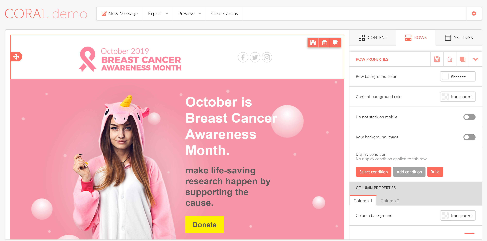

# Custom Sidebar Position


This feature is available on Beefree SDK [paid plans](https://dam.beefree.io/pluginpricing) only.


## Overview <a href="#overview" id="overview"></a>

You can choose whether to display the builder sidebar on the left or on the right side of the screen.

Available positions:

* left
* right

Here is the same sample application, with the same template and same content element selected, and the sidebar displayed on the left…

<figure><figcaption></figcaption></figure>

… and on the right.

<figure><figcaption></figcaption></figure>

The configuration document needs the following, new parameter:

```javascript

var beeConfig = {
        uid: config.uid,
        sidebarPosition: 'right',
        ...  

```
