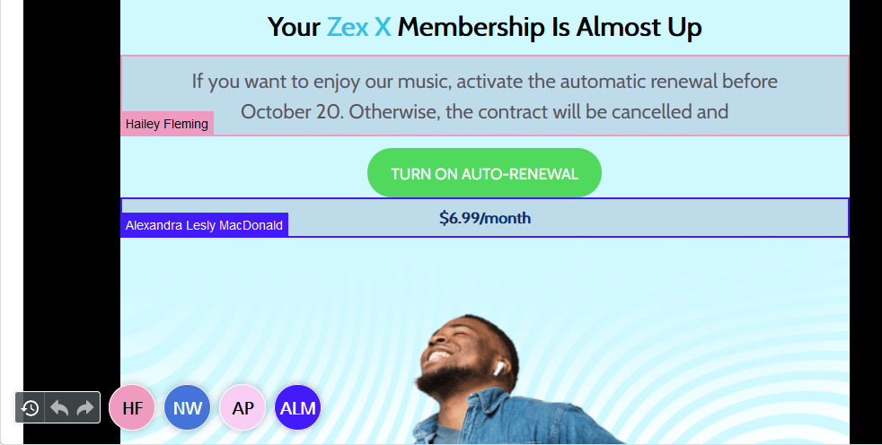
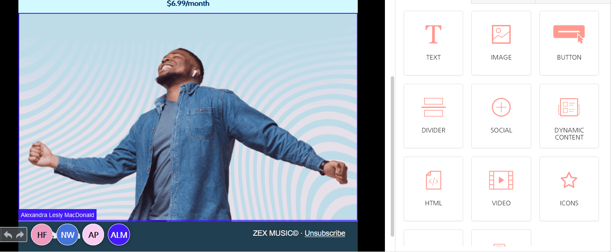

# Collaborative Editing


This feature is available on the Beefree SDK [Superpowers plan](https://dam.beefree.io/pluginpricing) and above. Additional limitations apply ([learn more](collaborative-editing.md#monitor-a-session)). Upgrade a [development application](../getting-started/readme/development-applications.md) at no extra charge to explore features from higher plan tiers. **Note:** Usage on a development application still counts toward [usage-based fees](https://devportal.beefree.io/hc/en-us/articles/4403095825042-Usage-based-fees) and limits.


## Overview

With Co-editing, multiple users can work on the same asset (email, page or popup) simultaneously. Co-editors can see what each other is doing, as their changes are synced to the stage in real-time.

<figure><figcaption></figcaption></figure>

Each user is represented by a round icon with the initial of the user, and hovering the mouse on the icon will show the full name for that user.

When a user selects a row or a content block, other co-editors will see it highlighted with that user’s color. To avoid conflicting edits, only one user at a time can edit a row or block. A feedback message will guide users when this situation happens.

<figure><figcaption></figcaption></figure>

## Use Cases

In many companies, it’s rare that someone works alone on everything related to an email and or a landing page. Your customers may have multiple people sharing duties – copywriting, designing, testing, reviewing, etc. That is why SaaS applications typically offer additional users or seats, so that more people can log into an account at the same time and collaborate.

When multiple people collaborate on creating content, co-editing is the logical solution for an authentic teamwork experience, Google-doc style.

<figure><figcaption></figcaption></figure>

If you add [Commenting](advanced-options/commenting.md) to the mix, Beefree SDK becomes an all-around, real-time, collaborative content creation platform to design and review emails, landing pages, and popups, unifying your customers’ workflow under one roof.

### Availability <a href="#availability" id="availability"></a>

Co-editing is available for Beefree SDK [Superpowers](https://dam.beefree.io/pluginpricing) and [Enterprise](https://dam.beefree.io/pluginpricing) plans:

* Superpowers plans are limited to a maximum of **5 co-editors per session**.
* **Enterprise** plans are limited to a maximum of **20 co-editors per session.**

This means that on the Superpowers plan, no more than five users can edit the same email or web page simultaneously. Your application will only receive an error code from the Beefree SDK platform when the limit is reached and the editor will not load – you’ll need to add a user notification to let them know they cannot join the editing session (e.g. “Sorry, you cannot edit this message because you’ve reached the limit of five co-editors, try again later”).

Even better, you can monitor sessions and disable editing for an email or landing page once the limit is reached.

## How it Works

Creating a co-edit session is nearly identical to starting a traditional, single-user session of your Beefree SDK application. You simply need to pass a shared flag, indicating the template is sharable, along with some simple user settings.

### User Settings

The following parameters are all required.

| Description | Type   | Value                         |
| ----------- | ------ | ----------------------------- |
| username    | string | The user’s display name       |
| userColor   | string | Hex color code (e.g. #FFFFFF) |

### Example beeConfig

```javascript

var config = {
  uid: '1234', 
  ...
  username: 'Jane Doe', 
  userColor: 'black',
  ...
}

```

### Options

The following shared parameter is required to start a co-editing session.

| Description | Type    | Value         |
| ----------- | ------- | ------------- |
| shared      | boolean | true or false |

You pass this argument in the start instance method’s options parameter.

### Example Instance Method When Not Using Co-editing:

```javascript

bee.start(template)

```

### Example Instance Method With Co-editing Enabled:

```javascript

bee.start(template, { shared: true })

```

## Session Started Callback

Once the session is started, a globally unique id will be created and returned to the host application via the onSessionStarted callback. The host application will save this session id, and use it when users want to join the same session.

| Description | Type   | Value                                                   |
| ----------- | ------ | ------------------------------------------------------- |
| sessionId   | string | globally unique id saved from onSessionStarted callback |

### Example Callback Handler

```javascript

onSessionStarted: function(sessionInfo) {
  console.log('*** [integration] --> (onSessionStarted) ', sessionInfo)
  prompt('press ctrl+c to copy the session ID', sessionInfo.sessionId)
}

```

### Join a Session

The host application can add a user to any active co-edit session by using the new join instance method. The join method replaces the bee.start method and accepts the session id as a parameter, and loads the current template directly from the active session.

```javascript

bee.join(sessionId)

```

## Monitor a Session

Once the session is started, all changes to the session are reported to the `onSessionChange` callback. The host application can monitor this callback to understand the session’s status.&#x20;

### Example Return JSON

```json

{
  change: { 
    type: "USER_JOINED", 
    value: {
      username: "John Doe", 
      userColor: "#c0ffee" 
      userId: "johndoe"
    }
  },
  sessionData: {
    users: {
      668bf8aa-97b9-4f5d-80a2-dc3e0986a370: { 
        userId: "johndoe", 
        username: "John Doe", 
        userColor: "#c0ffee" 
      },
      ...
    }
  }
}

```

### Example onSessionChange Handler:

```javascript

onSessionChange: function(data) {
  console.log('*** [integration] --> (onSessionChange) ', data)
}

```

#### Use Cases to Monitor a Session

* Only display a “join” button when a session is active
* Display an “edit” session only if there is at least one free co-editing spot
* Know when someone logs on or logs off, and notify other users in the host application
* Know when the session contains only a single user, so the user knows it’s safe to send a campaign

## Usage Limitations

There are some limitations set for the Co-editing feature to preserve the integrity of the experience. These are:

* **Undo/redo:**  If only a single user is present in the co-editing session at any given time, undo/redo will function the same as in a normal session. When a second user is present, undo/redo will be limited to only allow changes while the content or row is locked, and users cannot undo the changes of other users or those that have been synchronized across all sessions.
* **Load/reload:**  The host application cannot trigger any action that overwrites the user’s changes.
* **Autosave:** The autosave timer is set on the instance that started the session; it’s not recommended for co-editing sessions.
* **onChange:**  The onChange callback occurs only for the user that makes the change. For example, if user A makes a change, the onChange event fires only for their instance, and user B won’t receive the notification.

## Versioning

During the co-edit session, the host application may receive callbacks for saving JSON and HTML. However, with multiple users editing the content, potentially all over the world, the host application needs to confirm which changes are new vs. old. For this reason, a new version parameter has been added to all of the callbacks that return JSON or HTML.

The version is a simple integration counter: 1, 2, 3, …

### onChange Callback Handler:

```javascript
onChange: function(jsonFile, response, version) {
   console.log(`*** [integration] (onChange) version ${version}, ${new Date().toISOString()}`);
},
```

### onSave Callback Handler:

```javascript

onSave: function(jsonFile, htmlFile, version) {
   console.log(`*** [integration] (onSave) version ${version}, ${new Date().toISOString()}`);
},

```

### onSaveAsTemplate Callback Handler

```javascript

onSaveAsTemplate: function(jsonFile, version) {
   console.log(`*** [integration] (onSaveAsTemplate) version ${version}, ${new Date().toISOString()}`);
},

```

### onSend Callback Handler

```javascript


onSend: function(htmlFile, version) {
   console.log(`*** [integration] (onSend) version ${version}, ${new Date().toISOString()}`);
},


```

## Track Message Changes

You can [track message changes](collaborative-editing.md#track-message-changes) for the main user and additional users in a collaborative editing session.&#x20;

The `onChange` callback allows you to track the activities and changes to the design JSON performed by session's main user (User A). Reference the `onChange` [section of the Track Message Changes page](../getting-started/tracking-message-changes.md#onchange-event) to learn more about implementing and using this callback.&#x20;

The `onRemoteChange` callback allows you to track the activities and changes to the design's JSON performed by additional users (User B, User C, and so on). Reference the `onRemoteChange` [section of the Track Message Changes page](../getting-started/tracking-message-changes.md#onremotechange) to learn more about implementing and using this callback.&#x20;

## Custom Languages

You may override any of the default language strings using [custom translations](collaborative-editing.md#custom-languages).  The code block below contains the JSON required to replace all co-editing strings.

```json

translations: {
  "mailup-bee-newsletter-collaboration": {
    "locked-module-warning-message": "This module is being edited by another user and therefore its content cannot be edited.",
    "locked-module-warning-title": "This module is locked",
    "locked-row-warning-message": "This row is being edited by another user and therefore its content cannot be edited.",
    "locked-row-warning-title": "This row is locked",
    "row-delete-confirm-title": "Are you sure you want to delete this row?",
    "row-delete-confirm-message": "Another user is currently editing a module inside this row. By deleting it, you might cause their work to be lost.",
    "lock-rejected-title": "Element was locked by another user.",
    "lock-rejected-message": "The element is currently being edited by another user. Please wait until they are finished with their changes."
  }
},

```

## Session Lifecycle and Error Codes

### Heartbeat

Both the server and client regularly check the connection using the “ping-pong” heartbeat.&#x20;

If the client misses 5 consecutive pings (ping is emitted every 10s), the server considers the connection to be lost and disconnects the client.

If the server misses 5 consecutive pings (also every 10s), the client considers the connection to be lost and will attempt to _reconnect_ (see below).

### Reconnect Mechanism

If the server disconnects without reason (the disconnection is not _clean_), or it misses 5 consecutive pings, the client will attempt to reconnect to the session. It will keep trying for the 60s before emitting an error with code 5400.

Reconnect mechanism is also employed after certain recoverable errors, specifically 5001, 5100 and 5300. The error itself is only emitted if the reconnect fails.

The server will wait for 60s after the last user of the session disconnects (or the connection is lost) before erasing the session data.

### Error State

During reconnecting, the builder is covered with an overlay to prevent the user from doing any changes (since they cannot be synchronized). This overlay also appears if the server has missed a ping.

In case of error, another overlay modal is displayed to prevent the user from interacting with the builders in an error state. The host application should handle the errors and restart the Beefree SDK.

### Error Codes

You can monitor the onError callback to know when a problem occurs, and then alert users of the problem.  For example, if a user loses internet connection, you can display an alert in the host application to let them know their changes have not been saved.

Here is the full list of error codes that can be returned for Co-editing.

| Code   | Message                                            | Details                                                                                              | Is recoverable? |
| ------ | -------------------------------------------------- | ---------------------------------------------------------------------------------------------------- | --------------- |
| `5001` | Unexpected error occurred during co-editing.       | General error.                                                                                       | Yes             |
| `5100` | Failed to open co-editing session.                 | Unexpected error when creating/joining a co-editing session.                                         | Yes             |
| `5150` | Session does not exist.                            | The client attempted to join a non-existing (or expired) session.                                    | No              |
| `5200` | Failed to synchronize changes.                     | Emitted if an unexpected error occurs on the server during the real-time synchronization of changes. | No              |
| `5300` | Connection to the synchronization server was lost. | The server closed the connection. Reason is given in the detail field.                               | Yes             |
| `5400` | Connection to the synchronization server was lost. | Caused by network connection error or the server unexpectedly dying.                                 | No              |
| `5500` | Co-editing is not supported for your current plan. | If the client attempts to initiate or join a co-editing session with a lower plan.                   | No              |
| `5600` | Co-editing server is not available.                | Please try again later.                                                                              | No              |
