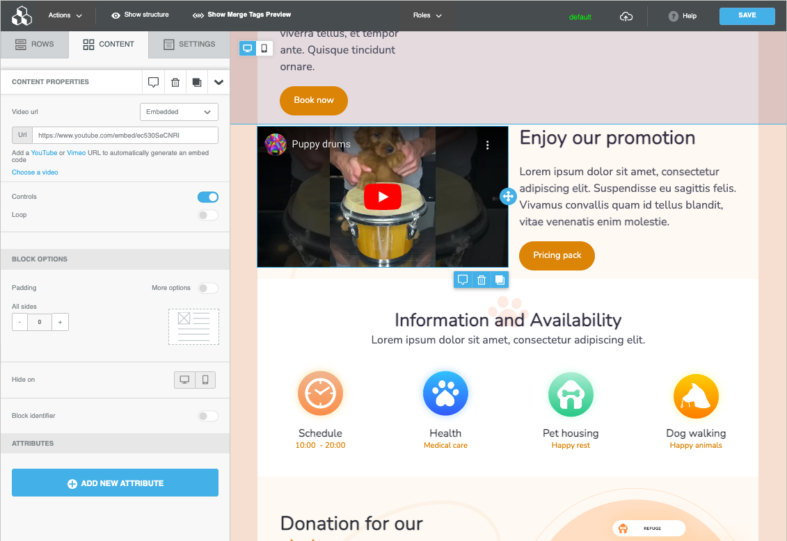
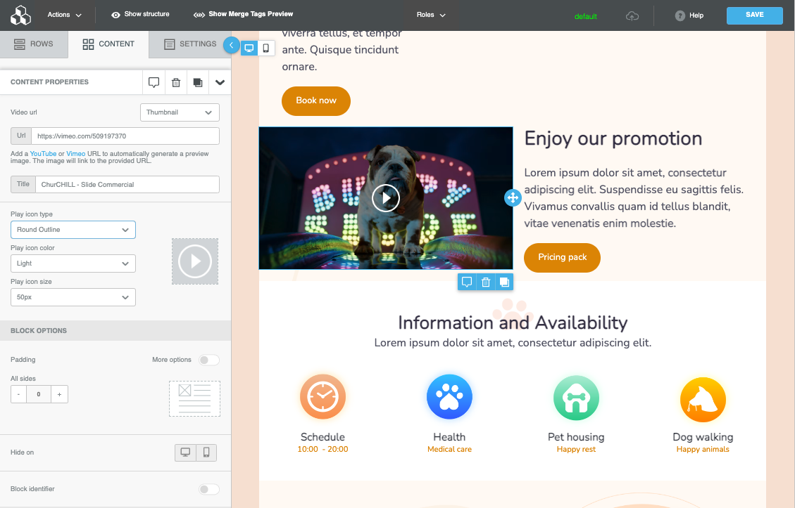

# Embedding videos in a page


This feature is available on Beefree SDK [paid plans](https://dam.beefree.io/pluginpricing) only.


The Page Builder includes an expanded Video content block for optimized usage of videos on web pages. Videos are added inside an iframe via the HTML5 video tag.

There are multiple ways to add a video to a page built with Beefree SDK. Additional settings allow the video progress bar and loop playback to be turned on or off.

## **Embedded**

The Embedded mode allows video playback inside the page. It requires the URL of a video hosted on YouTube, YouTube Shorts, or Vimeo.

<figure><figcaption></figcaption></figure>

## **Hosted video**

Same as the embedded option, but the URL provided must point to a self-hosted video in MP4 format. Settings for hiding controls and loop playback apply as well. Please note that the player interface your visitors will experience might slightly vary based on the browser they use.

<figure><figcaption></figcaption></figure>

## **Thumbnail**

As a fallback, you may also use the video block for generating a thumbnail, the same way the block works when building emails. Just enter the URL for a video hosted on YouTube, YouTube Shorts, or Vimeo. A thumbnail linked to the video will be created. You may also style the overlay play icon.

<figure><figcaption></figcaption></figure>

## Supported Video Sources

* YouTube (16:9 aspect ratio)
  * Public Videos
  * Unlisted Videos
  * Videos starting at a certain time
* YouTube Shorts (16:9 aspect ratio)
* Vimeo
  * Public Videos
  * Unlisted Videos
  * Cinemascope (21:9 aspect ratio)
