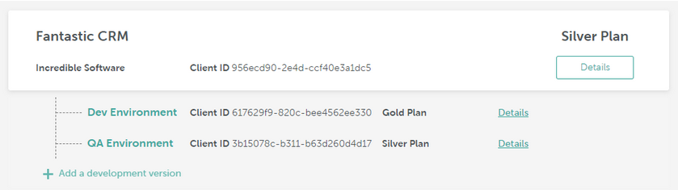

# Integrating Page Builder

## Integrating and Testing the Page Builder

When you create an application in the [Beefree SDK Console](https://dam.beefree.io/devmain), you’ll be asked to select either Page or Email Builder. Paid applications allow you to create child development applications, to ease new feature testing, development, and maintenance.

<figure><figcaption></figcaption></figure>

Page and Email builders **share the same core functionalities**, including authentication and configuration. If you already integrated our Email builder, you can re-use most of your work by using the **same configuration and callbacks**. If this is your first approach to our builders, just follow the [Installation section in our documentation](../getting-started/installation/). All the documentation in this site applies to both products, except where noted.

All builders are available to Beefree SDK customers under the same [all-in-one pricing](https://developers.beefree.io/pricing-plans). Please contact your Customer Success Manager for more details.

### The experience 

We aim to provide the foundations needed to build a delightful page building experience. We started with the basic features that are already provided to design awesome email messages and tweaked them to work for Web pages.

Once launched as Page Builder, an application will have a few but noticeable differences from the Email builder experience:

* width for pages can be expanded up to 1440px;
* the stage can be scrolled horizontally;
* the sidebar can be collapsed to provide more workspace – useful when working with larger widths;
* there’s a new 6-columns row layout, to take advantage of larger widths;
* the preview includes viewport resize, to test responsiveness on various screen sizes;
* the HTML block allows using scripts, for improved compatibility with embedded content like surveys. This also includes Javascript, although it cannot be executed within the builder.



If you’re on a paid plan, you will also get support for forms and embedded videos.

* You can define and pass forms to the builder, and use the form content block to retrieve and style those forms.
* You can use the video content block to embed and playback videos hosted on Youtube and Vimeo, or point to a hosted video in MP4 format.

### Additional resources 

[**Managing forms with the Page Builder**](../form-block/integrating-and-using-the-form-block/form-structure-and-parameters.md)

A quick primer on how to include forms in a web page.

[**Developer resources on GitHub**](https://dam.beefree.io/githubbeeforms)\

Our Github account hosts useful resources, including sample code to quick start your integrations.
