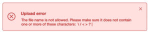

# File System Provider errors

## Example Response

```json

{"code":3200,"message":"Resource Not Found","details":"http:\/\/myfsp.com\/docs\/errorcodes\/404"}

```

## Error Codes

<table><thead><tr><th width="113">Code</th><th width="178">Message</th><th width="199">HTTP Status</th><th>Details</th></tr></thead><tbody><tr><td><code>3001</code></td><td>FSP Error</td><td>503 Service Unavailable</td><td>Default generic FSP Error</td></tr><tr><td><code>3100</code></td><td>Something went wrong accessing backend filesystem</td><td>503 Service Unavailable</td><td>Default generic Error</td></tr><tr><td><code>3200</code></td><td>Resource not found</td><td>404 Not Found</td><td>File or directory not found</td></tr><tr><td><code>3300</code></td><td>Permission denied</td><td>403 Forbidden</td><td>Permission denied to access a file or a directory</td></tr><tr><td><code>3400</code></td><td>Resource Already Exists</td><td>409 Conflict</td><td>File or directory already exists</td></tr><tr><td><code>3450</code></td><td>File Not Uploaded</td><td>422 Unprocessable Entity</td><td>Error during file upload</td></tr><tr><td><code>3500</code></td><td>Request Error</td><td>400 Bad Request</td><td>Server could not understand the request due to invalid syntax</td></tr><tr><td><code>3600</code></td><td>User Error</td><td>403 Forbidden</td><td>Not a valid S3 custom storage</td></tr><tr><td><code>3650</code></td><td>Wrong Username or Password</td><td>401 Unauthorized</td><td>Wrong user credentials</td></tr><tr><td>from <code>3900</code> to <code>3999</code></td><td><em>Custom error message</em></td><td><em>Custom HTTP status code</em></td><td> </td></tr></tbody></table>

## Displaying custom errors from your FSP API

You can return custom errors from your application that will be displayed in the file manager.

To do that we reserved codes from _3900_ to _3999_.\
An error sent with an error code number in this range displays the message as the error title and the details as the error text.

### **Example:**

1. Your file storage doesn’t support file names with the character “?”
2. The front end doesn’t stop the upload, as this character is allowed by other APIs and storages
3. When your API gets the file, returns the following error:\
   **Code:** 39105\
   **HTTP Status:** 400\
   **Message:** Upload error\
   **Details:** The file name is not allowed. Please make sure it does not contain one or more of these characters: \ / < > ? |
4. The file manager inside the editor displays:

<figure><figcaption></figcaption></figure>
