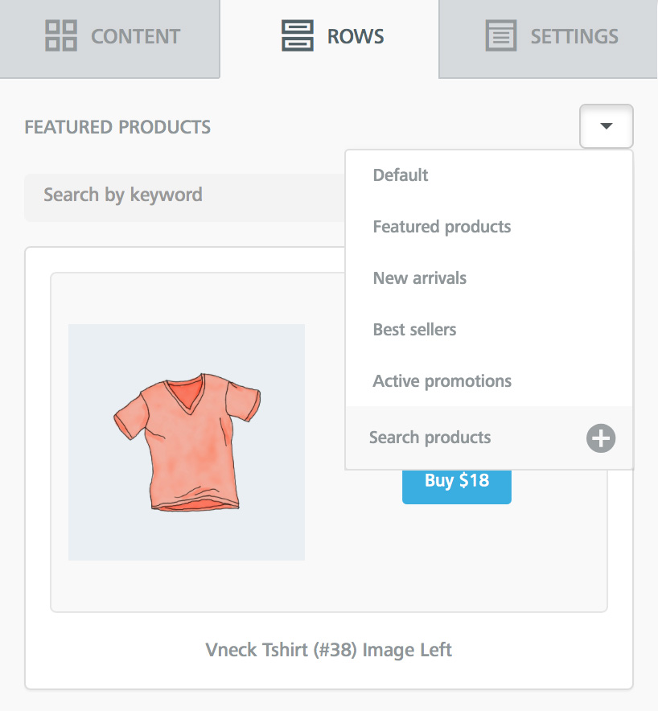
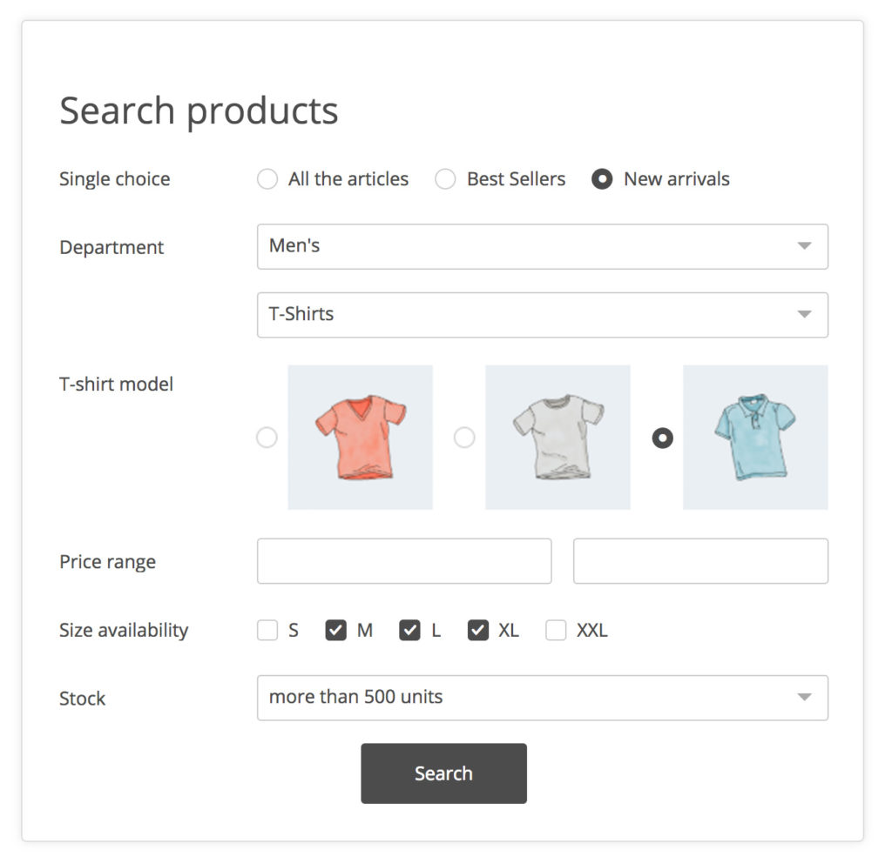
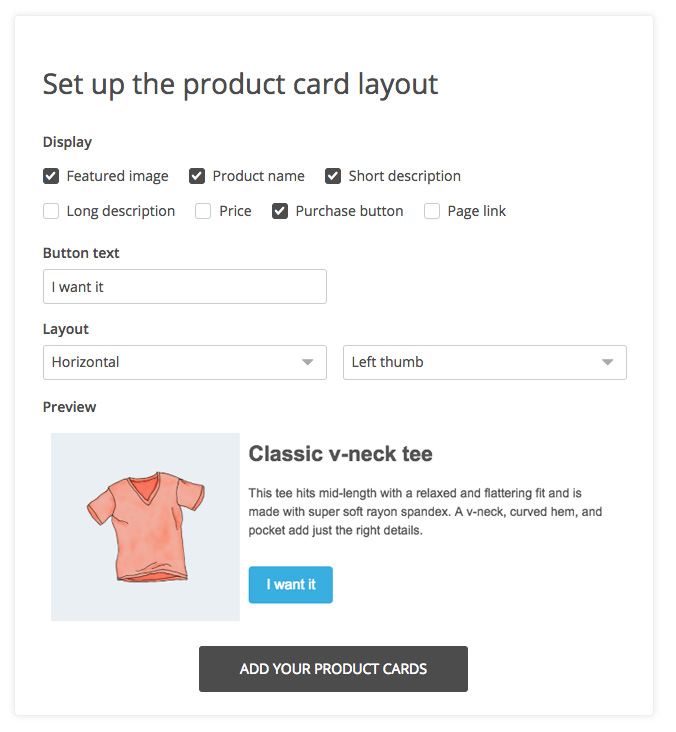
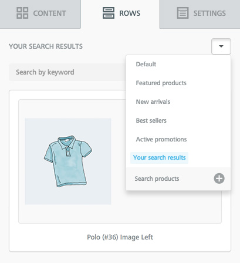
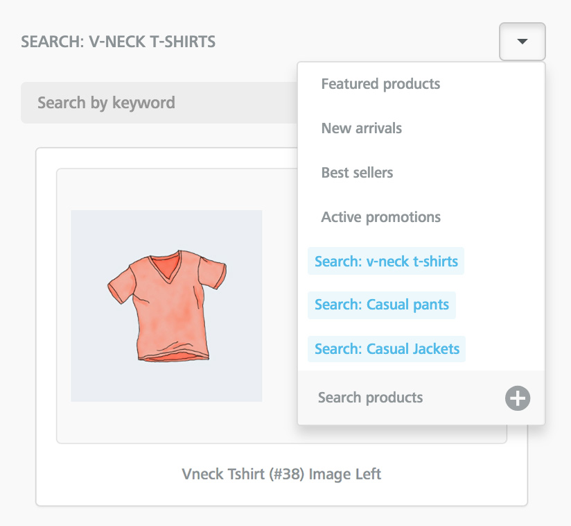

# 🏓 Extending Custom Rows with content dialog

## Overview <a href="#overview" id="overview"></a>

[Content Dialog](../../other-customizations/advanced-options/content-dialog.md) allows you to build user interfaces that let your users locate & insert additional content (Custom Rows) while they are working on their message.

By letting you establish an interaction layer between the editor and your application (e.g., you show a modal window), it allows your users to locate/build/insert new rows, thus making the _Rows_ tab in the editor dramatically more flexible and scalable.

Note that _Content Dialog_ may be used to load other content types, as merge tags, special links, or display conditions. [Learn more about the Content dialog](../../other-customizations/advanced-options/content-dialog.md).

To start using it, you need to add the _contentDialog_ object to _beeConfig_, or add the _externalContentURLs_ parameter if you already use this feature in your editor configuration.

Here is an example of the syntax that needs to be added to the editor configuration document (_beeConfig_):

<pre class="language-javascript"><code class="lang-javascript">
contentDialog: {
    externalContentURLs: {
            label: 'Search products',
            handler: function(resolve, reject) {
                // Your function
        }
    }
}
<strong>
</strong></code></pre>

## Understanding the end-user experience <a href="#understanding-the-end-user-experience" id="understanding-the-end-user-experience"></a>

From the perspective of your users, this additional configuration adds a new item (using your text label) in the Rows drop-down.

Here is a visual example of how the “Search products” label will be shown, at the bottom of the _Rows_ drop-down.

<figure><figcaption></figcaption></figure>

## How it works <a href="#how-it-works" id="how-it-works"></a>

### **Initializing the dialog**

When the user clicks on the new menu item (e.g., “Search products” in the example above), what you define in the handler (a function with a [Promise](https://dam.beefree.io/mozillapromise)-like signature) is triggered.

You can use this event to display a form where the user can search for new items to insert in the message. Here is a visual example:

<figure><figcaption></figcaption></figure>

You could also ask the user to enter parameters that will affect the very structure of the rows (JSON documents) that will be imported into the editor, affecting the way they will display:

<figure><figcaption></figcaption></figure>

You can also mix both forms in a 2-step pattern.

## **Returning items to the editor**

When the selection is made, you must return to the resolve function a URL containing the result (row’s list).

The response must match the same format used to define the externalContentURLs in beeConfig:

```javascript

{"name":"Results name","value":"Results URL"}

```

This response will:

1. Create a new drop-down choice with the provided name
2. Display the rows provided by the URL in the rows panel

<figure><figcaption></figcaption></figure>

Notice that in the rows list, names returned by the Content Dialog display as highlighted elements to give them further visibility over starting choices.

The Content Dialog can be used as many times as the user needs and, depending on the response, the behavior may change:

### **1. Returning the same name**

This overwrites the existing results, keeping the same name in the drop-down.\
This behavior perfectly matches our example above, where the host application returns “Your search results” every time the content dialog is resolved.

### **2. Returning a new name**

This creates a new drop-down choice, keeping the previous results as selectable elements. Previous results are available directly in the drop-down.

Here is a visual example:

<figure><figcaption></figcaption></figure>

### **Live example**

In our example, we are using this event to display a search form and transfer the user selection to the editor as custom rows.

The form is part of the application, so we are using the same elements and styles that users of the application are used to.

<figure><figcaption></figcaption></figure>


