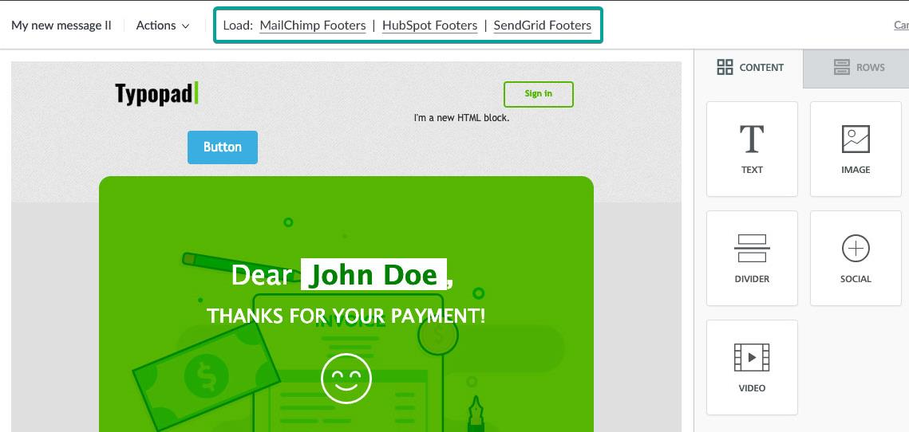
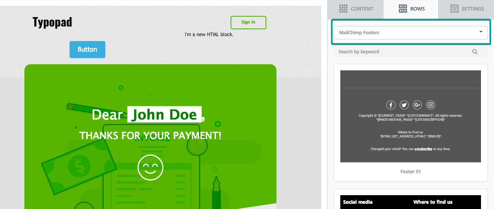
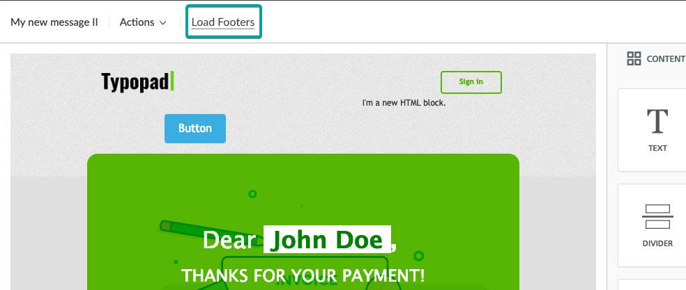
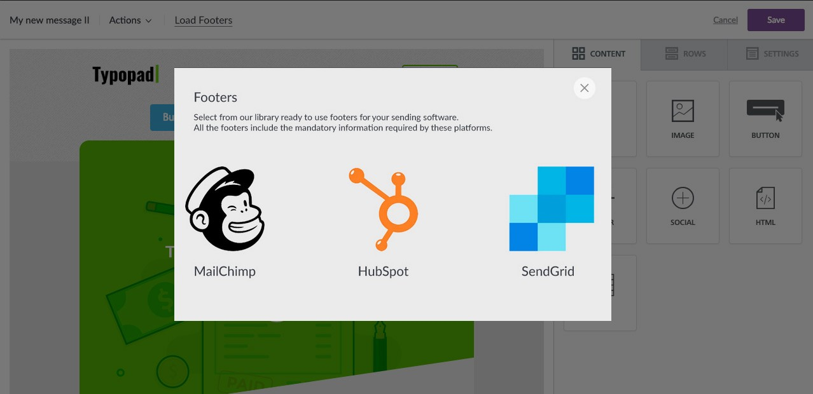

# Loading Custom Rows from your UI

## Overview <a href="#overview" id="overview"></a>

Custom Rows are a powerful way to provide “ready-to-go” content directly into the builder. Think products, blog articles, events, coupons. And don’t forget that Saved Rows your customers might have will be loaded as Custom Rows the next time they load the builder.

All this content is crucial to make the most out of the Beefree SDK experience, and that’s why you can add UI elements in your app’s interface to:

* jump right to a Custom Rows category, without the need for the user to go into the _Rows_ tab, click on the dropdown and select the category;
* provide additional information on the available rows, either through a tooltip or by showing a Content dialog with all the information and the links to the rows.

With this feature, you will reduce the friction needed to discover and access the builder’s Custom Rows. To do so, you’ll use the `loadRows` event, which will trigger the _Custom Rows content dialog_.\


### How it works <a href="#how-it-works" id="how-it-works"></a>

Here’s an example of our Beefree product, which integrates Beefree SDK, taking advantage of this method to load custom rows from its UI.

The toolbar in the application contains explicit call-to-action text links to load footers, which correspond to different categories of Custom Rows in the application.

<figure><figcaption></figcaption></figure>

When users click on “Mailchimp Footers”, the Custom Rows Content Dialog is triggered, meaning that the builder opens a communication channel with your application. In this case, no additional UI will be displayed, as the host application provides the URL to the rows associated with that call-to-action. This way, the Rows tab will be immediately selected, with the “Mailchimp Footers” category already selected:

<figure><figcaption></figcaption></figure>

But what if you wanted users to select the email footers they need from a large catalog of pre-built content? In that scenario, you could have a more generic “Load footers” call-to-action in the toolbar.

<figure><figcaption></figcaption></figure>

Clicking on “Load Footers” will once again trigger the _Custom Rows content dialog_, but this time the application could provide a dialog window where users can browse or search through available footers, and get some additional context on them. Here is a visual example of how it might look like, but as with all content dialogs you have complete freedom on what to show:

<figure><figcaption></figcaption></figure>

When users click on MailChimp, the modal window fades off, the builder switches to the “Rows” tab, and the MailChimp Footers are shown, ready to be dragged into the message.

### How to integrate it <a href="#how-to-integrate-it" id="how-to-integrate-it"></a>

You can trigger the _Custom Rows content dialog_ via the `loadRows` instance event.

```javascript

bee.loadRows()

```

Once the Content Dialog is triggered, you have two options, as explained in the How it works section:

* Interact with the end user, as described in our [Content Dialog](../../other-customizations/advanced-options/content-dialog.md) documentation, and eventually return a URL of custom rows.
* Immediately return the rows URL, without displaying the Content Dialog. This is useful if you have a menu and already know which rows to load based on the interaction by the end user with you application’s UI.
