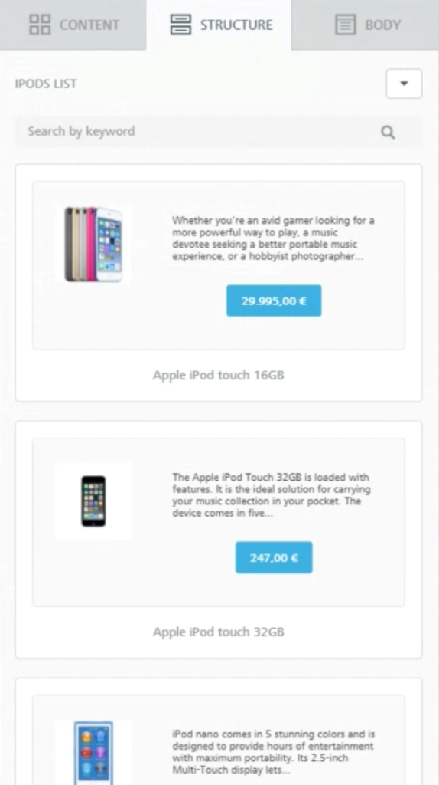
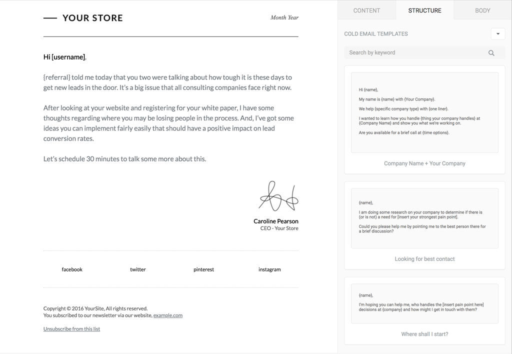
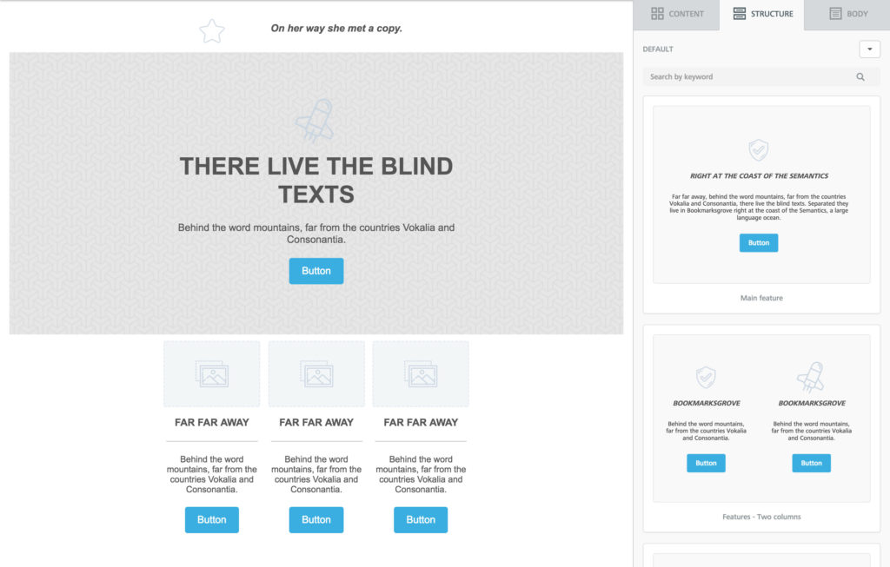
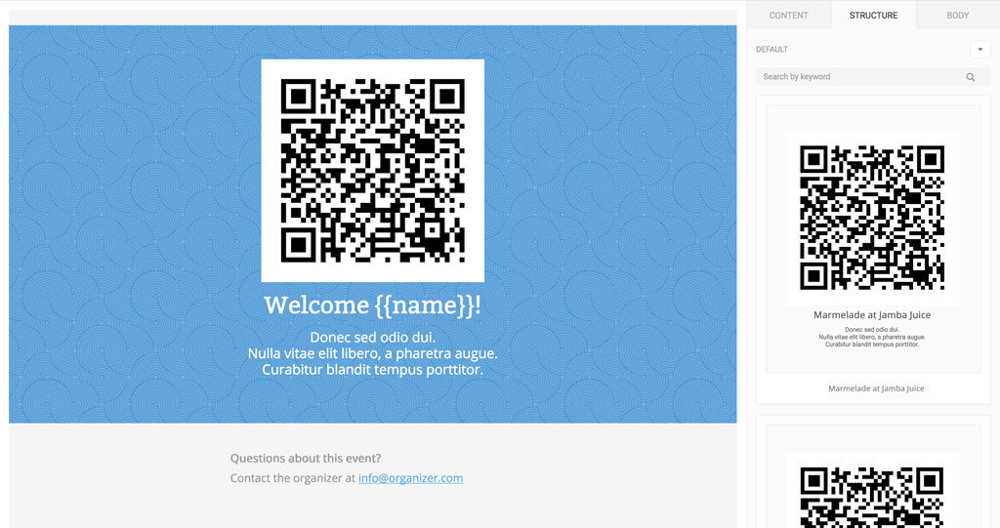
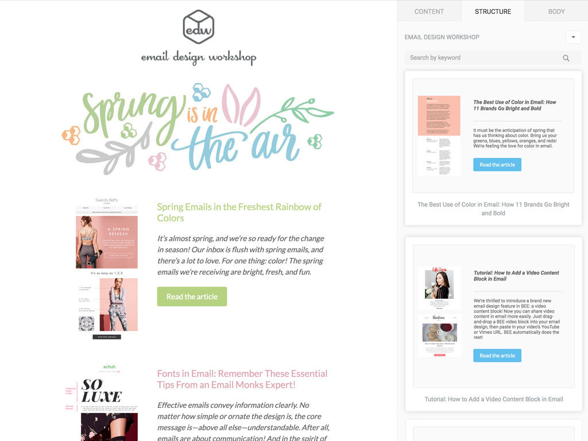
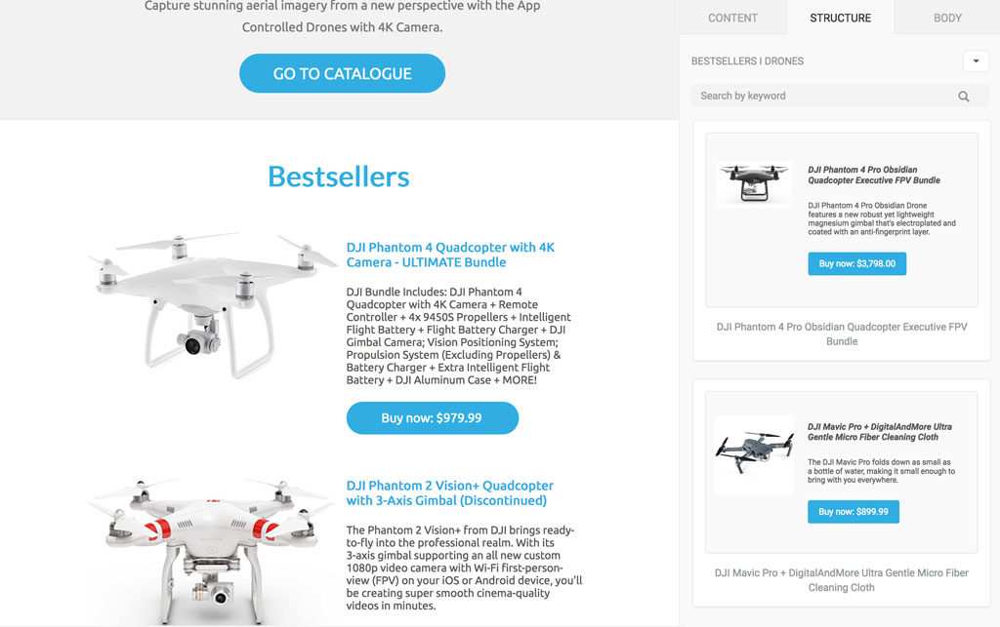

# 🤔 Understanding Custom Rows


This feature is available on Beefree SDK [Core plan](https://dam.beefree.io/pluginpricing) and above.\
If you're on the Essentials plan, [upgrade a development application](../../getting-started/readme/development-applications.md) for free to try this and other Core-level features.


## Introduction

Rows are a core feature of the visual builders within Beefree SDK. They provide a structured method to house various types of content such as headers, paragraphs, images, and buttons. These rows allow end users to either add their own content or use pre-designed rows with ready-made content that can be easily customized to fit their design needs. This approach increases flexibility and efficiency by allowing end users to customize content quickly without starting from scratch. It ensures that designs remain visually cohesive and well-organized, balancing creative freedom with structure.

### End User Benefits

The following lists shares a few of the end user benefits of Rows:

* **Pre-designed and customizable content**: End users can select from rows that already contain content, making it easy to modify and adapt for their specific needs.
* **Flexible structure**: Rows help organize different content types in a structured layout, promoting clean and efficient design.
* **Drag-and-drop functionality**: Rows can be easily dragged and dropped onto the stage, making the design process intuitive and user-friendly.
* **Continuity with current user experience**: The option to add empty structures is still available, preserving the familiar workflow for users who prefer to build from scratch.
* **Option to disable empty rows**: Users can opt to work solely with pre-made rows, focusing on content customization without the need to build layouts from the ground up.

### Host Application Benefits

The following lists shares a few of the host application benefits of Rows:

* **Ready-to-go content delivery**: The host application can pass pre-built, ready-to-go rows directly into the builder, reducing the need for end users to create content from scratch.
* **Customization control**: Host applications can offer a variety of customizable rows, ensuring users follow design guidelines while still providing creative freedom.
* **Improved user experience**: Pre-designed rows simplify the user interface, making the builder more intuitive and less complex for users.
* **Optional removal of empty structures**: Host applications can disable empty row options if desired, encouraging users to focus on modifying pre-existing content.
* **Efficient content management**: Rows enable the host to provide consistent, reusable content blocks that can be updated globally, streamlining content management and maintaining design consistency across the platform.

<figure><figcaption></figcaption></figure>

## Use cases 

### **User saved rows**

By enabling the [Save Rows](../saved-rows/) feature, your end users will be able to save design elements that they want to use in other messages in the future.

To display saved rows in the _Rows_ tab, add them to the list of rows available to users by leveraging the [Custom Rows feature](displaying-saved-rows.md).

<figure><figcaption></figcaption></figure>

## **Prebuilt rows**

When using the standard, empty rows, users are forced to start from scratch every time they introduce a new row.

A set of pre-built rows may accelerate message construction, providing users with commonly used structures filled with sample content. For example, a set of headers, footers, news sections, etc.

With _Custom rows_ you – the host application – are in control of the content that is included. In some cases, providing canned text can speed up the email creation process and provide consistency across all the communications.

Imagine, for example, the case of a CRM where customer success representatives can quickly build curated emails selecting from a number of pre-built text blocks.

<figure><figcaption></figcaption></figure>

## **Default rows**

In addition to the _empty rows_ that have always been part of the Beefree SDK system, we now provide a set of _default rows_ that you can add to your application with a simple configuration parameter.

They feature a series of popular structures, filled with placeholder text, images, and buttons.

For some users, they may work better than _empty rows_ as they allow them to immediately visualize what they can accomplish with a specific structure.

<figure><figcaption></figcaption></figure>

Reference [Rows Configuration](https://docs.beefree.io/beefree-sdk/custom-rows/displaying-saved-rows#rows-configuration) to learn more about how to configure these sample rows.

## **User/campaign tailored contents**

Does your application onboard users asking for company or brand information?

If so, you can use _custom rows_ to provide footers with legal information already applied (and centralized), header designs that already include the company logo, etc.

Other common use cases:

* Approved promotional material
* QR codes or barcodes
* Advertising content
* Product recommendation templates

<figure><figcaption></figcaption></figure>

Check how to configure these sample rows below under _Rows configuration > Parameters > Default rows_

## **Blog updates and other news**

Create _custom rows_ with content from different sources like blogging platforms, content management systems, etc.

This will allow your customers to save time and reduce errors by avoiding copying and pasting text, links, and images.

Additionally, this helps you ensure that only reviewed and approved contents, provided by a common repository, are used in the message creation.

<figure><figcaption></figcaption></figure>

## **E-commerce products**

Transform products from your e-commerce catalog into _custom rows_, using product images, text, and call to actions to create a promotional message with a few clicks.

You can divide the products into categories and feed them into the builder as different arrays of _custom rows_.

Or you can use different sets of _custom rows to_ provide different layout options in order to add design flexibility.

<figure><figcaption></figcaption></figure>
