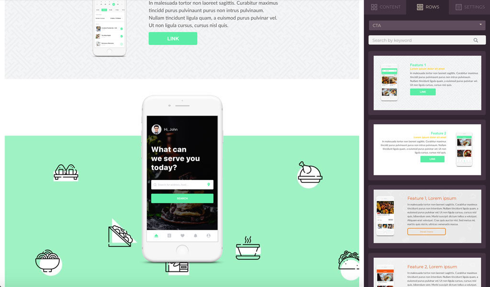
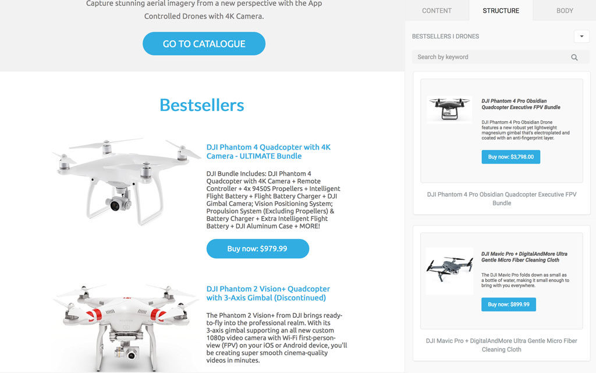
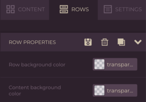

# Create Reusable Content


This feature is available on Beefree SDK [Core plan](https://dam.beefree.io/pluginpricing) and above. If you're on the Essentials plan, [upgrade a development application](../../../getting-started/readme/development-applications.md) for free to try this and other Core-level features.


The [Reusable Content page](../) discusses, on a very high-level, the differences between key row-related features offered within Beefree SDK. This page provides more detailed information on pre-building and saving reusable content.&#x20;

## Pre-build Reusable Content

### Use cases <a href="#use-cases" id="use-cases"></a>

#### **User saved rows**

By enabling the [Save Rows](save/implement-self-hosted-saved-rows.md) feature, your end users will be able to save design elements that they want to use in other designs in the future.

To display saved rows in the _Rows_ tab, add them to the list of rows available to users by leveraging the [Custom Rows feature](pre-build/implement-custom-rows.md).

<figure><figcaption></figcaption></figure>

#### **Prebuilt rows**

When using the standard, empty rows, users are forced to start from scratch every time they introduce a new row.

A set of pre-built rows may accelerate message construction, providing users with commonly used structures filled with sample content. For example, a set of headers, footers, news sections, etc.

With _Custom rows_ you – the host application – are in control of the content that is included. In some cases, providing canned text can speed up the email creation process and provide consistency across all the communications.

Imagine, for example, the case of a CRM where customer success representatives can quickly build curated emails selecting from a number of pre-built text blocks.

<figure><figcaption></figcaption></figure>

## **Default rows**

In addition to the _empty rows_ that have always been part of the Beefree SDK system, we now provide a set of _default rows_ that you can add to your application with a simple configuration parameter.

They feature a series of popular structures, filled with placeholder text, images, and buttons.

For some users, they may work better than _empty rows_ as they allow them to immediately visualize what they can accomplish with a specific structure.

<figure><figcaption></figcaption></figure>

Reference [Rows Configuration](https://docs.beefree.io/beefree-sdk/custom-rows/displaying-saved-rows#rows-configuration) to learn more about how to configure these sample rows.

## **User/campaign tailored contents**

Does your application onboard users asking for company or brand information?

If so, you can use _custom rows_ to provide footers with legal information already applied (and centralized), header designs that already include the company logo, etc.

Other common use cases:

* Approved promotional material
* QR codes or barcodes
* Advertising content
* Product recommendation templates

<figure><figcaption></figcaption></figure>

Check how to configure these sample rows below under _Rows configuration > Parameters > Default rows_

## **Blog updates and other news**

Create _custom rows_ with content from different sources like blogging platforms, content management systems, etc.

This will allow your customers to save time and reduce errors by avoiding copying and pasting text, links, and images.

Additionally, this helps you ensure that only reviewed and approved contents, provided by a common repository, are used in the message creation.

<figure><figcaption></figcaption></figure>

## **E-commerce products**

Transform products from your e-commerce catalog into _custom rows_, using product images, text, and call to actions to create a promotional message with a few clicks.

You can divide the products into categories and feed them into the builder as different arrays of _custom rows_.

Or you can use different sets of _custom rows to_ provide different layout options in order to add design flexibility.

<figure><figcaption></figcaption></figure>

## Save Reusable Content

Saved Rows allows users to select a row in a message and save it for later use. More specifically, it allows users to submit a request to the host application to save a piece of content and turn it into a reusable element. The host application, using the [Custom Rows](pre-build/implement-custom-rows.md) feature, can feed these saved elements back to the builder as rows that can be dragged into other messages.

In this tutorial, you will learn how to implement Saved Rows in an application that has embedded Beefree SDK.



Also, see the [sample code](https://github.com/BEE-Plugin/bee-plugin-webinars-demo-code)!

### How it works <a href="#how-it-works" id="how-it-works"></a>

When the feature is enabled, a new **Save** icon is added to the action icons when a row is selected:

<figure><figcaption></figcaption></figure>

The same action is also available in the row properties panel when a row is selected:

<figure><figcaption></figcaption></figure>

By clicking on this icon, users trigger a request to the host application to store the row’s JSON document, which includes:

* row structure and settings;
* contents and their settings;
* all style settings.

It is entirely up to the host application:

* where to store the JSON documents that describe these saved rows;
* if and how to display them to users of the application;
* whether to allow users to edit them individually
* when and how to feed them back to the builder, using the [Custom Rows](pre-build/implement-custom-rows.md) feature.

## Schemas

There are two schemas that are important to understand and utilize when working with both Custom Rows and Self-hosted Saved Rows.&#x20;

These schemas are the following:

* [Simplified Rows Schema](./#simplified-rows-schema)
* [Saved Rows Metadata Schema](./#saved-rows-schema)

Throughout the subsequent pages, these two schemas and their applications will be referenced and discussed more thoroughly.&#x20;

### Simplified Rows Schema

The following code snippet provides an example of the Simplified Rows Schema.

<details>

<summary>View the Simplified Rows Schema</summary>

The following code displays the Simplified Rows Schema.

```json
{
  $schema: 'http://json-schema.org/draft-07/schema',
  $id: 'BEE-simplified-row',
  type: 'object',
  required: [
    'name',
    'columns',
  ],
  definitions: {
    padding: {
      type: 'integer',
      minimum: 0,
      maximum: 60,
    },
  },
  properties: {
    name: {
      type: 'string',
    },
    colStackOnMobile: {
      type: 'boolean',
    },
    rowReverseColStackOnMobile: {
      type: 'boolean',
    },
    contentAreaBackgroundColor: {
      type: 'string',
    },
    'background-color': {
      type: 'string',
    },
    'background-image': {
      type: 'string',
    },
    'background-position': {
      type: 'string',
    },
    'background-repeat': {
      type: 'string',
    },
    customFields: {
      type: 'object',
    },
    'display-condition': {
      type: 'object',
      properties: {
        type: {
          type: 'string',
        },
        label: {
          type: 'string',
        },
        description: {
          type: 'string',
        },
        before: {
          type: 'string',
        },
        after: {
          type: 'string',
        },
      },
    },
    metadata: {
      type: 'object',
    },
    'padding-top': {
      $ref: '#/definitions/padding',
    },
    'padding-right': {
      $ref: '#/definitions/padding',
    },
    'padding-bottom': {
      $ref: '#/definitions/padding',
    },
    'padding-left': {
      $ref: '#/definitions/padding',
    },
    columns: {
      type: 'array',
      minItems: 1,
      items: {
        type: 'object',
        required: [
          'weight',
          'modules',
        ],
        additionalProperties: false,
        properties: {
          weight: {
            type: 'integer',
            minimum: 1,
            maximum: 12,
          },
          'background-color': {
            type: 'string',
          },
          'padding-top': {
            $ref: '#/definitions/padding',
          },
          'padding-right': {
            $ref: '#/definitions/padding',
          },
          'padding-bottom': {
            $ref: '#/definitions/padding',
          },
          'padding-left': {
            $ref: '#/definitions/padding',
          },
          modules: {
            type: 'array',
            items: {
              type: 'object',
              discriminator: {
                propertyName: 'type',
              },
              required: [
                'type',
              ],
              properties: {
                type: {
                  enum: [
                    'button',
                    'divider',
                    'heading',
                    'html',
                    'icons',
                    'image',
                    'list',
                    'menu',
                    'paragraph',
                    'title',
                  ],
                },
              },
              oneOf: [
                {
                  $schema: 'http://json-schema.org/draft-07/schema',
                  $id: 'BEE-simplified-button',
                  type: 'object',
                  properties: {
                    type: {
                      const: 'button',
                    },
                    label: {
                      type: 'string',
                      format: 'noAnchorTags',
                    },
                    text: {
                      type: 'string',
                      format: 'noAnchorTags',
                    },
                    href: {
                      type: 'string',
                      format: 'urlOrMergeTags',
                    },
                    target: {
                      enum: [
                        '_blank',
                        '_self',
                        '_top',
                      ],
                    },
                    color: {
                      type: 'string',
                    },
                    'background-color': {
                      type: 'string',
                    },
                    customFields: {
                      type: 'object',
                    },
                  },
                },
                {
                  $schema: 'http://json-schema.org/draft-07/schema',
                  $id: 'BEE-simplified-divider',
                  type: 'object',
                  properties: {
                    type: {
                      const: 'divider',
                    },
                    customFields: {
                      type: 'object',
                    },
                  },
                },
                {
                  $schema: 'http://json-schema.org/draft-07/schema',
                  $id: 'BEE-simplified-icons',
                  type: 'object',
                  properties: {
                    type: {
                      const: 'icons',
                    },
                    icons: {
                      type: 'array',
                      items: {
                        type: 'object',
                        additionalProperties: false,
                        required: [
                          'image',
                          'textPosition',
                          'width',
                          'height',
                        ],
                        properties: {
                          alt: {
                            type: 'string',
                          },
                          text: {
                            type: 'string',
                          },
                          title: {
                            type: 'string',
                          },
                          image: {
                            type: 'string',
                            format: 'urlOrMergeTags',
                          },
                          href: {
                            type: 'string',
                            format: 'urlOrMergeTags',
                          },
                          height: {
                            type: 'string',
                          },
                          width: {
                            type: 'string',
                          },
                          target: {
                            enum: [
                              '_blank',
                              '_self',
                              '_top',
                            ],
                          },
                          textPosition: {
                            enum: [
                              'left',
                              'right',
                              'top',
                              'bottom',
                            ],
                          },
                        },
                      },
                    },
                    customFields: {
                      type: 'object',
                    },
                  },
                },
                {
                  $schema: 'http://json-schema.org/draft-07/schema',
                  $id: 'BEE-simplified-image',
                  type: 'object',
                  properties: {
                    type: {
                      const: 'image',
                    },
                    alt: {
                      type: 'string',
                    },
                    href: {
                      type: 'string',
                      format: 'urlOrMergeTags',
                    },
                    src: {
                      type: 'string',
                      format: 'urlOrMergeTags',
                    },
                    dynamicSrc: {
                      type: 'string',
                    },
                    target: {
                      enum: [
                        '_blank',
                        '_self',
                        '_top',
                      ],
                    },
                    customFields: {
                      type: 'object',
                    },
                  },
                },
                {
                  $schema: 'http://json-schema.org/draft-07/schema',
                  $id: 'BEE-simplified-html',
                  type: 'object',
                  properties: {
                    type: {
                      const: 'html',
                    },
                    html: {
                      type: 'string',
                    },
                    customFields: {
                      type: 'object',
                    },
                  },
                },
                {
                  $schema: 'http://json-schema.org/draft-07/schema',
                  $id: 'BEE-simplified-list',
                  type: 'object',
                  properties: {
                    type: {
                      const: 'list',
                    },
                    underline: {
                      type: 'boolean',
                    },
                    italic: {
                      type: 'boolean',
                    },
                    bold: {
                      type: 'boolean',
                    },
                    html: {
                      type: 'string',
                    },
                    text: {
                      type: 'string',
                    },
                    align: {
                      enum: [
                        'left',
                        'center',
                        'right',
                      ],
                    },
                    tag: {
                      enum: [
                        'ol',
                        'ul',
                      ],
                    },
                    size: {
                      type: 'integer',
                    },
                    color: {
                      type: 'string',
                    },
                    linkColor: {
                      type: 'string',
                    },
                    customFields: {
                      type: 'object',
                    },
                  },
                },
                {
                  $schema: 'http://json-schema.org/draft-07/schema',
                  $id: 'BEE-simplified-menu',
                  type: 'object',
                  properties: {
                    type: {
                      const: 'menu',
                    },
                    items: {
                      type: 'array',
                      items: {
                        type: 'object',
                        additionalProperties: false,
                        properties: {
                          type: {
                            const: 'menu-item',
                          },
                          text: {
                            type: 'string',
                          },
                          link: {
                            type: 'object',
                            additionalProperties: false,
                            properties: {
                              title: {
                                type: 'string',
                              },
                              href: {
                                type: 'string',
                                format: 'urlOrMergeTags',
                              },
                              target: {
                                type: 'string',
                                enum: [
                                  '_blank',
                                  '_self',
                                  '_top',
                                ],
                              },
                            },
                          },
                        },
                      },
                    },
                    customFields: {
                      type: 'object',
                    },
                  },
                },
                {
                  $schema: 'http://json-schema.org/draft-07/schema',
                  $id: 'BEE-simplified-paragraph',
                  type: 'object',
                  properties: {
                    type: {
                      const: 'paragraph',
                    },
                    underline: {
                      type: 'boolean',
                    },
                    italic: {
                      type: 'boolean',
                    },
                    bold: {
                      type: 'boolean',
                    },
                    html: {
                      type: 'string',
                    },
                    text: {
                      type: 'string',
                    },
                    align: {
                      enum: [
                        'left',
                        'center',
                        'right',
                      ],
                    },
                    size: {
                      type: 'integer',
                    },
                    color: {
                      type: 'string',
                    },
                    linkColor: {
                      type: 'string',
                    },
                    customFields: {
                      type: 'object',
                    },
                  },
                },
                {
                  $schema: 'http://json-schema.org/draft-07/schema',
                  $id: 'BEE-simplified-title',
                  type: 'object',
                  properties: {
                    type: {
                      enum: ['title', 'heading'],
                    },
                    underline: {
                      type: 'boolean',
                    },
                    italic: {
                      type: 'boolean',
                    },
                    bold: {
                      type: 'boolean',
                    },
                    html: {
                      type: 'string',
                    },
                    text: {
                      type: 'string',
                    },
                    align: {
                      enum: [
                        'left',
                        'center',
                        'right',
                      ],
                    },
                    title: {
                      enum: [
                        'h1',
                        'h2',
                        'h3',
                      ],
                    },
                    size: {
                      type: 'integer',
                    },
                    color: {
                      type: 'string',
                    },
                    linkColor: {
                      type: 'string',
                    },
                    customFields: {
                      type: 'object',
                    },
                  },
                },
              ],
            },
          },
          customFields: {
            type: 'object',
          },
        },
      },
    },
  },
}
```

</details>


**Note:** This section includes expandable content. Click the **>** symbol to expand the content and view the Simplified Rows Schema.


### Saved rows schema <a href="#saved-rows-schema" id="saved-rows-schema"></a>

The following is the basic structure of the row’s JSON schema. Simply put, the schema is the structure of your saved rows data feed.

```

[
    {
        metadata: {
            name: 'My row name' // Identifies the row, required.
        }
        columns: { ... }
        ...
    }, // The row that was previously saved. - (*)
    ...
]
```

**NOTE**: The row schema is complex and we do not recommend creating rows programmatically. Therefore, there is no schema reference of the row itself. However, you can add your own parameters to the row’s metadata or use our [Simplified Row Schema](https://docs.beefree.io/beefree-sdk/rows/custom-rows/generating-custom-rows-from-existing-content) to generate them programmatically from existing content.

The _metadata_ section of the rows schema allows you to keep track of row-specific information.

```

metadata: {
    "name": "My Saved Row", // The row's title displayed in the "Rows" panel.
    "tags": "product, two columns, blue",
    ... additional custom parameters
}
```

#### **Required metadata** <a href="#required-metadata" id="required-metadata"></a>

**name The saved row’s title displayed in the&#x20;**_**Rows**_**&#x20;panel.**

* A string of plain text that identifies the row.
* Displayed in the row card when the row is shown in the _Rows_ panel.
* Used for text searches within the _Rows_ panel

**Recommended metadata**

**category** A category can be useful for organizing your feeds on the Rows tab.

**id** A handle that identifies the row in the host application’s data storage.

**idParent** Useful to track rows that were saved from previously saved rows. Keeping track of where a row came from allows you to implement additional editing features.

**dateCreated** The date the row was created: useful for filtering/sorting rows for content management purposes in your application. It can also help with technical support tasks.

**dateModified** The date a saved row was updated: useful for filtering/sorting rows for content management purposes in your application. It can also help with technical support tasks.

**userId** To let your application decide whom can edit or saved rows.

**tags** Useful to create filters, management, search, and in general to organize the content in your application.
