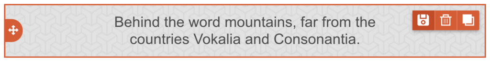
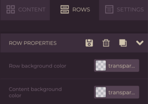
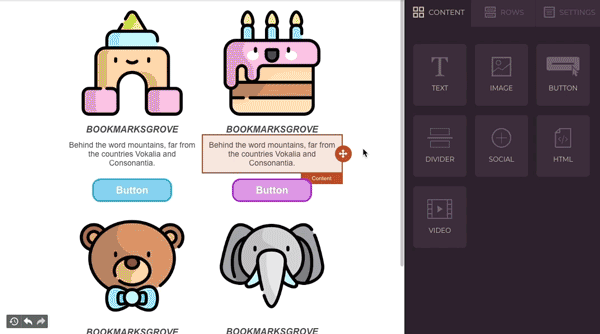
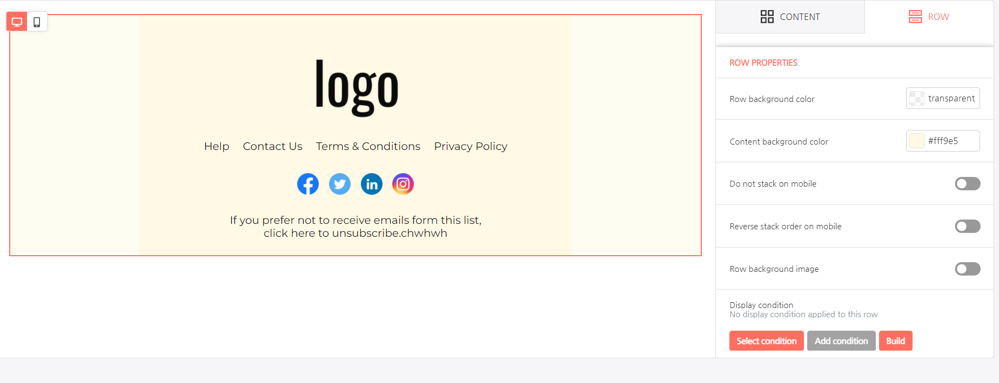

# Implement Self-hosted Saved Rows


This feature is available on Beefree SDK [Core plan](https://dam.beefree.io/pluginpricing) and above. Upgrade a [development application](../../../../../getting-started/readme/development-applications.md) at no extra charge to explore features from higher plan tiers. **Note:** Usage on a development application still counts toward [usage-based fees](https://devportal.beefree.io/hc/en-us/articles/4403095825042-Usage-based-fees) and limits.


## Overview <a href="#overview" id="overview"></a>

Saved Rows allows end users to select a row in a design and save it for later use. More specifically, it allows end users to submit a request to the host application to save a piece of content and turn it into a reusable element. The host application, using `externalContentURLs`, can feed these saved elements back to the builder as rows that can be dragged into other designs.

In the following video tutorial, you will learn how to implement Self-hosted Saved Rows in an application that has embedded Beefree SDK.



You can also reference the [sample code](https://github.com/BEE-Plugin/bee-plugin-webinars-demo-code) in our GitHub repository used throughout this video.

## How it works <a href="#how-it-works" id="how-it-works"></a>

When the Self-hosted Saved Rows feature is enabled, a  **Save** icon is added to the action icons when a row is selected. The following image displays an example of a row with the **Save** icon enabled in the upper right-hand corner.

<figure><figcaption></figcaption></figure>

The **Save** icon is also available in the Row properties panel when a row is selected. The following image displays an example of this.

<figure><figcaption></figcaption></figure>

By clicking on the **Save** icon, the end user triggers a request to the host application to store the row’s JSON document.&#x20;

This JSON document includes the following:

* Row structure and settings.
* Contents and their settings.
* All style settings.

The host application needs to determine the following:

* Where to store the JSON documents that describe these saved rows.
* If and how to display them to end users of the application.
* Whether to allow end users to edit them individually.
* When and how to feed them back to the builder, using the `externalContentURLs` parameter.

## **Enable Self-Hosted Saved Rows in the Developer Console**

Take the following steps to enable Self-hosted Saved Rows in the [Beefree SDK Developer Console](https://developers.beefree.io/accounts/login/?from=website_menu):

1. Log in to the [Beefree SDK Console](https://developers.beefree.io/).
2. Locate the application you'd like to activate Self-hosted Saved Rows for.
3.  Click the application's corresponding **Details** button.

    You will be prompted to the **Application Details** page.
4. Click the **View more** link under the **Application configuration** heading.
5. Navigate to the **Saved Rows** section.
6. Toggle on the **Self-hosted on your own infrastructure** option.
7. Click **Save** on the upper right-hand corner to save your changes.

The following image displays where the toggle is located in the [Beefree SDK Developer Console](https://developers.beefree.io/accounts/login/?from=website_menu).

<figure><figcaption></figcaption></figure>

## **Making Saved Rows available only to select users**

Once the feature has been turned on at the global level, in [Beefree SDK Console](https://developers.beefree.io/), you may want to disable _Saved Rows_ on a per-user basis.  This can be accomplished via the client-side configuration document that you feed to an application when initializing the builder for a certain user.

Why? Because you may decide to make the feature available to different users of your application:

* depending on the subscription plan that they are on (you could push users to a higher plan based on the ability to save a row for later);
* depending on the purchase of an optional feature (same);
* to allow “beta” users to see it while keeping it hidden from the rest of your users;
* etc.

Here’s how to do so:

* Enable _Saved Rows_ in the [Beefree SDK Console](https://developers.beefree.io/). as mentioned above.
* Add the configuration parameter _saveRows_ to the _beeConfig_ document:
  * Set it to _false_ for all users that cannot saved rows.

Here is a simple example:

## **Saved Row Configuration**

```javascript

const beeConfig = {
    uid: 'dev-user',
    language: 'en-US',
    ...
    saveRows: false // boolean
    ...
}

```

## **Understanding the end user experience**

Visit the [Saved Rows section of the Reusable Content page](../../../#self-hosted-saved-rows) to learn more about the end user experience with saved rows. You can also reference the [white label end user documentation on Saved Rows](https://docs.beefree.io/end-user-guide/saved-rows) to learn more. &#x20;

The following GIF provides a quick visual example of the end user experience:

<figure><figcaption></figcaption></figure>

## **Saving rows workflow for developers**

When the **saved row** action is triggered by the user, the builder starts the following sequence:

1. **Metadata Content dialog**\
   Used to collect data from the host application and add it to the row object.\
   Metadata helps your application to identify a row, overwrite a previously saved version, etc.
2. **Saved Rows Callback.**\
   Function that returns the row to the host application.

The following describes the recommended workflow to implement saved rows in a host SaaS application.

1. Enable _Saved Rows_ in the [Beefree SDK Console](https://developers.beefree.io/) as described above.
2. Load a [Beefree SDK template](https://dam.beefree.io/githhubtemplates).
3. Select the row you want to save and make note of the new save icon.
4. Click the save icon to trigger a Metadata Content Dialog.  To successfully handle this step, you must complete these tasks:
   * Add a Metadata Content Dialog object to your _beeConfig_. This configures your handler.
   * Implement the handler method to open a dialog (e.g., modal window) to collect any metadata you wish your users to input when saving a row.
5. The dialog should contain a form and complete the following specs:
   1. Save the row returned in the Metadata Content Dialog’s _args_ object.
   2. Collect metadata from the end-user, such as row name.
   3. Merge the metadata with the row, so it can be immediately returned to the application.
   4. Return a metadata object to the application so the stage can immediately use the data.
6. The application will update the selected row on the stage with the returned metadata.
7. The application will trigger the _onSaveRow_ callback with the following details:
   * JSON of the selected row
   * HTML preview of the selected row
   * Page Partial of the selected row contained in a page. Use this JSON document to allow users to edit a saved row independently of any message or landing page that might use it.
8. The application will refresh the Rows panel to reload the selected rows data feed.
9. Host app will listen for _onSaveRows_ callback and update the previously saved records with the HTML preview.

## Displaying rows <a href="#displaying-rows" id="displaying-rows"></a>

To display saved rows in the Rows tab, add them to the list of rows available to users by leveraging [Custom Rows](../../pre-build/implement-custom-rows.md).

The rows are organized in lists that are displayed based on your rows configuration. Use the metadata submitted by your users to categorize them, creating multiple lists of rows: this can significantly improve the user experience.

The following code sample shows an example of a `rowsConfiguration` that displays saved rows organized by category:

```json

rowsConfiguration: {
            emptyRows: true,
            defaultRows: true,
            maxRowsDisplayed: 40, //optional parameter, the max number of displayed rows is 30 by default         
            externalContentURLs: [{
                name: "Headers",
                value: "https://URL-01"
                },{
                name: "Footers",
                value: "https://URL-02"
                },{
                name: "Product grids",
                value: "https://URL-03"
                },{
                name: "Main article",
                value: "https://URL-04"
            }]         
        },

```

In this code snippet example, the Rows tab will show:

* _Empty rows_
* _Default rows_
* _Headers_
* _Footers_
* _Product grids_
* _Main article_

_…_ retrieving the arrays of JSON documents for custom rows (_externalContentURLs_) from the URLs specified.

These _custom rows_ names (_Headers, Footers, Product grids, etc._) could be the result of a “Category” metadata entered by the user at the time the row was saved. The input could be the result of:

1. The user writing a new category name for the selected row.
2. The user selecting from a list of existing categories, previously created by the user, or set up by you.

Here is another example that shows _saved rows_ organized in the _Rows_ tab based on the campaign type:

```javascript

rowsConfiguration: {
            emptyRows: true,
            defaultRows: true,         
            externalContentURLs: [{
                name: "Acquisition series",
                value: "https://URL-01"
                },{
                name: "Newsletter",
                value: "https://URL-02"
                },{
                name: "Transactional",
                value: "https://URL-03"
                },{
                name: "Post-Purchase Drip",
                value: "https://URL-04"
            }]         
        },

```

## Setting a Category's Maximum Rows <a href="#saved-rows-management" id="saved-rows-management"></a>

You can set a category's maximum rows using the following configuration"

```javascript
rowsConfiguration: {
  maxRowsDisplayed: 50
}
```

For more information on setting a category's maximum rows, visit[ Manage Reusable Content](../../../manage.md).

## Saved Row Management Actions

Accessing, and organizing saved rows is intuitive with Saved Rows Management. With this feature, we’ve introduced a new action in the list of saved rows that your application can intercept to handle changes in this list itself. This means you can now delete, rename, or re-organize your saved rows, right inside the builder.

Visit the [Saved Row Management Actions section of the Manage Reusable page](../../../manage.md#saved-row-management-actions) to learn how to configure edit and delete row options for your application's end users.

## Loading External Rows with an Instance Method <a href="#loading-external-rows-with-an-instance-method" id="loading-external-rows-with-an-instance-method"></a>

Saved Rows Management also comes with the ability to load any external rows via an instance method instead of an external URL. In addition, since you can now access rows through your application, you don’t need to perform authentication.

To start, define a hook in your application configuration. The hook method should be named `getRows` and will be nested under the `hooks` object, as follows:

```javascript

beeConfig: {
  uid: 'CmsUserName', // [mandatory]
  container: 'bee-plugin-container', // [mandatory]
  hooks: {
    getRows: {
      handler: async (resolve, reject, args) => {

      }
    }
  },
}

```

Following that, amend your `rowsConfiguration` object with the additional parameters:

* The `handle` parameter to utilize in your `getRows` handler from the previous step
* The `isLocal` parameter to let the application know to use the hook handler

### Here’s an example:

```json

rowsConfiguration: {
  externalContentURLs: [
    {
      name: "Saved Rows via Hooks",
      value: "category-value",
      handle: "category-handle",
      isLocal: true,
    }
  ]
}

```

When the getRows method is invoked, utilize the 3rd parameter to obtain an argument containing the handle value of the row being requested. Use the handle to determine which set of rows should be returned.

### **Example** **args:**

```json

{
  value: "category-value",
  handle: "category-handle",
}

```

Finally, we can call the resolve method, passing in an array of savedRows.

### **Example hook with args:**

```javascript

beeConfig: {
  uid: 'CmsUserName', // [mandatory]
  container: 'bee-plugin-container', // [mandatory]
  hooks: {
    getRows: {
      handler: async (resolve, reject, args) => {
        // get the handle
        const handle = args.handle
        // pseudo code to get the rows with the handle...
        const rows = await fakeRowsService(handle)
        resolve([ ...rows ]) 
      }
    }
  },
}

```


If you are using a React application, be sure to pass a new rows array and not a reference to a row state. Otherwise, the rows state may be “stale” and won’t update in the side panel.


## Chunking for Self-Hosted Saved Rows

You can now deliver saved rows to the editor in chunks, which improves performance for large datasets.

### Why this matters

Chunking avoids loading all saved rows at once. The editor progressively fetches them in smaller parts, which is more efficient and responsive.

### How it works

To enable chunking:

1. In `rowsConfiguration`, set `isChunked: true`.
2. Optionally, customize the request interval using `chunkPageInterval` (default is 1000ms).
3. In your `getRows` hook, use the `args.chunk` parameter to return the correct subset of rows.
4. The editor will automatically call the hook again every interval until it gets an empty array (`[]`), which tells it to stop.

### Setup Example

This section includes sample code related to implementing Chunking for Self-hosted Saved Rows.

The following code snippet shows an example rowsConfiguration:

```js
rowsConfiguration: {
  externalContentURLs: [
    {
      name: "Saved Rows via Hooks",
      value: "category-value",
      handle: "category-handle",
      isLocal: true,
      isChunked: true, // mandatory for sending chunked responses
      chunkPageInterval: 2000, // optional to change the chunks interval
    }
  ]
}
```

The following code snippet shows an example beeConfig with `getRows` hook:

```js
beeConfig: {
  uid: 'CmsUserName', // [mandatory]
  container: 'bee-plugin-container', // [mandatory]
  hooks: {
    getRows: {
      handler: async (resolve, reject, args) => {
        // get the handle
        const handle = args.handle
        // get the chunk requested (first is 0)
        const chunk = args.chunk
        // pseudo code to get the rows with the handle...
        const rows = await fakeRowsService(handle, chunk)
        resolve([ ...rows ]) 
      }
    }
  },
}
```

### Behavior Details

* **Stopping condition:** When your handler returns `[]`, the editor stops requesting more chunks.
* **Chunk size:** You define it on your backend. The editor just shows whatever the hook returns.
* **Compatibility:** This feature is **optional**, **backward compatible**, and **only works with `getRows` hooks** (not with static `externalContentURLs`).

## Saved rows schema <a href="#saved-rows-schema" id="saved-rows-schema"></a>

The following is the basic structure of the row’s JSON schema. Simply put, the schema is the structure of your saved rows data feed.

```javascript

[
    {
        metadata: {
            name: 'My row name' // Identifies the row, required.
        }
        columns: { ... }
        ...
    }, // The row that was previously saved. - (*)
    ...
]

```


**NOTE**: The row schema is complex and we do not recommend creating rows programmatically. Therefore, there is no schema reference of the row itself. However, you can add your own parameters to the row’s metadata or use our [Simplified Row Schema](broken-reference) to generate them programmatically from existing content.


The _metadata_ section of the rows schema allows you to keep track of row-specific information.

```javascript

metadata: {
    "name": "My Saved Row", // The row's title displayed in the "Rows" panel.
    "tags": "product, two columns, blue",
    ... additional custom parameters
}

```

### **Required metadata**

#### **name** The saved row’s title displayed in the _Rows_ panel.

* A string of plain text that identifies the row.
* Displayed in the row card when the row is shown in the _Rows_ panel.
* Used for text searches within the _Rows_ panel

#### **Recommended metadata**

**category**\
A category can be useful for organizing your feeds on the Rows tab.

**id**\
A handle that identifies the row in the host application’s data storage.

**idParent**\
Useful to track rows that were saved from previously saved rows. Keeping track of where a row came from allows you to implement additional editing features.

**dateCreated**\
The date the row was created: useful for filtering/sorting rows for content management purposes in your application. It can also help with technical support tasks.

**dateModified**\
The date a saved row was updated: useful for filtering/sorting rows for content management purposes in your application. It can also help with technical support tasks.

**userId**\
To let your application decide whom can edit or saved rows.

**tags**\
Useful to create filters, management, search, and in general to organize the content in your application.

## Metadata Content Dialog <a href="#metadata-content-dialog" id="metadata-content-dialog"></a>

The metadata content dialog is triggered by the save icon in Beefree SDK. This step is required to provide Beefree SDK with information about the row, such as its name and/or id.  The Metadata Content Dialog is added in the same manner as other Content Dialogs, such as Merge Tags.  Please review the [Content Dialog](../../../../../other-customizations/advanced-options/content-dialog.md) section for more details about how to use Beefree SDK’s Content Dialog feature.

An example Metadata Content Dialog configuration can be found below.

```javascript

contentDialog: {
    saveRow: {
        handler: function (resolve, reject, args) {
            return window.bee.onHandleMetadata(args)
               .then((metadata) => {
                 resolve(metadata, { synced: true }) //  {
                reject()
              })
       }
    },
externalContentURLs: {
   handler: function (resolve, reject, args) {
       return window.bee.onSearchSavedRows(args)
           .then((rows) => {
             resolve(rows)
           })
           .catch(() => {
             reject()
           })
     }
   },
},

```

The metadata resolve function now accepts an `options` object in which you can pass the property `synced` to determine if the row needs to be saved and treated by the builder as synced.

```json

{ synced: true }

```

## Saved Rows callback <a href="#save-rows-callback" id="save-rows-callback"></a>

When the _Metadata Content Dialog_ is completed, the application triggers the _Saved Rows callback_.  The callback returns the following details:

**rowJSON**\
JSON of the selected row.

**rowHTML**\
HTML preview of the selected row

**pageJSON**\
Page Partial of the selected row contained in a page (for editing a row as an independent piece of content).

```javascript

onSaveRow: function (rowJSON, rowHTML, pageJSON) {
    // Do something with the returned values...
},

```

## Edit Saved Rows <a href="#edit-saved-rows" id="edit-saved-rows"></a>

With [Edit Single Row mode](../../../sync/initialize-edit-single-row-mode.md) you can offer an easy way for your end users to edit saved rows individually, using a tailored UI built to modify the row structure, content, and style settings without worrying about messing up with the overall design of the email campaign, landing page, or pop-up.

<figure><figcaption></figcaption></figure>

Enabling a more modular approach to saved rows simplifies how users can design and act on content: updating small details in a saved row, saving it, then deploying it to existing templates becomes a matter of minutes. If you want to learn more about how to leverage Edit Single Row mode to safely modify a Saved Row, take a look at the [dedicated technical documentation](../../../sync/initialize-edit-single-row-mode.md).
