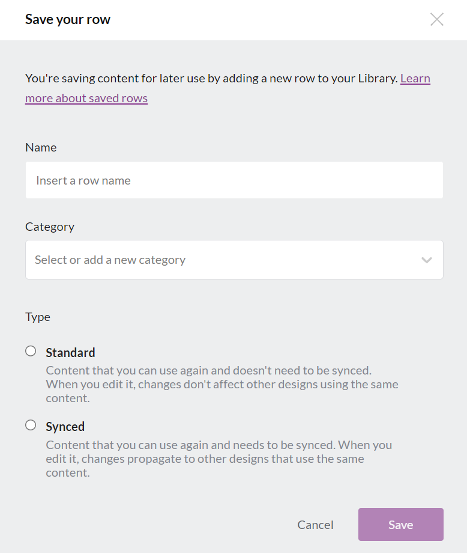
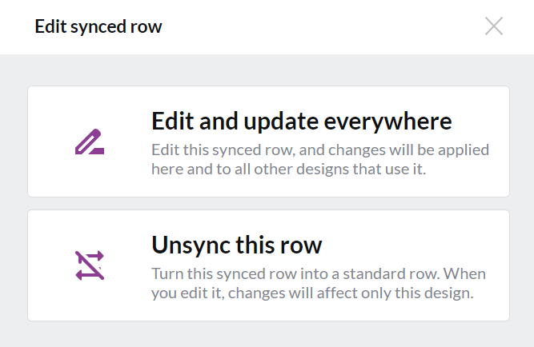

# 📄 Synced Rows


This feature is available on Beefree SDK [Core plan](https://dam.beefree.io/pluginpricing) and above.\
If you're on the Essentials plan, [upgrade a development application](../../getting-started/readme/development-applications.md) for free to try this and other Core-level features.


## Overview <a href="#overview" id="overview"></a>

**Synced Rows** expands on the foundational capabilities of [Save Rows](./) and [Single Row Edit Mode](edit-single-row-mode.md), helping users manage rows more effectively. Using the `merge-rows` and `synced-rows` methods in the [Content Services API (CSAPI)](../../apis/content-services-api/), app developers can create a seamless row management workflow. This ensures that when users update content in one row marked as “synced,” those updates are reflected across all connected designs.

### Key features

* **Cross-design synchronization**: Sync saved row contents across multiple linked designs.
* **Design consistency**: Lock rows in linked designs to keep designs uniform.
* **Editing flexibility**: Switch between synced and unsynced rows, making individual changes as needed.
* **Intuitive edit indicator**: Look for the pencil icon at the top-right of synced rows, which provides access to editing options

### Example use cases

* **Auto-updating contacts**: Change a contact in one email, and it updates across multiple campaigns.
* **Effortless re-branding**: Edit your logo once and watch it reflect across all designs.
* **Unified transactional footers**: Update details like copyright or social links, and it automatically updates in all relevant email templates.

### Elements that can be synchronized

* **Row details**: This includes structure, settings, and styles.
* **Content details**: Settings and styles of individual content blocks.
* **Metadata**: Any metadata tied to the saved row.

## Prerequisites <a href="#prerequisites" id="prerequisites"></a>

Before diving into Synced Rows, we recommend reviewing the following features:

1. [Save Rows](./): Implement this feature first, as it establishes the foundation for a row management workflow.
2. [Single Row Edit Mode](edit-single-row-mode.md) & [Content Services API (CSAPI)](../../apis/content-services-api/): Familiarizing yourself with the Single Row Edit Mode and CSAPI will enhance your understanding of key concepts later. However, they are not strictly necessary to start with Synced Rows.

## How it works <a href="#how-it-works" id="how-it-works"></a>

When a row is saved with the `synced` property, it becomes a “synced row.” To maintain consistency, synced rows cannot be edited within a design. Instead, they function as reference points, ensuring uniformity across all linked designs. The host app must load the row’s JSON using Single Row Edit Mode to edit synced rows. Any modifications to synced rows can be propagated to all linked designs with the help of the CSAPI’s `merge-rows` and `synced-rows` methods.

Unsynced saved rows, in contrast, allow for edits that don’t impact other designs. They’re ideal for making design-specific changes without influencing other designs that might share the same base row.

## Designating a row as "synced" <a href="#designating-a-row-as-synced" id="designating-a-row-as-synced"></a>

As previously mentioned, a synced row is a saved row designated  `synced` when saved. To set a row’s synced property, adjust the JSON response from the `saveRow` Content Dialog.

You might need to modify the `saveRow` handler from the Metadata Content Dialog step in your app’s Save Rows workflow.

If you need a refresher, check out:

* [Save Rows workflow for developers](./)
* [Metadata Content Dialog response format](save-rows-overview.md)

Here’s a **sample implementation for the Metadata Content Dialog**, offering the synced row option:

<figure><figcaption></figcaption></figure>

The JSON returned to the builder includes the user’s input and selections from the UI. The configuration below shows the new synced row setting applied to the options argument of the resolve method.

### **Example**

```json

contentDialog: {
  saveRow: {
    handler: async (resolve, reject, args) => {
      // The following is psuedo code: You need to create "openMetaDataContentDialogModal".
      const metadata = await openMetaDataContentDialogModal(args)
      // Metadata object format:
      // Example: https://docs.beefree.io/save-rows/#saved-rows-metadata
      // {
      //   "guid": "Globally unique id to track this row",
      //   "name": "string",
      //   "category": "string",
      // }
      resolve(metadata, { synced: true })
    }
  },
},

```

## Identifying synced rows <a href="#identifying-synced-rows" id="identifying-synced-rows"></a>

Look for the pencil icon at the top-right of synced rows. Rows without this icon are standard saved rows. The icon provides a clear visual cue for quickly identifying and editing synced rows.

<figure><figcaption></figcaption></figure>

## Editing synced rows <a href="#editing-synced-rows" id="editing-synced-rows"></a>

To edit a synced row, click the pencil icon. Editing options appear in the sidebar panel. Inside, you’ll find a CTA button and optional text.

<figure><figcaption></figcaption></figure>

The CTA button opens the `editSyncedRow` Content Dialog, allowing the host application to interact with the end-user and receive their selection.

The host application has complete control over the content dialog and UX. However, the content dialog must always return a boolean value of `true` or `false` to trigger one of the following outcomes:

1. If `true`, the row remains synced to disable content editing in the design before closing the dialog.
2. If `false`, the row updates to enable editing and remove the synced property before closing the dialog.

**For example**, a content dialog might **present users with two options**:

1. Edit the row across all designs.
2. Unsync the row, turning it into a standard saved row.

<figure><figcaption></figcaption></figure>

The first option, to edit the row across all designs, allows users to make changes to the synced row that will be reflected in all designs that use it.

The second option, to unsync the row, converts the synced row into a standard saved row. This means that any changes made to the row will only affect the design in which it is being edited. This option is useful when the user needs to make specific changes to a single design without affecting other designs that may use the same saved row.

The user’s selection from the above example `editSyncedRow`  content dialog UI is returned to the builder as a boolean value.  Below is an example of the `editSyncedRow` configuration for the UI above. Note the boolean value  `false` in the resolve method unlocks the row:

### **Example**

```json

contentDialog: {
    editSyncedRow: {
		label: 'Edit synced rows',
		description: `This row is used in other designs.
					  You can decide to update all the designs or transform this single row into a regular one`,
		notPermittedDescription: `This row is used in other designs.
                                  Your plan does not permit you to edit it. Please contact your account administrator`,
        handler: function (resolve, reject, args) => {
        	resolve(false) // the boolean will be the value of 'Label of the sidebar button that triggers the contentDialog' `synced`
                           // if false the row will be un-synced, if true nothing will happen.
    	}
    }
}

```


A comprehensive reference of the `editSyncedRow` Content Dialog settings, such as the CTA button label and optional text, can be found in our [Content Dialog docs](../../other-customizations/appearance/content-defaults.md).


The following animation shows this **example of edit synced rows workflow** in action. We’ll dive into this process in the following sections.

<figure><figcaption></figcaption></figure>

## Example synced rows workflow <a href="#example-synced-rows-workflow" id="example-synced-rows-workflow"></a>

Suppose a user selects “Edit and update everywhere” from the content dialog. How does the host app ensure seamless editing and synchronization of the row?

Here’s a breakdown of the typical workflow the host app adopts:

1. **Initialization**: The host app launches the Single Row Edit Mode in a new builder instance to enable editing of the synchronized row. Our [Single Row Edit Mode](edit-single-row-mode.md) documentation is available for reference for a deeper understanding.
2. **User edits**: Users generally hit ‘Save’ to confirm their edits once they modify the synchronized row. Simultaneously, the host app can proactively track these edits using the `onChange` method.
3. **Synchronization timing**: The decision on when to synchronize changes across all designs rests with the host application. Given the potential need to propagate edits to multiple designs, holding off until the user indicates their wish to exit is customary.
4. **Initiation of synchronization**: The synchronization is initiated as soon as the user signifies their satisfaction with the edits, either through the ‘Save’ or ‘Save & Exit’ options.
5. **Redirection & Synchronizing changes**: After editing a row, the host app usually performs a synchronous [merge rows using the CSAPI](../../apis/content-services-api/content-services-api-reference.md#merge-1). The user will then be redirected to their ongoing design, where they can see their edits reflected in the synced row.
6. **Background syncing**: Given the possible existence of numerous linked designs, a background process is usually set in motion to update all other templates.

## Synchronizing row changes <a href="#synchronizing-row-changes" id="synchronizing-row-changes"></a>

In the fifth step of the sample workflow, the goal is to bring the user back to their ongoing design with the updated content. This is achieved using the CSAPI’s `merge-rows` method.

The `merge-rows` method functions as a sophisticated “find and replace.”

* i.e., To synchronize content, the host app forwards a request comprising the outdated template, the newly edited row, and a succinct query detailing which row(s) the API should target for replacement.  The “query” is a standards-based JSON Path query typically referencing a globally unique identifier that was added to the saved row during the Metadata Content Dialog step.

For an example on how to use the `merge-rows` method, [visit our Content Services API Reference on Merge Rows](../../apis/content-services-api/content-services-api-reference.md#merge-1).

## Efficient template updates <a href="#efficient-template-updates" id="efficient-template-updates"></a>

To update rows across all designs, keeping track of the templates where rows have been dropped is crucial. There are two principal methods to associate rows with templates:

**Using the `onChange` method**

Upon adding a synced row into a design, the `onChange` callback method supplies the row’s metadata. The metadata will contain the row’s `guid`, which can be used to link the synced row to the `guid` assigned to the template by the host app. Commonly, this is achieved by establishing an index record within the app’s database linking the template’s `guid` with the row’s `guid`.

**Leverage the `synced-rows` method**

For those rows incorporated into designs before the implementation of the `onChange` tracking method, CSAPI’s `synced-rows` method is available. Use the `synced-rows` method get a list of all the synced rows inside a template with their corresponding `rowIdentifier` values. To learn more about how to use this endpoint, visit our Content Services API Reference on [Synced Rows](https://docs.beefree.io/beefree-sdk/content-services-api/content-services-api-reference#merge-2).

The specific objectives of the host application steer the choice between these methods. Whatever the choice, the primary focus is meticulously tracking the row across all linked templates, ensuring accurate and efficient updates.
