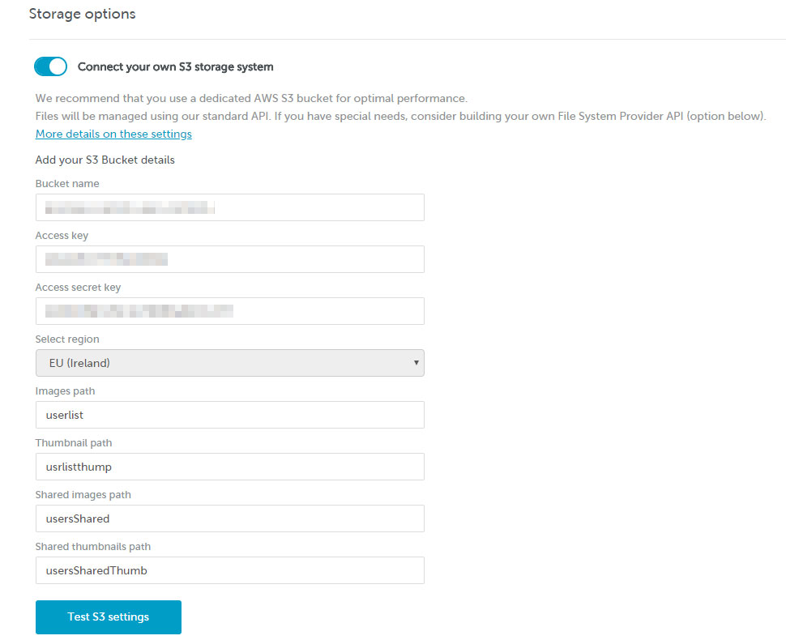
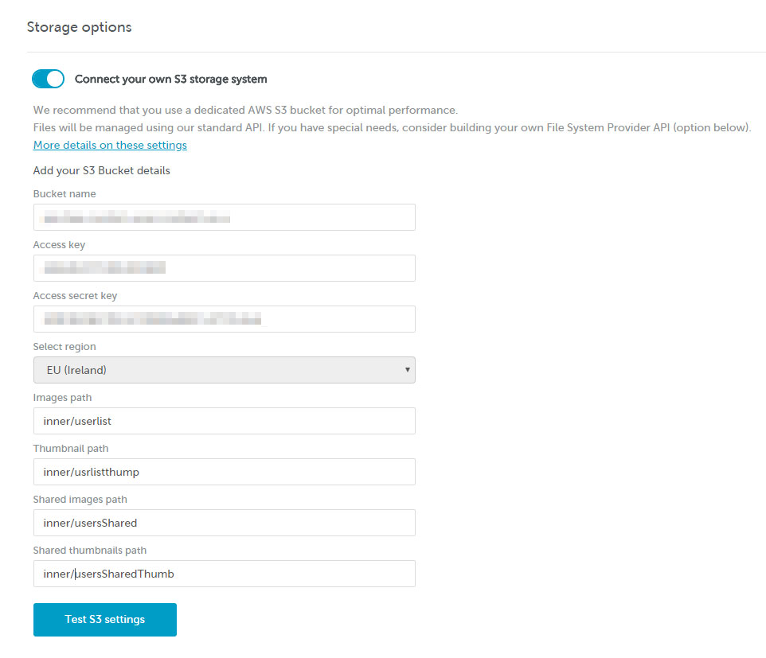

# Configure your AWS S3 bucket


This feature is only available on Beefree SDK paid plans.


Custom S3 Bucket is a Beefree application configuration feature that allows you to easily connect your own Amazon Web Services S3 bucket to your Beefree application.

By leveraging this feature, you will be able to store and manage your customers’ assets without having to build a new File System Provider, but rather by providing a compliant folder structure and filling out a simple form.

## How are images stored? <a href="#how-are-images-stored" id="how-are-images-stored"></a>

Our default file system provider uses two first level folders to manage assets:

* **Images folder** – It defines where the user’s images will be stored.
* **Thumbnails folder** – Is used by our API to store the thumbnails of the uploaded images.

These folders can be root folders or can be part of a more complex directory structure.

A few notes and recommendations:

* These folders should not be parents/children between themselves.
* Their name is restricted by [AWS standard naming restrictions](https://dam.beefree.io/awsnames).
* For performance reasons, you should use a dedicated bucket and place these folders in the root.

## Shared Assets

As an additional configuration option, you can provide shared files to your users, something that we do in the free version of the Beefree editor at beefree.io. These images are shown to all your customers as read-only assets.

The most common use case is providing sample images for the user’s first experience with the editor. Other use cases include providing application-specific images or documents that must not be deleted by the user.

To use this option you need to set-up two additional folders:

* **Shared images folder** – This is the folder that your users will browse through the file manager.
* **Shared thumbnails folder** – While the user images thumbnails are created when the images are uploaded, there is no automatic thumbnail creation for shared images. You must provide your own thumbnails using these settings:
  * 200px as max. width/height (this guarantee a correct preview in the file manager)
  * Name: original\_image\_name.ext\_thumb.png (so the thumbnail for cat.jpg must be cat.jpg\_thumb.png)
  * PNG: use only PNG as image format

## S3 configuration <a href="#s3-configuration" id="s3-configuration"></a>

This section discusses how you can configure your own custom S3 bucket within the [Developer Console](https://developers.beefree.io/accounts/login/?from=website_menu), and also provides an example JSON of the Permission policy.&#x20;

### Configure Access keys in the Developer Console

Prior to configuring your custom S3 bucket, ensure you configure Access keys in the [Developer Console](https://developers.beefree.io/accounts/login/?from=website_menu).&#x20;

Take the following steps to configure Access keys in the Developer Console:

1. Log in to the [Developer Console](https://developers.beefree.io).
2. Navigate to the application you'd like to configure a custom S3 bucket for.
3. Click the **Details** button for that application.
4.  Navigate to **Application configuration** and click **View more.**

    You will be redirected to **Storage options**.
5. Toggle on **Configure your own S3 storage system** to enable the option.
6. Complete the required fields.\*
7. Click the **Test S3 settings** button.

\*The following image shows an example of the required fields within the [Developer Console](https://developers.beefree.io/accounts/login/?from=website_menu) for configuring your own S3 bucket:

<figure><figcaption><p>Image of required fields to configure your own S3 bucket within the Developer Console.</p></figcaption></figure>

### Configure Access keys policy in AWS

The following JSON is of the Permissions policy assigned to the AWS user.

```json
{
    "Version": "2012-10-17",
    "Statement": [
        {
            "Sid": "CustomBucket01",
            "Effect": "Allow",
            "Action": "s3:ListBucket",
            "Resource": "arn:aws:s3:::the-bucket-name"
        },
        {
            "Sid": "CustomBucket02",
            "Effect": "Allow",
            "Action": [
                "s3:GetObject",
                "s3:PutObject",
                "s3:DeleteObject"
            ],
            "Resource": "arn:aws:s3:::the-bucket-name/content-path/*"
        }
    ]
}
```


**Note: Images path** and **Thumbs path** must be valid directories in the bucket.


### Configure bucket permissions

#### File URL Generation Based on "Custom URL" Parameter

The URLs for accessing files in your S3 bucket vary depending on whether the "Custom URL" field is set in the Developer Console:

*   **If "Custom URL" is empty**:\
    URLs will follow this format:

    ```
    https://<bucket-name>.s3.<region>.amazonaws.com/path/to/file.png
    ```
*   **If "Custom URL" is set** (e.g., `https://my-cdn/`):\
    URLs will be generated like this:

    ```
    <custom-url>/path/to/file.png
    ```

#### Important Configuration Notes

1. **Public Access**:
   * For the generated URLs to work, the bucket’s permissions should allow public access to the files.
2. **Using a CDN as "Custom URL"**:
   * If you’re using a CDN (e.g., CloudFront) in the "Custom URL" field, you can restrict the bucket's access to only the CDN. In this case, the bucket itself doesn't need to be publicly accessible, as access is controlled through the CDN.

Ensure that bucket permissions are configured appropriately based on the type of URL being generated.

## Enabling the Move File Feature for Your File Manager

You can enable the move icon for files within the File manager. This move icon allows your end users to move their files between folders, locations, and so on within the File manger. They can access the move icon directly on the file within the File manager. The move icon is a folder with an arrow pointing right inside it. End users click this icon to initiate the process of relocating the corresponding file to a new destination.

If you are using a Custom AWS S3 Bucket, take the following steps to enable this feature for your File manager.

### How to Enable the Move File Feature&#x20;

Take the following steps to enable the Move icon for your end users:

1. Log in to the [Developer Console](https://developers.beefree.io/accounts/login/?from=website_menu).
2. Navigate to the application you'd like to activate it for.
3. Click on the **Details** button.
4. Select the **View more** option located under **Application configuration**.
5. Navigate to the **Services** section.
6. Toggle on the **Enable moving files between folders in file manager** option.

The **Move** file option will automatically become available for your end users.

<figure><figcaption></figcaption></figure>

### How File Name Conflicts Are Handled

If a file an end user trying to move or copy has the same name as an existing file, the File Manager will show a pop-up asking how to handle the conflict.&#x20;

The end user will have the following options:

1. **Cancel**: For this option, nothing will happen, and the operation will be stopped.
2. **Keep Both**: This option lets them keep both files. The new file will be saved with a slightly different name, adding a number at the end. For example, if the original file is called "pizza.jpg," the new one will be named "pizza\_1.jpg."
3. **Replace**: Selecting this will replace the old file with the new one, meaning the existing file will be overwritten.

These options help them decide what to do when file names clash, ensuring they have control over how their files are managed.

### Using a Custom AWS S3 Bucket

To implement the new Move File feature in your application, follow these steps to change your file path from the old format to the new format. This change is important because it allows the host application to enable the Move File feature within the File Manager without breaking old URLs. Here's how to make the transition:

1. **Understand the Changes**: The file paths will change from `/your-path/UID/user-path/filename.jpg` to `/your-path/new-internal-id/random-path/filename.jpg`. This new structure decouples the logical path you see in the File Manager from the physical path in the storage, supporting the "move file" feature. For example, you can move the file in the File Manager, and the URL will remain the same.
2. **Activate Move Feature**: Once you are onboarded, activate the Move Feature inside your SDK Console to utilize the new file paths. Follow the steps outlined in the previous section to complete this process.

#### Why This Change is Important

* **Decoupling Logical and Physical Paths**: The new path structure separates the logical path (what you see in the File Manager) from the physical path (where the file is stored). This allows for more flexibility and new opportunities for future features.
* **Enable the Move File Feature**: By adopting the new path structure, you can use the Move File feature in the File Manager, which allows you to move files without changing their URLs.

#### Impact on Existing Data

* **Existing Paths**: Existing paths are not affected. The task done was to collect paths in the new database and keep files where they are.
* **Newly Uploaded Files**: New uploaded files will be stored using the new path structure.

#### About the New Path

* **Logical and Physical Path Separation**: The new path structure decouples the logical path you see in the File Manager from the physical path in the storage. This supports the "move file" feature, allowing you to move files in the File Manager without changing their URLs.
* **Changes:** The key difference between the two paths is that the new path uses a random part to enhance security and reduce predictability, making it harder for unauthorized users to guess the URLs of stored files.

By following these steps, you can ensure a smooth transition to the new file paths and take full advantage of the Move File feature in your application.

## Filling out the form to connect your AWS S3 bucket <a href="#filling-out-the-form-to-connect-your-aws-s3-bucket" id="filling-out-the-form-to-connect-your-aws-s3-bucket"></a>

Once you have set up a compliant folder structure, you can use the form in the [Beefree SDK Console](https://developers.beefree.io/) to connect your application. It’s one of the available server-side configurations for your Beefree application (Application details > Open configuration > Storage options).

This is a description of the form fields and what information you will need to provide in each of them:

<table><thead><tr><th width="177.33333333333331">Parameter</th><th width="460">Description</th><th>Required</th></tr></thead><tbody><tr><td><strong>Custom url</strong></td><td>The hostname – typically a CDN – that will be prefixed to resources URLs referenced in the JSONs created with BEE.</td><td>No</td></tr><tr><td><strong>Bucket name</strong></td><td>The name you assigned to the bucket when you created it.</td><td>Yes</td></tr><tr><td><strong>Access key &#x26; Access secret key</strong></td><td>You can provide AWS Root Account Credentials or IAM User Credentials (we recommend the second option for security reasons). The provided account must have read and write access to the given bucket. <a href="http://docs.aws.amazon.com/general/latest/gr/aws-security-credentials.html">More about AWS credentials</a>.</td><td>Yes</td></tr><tr><td><strong>Select Region</strong></td><td>AWS region where you created the bucket. Uses EU as the default setting.</td><td>Yes</td></tr><tr><td><strong>Images Path</strong></td><td>The relative path (from the bucket root) to the images folder described above (use “/” symbol as path delimiter).</td><td>Yes</td></tr><tr><td><strong>Thumbnails Path</strong></td><td>The relative path (from the bucket root) to the thumbnails folder described above (use “/” symbol as path delimiter).</td><td>Yes</td></tr><tr><td><strong>Shared images path</strong></td><td>The relative path (from the bucket root) to the shared images folder described above. Cannot be the bucket root (use “/” symbol as path delimiter).</td><td>No</td></tr><tr><td><strong>Shared thumbnails Path</strong></td><td>The relative path (from the bucket root) to the shared thumbnails folder described above. Cannot be the bucket root (use “/” symbol as path delimiter).</td><td>No</td></tr></tbody></table>

**Note:** If you change the custom URL, the new URL is immediately used for all images.

Example using single folders in the bucket root:

<figure><figcaption></figcaption></figure>

Example using single nested folders:

<figure><figcaption></figcaption></figure>

## Testing your settings <a href="#testing-your-settings" id="testing-your-settings"></a>

The button will become active once all required fields have been correctly filled out. It allows you to test your settings before saving the updated configuration. We recommend that you do so before saving any changes.


Remember to **save your changes** with the SAVE button at the top.


## Preparing thumbnails <a href="#preparing-thumbnails" id="preparing-thumbnails"></a>

If you’ve just linked your custom bucket, you may find that you need to create your own thumbnails. Thankfully, this is an easy process.

For starters, the thumbnails in the File Manager are PNG files that are resized to 200×200 px.

Here is an example of thumbnail generation with image magick:

```markup
# convert one file
convert image1.jpg -resize 200x200 image1.jpg_thumb.png
```

```markup
# resize many files (WARNING this command overwrite files)
mogrify -resize 200x200  myimages/*jpg

# convert many files
mogrify -format png      myimages/*jpg
```

As a quick example, we’ll be using this custom bucket configuration:

* bucket\_name : `my-custom-bucket`
* path\_images : `/path/to/images/`
* path\_thumbnails : `/path/to/thumbnails/`

…And starting the editor with this UID:

* uid : `my-uid`

When uploading `image1.jpg` in root dir, this key will be created in the custom bucket: `s3://my-custom-bucket/path/to/images/my-uid/image1.jpg`. Following that, a thumbnail will be generated with name `image1.jpg_thumb.png` with key: `s3://my-custom-bucket/path/to/thumbnails/my-uid/image1.jpg_thumb.png`.

And one more example:

When uploading `image2.jpg` in `mydir` inside the root dir, this key is created in the custom bucket: `s3://my-custom-bucket/path/to/images/my-uid/mydir/image2.jpg`. Similarly to above, a thumbnail will be generated with name `image2.jpg_thumb.png` with key: `s3://my-custom-bucket/path/to/thumbnails/my-uid/mydir/image2.jpg_thumb.png`.

## Moving from the default S3 bucket <a href="#moving-from-the-default-s3-bucket" id="moving-from-the-default-s3-bucket"></a>

If your Beefree application is currently using the default S3 bucket, you wish to switch to your own bucket, and you have files that you want to transfer between the two, please please [log into the Beefree SDK Console](https://dam.beefree.io/devmain) and submit a support ticket.
