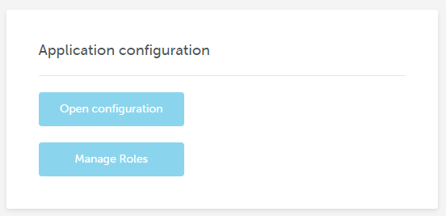

# Server-side options

## Overview

Besides the client-side configuration parameters that you can set for your instance of Beefree SDK, you also can specify some **server-side** configuration options.

## Access Server-side Configurations

To access server-side configurations, log into your [Beefree SDK Console](https://dam.beefree.io/devportal) and select the application that you wish to configure.

In the application’s details page, locate the area called _Application configuration._

<figure><figcaption></figcaption></figure>

_Manage roles_ is used to manage user roles. For details on this feature, see “user roles and permissions“.

Click on _Open configuration_ to manage the server-side settings like:

* **Toolbar** options: affect the UI of the editor
* **Storage** options: determine where the File Manager will store & retrieve images
* **Content** options: define whether certain content elements (e.g. HTML block) are active or inactive
* **Service** options: define whether additional services (e.g. photo search) are active or inactive
