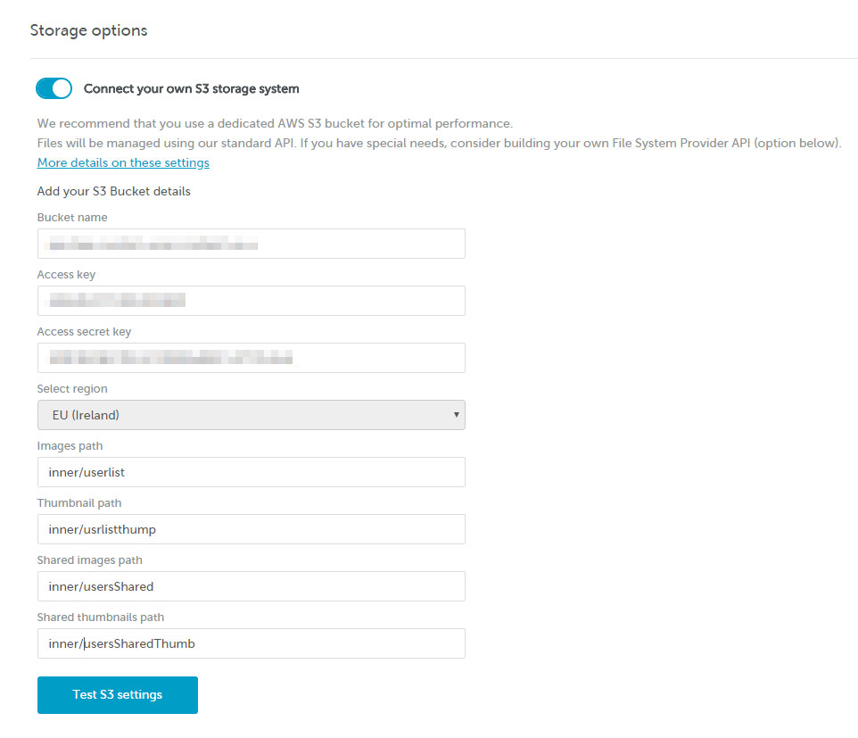

# Configure your AWS S3 bucket


This feature is only available on Beefree SDK paid plans.


Custom S3 Bucket is a Beefree application configuration feature that allows you to easily connect your own Amazon Web Services S3 bucket to your Beefree application.

By leveraging this feature, you will be able to store and manage your customers’ assets without having to build a new File System Provider, but rather by providing a compliant folder structure and filling out a simple form.

## How are images stored? <a href="#how-are-images-stored" id="how-are-images-stored"></a>

Our default file system provider uses two first level folders to manage assets:

* **Images folder** – It defines where the user’s images will be stored.
* **Thumbnails folder** – Is used by our API to store the thumbnails of the uploaded images.

These folders can be root folders or can be part of a more complex directory structure.

A few notes and recommendations:

* These folders should not be parents/children between themselves.
* Their name is restricted by [AWS standard naming restrictions](https://dam.beefree.io/awsnames).
* For performance reasons, you should use a dedicated bucket and place these folders in the root.
* The S3 bucket must be publicly accessible.
* The S3 bucket Access Control List (ACL) should ensure “List objects, Write objects, and Write bucket permissions” are **disabled** for the _Everyone_ user.

## Shared Assets

As an additional configuration option, you can provide shared files to your users, something that we do in the free version of the Beefree editor at beefree.io. These images are shown to all your customers as read-only assets.

The most common use case is providing sample images for the user’s first experience with the editor. Other use cases include providing application-specific images or documents that must not be deleted by the user.

To use this option you need to set-up two additional folders:

* **Shared images folder** – This is the folder that your users will browse through the file manager.
* **Shared thumbnails folder** – While the user images thumbnails are created when the images are uploaded, there is no automatic thumbnail creation for shared images. You must provide your own thumbnails using these settings:
  * 200px as max. width/height (this guarantee a correct preview in the file manager)
  * Name: original\_image\_name.ext\_thumb.png (so the thumbnail for cat.jpg must be cat.jpg\_thumb.png)
  * PNG: use only PNG as image format

## S3 configuration <a href="#s3-configuration" id="s3-configuration"></a>

To use an S3 bucket and configure a policy with the “Policy Generator,” follow these steps:

1. Configure Bucket Policy using the “Policy Generator”:
   1. In the S3 bucket dashboard, click on the “Permissions” tab.
   2. Under the “Bucket policy” section, click on the “Edit” button.
   3. In the “Edit bucket policy” dialog box, click on the “Policy Generator” button.
2. Set Policy Generator Options:
   1. Type: Set the type to “s3 Bucket Policy.”
   2. Effect: Set the effect to “Allow.”
   3. Principal: Set the principal to “”, allowing any AWS user or service to access the resources.
   4. AWS Service: Set AWS service to “Amazon S3.”
   5. Actions: Set Action to “GetObject.”
   6. Amazon Resource Name (ARN): Set the ARN to “arn:aws:s3:::myBucketName/” (Replace “myBucketName” with your actual bucket name).
   7. Conditions: Add specific conditions under “Conditions”, such as requiring secure transport and TLS version 1.2.
3. Review and Generate Policy: After configuring the policy parameters in the “Policy Generator,” review the generated policy to ensure it matches your requirements.
4. Add the Generated Policy: Click on the “Add Statement” button to add the generated policy to your bucket’s policy.
5. Save Changes: After adding the statement, click the “Save changes” button to apply the updated policy to your S3 bucket.

Test the configured policy by attempting to access objects within the bucket using both secure and non-secure connections to verify that the policy is working as intended. Once verified, you have successfully configured your Amazon S3 bucket with a policy using the “Policy Generator” in the AWS Management Console. This policy allows any AWS user or service to retrieve objects from the specified bucket under the specified conditions.

### Filling out the form to connect your AWS S3 bucket <a href="#filling-out-the-form-to-connect-your-aws-s3-bucket" id="filling-out-the-form-to-connect-your-aws-s3-bucket"></a>

Once you have set up a compliant folder structure, you can use the form in the [Beefree SDK Console](https://developers.beefree.io/) to connect your application. It’s one of the available server-side configurations for your Beefree application (Application details > Open configuration > Storage options).

This is a description of the form fields and what information you will need to provide in each of them:

<table><thead><tr><th width="177.33333333333331">Parameter</th><th width="460">Description</th><th>Required</th></tr></thead><tbody><tr><td><strong>Custom url</strong></td><td>The hostname – typically a CDN – that will be prefixed to resources URLs referenced in the JSONs created with BEE.</td><td>No</td></tr><tr><td><strong>Bucket name</strong></td><td>The name you assigned to the bucket when you created it.</td><td>Yes</td></tr><tr><td><strong>Access key &#x26; Access secret key</strong></td><td>You can provide AWS Root Account Credentials or IAM User Credentials (we recommend the second option for security reasons). The provided account must have read and write access to the given bucket. <a href="http://docs.aws.amazon.com/general/latest/gr/aws-security-credentials.html">More about AWS credentials</a>.</td><td>Yes</td></tr><tr><td><strong>Select Region</strong></td><td>AWS region where you created the bucket. Uses EU as the default setting.</td><td>Yes</td></tr><tr><td><strong>Images Path</strong></td><td>The relative path (from the bucket root) to the images folder described above (use “/” symbol as path delimiter).</td><td>Yes</td></tr><tr><td><strong>Thumbnails Path</strong></td><td>The relative path (from the bucket root) to the thumbnails folder described above (use “/” symbol as path delimiter).</td><td>Yes</td></tr><tr><td><strong>Shared images path</strong></td><td>The relative path (from the bucket root) to the shared images folder described above. Cannot be the bucket root (use “/” symbol as path delimiter).</td><td>No</td></tr><tr><td><strong>Shared thumbnails Path</strong></td><td>The relative path (from the bucket root) to the shared thumbnails folder described above. Cannot be the bucket root (use “/” symbol as path delimiter).</td><td>No</td></tr></tbody></table>

Please note that the **Custom url** configuration is not retroactive, so messages and pages saved before this configuration is added will keep the assets under the old URLs.

Example using single folders in the bucket root:

<figure><figcaption></figcaption></figure>

Example using single nested folders:

<figure><figcaption></figcaption></figure>

### Testing your settings <a href="#testing-your-settings" id="testing-your-settings"></a>

The button will become active once all required fields have been correctly filled out. It allows you to test your settings before saving the updated configuration. We recommend that you do so before saving any changes.


Remember to **save your changes** with the SAVE button at the top.


## Preparing thumbnails <a href="#preparing-thumbnails" id="preparing-thumbnails"></a>

If you’ve just linked your custom bucket, you may find that you need to create your own thumbnails. Thankfully, this is an easy process.

For starters, the thumbnails in the File Manager are PNG files that are resized to 200×200 px.

Here is an example of thumbnail generation with image magick:

```markup
# convert one file
convert image1.jpg -resize 200x200 image1.jpg_thumb.png
```

```markup
# resize many files (WARNING this command overwrite files)
mogrify -resize 200x200  myimages/*jpg

# convert many files
mogrify -format png      myimages/*jpg
```

As a quick example, we’ll be using this custom bucket configuration:

* bucket\_name : `my-custom-bucket`
* path\_images : `/path/to/images/`
* path\_thumbnails : `/path/to/thumbnails/`

…And starting the editor with this UID:

* uid : `my-uid`

When uploading `image1.jpg` in root dir, this key will be created in the custom bucket: `s3://my-custom-bucket/path/to/images/my-uid/image1.jpg`. Following that, a thumbnail will be generated with name `image1.jpg_thumb.png` with key: `s3://my-custom-bucket/path/to/thumbnails/my-uid/image1.jpg_thumb.png`.

And one more example:

When uploading `image2.jpg` in `mydir` inside the root dir, this key is created in the custom bucket: `s3://my-custom-bucket/path/to/images/my-uid/mydir/image2.jpg`. Similarly to above, a thumbnail will be generated with name `image2.jpg_thumb.png` with key: `s3://my-custom-bucket/path/to/thumbnails/my-uid/mydir/image2.jpg_thumb.png`.

## Moving from the default S3 bucket <a href="#moving-from-the-default-s3-bucket" id="moving-from-the-default-s3-bucket"></a>

If your Beefree application is currently using the default S3 bucket, you wish to switch to your own bucket, and you have files that you want to transfer between the two, please please [log into the Beefree SDK Console](https://dam.beefree.io/devmain) and submit a support ticket.
