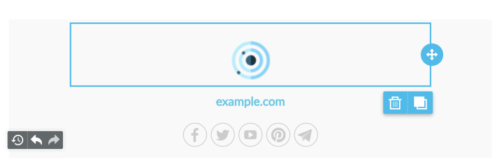
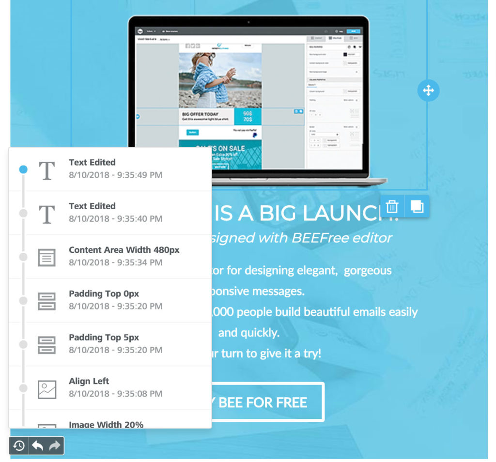
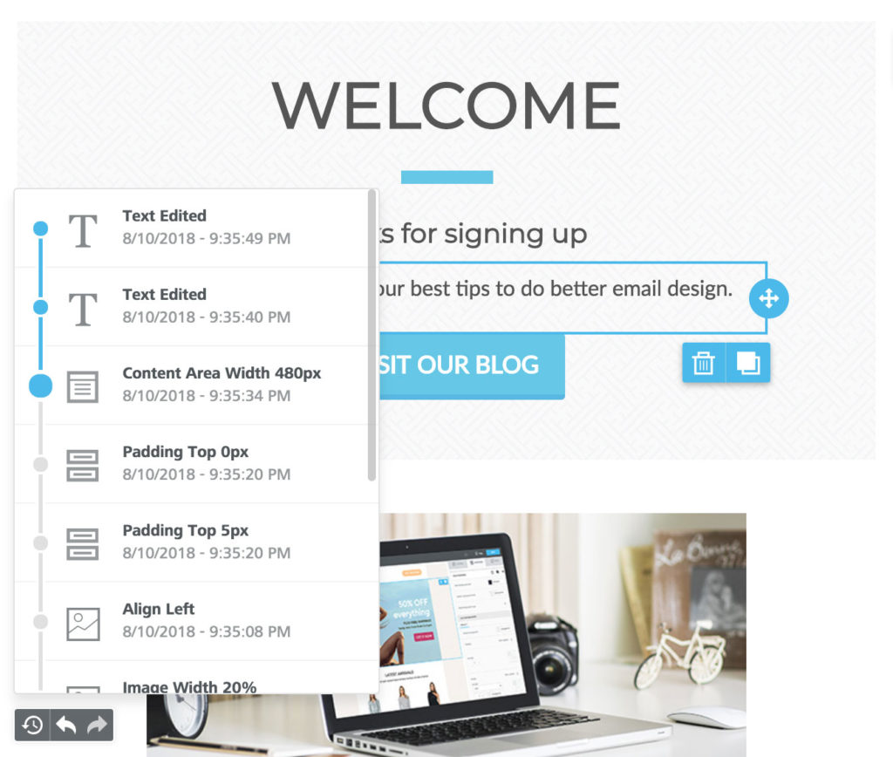
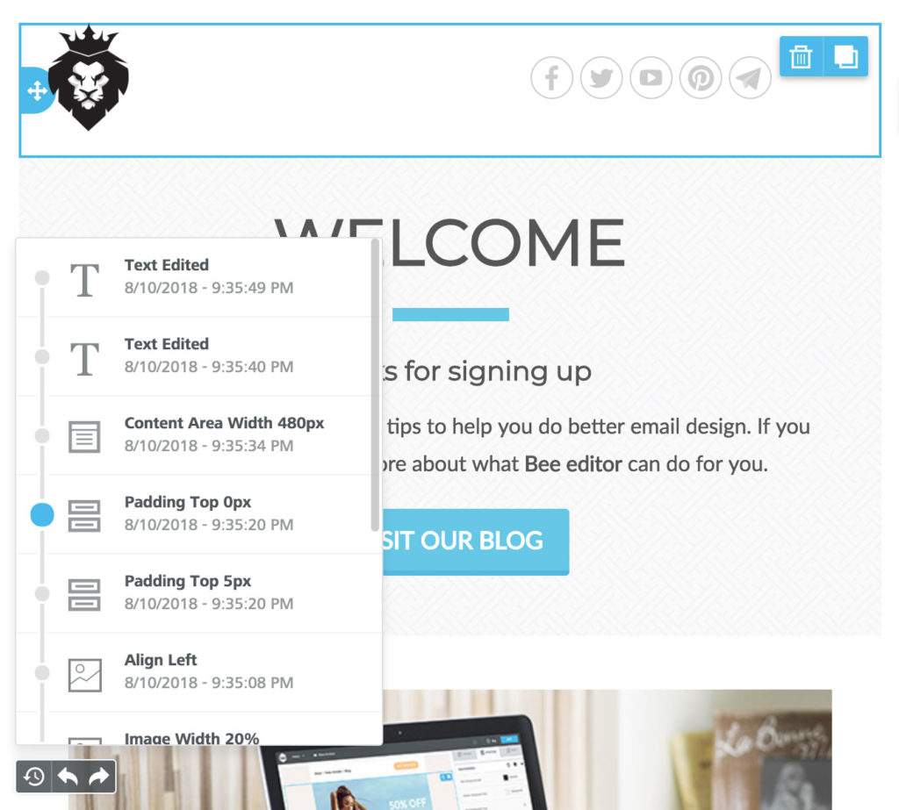

# Undo & Changes history

## Overview 

Your users will have the ability to rewind and fast-forward to any point in their recent edit history.  Once _Undo_ is enabled in the [Beefree SDK Console](https://dam.beefree.io/devmain), the application immediately begins tracking changes. Behind the scenes, this is accomplished via a new callback event – [called onChange](../tracking-message-changes.md) – which can also be used “stand-alone” without enabling _Undo_. No client-side configuration is required to use this feature. Continue reading to learn how to activate and use _Undo_. And if you can’t wait to try it yourself, you can immediately do so at [beefree.io](https://dam.beefree.io/beefreetemplates)

### How it works 

When changes are detected, a compact _Undo_ widget displays in the bottom left corner of the stage:

<figure><figcaption></figcaption></figure>

The widget displays 3 actions:

* **Undo and Redo arrows** that offer the classic pattern to move back and forth between changes.
* **A history icon** that expands a timeline of the latest changes:

<figure><figcaption></figcaption></figure>

### **Timeline**

The timeline allows the user to browse through the most recent changes.

All the steps display:

* An icon to identify the content element type (an image, text, etc.)
* A description of what changed, giving the new property value (if any)
* The exact time it happened

All these details provide enough information for users to understand what modification was applied, and, if desired, rewind the message to that state:

<figure><figcaption></figcaption></figure>

When the user selects a previous step, the content or row that triggered the history record displays as the selected item, providing further context.

The timeline for more recent changes is still available, allowing the user to move forward without losing any changes:

<figure><figcaption></figcaption></figure>

The _Undo_ widget currently displays the last 15 edits in the timeline, but users can always rewind to the _Message opened_ state to undo all changes since the message was initially opened in the builder.

We are also doing additional testing to see if the number of recent edits can be increased beyond 15 without negatively impacting the browser’s performance. We will update this section if the number is increased.

The last saved edits are only available at the session level, so they reset every time the builder is loaded. If you need to provide a complete message history, you can build a custom one based on the _onSave_ and _onChange_ events (see below).

## Activating the Widget

The Undo option is available at the application level in the [Beefree SDK Console](https://dam.beefree.io/devmain). Select your application from the list and open the _Application configuration_ in the bottom-right.\
The option to enable this widget is available in the _Services_ list:

<figure><figcaption></figcaption></figure>

The widget uses the [onChange callback](../tracking-message-changes.md) information to work. However, it doesn’t need a client-side configuration for the callback: once _Undo_ is enabled, the application starts tracking changes even if the [_trackChanges_ parameter](../tracking-message-changes.md) is not set in [_beeConfig_](../readme/installation/configuration-parameters/).
