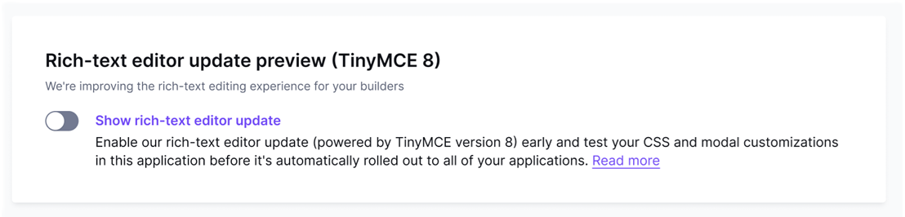

# Rich-text editor (TinyMCE) update

We are improving the rich-text editor experience for your email, page and popup builders. Beefree SDK’s updated editor engine (based on TinyMCE) brings a more consistent, modern look across all editor dialogs. It also ensures a lighter HTML output of text blocks, while confirming our ongoing commitment to keeping all tools behind Beefree SDK updated and secure.

Below is a preview of what looks and behaves differently, so you can adjust your user-facing documentation and, if available in your subscription, arrange any necessary custom CSS and contentDialog modifications. Please note that we made some minor modifications to our CSS classes, as you can see in our [changelog](https://docs.beefree.io/beefree-sdk/other-customizations/appearance/custom-css/css-changes#release-august-2026).


If you're using Custom CSS, please only stick to "change safe" class names (marked with the '--cs' suffix) to customize the look and feel of your editor. Class names without the '--cs' suffix may change without prior notice in the future.


Most changes are visual only. A few, noted below, also change how you interact with the element.&#x20;

### Detailed Old v. New

#### Toolbar

|                    Old                    |                    New                    |
| :---------------------------------------: | :---------------------------------------: |
|  |  |

We updated the look\&feel and button positions in the toolbar. If you rely on [Advanced Permissions](../other-customizations/advanced-options/advanced-permissions.md), please note that the `fontselect` component is now called `fontfamily`, while `fontsizeselect` is now `fontsize`.

#### Insert link

|                         Old                         |                         New                         |
| :-------------------------------------------------: | :-------------------------------------------------: |
|               |               |
|  |  |

The link dialog has a redesigned look, while the custom attributes tab is now named “Attributes” and allows users to add these via a new CTA button.

#### Merge tags

|                                         Old                                         |                             New                            |
| :---------------------------------------------------------------------------------: | :--------------------------------------------------------: |
|                                         |                |
|  |  |

The new merge tag dialog now offers end users a search bar to streamline the selection of fields. We also updated the merge tag dropdown menu appearing when a user types the `@` character in a text field to increase consistency with the overall look & feel.&#x20;


Some --cs classes related to the merge tag `@` dropdown menu have changed. Please refer to the [changelog](https://docs.beefree.io/beefree-sdk/~/changes/607/other-customizations/appearance/custom-css/css-changes#release-august-2026) for all details.


#### New feature: editable Smart merge tags

When an end user clicks an existing Smart merge tag, the Content Dialog now receives data about which tag was previously selected. This lets your host application **pre-populate the dialog** for a true edit experience, instead of requiring users to delete and re-insert a tag from scratch.

Previous payload:

```json
{
    "context": "toolbar.mergeTag"
}
```

New payload example:

```json
{
    "context": "toolbar.mergeTag",
    "mergeTag": {
        "name": "Last Name",
        "value": "[lastname]",
        "previewValue": "Smith"
    }
}
```

#### Special links

|                       Old                       |                       New                       |
| :---------------------------------------------: | :---------------------------------------------: |
|  |  |

Special links used to be managed via a dropdown menu. Now the toolbar button opens as a dialog, consistent with the Merge tag experience.

#### Emoji & special characters

|                          Old                         |                          New                         |
| :--------------------------------------------------: | :--------------------------------------------------: |
|           |              |
|  |  |

Visual restyle only, with all functionality identical to the previous version. The “Emoticons” dialogue is now called “Emojis”.

#### Color picker

|                       Old                      |                       New                      |
| :--------------------------------------------: | :--------------------------------------------: |
|  |  |


We replaced the bipartite color picker with a single new component, functionally equivalent to the previous one.

### Release plan & testing

#### Free plans

If you’re on a free plan, the updated rich text editor will roll out on August 27, 2026.&#x20;

#### Essential and Core plans

If you’re on an Essential or Core plan, these changes will go live in your applications on August 31, 2026.

#### Superpowers plans

If you are on a Superpowers plan, the updated rich text editor will roll out to all your applications on September 17, 2026.&#x20;

You will have the **chance to test the updates ahead of time**. Starting August 27, you’ll find a toggle in the "Configure application" page of your Developer Console that lets you enable the new rich-text editor experience in any of your applications, so you can preview the experience and any impact it might have on your Custom CSS before we enforce the upgrade (and remove the preview toggle) on September 17.

<figure><figcaption></figcaption></figure>


If you’re using Custom CSS, we strongly encourage you to review the CSS class changes and test the updates before the release date.


#### Enterprise plans (Version Control)

If you are on an Enterprise plan, the new rich-text editor experience will be available starting with SDK version 3.55 which is scheduled to be released on August 27, 2026.

Once this version is released, you can test the new experience (and any impact it might have on your custom CSS) by **applying version 3.55 to any of your test applications** via your Version Control settings.&#x20;

If your production applications are set to automatic upgrade mode, the new rich-text editor will reach your production applications as soon as version 3.55 gets promoted to ‘Stable’ on September 17, 2026.


If you’re using Custom CSS, we strongly encourage you to review the CSS class changes and test the updates before the new rich text editor reaches your production applications. Please remember: If you need more time for testing or adjusting you CSS, you can keep your production applications pinned to a previous version until you’re ready. [Here’s how](https://docs.beefree.io/beefree-sdk/getting-started/version-control).

