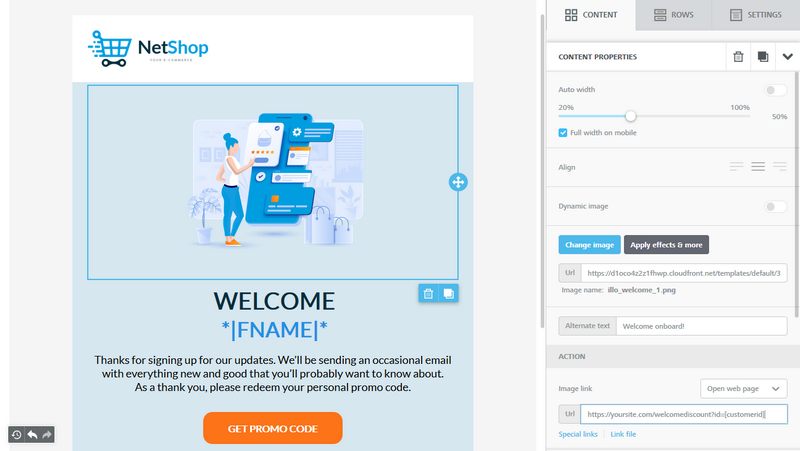

# Email Builder

Beefree SDK started out in 2015 as an embeddable, drag-&-drop email editor. It was first embedded in [beefree.io](https://beefree.io/?utm\_source=docs\&utm\_medium=website\&utm\_campaign=building-emails-page) and then in hundreds of SaaS applications around the globe, across all sorts of industries: from marketing automation to event engagement; from restaurant management to a CRM for dentists. 🙂

<figure><figcaption></figcaption></figure>

Beefree SDK Email Builder aims to be the best email editor on the market, ready to be embedded and bring awesome email creation inside web applications. It features a unique combination of design flexibility and ease of use, coupled with great freedom in how you can integrate it into your application.

In 2020, guided by the same principles, we launched [Page Builder](page-builder/), another embeddable product for creating beautiful, responsive landing pages, without writing a single line of code.

Now Beefree SDK is both an Email and a Page Builder: as these two products share the same core capabilities and features, the documentation in this site applies to both, unless otherwise specified. If this is your first approach to our builders, just follow the [Installation section in our documentation](../getting-started/readme/installation/).
