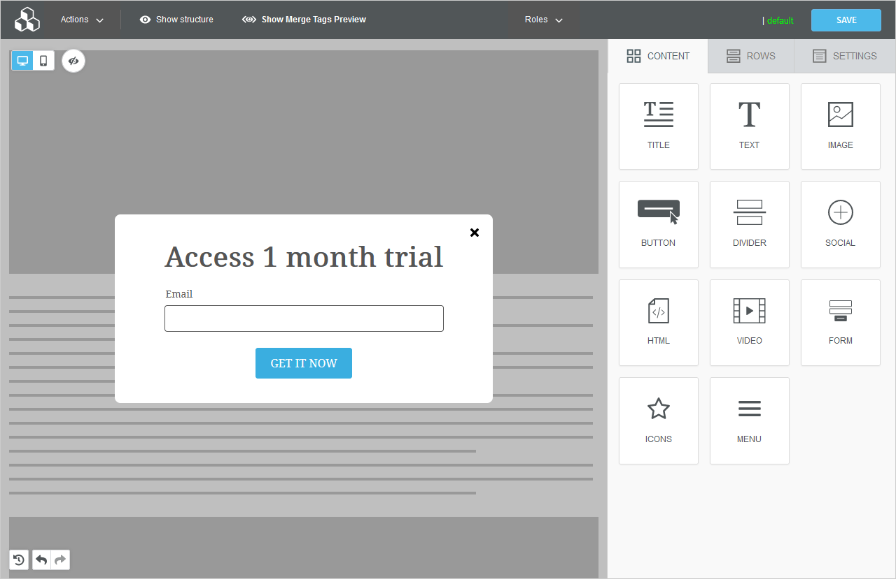

# Setting layout and size

## Width settings <a href="#width-settings" id="width-settings"></a>

Let’s start by looking at some of the peculiarities of the Popup builder.

In Email and Page Builder, the content area width is saved in the template. For example, if you start with an empty template, a default width that works for most scenarios is chosen, but **the designer can adjust the message width slider**. If you start with an existing template, the content width was **chosen by the template’s designer** using the message width slider in the builder _Settings_ tab.

With Popup Builder, the same template may have multiple contexts, and each context will likely have specific size requirements. For example, an exit-intent popup may have a max-width of 600px on a desktop with a classical layout centered on the screen. On the other hand, the host app may display the same template on mobile in the bar style docked at the bottom of the screen with a restricted width of 300px.

Since the content area’s width is tightly coupled to the context and layout, no one size fits all width is saved in the template. Instead, **the host app will specify the width settings** when the builder loads, based on the context of using the template. Here is a quick example:

```json
workspace: {
  popup: {
    contentWidth: 600,
    contentWidthMobile: 300
  }
}
```

Two final notes:

* Popup Builder does not currently support fluid 100% width content.
* If you don’t specify a width, the application will apply a default one.

## Layout settings <a href="#layout-settings" id="layout-settings"></a>

As mentioned before, you will receive a ready-to-go design experience when no settings are provided. The default layout is a classic centered modal with a fixed width.

<figure><figcaption></figcaption></figure>

If the default popup style and layout suit your needs, then your customers are all set to start designing! You can load the builder without additional configuration and use the same standard controls and callbacks to access the HTML and JSON template.

What if you like most of the defaults but want to do some minor adjustments? We have you covered!

## Changing the background <a href="#changing-the-background" id="changing-the-background"></a>

You can easily change the background to make the workspace look like the destination page where your customer will embed the popup.

```markup

beeConfig: {
  ...
  workspace: {
    popup: {
      backgroundImage: 'https://.../background.png',
      backgroundImageMobile: 'https://.../background.png',
      ...
    }
  }
}

```

If this option is not set, then we will provide a default skeleton layout. It’s worth noting at this point that you can apply every setting for both desktop and mobile design modes. That means you can have a different background when editing in [Mobile Design Mode](../../../other-customizations/mobile-design-mode.md).

## Applying a preset layout <a href="#applying-a-preset-layout" id="applying-a-preset-layout"></a>

One of the most common needs is changing the popup’s default-centered position to better match the end-user’s use case. Out-of-the-box, the Popup Builder comes with many of the most common popup layouts preconfigured. You can use any available presets “as is” or use them as starting points that you can fine-tune to your satisfaction.

```json

beeConfig: {
  ...
  workspace: {
    popup: {
      layout: 'bar-top'
    }
  }
}

```

Here is a complete list of preset layouts:

| Name                     | Value                                                                                                                                                                                      | Description                                                             |
| ------------------------ | ------------------------------------------------------------------------------------------------------------------------------------------------------------------------------------------ | ----------------------------------------------------------------------- |
| Classic Popup            | <p><code>classic-center</code></p><p><code>classic-top-right</code></p><p><code>classic-top-left</code></p><p><code>classic-bottom-right</code></p><p><code>classic-bottom-left</code></p> | This is our default layout and works great for alerts and exit intents. |
| Drawer or Slide-in panel | <p><code>drawer-left</code></p><p><code>drawer-right</code></p>                                                                                                                            | Side panels, or drawers, can be used to design menus or display ads.    |
| Bar or Docker            | <p><code>bar-bottom</code></p><p><code>bar-top</code></p>                                                                                                                                  | This is great for cookie approval dialogs.                              |
